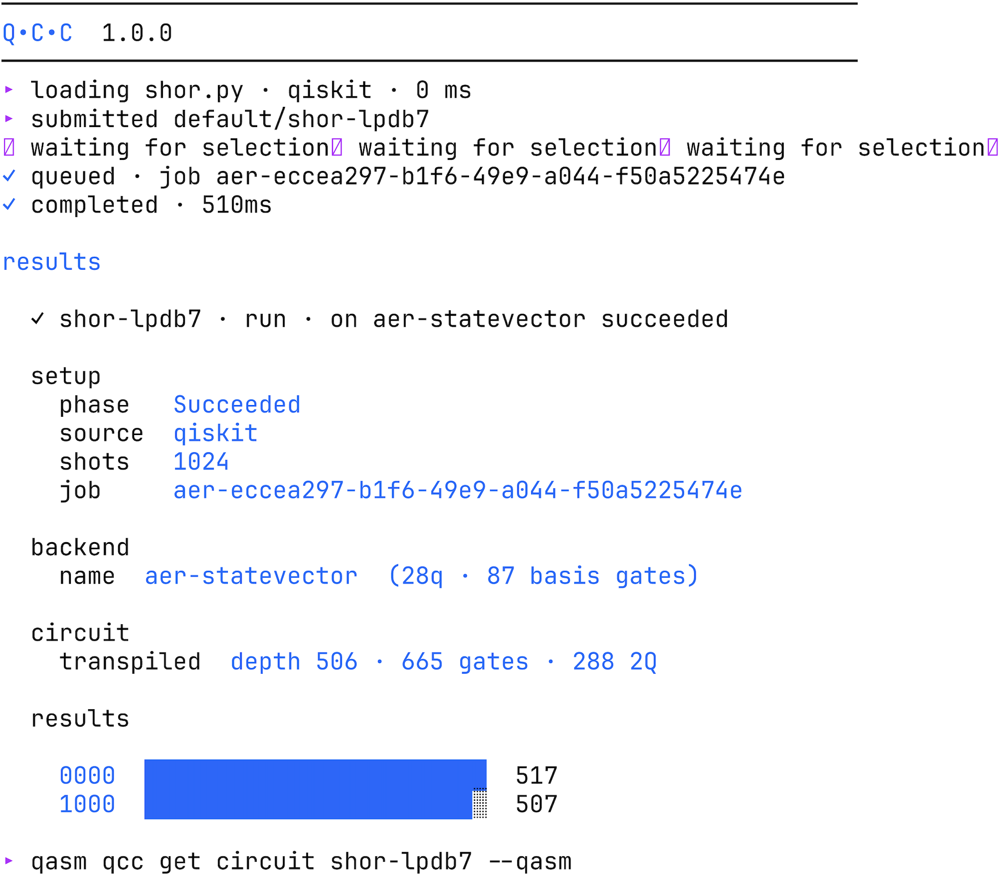

<picture>
  <source media="(prefers-color-scheme: dark)" srcset="./docs/assets/images/readme-banner.svg">
  <source media="(prefers-color-scheme: light)" srcset="./docs/assets/images/readme-banner.svg">
  
</picture>

# Quantum Circuit Controller

[](https://github.com/ioaiaaii/quantum-circuit-controller/actions/workflows/test.yml)
[](https://github.com/ioaiaaii/quantum-circuit-controller/actions/workflows/lint.yml)
[](https://github.com/ioaiaaii/quantum-circuit-controller/actions/workflows/executor.yml)
[](./LICENSE)
[](https://ioaiaaii.github.io/project/msc-thesis/)

QCC is a Kubernetes operator for hybrid quantum-classical execution. A
circuit is submitted with `kubectl apply` or the `qcc` CLI, reconciled
through an observable lifecycle, and executed on Qiskit Aer,
calibration-faithful `fake_*` snapshots, or real IBM Quantum hardware.
Circuits and quantum backends are custom resources; every step lands in
Prometheus under the `qcc_*` namespace.

```bash
qcc run shor.py --backend ibm-fez --detach
qcc get circuit shor-wffxg
```



## Motivation

Hybrid quantum-classical execution lacks the operational conventions that
classical infrastructure standardized years ago: runs are opaque, tooling
is vendor-specific, and backend quality is treated as a specification
rather than a measured signal. QCC applies SRE practice to that gap:

- **A run is a resource.** Submit OpenQASM 3 or Qiskit Python as a
  `Circuit`; phase, conditions, selected backend, provider job ID,
  measured counts, and transpile shape all live on its status.
- **Backend quality is telemetry.** Each registered `QPU` is probed for
  qubit count, basis gates, error medians, T1/T2, and calibration age.
  The result card turns those numbers into a per-run error-budget
  verdict.
- **The boundary is traceable in both directions.** The provider job ID is
  recorded on the Circuit and its metrics; the Circuit's UID is stamped
  onto the IBM job as a tag. Console to cluster and back, with standard
  tooling.
- **Vendors are adapters.** One six-method contract behind a typed gRPC
  seam; adding a provider touches neither the controller, the schema, nor
  the telemetry.
- **The API absorbs SDK churn.** Typed fields for what QCC owns, plus
  passthrough blocks whose keys land verbatim as Qiskit kwargs. When the
  SDK gains a flag, users can set it the day the executor image ships it,
  with no schema change.

Evaluated end to end with Shor's algorithm across eight simulators and
three live IBM Heron r2 backends, with the full evidence in the
[demonstration](./docs/demonstration.md).

## Quickstart

Requires a container runtime, Go, and [mise](https://mise.jdx.dev/). The
local path runs on a laptop with kind:

```bash
make tools-install                    # pinned toolchain (kubectl, kind, helm, uv, ...)
make platform-up                      # kind cluster + Prometheus/Grafana/OTel
kubectl apply -f deploy/grafana/      # QCC dashboards
make dist-up                          # build images, load into kind, deploy QCC
kubectl apply -k config/samples/qpu/  # register simulators + IBM profiles
make qcc-build
./dist/qcc run examples/bell-state.qasm --backend aer-statevector
```

Full walkthrough, including real IBM hardware:
[getting-started](./docs/getting-started.md).

## Documentation

| Start | Reference | Understand | Run and extend |
|---|---|---|---|
| [Getting started](./docs/getting-started.md) | [CLI commands](./docs/getting-started.md#command-reference) | [Architecture](./docs/architecture.md) | [Operations](./docs/operations.md) |
| [Demonstration](./docs/demonstration.md) | [API contract](./docs/api.md) | [Position and trajectory](./docs/architecture.md#position-and-trajectory) | [Engineering](./docs/engineering.md) |
| | [Metrics](./docs/observability.md) | [Implementation status](./docs/README.md#implementation-status) | [Add a provider](./docs/engineering.md#adding-a-provider-adapter) |

Three docs answer most questions: the
[demonstration](./docs/demonstration.md) shows everything working with
real screenshots and numbers, the
[architecture](./docs/architecture.md) explains the design and where it
sits relative to QCSC, Qubernetes, Qonductor, and QRMI, and the
[status matrix](./docs/README.md#implementation-status) says plainly what
is shipped, partial, and absent.

## Status

Working proof of concept. It is the artifact of the MSc thesis
[*Interface between Quantum and Classical Computers*](https://ioaiaaii.github.io/project/msc-thesis/)
(Democritus University of Thrace, 2026); interfaces (`qcc.io/v1alpha1`,
the executor gRPC contract, the metrics specification) are stable within
the v1.0.x line but carry no compatibility promise yet. Citation:
[CITATION.cff](./CITATION.cff).

Near-term roadmap: Helm packaging and published images, TTL-driven
calibration re-probing, Kubernetes Events, calibration-aware selection
scoring, distributed tracing, and more provider adapters. Contributions
welcome; see [CONTRIBUTING.md](./CONTRIBUTING.md) and the
[adapter guide](./docs/engineering.md#adding-a-provider-adapter).

## License

[Apache License 2.0](./LICENSE). Copyright 2026 Ioannis Savvaidis.
