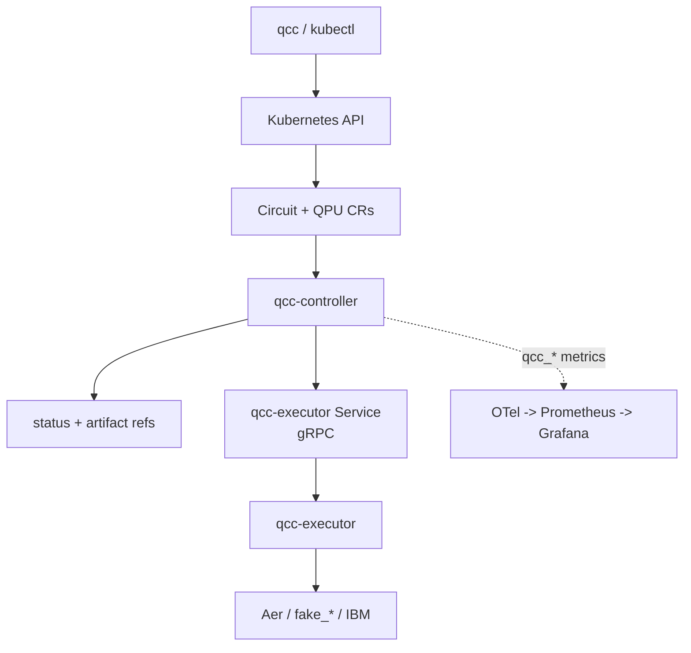

# QCC Revisited Docs

This directory is the implementation guide for the current `quantum-circuit-controller` codebase.

It complements, but does not replace, the original documentation under [`../docs/`](../docs/README.md).

Last aligned to repository state on `2026-05-27`.

## The Four Files

The docs are consolidated into four files:

| File | Purpose |
|---|---|
| [`README.md`](./README.md) | start here, quickstart, command reference, implementation status |
| [`architecture.md`](./architecture.md) | runtime topology, request flow, controller/executor split |
| [`api.md`](./api.md) | `Circuit` and `QPU` contract, fields, status, artifacts |
| [`observability.md`](./observability.md) | status, metrics, logs, dashboards, debugging flow |

Use the original docs when you want either:

- thesis/design rationale: [`../docs/systems-design/`](../docs/systems-design/README.md)
- captured evidence and screenshots: [`../docs/README.md`](../docs/README.md) and [`../docs/RUNBOOK.md`](../docs/RUNBOOK.md)

## QCC In Three Sentences

- `Circuit` is the user request and lifecycle record.
- `QPU` is the backend registry plus probed backend metadata.
- The Go controller owns orchestration, while the Python executor owns Qiskit, adapters, provider calls, and artifacts.

## Runtime Map



## Quickstart

The shortest supported local path is the kind-based flow driven by `make dist-up`.

```bash
make tools-install
make tools-check
make dist-up
kubectl apply -k config/samples/qpu/
make qcc-build
./dist/qcc run examples/bell-state.qasm --backend aer-statevector
```

Verify the deployment:

```bash
kubectl get pods -n quantum-circuit-controller-system
kubectl get qpus
./dist/qcc get circuits
```

Try the non-execution modes:

```bash
./dist/qcc draw examples/bell-state.qasm
./dist/qcc schedule examples/bell-state.qasm --backend fake-brisbane
./dist/qcc run examples/bell-state.qasm --performance-test
```

Tear down:

```bash
make dist-down
make platform-down
```

## Daily Commands

### Tooling

```bash
make tools-install
make tools-check
make help
```

The repository uses Go from `go.mod`, auxiliary tools from `.mise.toml`, and `uv` for Python-side work.

### Deploy

```bash
make deploy IMG=<your-controller-image>
kubectl apply -k config/samples/qpu/
```

Important deployment detail: the default deploy includes both the controller-manager and executor manifests, but it does not register ready-to-use QPUs. Apply sample or custom QPUs before expecting backend selection to work.

### IBM Credentials

The current IBM path is configured through executor environment variables, not through `QPU.spec.access.credentialSecretRef`.

```bash
kubectl create secret generic ibm-quantum-token \
  -n quantum-circuit-controller-system \
  --from-literal=QISKIT_IBM_TOKEN='<your-token>'

kubectl rollout restart deployment/quantum-circuit-controller-executor \
  -n quantum-circuit-controller-system
```

Optional channel override:

```bash
kubectl create secret generic ibm-quantum-token \
  -n quantum-circuit-controller-system \
  --from-literal=QISKIT_IBM_TOKEN='<your-token>' \
  --from-literal=QISKIT_IBM_CHANNEL='ibm_quantum_platform'
```

### CLI

```bash
qcc run examples/bell-state.qasm
qcc run examples/bell-state.qasm --backend fake-brisbane
qcc run examples/bell-state.qasm --detach
qcc run examples/bell-state.qasm --performance-test
qcc draw examples/bell-state.qasm
qcc schedule examples/bell-state.qasm --backend fake-brisbane
qcc get circuits
qcc get circuit <name> --qasm
qcc get circuit <name> --draw
qcc get circuit <name> --schedule
qcc get qpus
```

Grouping labels:

```bash
qcc run examples/bell-state.qasm --algorithm bell --version v1 --experiment smoke
qcc get circuits --algorithm bell
```

The controller auto-fills `qcc.io/run-index` and `qcc.io/source-sha256`.

### Observability Stack

```bash
make platform-up
make platform-status
kubectl port-forward -n monitoring svc/kps-grafana 3000:80
```

Dashboard manifests live in:

- [`../deploy/grafana/qcc-circuit-dashboard.yaml`](../deploy/grafana/qcc-circuit-dashboard.yaml)
- [`../deploy/grafana/qcc-qpu-dashboard.yaml`](../deploy/grafana/qcc-qpu-dashboard.yaml)

### Tests

```bash
make test
make executor-test
make test-e2e
```

Notes:

- `make test` requires `controller-gen` and envtest assets
- executor tests use `uv`
- e2e tests require a dedicated kind cluster, not a shared dev/prod cluster

## Evidence And Figures

The empirical figure pack lives under [`../docs/`](../docs/README.md). Keep those files as the source of truth for thesis figures; `docs_revisited` only summarizes the implementation they demonstrate.

| Evidence area | Primary figures |
|---|---|
| QPU registry and probe-populated metadata | [`qpu_get_all.png`](../docs/qpu_get_all.png), [`qpu_manifest_fake-fez.png`](../docs/qpu_manifest_fake-fez.png), [`qpu_get_fale-fez.png`](../docs/qpu_get_fale-fez.png) |
| Circuit resource and non-execution modes | [`circuit_draw_shor.png`](../docs/circuit_draw_shor.png), [`circuit_get_shor_lpdb7.png`](../docs/circuit_get_shor_lpdb7.png) |
| Cross-backend empirical comparison | [`circuit_run_shor_perf-test.png`](../docs/circuit_run_shor_perf-test.png), [`grafana_shor_fake-fez.png`](../docs/grafana_shor_fake-fez.png), [`grafana_shor-fake-marrakesh.png`](../docs/grafana_shor-fake-marrakesh.png), [`grafana_shor_fake-kyoto.png`](../docs/grafana_shor_fake-kyoto.png) |
| Observability metrics and dashboards | [`grafana_qcc_qpu_metrics.png`](../docs/grafana_qcc_qpu_metrics.png), [`grafana_qcc_circuit_metrics.png`](../docs/grafana_qcc_circuit_metrics.png), [`grafana_qpu_availability.png`](../docs/grafana_qpu_availability.png), [`grafana_qpu_coherence.png`](../docs/grafana_qpu_coherence.png) |
| IBM cross-boundary identity | [`ibm_console_job_tag_kingston.png`](../docs/ibm_console_job_tag_kingston.png), [`grafana_circuit_provider_job_link.png`](../docs/grafana_circuit_provider_job_link.png), [`cli_detach_submission_kingston.png`](../docs/cli_detach_submission_kingston.png) |
| Real-hardware and Tier-2 Shor evidence | [`circuit_get_shor_fez_v1.png`](../docs/circuit_get_shor_fez_v1.png), [`circuit_get_shor-wr9ds.png`](../docs/circuit_get_shor-wr9ds.png), [`circuit_get_shor_tuned_v2.png`](../docs/circuit_get_shor_tuned_v2.png), [`circuit_get_shor_tuned_v3.png`](../docs/circuit_get_shor_tuned_v3.png), [`final_get_all_circuits.png`](../docs/final_get_all_circuits.png) |

For the full command-to-figure mapping, read [`../docs/RUNBOOK.md`](../docs/RUNBOOK.md).

## Implementation Status

Legend:

- `shipped`: implemented and part of the normal runtime path
- `partial`: present but caveated or only partly wired
- `absent`: not implemented

| Area | Status | Notes |
|---|---|---|
| `Circuit` CRD | shipped | namespaced, four modes |
| `QPU` CRD | shipped | cluster-scoped |
| Circuit phase machine | shipped | explicit phases in controller |
| Artifact `ConfigMap` model | shipped | drawing, converted QASM, schedule |
| First-pass backend filtering | shipped | availability/provider/backend/kind/minQubits/maxShots |
| Calibration-aware backend scoring | absent | design exists, runtime does not |
| `allowedQPURefs` enforcement | absent | field exists on schema only |
| `region` enforcement | absent | field exists on schema only |
| Aer simulator execution | shipped | sync path |
| Fake IBM snapshot execution | shipped | through `AerAdapter` |
| IBM hardware execution | shipped | async path via `qiskit-ibm-runtime` |
| Generic Qiskit provider adapter | absent | future path for Braket and other Qiskit provider plugins |
| OpenQASM runtime adapter | absent | future path for non-Qiskit runtimes that accept OpenQASM payloads |
| QRMI / CUDA-Q adapters | absent | future alternative substrates |
| OpenQASM 3 input | shipped | inline source |
| Qiskit-Python input | shipped | executor converts to QASM 3 |
| `qcc run`, `draw`, `schedule`, `get` | shipped | normal CLI surface |
| `qcc run --performance-test` | shipped | empirical comparison across QPUs |
| controller-side OTLP metrics | shipped | `qcc_*` namespace |
| Grafana dashboards | shipped | source-controlled YAML |
| cross-boundary IBM job tags | shipped | Circuit UID stamped into provider job |
| QPU probing through executor | shipped | qubits, basis, coupling, calibration, medians |
| IBM optimistic availability | partial | probe failure does not remove from selection |
| per-QPU credential reference | absent | schema only; runtime uses executor env vars |
| async restart tolerance | absent | executor task registry is in-memory |
| executor-side metrics | absent | no Python OTel instrumentation |
| distributed tracing | partial | scaffolding exists, not operational |
| Kubernetes `Event` emission | absent | RBAC exists, recorder path does not |
| default ready-to-use QPUs on deploy | absent | apply samples explicitly |
| Helm packaging | absent | not implemented here |

## What To Trust

- Trust `run`, `draw`, `schedule`, `get`, Aer/fake backends, IBM async execution, QPU probing, and controller-side metrics.
- Do not trust the API to enforce every declared selector or credential field yet.
- Treat Braket/Qiskit-provider expansion, OpenQASM runtime expansion, restart tolerance, scoring-based selection, distributed tracing, executor-side telemetry, Kubernetes Events, and per-QPU credentials as unfinished areas.

## Repository Map

- Go controller: [`../cmd/qcc-controller/`](../cmd/qcc-controller)
- CLI: [`../cmd/qcc/`](../cmd/qcc)
- Python executor: [`../qcc-executor/`](../qcc-executor)
- CRDs and manifests: [`../config/`](../config)
- sample QPUs: [`../config/samples/qpu/`](../config/samples/qpu)
- observability platform: [`../deploy/platform/`](../deploy/platform)

## Files To Inspect First

If you are trying to understand or change runtime behavior, start here:

- [`../internal/controller/circuit_controller.go`](../internal/controller/circuit_controller.go)
- [`../internal/controller/qpu_controller.go`](../internal/controller/qpu_controller.go)
- [`../internal/executor/client.go`](../internal/executor/client.go)
- [`../qcc-executor/src/qcc_executor/servicer.py`](../qcc-executor/src/qcc_executor/servicer.py)
- [`../qcc-executor/src/qcc_executor/adapters/aer.py`](../qcc-executor/src/qcc_executor/adapters/aer.py)
- [`../qcc-executor/src/qcc_executor/adapters/ibm.py`](../qcc-executor/src/qcc_executor/adapters/ibm.py)

## Source-Of-Truth Rule

If the docs disagree:

1. the code wins
2. then `docs_revisited/`
3. then the design/evidence material under `docs/`
