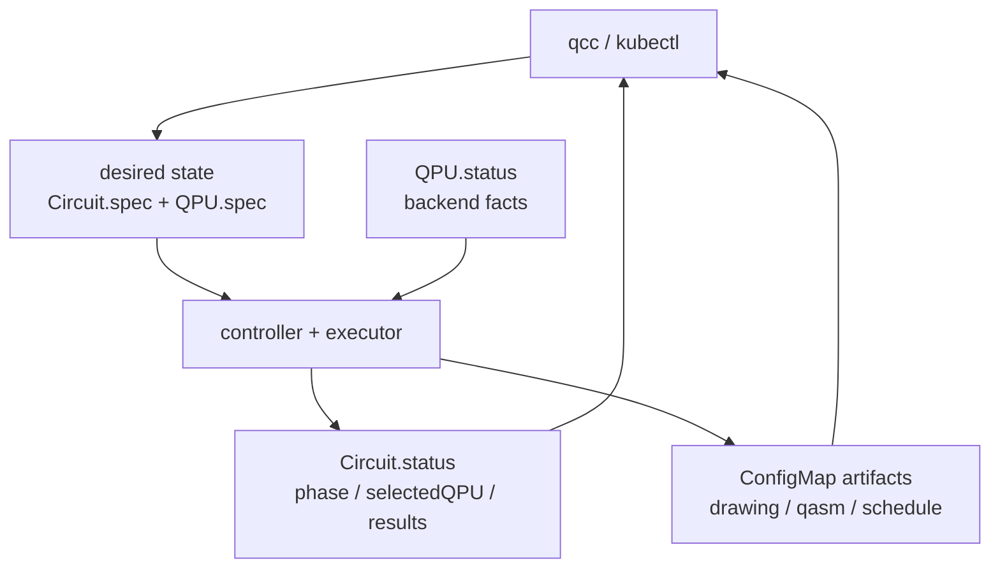
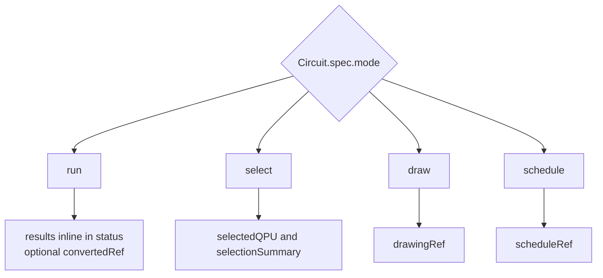
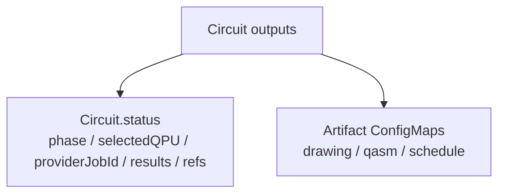

# API

This document summarizes the current QCC API from the implementation point of view.

## The API In One View

QCC intentionally exposes only two first-class resources:

- `Circuit`: one execution, draw, schedule, or selection request
- `QPU`: one backend profile plus observed backend metadata

Everything else is derived from those two.



The important split is:

- `spec` expresses desired state or declared backend identity
- `status` expresses observed state and outcomes
- artifacts hold bulky generated payloads

## Resource Summary

### `Circuit`

- group/version: `qcc.io/v1alpha1`
- scope: namespaced
- purpose: one circuit request and its lifecycle

### `QPU`

- group/version: `qcc.io/v1alpha1`
- scope: cluster-scoped
- purpose: one registered backend profile and its observed metadata

## Who Writes What

| Surface | Main writer | What it means |
|---|---|---|
| `Circuit.spec` | user or `qcc` CLI | desired circuit operation |
| `Circuit.metadata.labels` | user, CLI, and controller | grouping and provenance |
| `Circuit.status` | controller | what happened to the request |
| artifact `ConfigMap`s | controller | large generated outputs referenced from status |
| `QPU.spec` | user or sample manifest | declared backend identity |
| `QPU.status` | controller | probed backend facts and availability |

The executor influences status, but it does not write Kubernetes objects directly.

## `Circuit`

### Main Spec Fields

| Field | Meaning | Current status |
|---|---|---|
| `spec.source.format` | `openqasm3` or `qiskit` | implemented |
| `spec.source.body` | inline source text | implemented |
| `spec.mode` | `run`, `select`, `draw`, `schedule` | implemented |
| `spec.shots` | execution repetitions for `run` | implemented |
| `spec.backendSelector.provider` | provider filter | implemented |
| `spec.backendSelector.backendName` | exact backend target | implemented |
| `spec.backendSelector.kind` | `hardware` or `simulator` | implemented |
| `spec.backendSelector.minQubits` | minimum qubit requirement | implemented |
| `spec.backendSelector.allowedQPURefs` | QPU allow-list | schema exists, not enforced yet |
| `spec.backendSelector.region` | region/locality hint | schema exists, not enforced yet |
| `spec.optimizationLevel` | transpilation effort knob | implemented |
| `spec.timeoutSeconds` | execution timeout hint | present in wire model; not a full controller timeout policy |
| `spec.transpile` | opaque Qiskit transpile kwargs | implemented |
| `spec.execute` | opaque adapter execution kwargs | implemented |

### Circuit Mode Map



### Example: `run`

```yaml
apiVersion: qcc.io/v1alpha1
kind: Circuit
metadata:
  name: bell-run
spec:
  mode: run
  shots: 1024
  backendSelector:
    backendName: aer-statevector
  source:
    format: openqasm3
    body: |
      OPENQASM 3.0;
      include "stdgates.inc";
      qubit[2] q;
      bit[2] c;
      h q[0];
      cx q[0], q[1];
      c[0] = measure q[0];
      c[1] = measure q[1];
```

### Example: `draw`

```yaml
apiVersion: qcc.io/v1alpha1
kind: Circuit
metadata:
  name: bell-draw
spec:
  mode: draw
  source:
    format: qiskit
    body: |
      from qiskit import QuantumCircuit
      circuit = QuantumCircuit(2, 2)
      circuit.h(0)
      circuit.cx(0, 1)
      circuit.measure([0, 1], [0, 1])
```

### Modes

| Mode | Behavior | Main outputs |
|---|---|---|
| `run` | select backend and execute | `status.results`, `status.providerJobId`, `status.transpile`, optional `status.convertedRef` |
| `select` | select a backend only | `status.selectedQPU`, `status.selectionSummary` |
| `draw` | render ASCII drawing | `status.drawingRef` |
| `schedule` | render backend-specific timeline | `status.scheduleRef` |

### Backend Selector Semantics Today

| Selector field | Behavior today |
|---|---|
| `provider` | enforced |
| `backendName` | enforced |
| `kind` | enforced |
| `minQubits` | enforced |
| `allowedQPURefs` | declared, not enforced |
| `region` | declared, not enforced |

### Status Layout

QCC keeps small, structured facts on the CR and puts larger payloads into sibling artifacts.



### Status Fields

| Field | Meaning |
|---|---|
| `status.phase` | current user-facing phase |
| `status.selectedQPU` | chosen `QPU` name |
| `status.providerJobId` | executor/provider job identifier |
| `status.observedGeneration` | reconciliation generation marker |
| `status.conditions` | phase and outcome conditions |
| `status.selectionSummary` | human-readable selection summary |
| `status.results` | measurement counts |
| `status.usageSeconds` | substrate-reported billable compute time |
| `status.transpile` | depth / two-qubit / total gate counts |
| `status.drawingRef` | ASCII drawing artifact |
| `status.scheduleRef` | schedule artifact |
| `status.convertedRef` | converted QASM artifact |
| `status.traceId` | reserved field, not populated today |

### Result Shape

Execution results are currently stored inline as:

```yaml
status:
  results:
    "00": 512
    "11": 512
```

This matches the current thesis-scale workloads and CLI UX. QCC does not currently externalize result histograms to a separate result object.

### Phases

- `Pending`
- `Selecting`
- `Transpiling`
- `Submitting`
- `Running`
- `Rendering`
- `Scheduling`
- `Succeeded`
- `Failed`

### Conditions Used Today

- `Accepted`
- `Validated`
- `Selected`
- `Submitted`
- `Rendered`
- `Scheduled`
- `Completed`
- `Failed`

### Common Failure Reasons

- `InvalidCircuit`
- `NoEligibleBackend`
- `TranspilationFailed`
- `ProviderSubmissionFailed`
- `ProviderJobTimedOut`
- `SourceConversionFailed`
- `RenderingFailed`
- `SchedulingFailed`
- `SchedulingUnsupported`

### Artifacts

QCC stores generated payloads in sibling `ConfigMap`s instead of CR status.

| Ref field | ConfigMap payload |
|---|---|
| `drawingRef` | `data["drawing"]` |
| `convertedRef` | `data["qasm"]` |
| `scheduleRef` | `data["schedule.json"]` |

The CLI reads these artifacts directly for `qcc get --draw`, `qcc get --qasm`, and `qcc get --schedule`.

### Labels Used By The CLI And Controller

The CLI and controller support a small grouping/provenance label convention:

| Label | Writer | Meaning |
|---|---|---|
| `qcc.io/algorithm` | CLI or user | algorithm family |
| `qcc.io/algorithm-version` | CLI or user | algorithm version |
| `qcc.io/experiment` | CLI or user | experiment/campaign |
| `qcc.io/run-index` | controller | ordinal within an algorithm cohort |
| `qcc.io/source-sha256` | controller | short SHA-256 prefix of the source body |

These labels are used by:

- `qcc get` filtering
- `qcc run --performance-test`
- Grafana grouping
- provenance/debugging

## `QPU`

### Main Spec Fields

| Field | Meaning | Current status |
|---|---|---|
| `spec.provider` | adapter discriminator such as `local` or `ibm` | implemented |
| `spec.backendName` | provider-native backend name | implemented |
| `spec.kind` | `simulator` or `hardware` | implemented |
| `spec.qubits` | user hint for qubit count | implemented as fallback |
| `spec.capabilities.maxShots` | backend shot ceiling | implemented |
| `spec.region` | provider locality hint | stored, shown in CLI, not used by selection |
| `spec.access.credentialSecretRef` | per-QPU credential reference | schema exists, not consumed by runtime yet |

### Example: fake backend

```yaml
apiVersion: qcc.io/v1alpha1
kind: QPU
metadata:
  name: fake-brisbane
spec:
  provider: local
  backendName: fake_brisbane
  kind: simulator
```

### Example: IBM backend

```yaml
apiVersion: qcc.io/v1alpha1
kind: QPU
metadata:
  name: ibm-kingston
spec:
  provider: ibm
  backendName: ibm_kingston
  kind: hardware
```

### Main Status Fields

| Field | Meaning |
|---|---|
| `status.availability` | `Available`, `Unavailable`, or `Unknown` |
| `status.qubits` | probed authoritative qubit count |
| `status.basisGates` | backend basis-gate set |
| `status.couplingEdges` | coupling-map edge count |
| `status.lastCalibrationTime` | backend calibration timestamp |
| `status.errorMedians` | single-qubit, two-qubit, and readout medians |
| `status.coherenceMedians` | T1 and T2 medians |
| `status.dtSeconds` | backend `dt` period |
| `status.instructionDurationMedians` | median gate durations |
| `status.processor` | processor family metadata |
| `status.queueDepth` | declared in schema, not actively maintained today |
| `status.conditions` | readiness/freshness matrix |
| `status.lastError` | declared in schema, not actively populated today |

### Availability Model

Current provider policies:

- `local` -> `Available`
- `ibm` -> treated as `Available` optimistically
- unknown providers -> `Unknown`

This means `ibm` availability is not a strict health guarantee yet.

## API Behavior Notes

### Qiskit-Python input

When `Circuit.spec.source.format=qiskit`, the executor executes the Python source in an isolated module namespace, finds a `QuantumCircuit`, and converts it to OpenQASM 3 before normal execution.

### Backend resolution

The controller resolves the selected QPU by name, and the executor reads the provider/backend from the resolved `QPU`, not from free-form user strings alone.

### Provider values and future adapters

The runtime currently recognizes these provider values:

| `QPU.spec.provider` | Meaning |
|---|---|
| empty or `local` | Qiskit Aer and `fake_*` simulator snapshots |
| `ibm` | IBM Quantum through `qiskit-ibm-runtime` |

Future providers should be documented as adapter implementations, not as schema changes. The intended extension paths are:

- a generic Qiskit-provider adapter for ecosystems such as Amazon Braket via `qiskit-braket-provider`
- OpenQASM runtime adapters for services that accept OpenQASM payloads directly
- substrate-specific adapters such as QRMI, CUDA-Q, or vendor-direct SDKs

The minimum contract is broader than accepting circuit text. A provider adapter must expose backend facts, submit/watch/fetch lifecycle behavior, error mapping, and normalized counts/results that the controller can persist in `Circuit.status`.

### Effective backend name

If `QPU.spec.backendName` is empty, the code derives it from `metadata.name` by replacing dashes with underscores.

### Effective qubit count

Selection prefers `QPU.status.qubits` when probing has populated it, and falls back to `QPU.spec.qubits` otherwise.

### Provider credential behavior

This is important because the schema and runtime are currently different.

- the schema exposes `QPU.spec.access.credentialSecretRef`
- the runtime loads IBM credentials from executor deployment env vars
- QPU objects do not currently select different credentials at runtime

Treat `credentialSecretRef` as future-facing contract surface, not live behavior.

## Current Contract Gaps

These matter if you are treating the CRDs as a strict external contract. The shipped/partial/absent matrix lives in the implementation status section in [`README.md`](./README.md#implementation-status).

- `QPU.spec.access.credentialSecretRef` is documented but not wired into executor credential loading
- `allowedQPURefs` and `region` are documented API fields but not enforced in backend selection yet
- `Circuit.status.traceId` is reserved but not populated
- `queueDepth` and `lastError` exist on the `QPU` schema but are not central parts of the current runtime behavior
