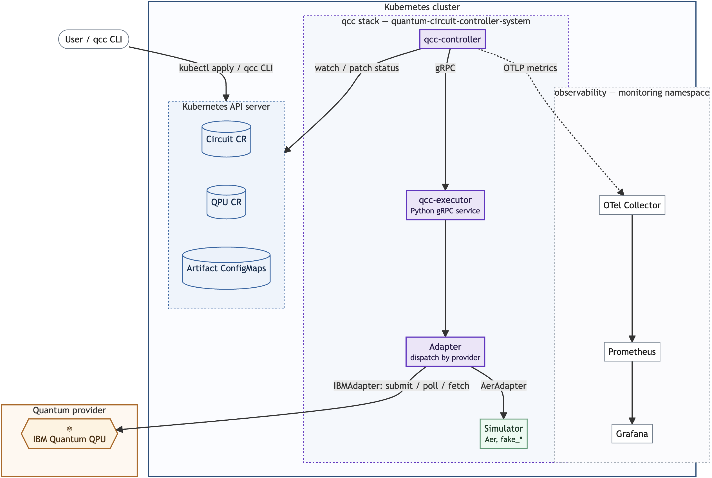
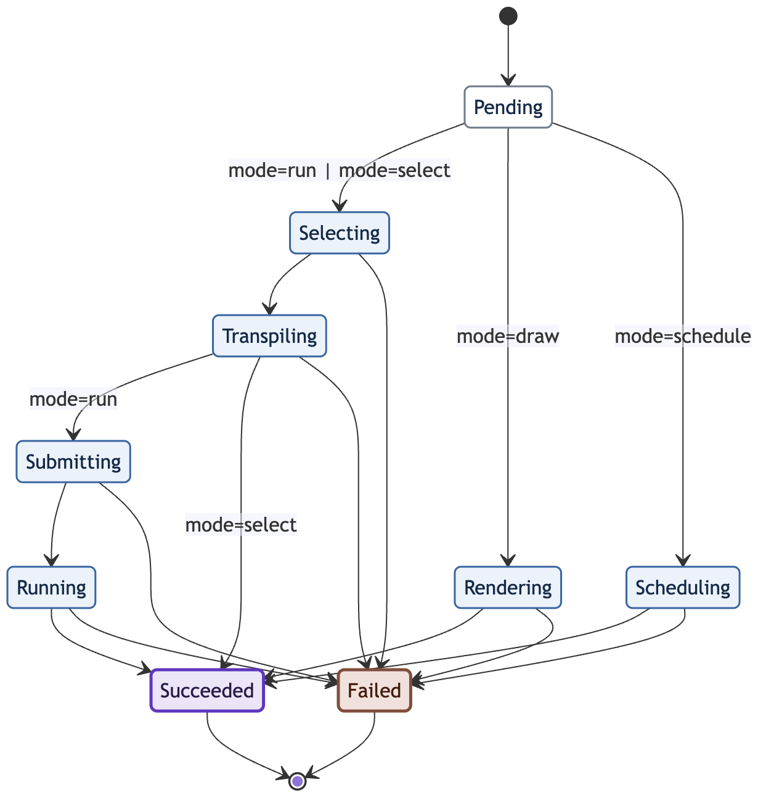
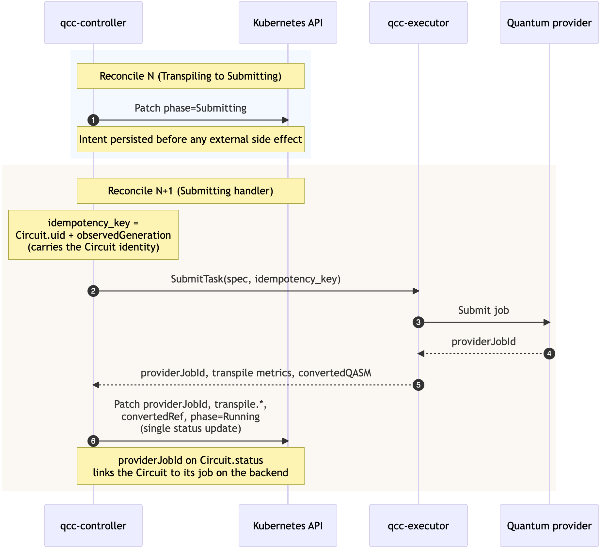

# Architecture

QCC applies SRE discipline to hybrid quantum-classical execution. Circuits
and the QPUs that execute them are modeled as observable, schedulable
Kubernetes resources, instrumented with the operational standards already
established in classical systems.

The design turns on one separation. The component that orchestrates work,
the controller, and the component that talks to quantum providers, the
executor, are kept apart and joined only by a typed gRPC contract. A user
states intent; the platform carries it across the quantum-classical
boundary and reports back through Kubernetes-native state and standard
telemetry.

## Requirements

Five requirements drive the design. The first four hold a quantum workload
to expectations already standard for production systems, and the fifth
captures what the quantum substrate adds.

| # | Name | Requirement |
|---|---|---|
| R1 | Declarative infrastructure | Stand up declaratively on commodity hardware, a laptop, a cloud VM, or a managed cluster, so one developer can operate backends and run circuits. HPC stays a valid target, not a prerequisite. |
| R2 | Observable through industry standards | Every circuit and backend surfaces operational state over standard telemetry that aggregates in any existing observability stack. Platform behaviour is instrumented; algorithm internals stay with the workflow. |
| R3 | Portable and modular across providers | Each provider sits behind an adapter against a stable API contract, out-of-tree the way Kubernetes moved storage drivers to CSI. The controller imports no vendor code, and adding a provider touches neither controller, schema, nor telemetry. |
| R4 | Correlated across the boundary in real time | Follow a circuit across the boundary and see its internals live, from transpiled shape to queue position to on-QPU versus orchestration time, through one identifier that resolves in both directions from the telemetry. |
| R5 | Monitored backend quality | Backend quality is a measured signal. Coherence times, gate and readout error rates, calibration vintage, and each run's outcome distribution are first-class telemetry, so backend choice and result-trust rest on execution evidence. |

The [evidence for each](#how-the-requirements-are-met) closes this page.

## System overview



A request enters as a Circuit on the Kubernetes API server, which is the
system's only entry point and its durable boundary. The controller watches
it, selects one of the backends registered as QPU resources, and drives
the circuit through its lifecycle without loading a quantum SDK.
Quantum-facing work is delegated to the executor over gRPC, where an
adapter dispatches by provider, either to an in-cluster simulator, Aer or
a calibration-faithful snapshot, or to IBM Quantum. Results return along
the same path, and all telemetry originates in the controller.

| Component | Kind | Role |
|---|---|---|
| `qcc-controller` | Go binary, Deployment | Reconciles Circuit and QPU; drives the phase machine; patches status; emits telemetry |
| `qcc-executor` | Python gRPC service, Deployment | Source conversion, drawing, transpilation, submission, result retrieval behind the adapter contract |
| `qcc` CLI | Go binary, user-side | Builds Circuit resources from local files; submits through the Kubernetes API |
| Circuit | Custom resource, namespaced | Declarative submission unit: body, intent, constraints, observed status |
| QPU | Custom resource, cluster-scoped | Registered backend: provider, kind, capabilities, calibration, availability |
| Executor gRPC API | `qcc.executor.v1` | Eight RPCs in three families: synchronous, asynchronous, utility |
| Adapter | Python module | One class per provider, registered by `spec.provider` |

## Components

### qcc-controller

A Kubernetes operator with two reconcilers. The CircuitReconciler drives
each Circuit through its phases, patching status and conditions on every
transition, which keeps the circuit's history on the resource where a
plain `kubectl describe` renders it. It also stamps the controller-owned
labels, `qcc.io/run-index` and `qcc.io/source-sha256`, at admission. The
QPUReconciler probes each registered backend through the executor's
`ProbeBackend` call and fills in qubit count, basis gates, coupling map,
calibration vintage, and error medians, and selection draws only from
backends it has marked `Available`.

Its input is API watches. Its output is status patches, OTLP metrics, and
gRPC calls. Large artifacts such as drawings and converted OpenQASM go to
ConfigMaps the Circuit owns.

### qcc-executor

The only component that links a quantum SDK. Its eight RPCs group into
three scopes. Discovery is a single call, `ProbeBackend`, returning the
backend characteristics recorded at registration: qubits, processor
identity, gate and readout errors, and the T1 and T2 coherence times.
Source handling covers `ConvertSource`, which translates Qiskit Python to
OpenQASM 3, `DrawCircuit`, which returns an ASCII rendering, and
`ScheduleCircuit`, which returns a per-instruction timeline. Execution
runs a simulator job in-process through `RunCircuit`, while a hardware job
threads through `SubmitTask`, `WatchTask`, and `FetchTaskResult`, the same
lifecycle as a Qiskit `JobV1`.

Every call stands alone. The request carries the source, the chosen
backend, and the correlation identifier; the response carries a result or
a job handle. The full RPC table is in the
[API reference](./api.md#the-executor-grpc-contract).

### qcc CLI

The CLI reads circuit source from local files, builds Circuit resources,
and submits them through the Kubernetes API. It links no quantum SDK,
since conversion runs server-side, so it ships as a single binary whose
only trust boundary is the API server, and everything it does is equally
reachable with `kubectl`.

A `run` blocks until completion, which suits simulators. The `--detach`
flag submits, waits until a provider job is queued, and exits, leaving the
controller to poll. The `--performance-test` flag fans the same circuit
out to every available simulator under one shared experiment label. Every
command and flag appears in the [CLI reference](./cli.md).

### Adapter contract

Inside the executor, every vendor operation goes through an `Adapter` base
class with six methods: `transpile`, `submit`, `poll`, `fetch_result`,
`inspect`, and `schedule`. Each returns a structured type that already
carries what the controller persists on status. A registry maps
`spec.provider` strings to adapters, so adding a vendor is one subclass
plus one registry entry, described in the
[adapter guide](./engineering.md#adding-a-provider-adapter).

| Provider | Adapter | Reach |
|---|---|---|
| `local` | `AerAdapter` | Qiskit Aer in-process plus `fake_*` snapshots through `FakeProviderForBackendV2`. No credentials. |
| `ibm` | `IBMAdapter` | IBM Quantum through `qiskit-ibm-runtime`, using `QiskitRuntimeService` and `SamplerV2`. Credentials from the `QISKIT_IBM_TOKEN` Secret. |

## Execution lifecycle

Each Circuit follows one of four mode-conditioned paths from `Pending` to
`Succeeded` or `Failed`. The modes share their early phases and diverge by
how far they go. A `run` executes end to end. A `select` stops after
transpilation and uses no QPU time. A `draw` renders ASCII into
`status.drawingRef`, and a `schedule` produces a per-instruction timeline
into `status.scheduleRef`.



### Submission and the cross-boundary identifier

Submitting is the lifecycle's one external side effect. Before issuing the
call the controller patches `phase=Submitting` to the cluster store, so
the intent to submit is durable across a controller restart. Each
submission carries an idempotency key formed from the Circuit's UID and
observed generation, which the executor reads back to stamp the
`qcc.circuit.uid` tag onto the IBM job. The returned provider job ID is
recorded on `status.providerJobId` in the same patch that sets
`phase=Running`, so the cross-boundary identifier lives on the resource
itself and survives restarts.



### Backend selection

The shipped selector applies hard constraints only. A QPU is eligible when
`status.availability` is `Available`, its `capabilities.maxShots` covers
the requested shots, and it matches the selector on provider, backend
name, kind, and minimum qubits. The controller takes the first eligible
candidate, and a Circuit with no qualifying candidate fails with
`NoEligibleBackend`. The selector ranks nothing; it filters and picks.
Scoring strategies would extend the same surface and consume the metrics
the lifecycle already exposes.

### The evaluation surface

Calibration enters after a run completes, when `qcc get circuit` turns the
recorded numbers into a verdict:

```text
shor-2vv42 · run · on ibm-kingston · degraded signal (error exposure ≈ 1.5)

  backend
    name         ibm-kingston  (156q · 352 edges · 10 basis gates)
    gate errors  1Q 2.74e-04 · 2Q 2.03e-03 · readout 1.65e-02
    coherence    T1 175 µs · T2 117 µs
    cycle time   dt = 4 ns

  circuit
    transpiled      depth 2048 · 2441 gates · 474 2Q
    exec time       ~139.26 µs (critical-path estimate)
    error exposure  ≈ 1.5 events/shot
    fidelity bound  P(no gate error) ≈ 0.22  (excludes readout & coherence)
```

The headline is an _error-exposure_ indicator, the expected number of
gate-error events per shot, computed as a first-order sum of transpiled
gate counts weighted by the backend's error medians:

```
exposure ≈ n_1Q·ε_1Q + n_2Q·ε_2Q
         = 1967 × 2.74e-4 + 474 × 2.03e-3 ≈ 0.54 + 0.96 ≈ 1.5
```

It falls into one of four bands: signal preserved below 0.1, noisy signal
from 0.1, degraded signal from 1, and signal expected lost at 5 and above.
The paired bound `P(no gate error) ≈ exp(-exposure) ≈ 0.22` says fewer
than a quarter of shots are expected free of any gate error.

This is the SRE error-budget framing carried to a quantum backend, and it
is a regime signal rather than a fidelity model. Only gate errors enter
the sum, and the same card makes the omission visible: the 139 µs
critical-path estimate is already comparable to the backend's T2 of
117 µs, so coherence decay is a real error source the gate-only number
does not capture.

## SRE principles, mapped

The thesis claim is SRE discipline applied to quantum execution. Where
each principle lands:

| Principle | Where it lives in QCC |
|---|---|
| Declarative desired state, reconciliation | Circuit and QPU custom resources; the phase machine converges observed toward declared |
| Error budgets | the error-exposure indicator and its bands, a budget verdict per run from measured backend data |
| Idempotency and safe retries | phase persisted before the external side effect; the UID and generation idempotency key; the terminal-versus-transient error rule |
| Observability as a first-class surface | the fourteen-metric specification; the USE-Q substrate dashboard and the RED-style circuit dashboard |
| Toil reduction | backend probing, label stamping, artifact garbage collection, and the performance-test fan-out are automation rather than runbook steps |
| Least privilege, small blast radius | scoped RBAC, restricted Pod Security Standard, vendor code confined to the executor |
| Graceful degradation | probe failures do not block availability, and the platform runs without the observability stack |
| Capacity discipline | metric cardinality budgeted per label, through allowlist promotion and a flagged 2^q dimension |

## How the requirements are met

| Requirement | Answered by |
|---|---|
| R1 Declarative infrastructure | the resource model plus the kind-deployable stack, in the [tutorial](./getting-started.md) |
| R2 Standards-based observability | the fourteen-metric `qcc_*` specification over OTLP into Prometheus, in the [metrics reference](./observability.md) |
| R3 Provider modularity | the adapter contract behind the executor gRPC seam |
| R4 Cross-boundary correlation | `providerJobId` on status and on `qcc_circuit_info`, plus the `qcc.circuit.uid` job tag, resolvable from both sides |
| R5 Monitored backend quality | QPU probe telemetry, per-run outcome metrics, and the evaluation surface, demonstrated end to end in the [demonstration](./demonstration.md) |

## Position and trajectory

QCC's architectural claim is legibility: a hybrid run is inspectable from
declared intent to provider-side execution and back to recorded outcome.
The research behind this section is the MSc thesis
[*Interface between Quantum and Classical Computers*](https://ioaiaaii.github.io/project/msc-thesis/)
(Democritus University of Thrace, 2026), of which QCC is the
proof-of-concept artifact.

### The QCSC reference architecture

IBM's Quantum-Centric Supercomputing reference architecture (Seelam et
al., 2026, [arXiv:2603.10970](https://arxiv.org/abs/2603.10970)) organises
the stack into Hardware Infrastructure, System Orchestration, Application
Middleware, and Applications, with System Management and Monitoring
cutting across them. It calls for Kubernetes-based orchestration and
Prometheus and Grafana monitoring of quantum resources without shipping a
vendor-neutral implementation of either.

QCC sits primarily in System Orchestration and absorbs a slice of
Application Middleware by transpiling each circuit against its selected
backend. Its main weight falls on the management and monitoring
cross-cut, where `Circuit.status` is the audit surface and the `qcc_*`
specification aggregates state across runs.

### Comparators

| System | What it is | What it optimises | How QCC differs |
|---|---|---|---|
| [Qubernetes](https://arxiv.org/abs/2408.01436) (Stirbu et al., 2024) | quantum jobs on Kubernetes batch primitives | packaging quantum workloads into existing Jobs | QCC models circuits and backends as purpose-built resources with a lifecycle, selection, and a metrics contract |
| [Qonductor](https://arxiv.org/abs/2408.04312) (Giortamis et al., SC '25) | cloud orchestrator for hybrid workloads | multi-objective scheduling over candidate backends | a different problem: Qonductor ranks placements, QCC makes runs legible with every decision and outcome observable |
| [QRMI](https://arxiv.org/abs/2506.10052) (Bacher et al., 2025) | resource-management interface and device-plugin sketch | exposing QPUs as allocatable resources beneath the scheduler | a complementary layer: QRMI allocates hardware, QCC orchestrates and observes execution above it, and a QRMI adapter fits the executor contract |
| IBM Quantum, AWS Braket, Azure Quantum | managed end-to-end services | vendor-integrated convenience | consumed through adapters rather than peers of the control plane, with QCC adding the vendor-neutral resource model and telemetry on top |
| Kanazawa et al., 2025 ([arXiv:2512.05484](https://arxiv.org/abs/2512.05484)) | observability architecture for QCSC workflows | structured telemetry inside an HPC and vendor context | the same architectural need implemented with open standards portable across providers |

The short answer to "why not X": Qubernetes has no resource model,
Qonductor solves scheduling rather than legibility, QRMI sits below the
scheduler, and the managed clouds are single-vendor.

### Toward an interface

Two surfaces are shaped as candidate interfaces rather than internal
conveniences.

The executor contract is one. Its asynchronous trio, `SubmitTask`,
`WatchTask`, and `FetchTaskResult`, deliberately follows the lifecycle of
Qiskit's `JobV1` and the QRMI task interface. A QRMI-managed resource, a
Qiskit-provider backend such as Braket, IonQ, or IQM, and a bare OpenQASM
runtime therefore implement the same six methods, without touching the
controller, the schema, or the telemetry.

The metrics specification is the other. The OpenTelemetry
semantic-conventions registry has no quantum namespace today, and the
fourteen-metric specification in the
[metrics reference](./observability.md#metric-specification) is a worked
proposal for what one would need: backend quality as gauges, lifecycle as
counters and histograms, an info-metric join key, and a cross-boundary
identifier label. The names are QCC's; the shape is the contribution.

Both are candidacies rather than standards. An interface argument needs a
reference implementation others can run, extend, and disagree with.

### Scalability model

Registered QPUs scale freely, since the registry is cluster-scoped and
probes are one-shot. Circuit submission scales per namespace, controller
availability comes from leader-elected standbys, and the read path scales
because metrics observe from informer caches rather than the API server.

One executor replica is the maximum, because the
asynchronous task registry is process-local. The synchronous simulator
path parks a reconcile worker for the duration of a run. Selection is
O(registered QPUs) per circuit, negligible at registry scale. Sizing
guidance is in [scaling and sizing](./operations.md#scaling-and-sizing).

A durable task registry unlocks
horizontal executor scaling, hardware allocation belongs below QCC in a
QRMI, device-plugin, or DRA layer as that matures, and calibration-aware
scoring extends the existing selection seam using telemetry the platform
already emits.

## What's next

The [API reference](./api.md) documents the Circuit and QPU fields
field by field. The [engineering guide](./engineering.md) covers
code-level detail, toolchain choices, and the decision ledger.
