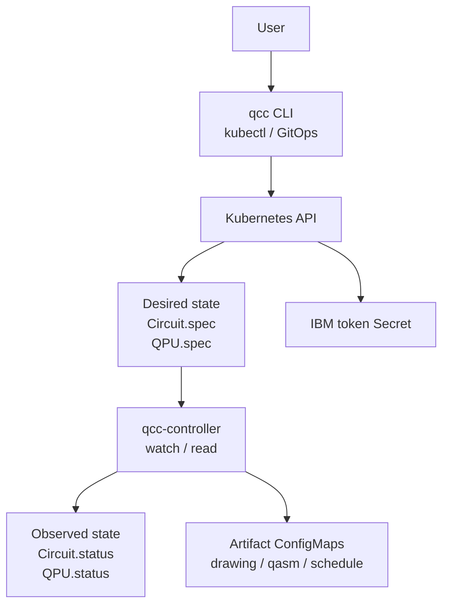
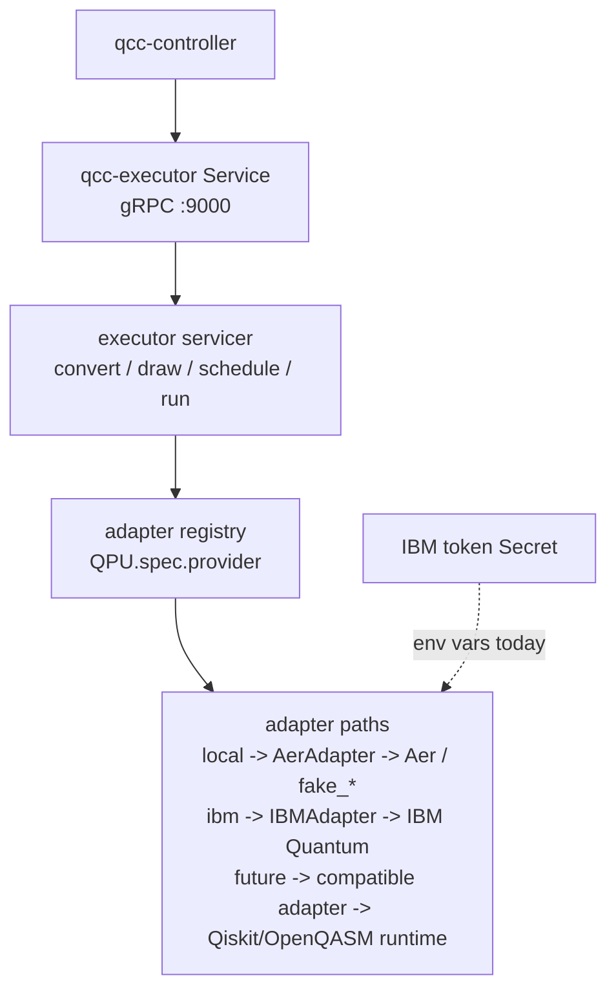
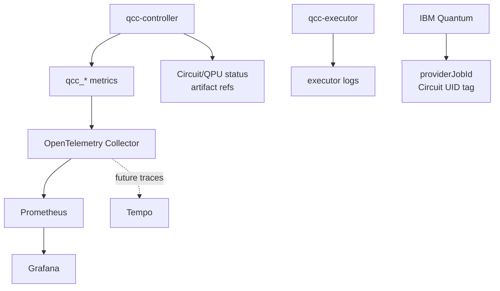
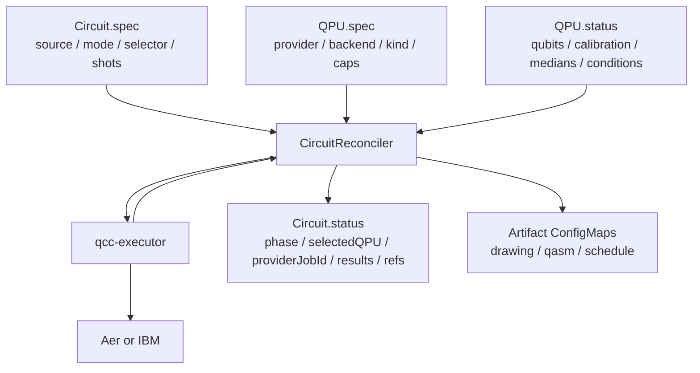
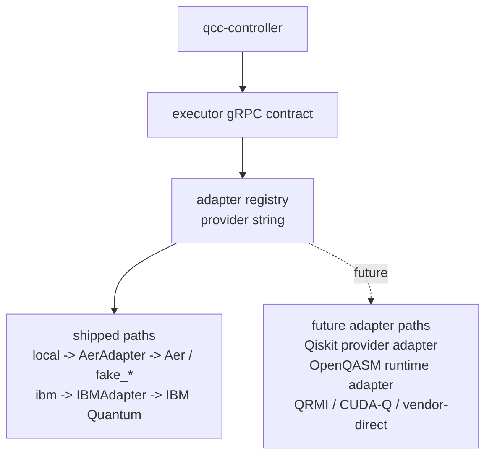
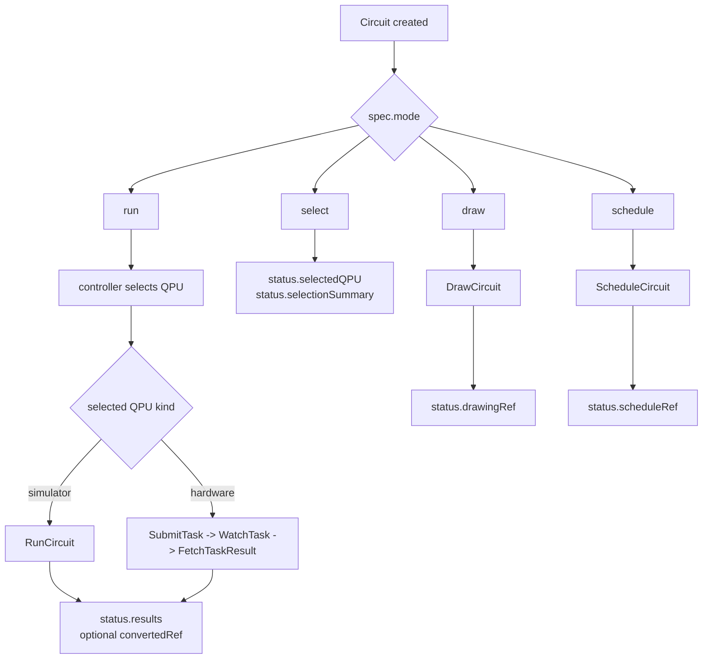
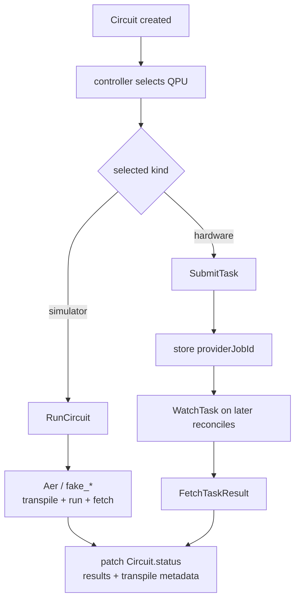
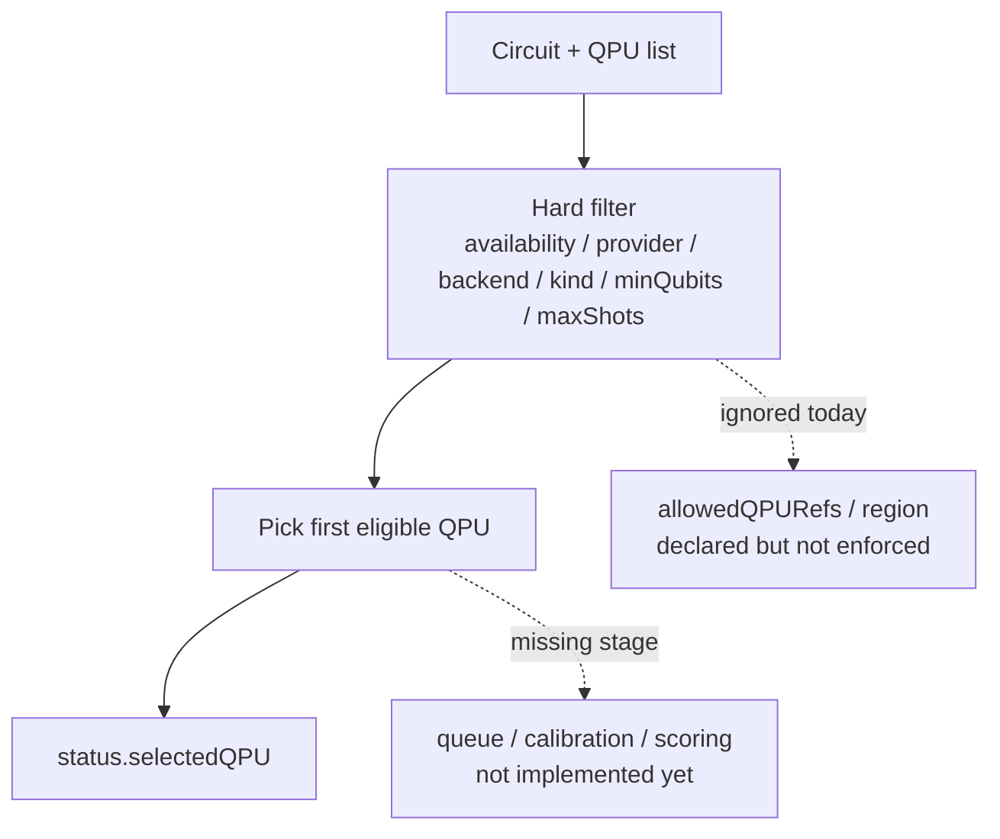

# Architecture

This document explains the runtime shape of QCC as it is implemented today.

## If You Remember Only Four Things

- Kubernetes is the durable control-plane boundary.
- The controller owns lifecycle and status, not quantum execution.
- The executor owns Qiskit, adapters, provider submission, and generated artifacts.
- The CLI talks only to Kubernetes, never directly to the executor or providers.

## System Topology

The full topology is split into three narrow slices so each figure fits a
portrait thesis page without hiding the implementation boundaries.

### Kubernetes Control Slice

### Executor Adapter Slice

### Observability Slice

The controller never bypasses Kubernetes storage: it watches, reads, and patches `Circuit` and `QPU` resources through the Kubernetes API, and it publishes bulky outputs through owned artifact `ConfigMap`s. The adapter registry dispatches by `QPU.spec.provider`; each adapter implements the same executor contract for inspection, execution, status polling, and result normalization. The observability stack is optional for local development, but it is part of the evaluated system: controller-side `qcc_*` metrics flow through the OpenTelemetry Collector into Prometheus and Grafana. The Python executor does not emit OTel telemetry today; it is visible through controller status, metrics, and logs.

## Component Roles

| Component | Owns | Does not own |
|---|---|---|
| Kubernetes API | durable resource state, status persistence, artifact discovery | quantum execution logic |
| `qcc-controller` | reconciliation, phase machine, status updates, QPU probing, metrics | Qiskit calls, provider SDKs |
| `qcc-executor` | source conversion, drawing, scheduling, transpilation, adapter dispatch, provider submission | CRD reconciliation, Kubernetes watch logic |
| `qcc` CLI | submit and inspect through Kubernetes | direct provider access, direct executor access |

## The Three State Surfaces

The cleanest way to understand QCC is to separate user intent, backend facts, and execution outcome.

Read that diagram as:

- `Circuit.spec` says what the user wants
- `QPU.spec` and `QPU.status` say what backends exist and what they look like
- `Circuit.status` says what happened

## Runtime Boundary Split

### Control plane

The control plane is everything that reasons in Kubernetes terms:

- `Circuit` and `QPU` resources
- reconciliation
- status transitions
- artifact references
- controller-side metrics

### Execution plane

The execution plane is everything that reasons in Qiskit/provider terms:

- source parsing
- OpenQASM conversion
- ASCII drawing
- schedule generation
- transpilation
- provider submission
- result retrieval

This split is the main architectural decision in the repo.

## Backend Adapter Boundary

The backend adapter is the portability seam. Everything provider-specific stays inside the Python executor; the controller continues to speak the same Kubernetes and gRPC vocabulary.

Current runtime adapters are only `local` and `ibm`. Future adapter work should be described as one of three categories:

- Qiskit-provider adapters: wrap a `qiskit.providers.Backend`/job-style provider and reuse Qiskit's transpilation and async job model.
- OpenQASM runtime adapters: send OpenQASM payloads to a backend that is not exposed as a Qiskit provider, then normalize status and counts back into QCC.
- Alternative substrate adapters: QRMI, CUDA-Q, or vendor-direct integrations that implement the same executor contract without changing the controller.

Supporting Qiskit or OpenQASM is necessary for a candidate backend, but not sufficient by itself. A QCC adapter must also implement backend inspection, capability reporting, submit/watch/fetch semantics, error mapping, and result normalization into `Circuit.status.results`.

## Mode Map

Each `Circuit.spec.mode` activates a different slice of the system.

## End-To-End `run` Flow

The most important path is still `mode=run`.

## Lifecycle Phases

The controller uses an explicit phase machine.

- `Pending`
- `Selecting`
- `Transpiling`
- `Submitting`
- `Running`
- `Rendering`
- `Scheduling`
- `Succeeded`
- `Failed`

Which subset appears depends on `Circuit.spec.mode`.

## Backend Selection Today

The original design docs describe a richer selection story than the current runtime actually implements. The implementation is simpler.

What is enforced today:

- `backendSelector.provider`
- `backendSelector.backendName`
- `backendSelector.kind`
- `backendSelector.minQubits`
- `QPU.spec.capabilities.maxShots`

What is not enforced today:

- `backendSelector.allowedQPURefs`
- `backendSelector.region`
- any queue-aware or calibration-aware scoring

In practice, the shipped comparison feature is `qcc run --performance-test`, not the `select` mode.

## Sync Vs Async Execution

| Path | Used for | Why |
|---|---|---|
| `RunCircuit` | simulators | quick and naturally synchronous |
| `SubmitTask` / `WatchTask` / `FetchTaskResult` | hardware backends | real provider queues outlive one reconcile loop |

The async path is correct for hardware, but it is not yet restart-tolerant because task handles live in executor memory only.

## QPU Lifecycle

The `QPUReconciler` is smaller than the `CircuitReconciler`.

It mainly:

- determines coarse availability
- probes backend metadata through the executor
- writes `QPU.status`
- emits QPU-side metrics

It does not run circuits.

## Artifact Model

QCC keeps large generated payloads out of CR status on purpose.

Artifacts are stored in owned `ConfigMap`s:

- `<circuit-name>-drawing`
- `<circuit-name>-converted`
- `<circuit-name>-schedule`

Each artifact is:

- in the same namespace as the `Circuit`
- owned by the `Circuit`
- garbage-collected with the `Circuit`

This is why `Circuit.status` stores references instead of large blobs.

## Trust Boundaries

| Actor | Main trust boundary |
|---|---|
| controller | Kubernetes state plus the executor gRPC contract |
| executor | selected `QPU` metadata, source bodies, and deployment env credentials |
| CLI | Kubernetes API only |

The CLI does not need direct network access to the executor or IBM.

## Status Boundary

This page explains how the system is shaped. For the shipped/partial/absent matrix, read the implementation status section in [`README.md`](./README.md#implementation-status).
