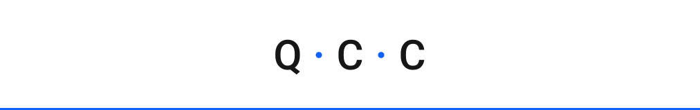

<picture>
  <source media="(prefers-color-scheme: dark)" srcset="./readme-banner.svg">
  
</picture>


# QCC brand assets

Drop these into any repo. All marks are pure SVG (no font files required — they fall back through `IBM Plex Sans` → system sans).

| File | Use |
|---|---|
| `qcc-mark-light.svg` | Default — README headers on light bg |
| `qcc-mark-dark.svg` | Dark-mode README, GitHub dark theme |
| `qcc-mark-blue.svg` | Hero / social card / OG image |
| `qcc-icon.svg` | Square app icon (64 × 64, rounded) |
| `favicon.svg` | Browser tab favicon (32 × 32) |

## Tokens

```
ink           #161616
paper-dim     #f4f4f4
phase / 60    #0f62fe   ← primary
phase / 30    #a6c8ff   ← dot on dark
night         #0a0a16
```

## Usage in a README

GitHub auto-switches with `#gh-light-mode-only` / `#gh-dark-mode-only`:

```md
<picture>
  <source media="(prefers-color-scheme: dark)" srcset="brand/qcc-mark-dark.svg">
  
</picture>
```

## Note on fonts

For pixel-perfect kerning, outline the glyphs (open the SVG in Figma/Illustrator → "Convert to outlines" → re-export). Until then, the SVGs use a font stack and look correct anywhere IBM Plex Sans is installed.
