# Demonstration: Shor's Algorithm End to End

This walkthrough exercises the whole platform with one workload: Shor's
algorithm factoring N=15 (a=4). It registers backends, draws and runs the
circuit, compares it across simulators, executes it on three live IBM
Heron r2 backends, reads the results through the dashboards, and finally
tunes one transpiler setting to show the two-tier schema absorbing a
vendor feature without any platform change.

Prerequisite: a running deployment
([getting-started.md](./getting-started.md)). The workload ships in the
repo at `examples/thesis/algorithms/shor.py`.

## 1. Register a backend

A QPU enters the platform through a minimal manifest, provider and kind;
everything else is discovered:

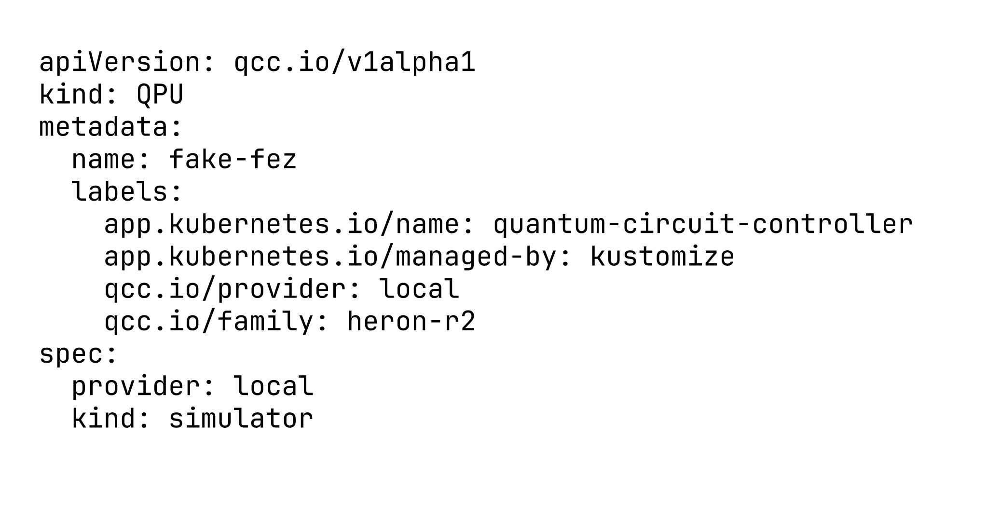

After `kubectl apply -f fake-fez.yaml`, the controller probes the backend
through the executor and populates `status` with the qubit count, basis
gates, coupling map, calibration vintage, and per-operation error
medians:

```bash
kubectl get qpu fake-fez -o yaml
```

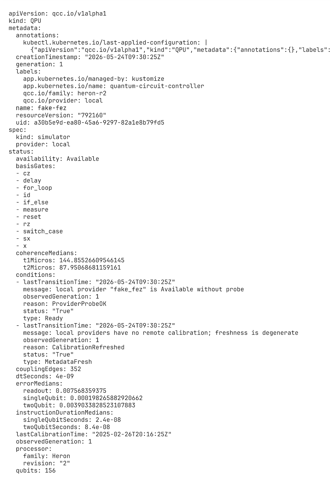

The registry at a glance, live IBM backends alongside simulators, with
processor family, 2Q error, T1, and calibration date in one listing:

```bash
kubectl get qpu
```

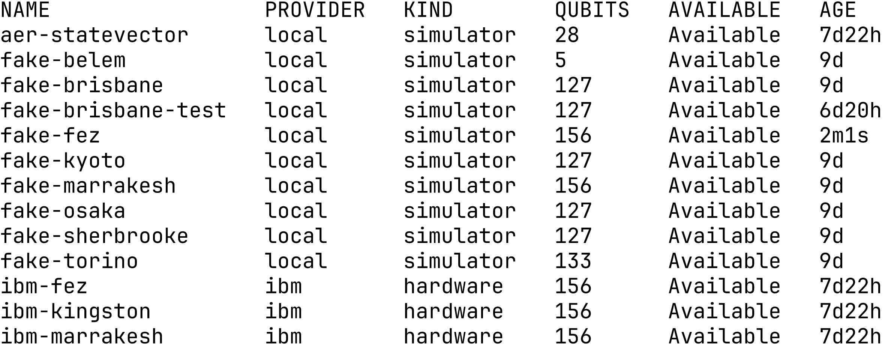

## 2. Draw the circuit

`mode=draw` renders the circuit without consuming QPU time, early
feedback on structure before anything runs:

```bash
qcc draw examples/thesis/algorithms/shor.py
```

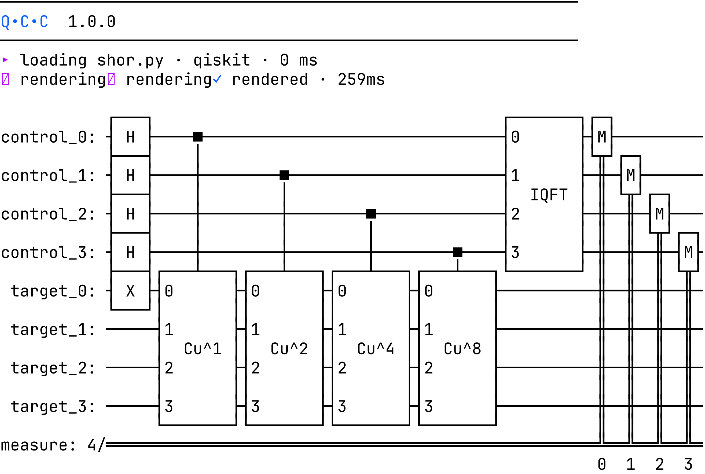

## 3. Run on the ideal simulator

The noise-free baseline targets `aer-statevector`, with grouping labels
for later comparison:

```bash
qcc run examples/thesis/algorithms/shor.py \
    --algorithm shor --experiment thesis \
    --version v1 --backend aer-statevector
```


The run completes in 510 ms after transpiling to depth 506. All 1024
shots land on the two expected period bitstrings `0000` and `1000`
(517 and 507); the difference is sampling variation.

The success metric used throughout is correct-period mass:

```
correct-period mass = (count[0000] + count[1000]) / shots
```

Ideal simulator: (517+507)/1024 = 100%. A fully decohered distribution
puts 2 of 16 outcomes in the period set, so 12.5% is the noise floor.

Every run is an ordinary Kubernetes resource.
`kubectl get circuit shor-lpdb7 -o yaml` shows the declared `spec`
(source, labels, backend) and the controller-assembled `status`
(conditions, counts, transpile shape).

## 4. Compare the simulators

Before spending hardware time, fan the same circuit out across every
registered simulator:

```bash
qcc run examples/thesis/algorithms/shor.py \
    --performance-test --algorithm shor \
    --version v1 --experiment thesis-perf-test
```

One `Circuit` per available simulator, all sharing the same source body
and `qcc.io/experiment` label. A single labelled experiment, not
unrelated runs:

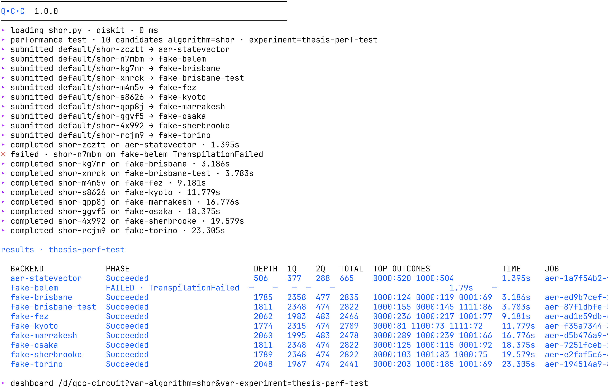

Two findings fall out of the table:

- Capability mismatches are first-class results. The 5-qubit `fake-belem`
  returns a terminal `TranspilationFailed`, recorded rather than silently
  omitted.
- Processor families separate. Heron r2 snapshots (`fake-fez`) keep
  `0000` and `1000` dominant; Eagle r3 snapshots (`fake-kyoto`) spread
  the mass until non-period bitstrings displace them.

The survey directs the hardware budget at the Heron r2 family.

## 5. Run on real hardware

Hardware jobs queue for minutes to hours, so submit detached. The CLI
exits once the provider job is queued and the controller polls in the
background:

```bash
qcc run examples/thesis/algorithms/shor.py \
    --algorithm shor --experiment thesis --version v1 \
    --backend ibm-fez --detach          # likewise ibm-kingston, ibm-marrakesh
```

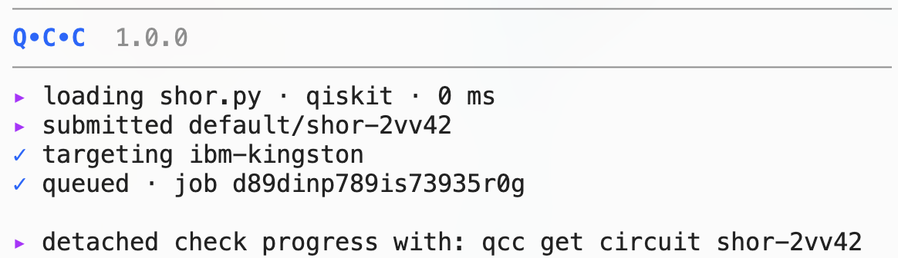

Each run uses 1024 shots and Qiskit's default transpilation (level 1, no
`optimizationLevel` set). Results, read back with
`qcc get circuit <name>`:

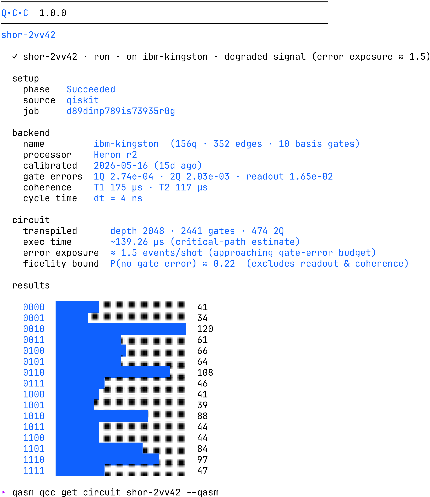

| Backend | Depth | 0000+1000 | Correct-period mass |
|---|---|---|---|
| `ibm-fez` | 2062 | 56+55 | 10.8% |
| `ibm-marrakesh` | 2048 | 42+44 | 8.4% |
| `ibm-kingston` | 2048 | 41+41 | 8.0% |

Two operational findings:

- All three sit at or below the 12.5% noise floor. Under default
  transpilation the circuit is degraded everywhere; "best" means
  least-degraded, not successful. The signal is recovered in step 8.
- T1 alone does not predict the ranking. By T1: `ibm-marrakesh`
  (about 196 µs), then `ibm-kingston` (about 175 µs), then `ibm-fez`
  (about 102 µs). By outcome, `ibm-fez` is least degraded. Backend
  quality is not reducible to one calibration number, which is exactly
  why it is telemetry rather than a spec sheet.

The whole experiment reads from a single listing. Every Circuit carries
its algorithm label, selected QPU, provider job ID, and terminal phase:

```bash
qcc get circuits
```

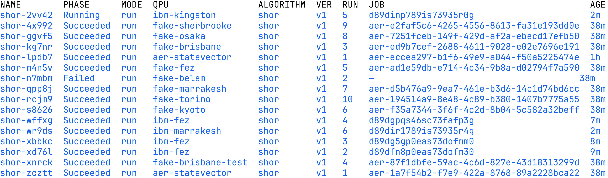

## 6. Read the dashboards

The `qcc_*` metrics render on two Grafana dashboards
([observability.md](./observability.md)).

QPU dashboard, substrate health: availability and ready-over-registered,
plus calibration age as the freshness signal:

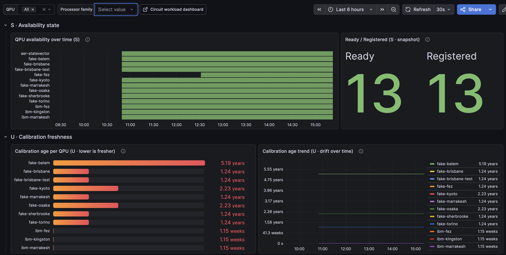

The errors section shows per-operation gate and readout medians, T1 and
T2, and a family-comparison row: registered Heron r2 QPUs at 0.32% median
2Q error versus 20.60% for the Eagle-family snapshots. The same
generation-level contrast the simulator sweep exposed, now visible at
fleet level:

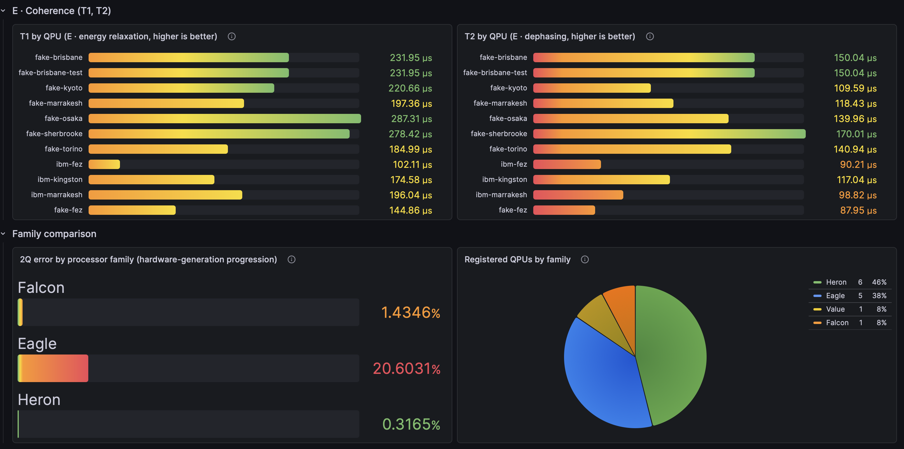

Circuit dashboard, one run in detail: identity, transpile shape, phase
timing, outcome distribution. The `$experiment` template variable filters
every panel to the runs sharing an experiment label, so cross-substrate
comparison is a selector change rather than a PromQL exercise:

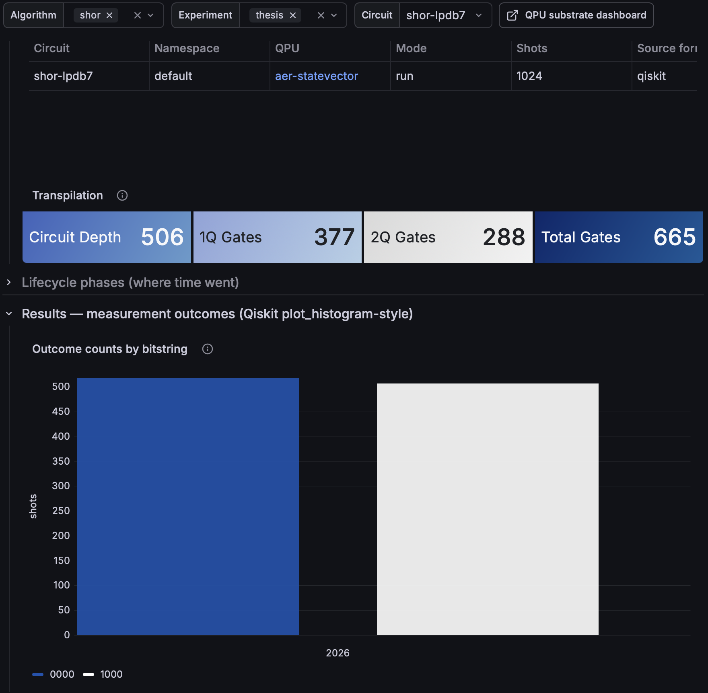

## 7. Cross the boundary in both directions

The identity panel's `provider_job_id` cell carries an "Open on IBM
Quantum" data link, resolved from the `qcc_circuit_info` series:

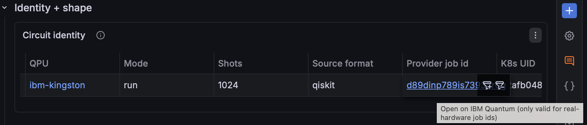

In the opposite direction, the executor stamps the Circuit's Kubernetes
UID onto the IBM job as a `qcc.circuit.uid` tag, so the vendor console
points back at the owning Circuit:

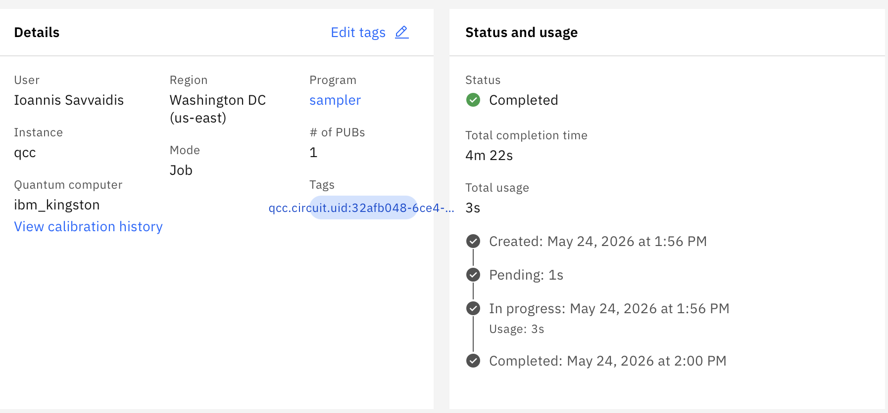

Together the two identifiers make a run traceable from either side, live
and after termination, with standard tooling on both ends.

## 8. Tune the transpiler

The v1 hardware runs left the signal under the noise floor. Two further
runs on `ibm-kingston` (4096 shots, so the comparison isolates
transpilation) change one thing each.

v2, a Tier-1 change: raise `optimizationLevel` to 3.

```yaml
spec:
  mode: run
  shots: 4096
  optimizationLevel: 3
```

v3, a Tier-2 change: add a passthrough `transpile` block with Qiskit's
as-late-as-possible scheduling pass. The key lands verbatim as a
`transpile()` kwarg, with no CRD change and no controller rebuild:

```yaml
spec:
  mode: run
  shots: 4096
  optimizationLevel: 3
  transpile:
    scheduling_method: alap
```

Both are submitted with `kubectl create -f` (the Tier-2 block is not
typed in the CRD and has no CLI flag; see
`examples/thesis/circuits/shor-v2.yaml` and `shor-v3.yaml`).

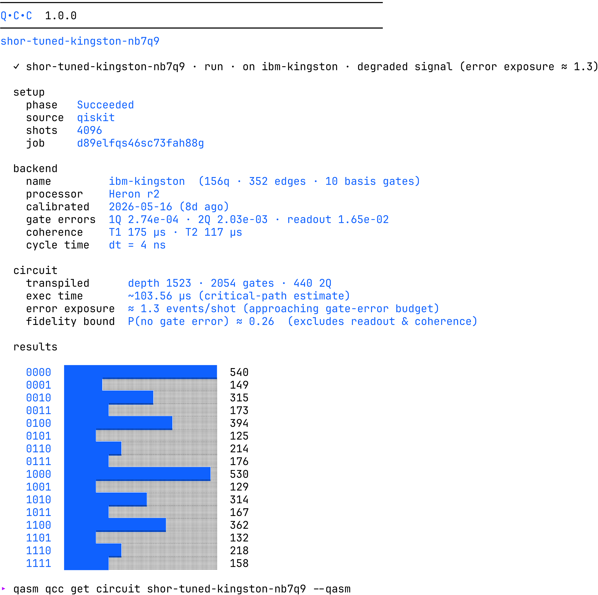

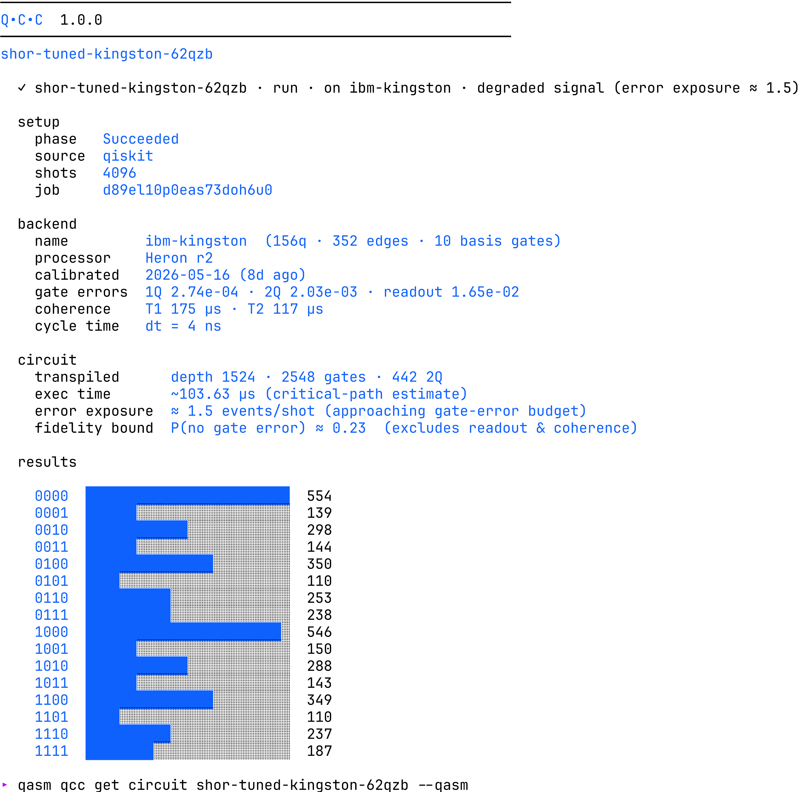

The full arc:

| Run | Transpilation | Shots | 0000+1000 | Success |
|---|---|---|---|---|
| Aer (ideal) | default | 1024 | 517+507 | about 100% |
| `ibm-fez` (v1) | default, L1 | 1024 | 56+55 | 10.8% |
| `ibm-marrakesh` (v1) | default, L1 | 1024 | 42+44 | 8.4% |
| `ibm-kingston` (v1) | default, L1 | 1024 | 41+41 | 8.0% |
| `ibm-kingston` (v2) | level 3 (Tier-1) | 4096 | 540+530 | **26.1%** |
| `ibm-kingston` (v3) | level 3 + `alap` (Tier-2) | 4096 | 554+546 | 26.9% |

The reading is operational, not an optimization claim. One stable Tier-1
field cuts depth from 2048 to 1523 and recovers the signal above the
noise floor, from 8.0% to 26.1%. The Tier-2 `alap` pass then inflates the
gate count from 2054 to 2548 (inserted delays) and drops the modelled
fidelity bound from 0.26 to 0.23, while the measured outcome stays within
sampling noise at 26.9%. Both the empirical outcome and the modelled
exposure are visible for every run on the same telemetry surface; the
model-versus-measurement gap is itself legible.
