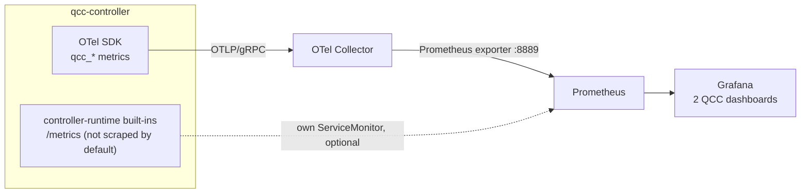

# Observability

QCC's principal contribution is its observability surface: a metrics
specification built entirely on cloud-native open standards, plus a query
convention that lets ordinary PromQL answer cross-substrate questions
without distributed tracing. This page is the reference; the dashboards in
action, with screenshots, are in
[demonstration.md](./demonstration.md#6-read-the-dashboards).

## The four surfaces

| Question | Surface |
|---|---|
| Which phase is my circuit in? Which backend? Why did it fail? | `Circuit.status` (phase, `selectedQPU`, conditions) |
| What exactly was executed? | `status.convertedRef` artifact plus `status.transpile` |
| What does this backend look like right now? | `QPU.status` (calibration, medians, availability) |
| How do runs compare across backends or versions? | Grafana / PromQL over `qcc_*` metrics |
| Which IBM job is this Circuit, and vice versa? | `status.providerJobId` and the `qcc.circuit.uid` job tag |
| Why did an RPC or adapter call fail? | controller and executor logs |

Per-resource truth lives on the resources; the metrics exist for the
aggregate view, many Circuits and QPUs at once.

## Telemetry pipeline

Two data paths feed one Prometheus, so Grafana sees a single data source:



Emitting OTLP rather than a backend-specific format keeps the application
independent of the metrics store: switching stores is Collector
configuration, not a QCC change. The executor emits no telemetry of its
own today; its work is visible through controller status, metrics, and
logs.

Two implementation patterns keep the reconcile hot path cheap and the
series count bounded:

- Resource-state metrics are observable gauges read from the
  controller-runtime informer cache once per export cycle (the
  kube-state-metrics idiom). The scrape path never touches the API
  server; a gauge can lag a status change by up to one cycle (30 s).
- Operational-event metrics (`qcc_circuits_total`, the phase-duration
  histogram) are recorded synchronously at the moment of a lifecycle
  transition (the controller-runtime idiom).

## Metric specification

Fourteen domain metrics. Six describe the substrate (how good each
backend currently is), eight describe the work (what happened to each
circuit).

### QPU metrics

All six are observable gauges populated from `QPU.status`. Every series
carries the `qpu` identity label; `QPU` is cluster-scoped, so there is no
`namespace` label.

| Metric | Additional dimensions |
|---|---|
| `qcc_qpu_info` | `uid, provider, kind, processor_family, processor_revision` |
| `qcc_qpu_operation_error_median` | `operation` in `{gate_1q, gate_2q, readout}` |
| `qcc_qpu_operation_duration_median_seconds` | `operation` in `{gate_1q, gate_2q}` |
| `qcc_qpu_coherence_seconds` | `type` in `{t1, t2}` |
| `qcc_qpu_last_calibration_timestamp_seconds` | none |
| `qcc_qpu_condition` | `condition`, `status` in `{true, false, unknown}` |

Dimension semantics, the physical quantities a quantum engineer reasons
about, each a median across the device's qubits or pairs:

- `gate_1q`: single-qubit gates. On IBM hardware the native `sx` and `x`;
  `rz` is virtual and error-free, so the figure reflects physical gate
  quality.
- `gate_2q`: the entangling gate (`cz` on Heron, `ecr` on Eagle), the
  operation that dominates a deep circuit's error budget.
- `readout`: measurement assignment error. Error metric only: the IBM
  `Target` reports no measurement duration, so `readout` is absent from
  the duration metric rather than zero.
- `t1` and `t2`: energy relaxation and dephasing. The CRD stores
  microseconds (IBM's published unit); the metric converts to seconds to
  honor its `_seconds` suffix.

`qcc_qpu_info` is the info-metric anchor (value always 1, identity in
labels); other QPU metrics join to it with `group_left`.
`qcc_qpu_condition` follows the kube-state-metrics Conditions idiom: one
row per `(qpu, condition, status)`, exactly one of which is 1.

### Circuit metrics

All series carry `circuit`, `namespace`, and `uid` as identity labels.

| Metric | Type | Additional dimensions |
|---|---|---|
| `qcc_circuit_info` | gauge | `mode, source_format, shots, qpu, provider_job_id, algorithm, algorithm_version, experiment, run_index, source_sha256` |
| `qcc_circuits_total` | counter | `mode, qpu, phase, reason, provider_job_id` |
| `qcc_circuit_phase_duration_seconds` | histogram | `qpu, phase, provider_job_id` |
| `qcc_circuit_phase_duration_seconds_observed` | gauge | `qpu, phase, provider_job_id` |
| `qcc_circuit_usage_seconds` | gauge | `qpu, provider_job_id` |
| `qcc_circuit_transpile_depth` | gauge | `qpu` |
| `qcc_circuit_transpile_gates` | gauge | `qpu, kind` in `{single_qubit, two_qubit, total}` |
| `qcc_circuit_result_count` | gauge | `qpu, bitstring` |

Dimension semantics:

- `kind`: post-transpile gate counts in the backend's native set.
  `two_qubit` is the count that drives fidelity; `single_qubit` is
  derived as total minus two_qubit.
- `phase`: one of `Pending`, `Selecting`, `Submitting`, `Running`, from
  the `status.conditions` timestamps. `Submitting` spans transpilation
  and submission together, which the conditions vocabulary does not
  separate.
- `bitstring`: a measured outcome (`0000`), valued by shot count. The raw
  measurement histogram and the input to any fidelity analysis; it adds
  2^q series for a q-qubit readout, fine at small-circuit scale and
  budgeted, revisit beyond.

Three deliberate design points:

- The phase-duration pair. The histogram gives fleet-wide percentiles via
  `histogram_quantile`; the `_observed` gauge is recomputed from
  condition timestamps every cycle, so per-Circuit panels survive
  controller restarts and Prometheus's staleness window. Same numbers,
  two lifetimes.
- `qcc_circuit_usage_seconds` is the substrate's own billable on-QPU time
  (Qiskit Runtime `Job.usage()`), emitted only when the substrate reports
  it, so any value in Prometheus marks a real-hardware run. Dividing it
  by the `Running` duration gives the orchestration overhead.
- The cross-boundary handle. The provider job ID is promoted onto
  `qcc_circuit_info` as `provider_job_id`. Given a job ID from a vendor
  console or billing export, one PromQL lookup returns the Circuit's full
  identity; given a Circuit, the ID sits on its status. The link reads
  from either side with no trace-context channel.

## Algorithm-aware queries

"How does Shor v2 compare to v1?" is an algorithm-level question, and
Prometheus has no algorithm catalogue. QCC closes the gap by promoting the
reserved `qcc.io/*` labels from the resource into metric label-space, onto
`qcc_circuit_info` only, so operational series stay low-cardinality and
join back on `uid`:

```promql
# transpiled depth of every "shor" run, labelled by version
qcc_circuit_transpile_depth
  * on(uid) group_left(algorithm, algorithm_version)
    qcc_circuit_info{algorithm="shor"}
```

The promotion is an explicit allowlist (algorithm, algorithm-version,
experiment, run-index, source-sha256). Arbitrary user labels are never
forwarded, because that would hand cardinality control to whoever creates
Circuits.

## Worked queries

```promql
# 1. Orchestration overhead: on-QPU seconds versus wall-clock Running time.
#    Only real-hardware runs have usage_seconds, so the ratio self-selects.
qcc_circuit_usage_seconds
  / on(uid) qcc_circuit_phase_duration_seconds_observed{phase="Running"}

# 2. Fleet p95 of Running duration per backend, from the histogram.
histogram_quantile(0.95,
  sum by (le, qpu) (rate(qcc_circuit_phase_duration_seconds_bucket{phase="Running"}[1h])))

# 3. Correct-period mass for every "shor" run (the demonstration's metric):
#    period-bitstring counts over total counts, labelled by version and QPU.
  sum by (uid) (qcc_circuit_result_count{bitstring=~"0000|1000"})
/ sum by (uid) (qcc_circuit_result_count)
* on(uid) group_left(algorithm_version, qpu) qcc_circuit_info{algorithm="shor"}

# 4. Failure reasons over the last day.
sum by (reason) (increase(qcc_circuits_total{phase="Failed"}[24h]))
```

## Dashboards

Two source-controlled dashboards ship as ConfigMaps under
[`../deploy/grafana/`](../deploy/grafana/) (label `grafana_dashboard: "1"`,
picked up by the kube-prometheus-stack sidecar; install with
`kubectl apply -f deploy/grafana/`):

- QCC · QPU substrate health (USE-Q): fleet view of availability,
  ready-over-registered, calibration freshness, error medians, coherence,
  family comparison.
- QCC · Circuit detail: one run's identity, transpile shape, phase
  timing, outcome histogram, `$experiment`/`$algorithm` pivots, and the
  "Open on IBM Quantum" data link on `provider_job_id`.

USE-Q is the USE method (Utilisation, Saturation, Errors) adapted to a
quantum substrate, a deliberate prototype mapping rather than settled
methodology. Saturation becomes "can this backend accept work"
(availability, ready-over-registered). Utilisation becomes "is it fresh
enough to be useful" (calibration age, since quality drifts between
calibrations). Errors becomes the noise profile (gate and readout
medians, T1 and T2, family comparison). The Circuit dashboard plays the
RED role for the workload side: rate and errors from
`qcc_circuits_total`, duration from the phase metrics, outcome from the
result histogram.

## Logs

Controller (slog JSON) and executor (Python logging) both write to
stdout:

```bash
kubectl logs -n quantum-circuit-controller-system deploy/quantum-circuit-controller-controller-manager
kubectl logs -n quantum-circuit-controller-system deploy/quantum-circuit-controller-executor
```

Logs are the right surface for adapter exceptions, probe failures, and
RPC transport errors. Status compresses those into a condition reason;
the logs keep the stack trace.

## What is not here yet

Distributed tracing (provider wired, no spans exported), executor-side
telemetry, and Kubernetes Events are absent by design in this release.
See the [implementation status matrix](./README.md#implementation-status)
for the full inventory.
