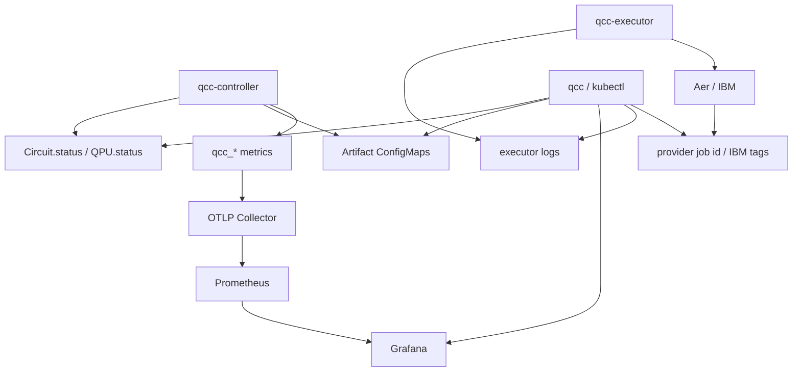
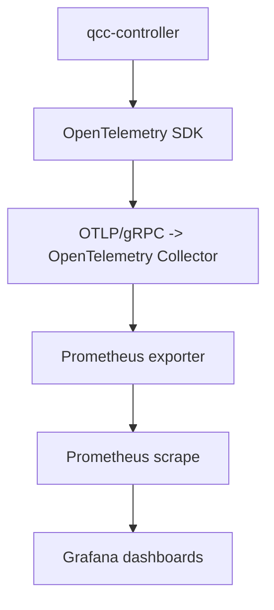
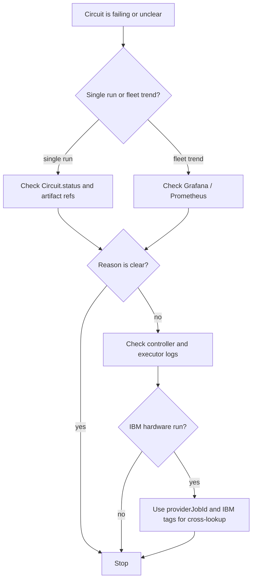

# Observability

This document describes the telemetry and operational surfaces that exist in the current implementation.

## The Short Version

Today, QCC is observable primarily through:

- `Circuit.status`
- `QPU.status`
- artifact `ConfigMap`s
- controller-side `qcc_*` metrics
- controller and executor logs
- IBM job ID and tag linkage

It is not yet observable through end-to-end traces or executor-side telemetry.

## Signal Map



Read that diagram as four separate observability surfaces:

- status for per-resource truth
- artifacts for large outputs
- metrics for fleet-level comparison and dashboards
- logs for adapter and RPC detail

## Use The Right Surface For The Question

| Question | Best surface | Why |
|---|---|---|
| Which phase is my circuit in? | `Circuit.status.phase` | primary per-run lifecycle fact |
| Which backend was chosen? | `Circuit.status.selectedQPU` | exact controller decision |
| Why did it fail? | `Circuit.status.conditions` | reason and message are persisted |
| What exactly was executed? | `status.convertedRef` plus `status.transpile` | captures normalized source and transpile shape |
| What does this backend look like? | `QPU.status` | calibration, qubits, medians, conditions |
| How long do phases take? | `qcc_circuit_phase_duration_seconds_observed` and `qcc_circuit_phase_duration_seconds` | one is per-Circuit, one is aggregate |
| Which IBM job matches this Circuit? | `status.providerJobId` and IBM tags | forward and reverse lookup |
| How do multiple runs compare? | Grafana over `qcc_*` metrics | best surface for cross-run and cross-QPU views |
| Why did the executor RPC fail? | controller and executor logs | status often compresses the error |

## What Exists Today

| Surface | Status | Notes |
|---|---|---|
| `Circuit.status` | implemented | primary per-run lifecycle surface |
| `QPU.status` | implemented | primary backend metadata surface |
| artifact `ConfigMap`s | implemented | drawings, converted QASM, schedules |
| `qcc_*` metrics via OTLP | implemented | controller-side instrumentation |
| Grafana dashboards | implemented | source-controlled dashboards under `deploy/grafana/` |
| cross-boundary IBM job tagging | implemented | Circuit UID stamped into IBM job tags |
| executor-side OTel instrumentation | not implemented | no Python-side metrics or traces |
| real distributed tracing | scaffolded only | tracer provider skeleton, no active exporter path |
| Kubernetes `Event` emission | not implemented | docs and RBAC mention it, runtime does not emit them today |
| direct scrape of controller-runtime built-ins | disabled by default | manifests exist but are not enabled in the default deploy |

## Observability Model

The current model is intentionally simple.

### 1. Resource status

`Circuit.status` and `QPU.status` are the primary operational truth.

Use them for:

- phase
- selected backend
- provider job ID
- transpile depth and gate counts
- backend error medians
- backend calibration time

### 2. Artifact `ConfigMap`s

Generated large payloads live in owned `ConfigMap`s and are read by the CLI.

- ASCII drawings
- converted OpenQASM 3
- schedule timelines

### 3. Metrics

The controller exports OTLP metrics to a collector, then to Prometheus and Grafana.



### 4. Logs

Logs are still the best place for:

- executor adapter exceptions
- provider probe failures
- RPC transport failures
- Python-side stack traces

## Operational Lookup Order

When debugging one Circuit, this is the most useful sequence.



## Circuit Metrics

### Observable gauges

- `qcc_circuit_info`
- `qcc_circuit_transpile_depth`
- `qcc_circuit_transpile_gates`
- `qcc_circuit_result_count`
- `qcc_circuit_phase_duration_seconds_observed`
- `qcc_circuit_usage_seconds`

### Event-driven instruments

- `qcc_circuits_total`
- `qcc_circuit_phase_duration_seconds`

### Circuit metric inventory

| Metric | Type | Purpose |
|---|---|---|
| `qcc_circuit_info` | observable gauge | identity row for joins |
| `qcc_circuit_transpile_depth` | observable gauge | post-transpile depth |
| `qcc_circuit_transpile_gates` | observable gauge | gate counts by kind |
| `qcc_circuit_result_count` | observable gauge | per-bitstring outcome counts |
| `qcc_circuit_phase_duration_seconds_observed` | observable gauge | per-Circuit phase durations from status timestamps |
| `qcc_circuit_usage_seconds` | observable gauge | hardware-reported compute time |
| `qcc_circuits_total` | counter | phase-transition count |
| `qcc_circuit_phase_duration_seconds` | histogram | fleet-level phase-duration distribution |

## QPU Metrics

- `qcc_qpu_info`
- `qcc_qpu_operation_error_median`
- `qcc_qpu_operation_duration_median_seconds`
- `qcc_qpu_coherence_seconds`
- `qcc_qpu_last_calibration_timestamp_seconds`
- `qcc_qpu_condition`

### QPU metric inventory

| Metric | Type | Purpose |
|---|---|---|
| `qcc_qpu_info` | observable gauge | identity row for joins |
| `qcc_qpu_operation_error_median` | observable gauge | 1Q/2Q/readout medians |
| `qcc_qpu_operation_duration_median_seconds` | observable gauge | 1Q/2Q median durations |
| `qcc_qpu_coherence_seconds` | observable gauge | T1/T2 medians |
| `qcc_qpu_last_calibration_timestamp_seconds` | observable gauge | calibration freshness |
| `qcc_qpu_condition` | observable gauge | KSM-style condition matrix |

## Dashboard And Evidence Pointers

The dashboard manifests live here:

- [`../deploy/grafana/qcc-circuit-dashboard.yaml`](../deploy/grafana/qcc-circuit-dashboard.yaml)
- [`../deploy/grafana/qcc-qpu-dashboard.yaml`](../deploy/grafana/qcc-qpu-dashboard.yaml)

If you want concrete examples of what those dashboards look like, use the captured screenshots in `../docs/`:

- [`../docs/grafana_qpu_availability.png`](../docs/grafana_qpu_availability.png): fleet-level QPU readiness and availability
- [`../docs/grafana_qpu_coherence.png`](../docs/grafana_qpu_coherence.png): coherence and family comparison view
- [`../docs/grafana_qcc_qpu_metrics.png`](../docs/grafana_qcc_qpu_metrics.png): QPU metric inventory in Grafana Explore
- [`../docs/grafana_qcc_circuit_metrics.png`](../docs/grafana_qcc_circuit_metrics.png): Circuit metric inventory in Grafana Explore
- [`../docs/grafana_circuit_provider_job_link.png`](../docs/grafana_circuit_provider_job_link.png): reverse linkage from dashboard to provider job ID
- [`../docs/grafana_circuit_get_shor_tuned_v2.png`](../docs/grafana_circuit_get_shor_tuned_v2.png): one real Circuit detail view

For the full evidence narrative behind those screenshots, read [`../docs/README.md`](../docs/README.md) and [`../docs/RUNBOOK.md`](../docs/RUNBOOK.md).

## Logs

There are two important log streams:

- controller logs
- executor logs

Typical commands:

```bash
kubectl logs -n quantum-circuit-controller-system deployment/quantum-circuit-controller-controller-manager -c manager
kubectl logs -n quantum-circuit-controller-system deployment/quantum-circuit-controller-executor
```

Use logs when:

- the executor RPC failed transiently
- backend probing failed
- a provider-specific adapter raised an exception
- you need detail not stored in CR status

## Cross-Boundary Identity

QCC solves the "which Kubernetes run produced which provider job?" question in both directions.

### Forward linkage

For IBM jobs, the executor stamps the Circuit UID into the provider job tags.

### Reverse linkage

The controller stores the provider job ID in:

- `Circuit.status.providerJobId`
- `qcc_circuit_info{provider_job_id="..."}`
- `qcc_circuits_total{provider_job_id="..."}`

This makes both Kubernetes-side and provider-side lookup practical.

## Missing Observability Surfaces

The shipped/partial/absent matrix lives in the implementation status section in [`README.md`](./README.md#implementation-status). Observability-specific gaps are:

| Surface | Current state |
|---|---|
| end-to-end traces | scaffolding exists, useful trace export is not active |
| executor-side telemetry | Python executor does not emit OTel metrics or traces |
| Kubernetes Events | controller does not currently record Events |
| controller-runtime built-ins | endpoint exists, default scrape path is not wired |

## Debugging Playbook

### A Circuit never leaves `Pending`

Check:

- is the controller running?
- did you apply any QPUs?
- does the namespace contain the `Circuit` you think it does?

### A Circuit fails with `NoEligibleBackend`

Check:

- `kubectl get qpus`
- `status.availability`
- selector mismatch on provider/backend/kind/minQubits
- whether you assumed `allowedQPURefs` or `region` are enforced

### A Circuit fails at submission on IBM

Check:

- executor deployment env vars or secret
- executor logs
- whether the IBM QPU was marked available optimistically even though probing failed

### A queued hardware run disappears after executor restart

This is a known limitation of the current implementation. The async task registry is in-memory only.
