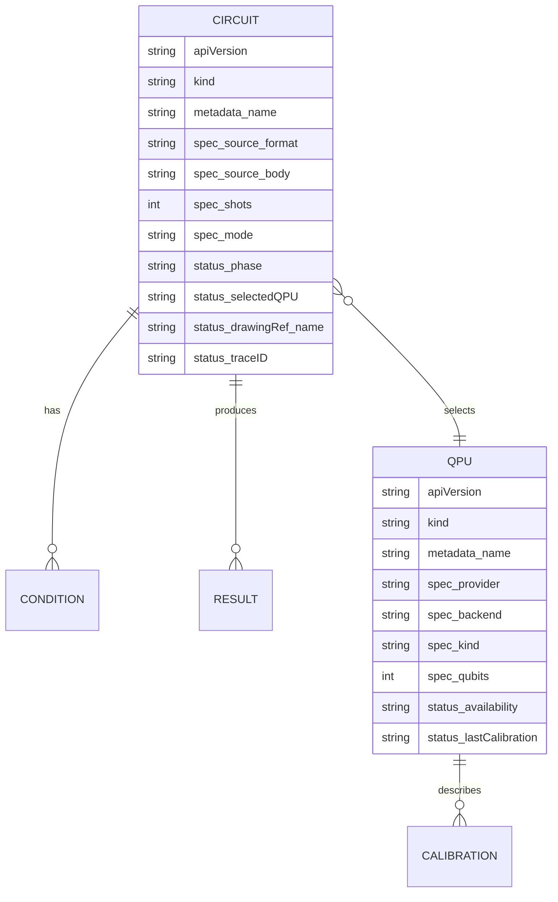
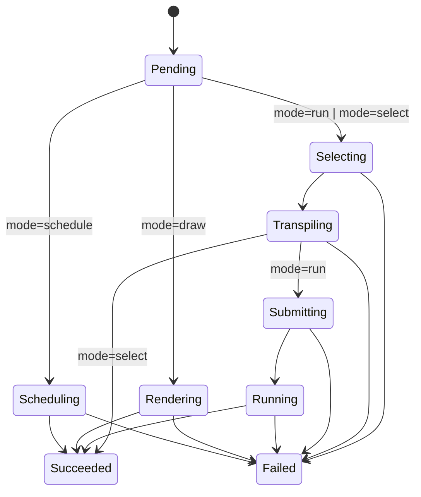
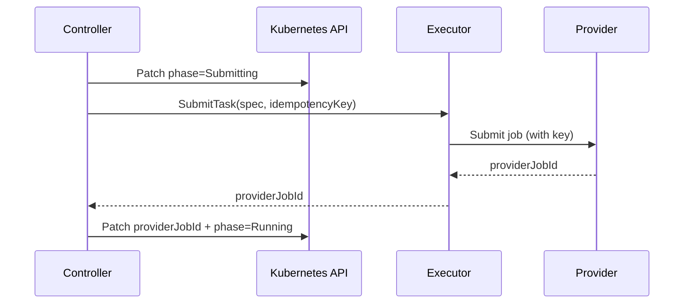

# QCC API Design

**Status:** draft  
**Primary thesis consumer:** Chapter 6 API/resource-model section  
**Related file:** `QCC-System-Design.md`

## 1. API design principle

The QCC API should be small enough to defend in an MSc thesis and precise enough to support a real controller implementation.

The API is not a full quantum workload language. It is a Kubernetes-facing execution interface that captures:

- the circuit to execute or evaluate;
- the execution intent;
- backend-selection constraints;
- operational status;
- result and telemetry references.

This API is the surface where two design requirements from `QCC-System-Design.md` §5 become concrete: **R1 (declarative circuit submission)** is realised through the `Circuit` resource, and **R2 (backend/QPU abstraction)** is realised through the `QPU` resource. The two resources together carry the inputs to **R3 (calibration-aware selection)**; the status fields and conditions carry the outputs of **R4 (observable execution lifecycle)**.

## 2. Resource model

QCC introduces two custom resources:

| Resource | Scope | Purpose |
|---|---:|---|
| `Circuit` | namespace-scoped | Represents one desired circuit evaluation/execution lifecycle. |
| `QPU` | cluster-scoped initially | Represents an execution backend profile used for scheduling and submission. |



## 3. `Circuit` resource

### 3.1 Purpose

`Circuit` represents a desired circuit execution or selection request. The controller reconciles this resource until it reaches a terminal state such as `Succeeded` or `Failed`.

### 3.2 Design shape

`Circuit.spec.mode` is a verb that selects which slice of the lifecycle the controller runs: `run` executes end-to-end, `select` stops after backend selection, `draw` calls the executor's ASCII renderer. `Circuit.spec.source` carries the circuit body and its format (`openqasm3` or `qiskit`); `qiskit` sources are converted to OpenQASM 3 server-side by the executor before submission. See §3.6 for the full mode/source matrix.

**Example — `mode: run` with OpenQASM 3:**

```yaml
apiVersion: qcc.io/v1alpha1
kind: Circuit
metadata:
  name: bell-run
  namespace: quantum-system
spec:
  mode: run
  shots: 1024
  source:
    format: openqasm3
    body: |
      OPENQASM 3.0;
      include "stdgates.inc";
      qubit[2] q;
      bit[2] c;
      h q[0];
      cx q[0], q[1];
      c[0] = measure q[0];
      c[1] = measure q[1];
  backendSelector:
    provider: local
    kind: simulator
  optimizationLevel: 1
status:
  phase: Succeeded
  selectedQPU: aer-local
  providerJobId: aer-8c5de408-a298-4a05-a390-77dd905cd422
  observedGeneration: 1
  results:
    "00": 512
    "11": 512
  conditions:
    - type: Completed
      status: "True"
      reason: ExecutionCompleted
      message: Execution completed with 2 outcome(s)
```

**Example — `mode: select`** (selection without execution; `shots` is ignored):

```yaml
spec:
  mode: select
  source:
    format: openqasm3
    body: |
      OPENQASM 3.0;
      ...
  backendSelector:
    provider: ibm
    kind: simulator
    minQubits: 2
```

**Example — `mode: draw` with a Qiskit-Python source** (the executor's `qiskit_io` loader picks up any top-level `QuantumCircuit`; the ASCII text lives in a sibling `ConfigMap` referenced by `status.drawingRef` — see §3.7 for the rationale):

```yaml
spec:
  mode: draw
  source:
    format: qiskit
    body: |
      from qiskit import QuantumCircuit
      circuit = QuantumCircuit(2, 2)
      circuit.h(0)
      circuit.cx(0, 1)
      circuit.measure([0, 1], [0, 1])
status:
  phase: Succeeded
  drawingRef:
    name: bell-draw-drawing       # owned by this Circuit (cascade-deletes with it)
  conditions:
    - type: Rendered
      status: "True"
      reason: DrawingRendered
      message: Rendered 299 bytes of ASCII into ConfigMap bell-draw-drawing
```

The drawing itself is fetched from `data["drawing"]` on the referenced `ConfigMap`:

```yaml
apiVersion: v1
kind: ConfigMap
metadata:
  name: bell-draw-drawing
  ownerReferences:
    - apiVersion: qcc.io/v1alpha1
      kind: Circuit
      name: bell-draw
      controller: true
      blockOwnerDeletion: true
data:
  drawing: |
        ┌───┐     ┌─┐
   q_0: ┤ H ├──■──┤M├───
        └───┘┌─┴─┐└╥┘┌─┐
   q_1: ─────┤ X ├─╫─┤M├
             └───┘ ║ └╥┘
   c: 2/═══════════╩══╩═
                   0  1
```

### 3.3 Proposed `spec` fields

| Field | Type | Required | Rationale |
|---|---|---:|---|
| `source.format` | enum (`openqasm3` \| `qiskit`) | yes | Discriminator for the source body. `qiskit` bodies are converted to OpenQASM 3 server-side by the executor; the controller never depends on a Python SDK. |
| `source.body` | string | yes | Raw circuit text in the chosen format. Inline keeps the Kubernetes API self-contained — no ConfigMap/Secret indirection in the first iteration. |
| `mode` | enum (`run` \| `select` \| `draw` \| `schedule`) | yes (default `run`) | Verb-style mode names the slice of the lifecycle the controller runs.  `run` executes end-to-end; `select` stops after backend selection; `draw` renders ASCII; `schedule` produces a per-instruction dt-cycle timeline artifact (no shots, no remote job — see `QCC-System-Design.md` §10.4). |
| `shots` | integer | yes for `mode=run` | Common execution parameter; ignored for `mode=select`, `mode=draw`, and `mode=schedule` because no execution happens. |
| `backendSelector` | object | no | Expresses hard constraints and preferences for backend selection. Unused by `mode=draw`. |
| `optimizationLevel` | integer (0–3) | no | Allows executor/provider transpilation policy to be parameterised without embedding SDK code in the CRD. |
| `timeoutSeconds` | integer | no | Bounds execution lifecycle for controller behavior. |
| `transpile` | opaque object (`x-kubernetes-preserve-unknown-fields: true`) | no | **Tier 2 passthrough** — opaque dict forwarded verbatim as `**kwargs` to `qiskit.compiler.transpile()`.  Keys are snake_case (Qiskit-native): `seed_transpiler`, `layout_method`, `routing_method`, `basis_gates`, …  Tier-1 fields (`optimizationLevel`) take precedence.  See `QCC-Design-State.md` §7a (Composition Principle Tier 2). |
| `execute` | opaque object (`x-kubernetes-preserve-unknown-fields: true`) | no | **Tier 2 passthrough** — opaque dict forwarded verbatim to the adapter's submit stage (`SamplerV2.run` for IBM, `AerSimulator.run` for Aer).  Keys are snake_case: `seed_simulator`, `memory`, `parameter_binds`, …  Tier-1 `shots` takes precedence; a leaked `shots` key is silently stripped with a logged warning. |

### 3.4 Proposed `backendSelector` fields

| Field | Type | Rationale |
|---|---|---|
| `provider` | string | Optional provider constraint, e.g. `ibm`. |
| `backendName` | string | Optional exact backend selection. If set, the executor can still validate suitability. |
| `kind` | enum | `hardware` or `simulator`. |
| `minQubits` | integer | Hard eligibility constraint. |
| `allowedQPURefs` | list | Optional allow-list for repeatable experiments. |
| `region` | string | Optional locality or provider-region hint; future-facing. |

### 3.5 Proposed `status` fields

| Field | Type | Rationale |
|---|---|---|
| `phase` | enum | User-facing lifecycle phase. |
| `selectedQPU` | string | Backend selected by the executor. Empty for `mode=draw`. |
| `providerJobId` | string | Idempotency and external correlation. Empty for `mode=select` and `mode=draw`. |
| `traceId` | string | Reserved field for an explicit OTel trace ID once controller spans propagate end-to-end (Ch9).  Not populated today — the cross-boundary linkage in `QCC-Observability.md` §6 is implemented via `metadata.uid` (forward, stamped into IBM `runtime_options.tags`) + `status.providerJobId` (reverse, surfaced as a label on `qcc_circuit_info`).  Kept on the schema so the OTel-trace upgrade path is additive, not a breaking change. |
| `observedGeneration` | integer | Kubernetes reconciliation correctness. |
| `conditions` | list | Standard Kubernetes condition model. |
| `selectionSummary` | object | Compact explanation of candidate count, selected backend, and score. |
| `results` | map[string]int64 | Measurement counts (classical-bitstring → count) for inline storage.  Suits thesis-scale Bell-state-style results.  Populated only by `mode=run`.  No out-of-band ResultRef indirection today — thesis-scale circuits stay below etcd's inline-value limit (see §3.7 and QCC-Design-State.md §7a).  Transpile metrics produced during admission live on `status.transpile` (depth / total gates / two-qubit gates) as a sibling object. |
| `usageSeconds` | float64 | Substrate-reported billable compute time for the execution, in seconds (Qiskit Runtime `Job.usage()` for IBM hardware).  Distinct from wall-clock `Running` phase duration: usageSeconds measures only on-QPU compute, not queue wait or transit.  Zero or omitted on simulator paths (Aer / `fake_*`) and when the substrate doesn't expose a usage handle — the `qcc_circuit_usage_seconds` metric is emitted only when this value is > 0 so simulator runs produce no noise series.  The difference `Running − usageSeconds` is the **orchestration-overhead window** (queue + transit + poll cadence) the thesis quantifies in Ch7.  See `QCC-Observability.md` §5.2. |
| `drawingRef` | `ArtifactRef` `{name}` | Reference to a sibling `ConfigMap` (in the Circuit's namespace) holding the ASCII rendering under `data["drawing"]`. Populated only by `mode=draw`. See §3.7. |
| `scheduleRef` | `ArtifactRef` `{name}` | Reference to a sibling `ConfigMap` holding the JSON-encoded per-instruction timeline under `data["schedule.json"]` (times in dt cycles; the ConfigMap also carries `dt_seconds`, `total_duration_dt`, `num_qubits`, and `backend_used`).  Populated only by `mode=schedule`.  See §3.7. |
| `convertedRef` | `ArtifactRef` `{name}` | Reference to a sibling `ConfigMap` holding the OpenQASM 3 form of a qiskit-format source under `data["qasm"]`. Populated as a byproduct of `mode=run` with `source.format=qiskit` (the controller's `Executor.ConvertSource` call already produces this — we just persist it). Null for native QASM inputs (nothing to convert). See §3.7. |

### 3.6 Mode / source matrix

The `mode` × `source.format` matrix is what the controller and executor must agree on; it is also what determines which RPC the controller dials.

| `mode` | `source.format` | Executor RPC | What populates | Phases traversed |
|---|---|---|---|---|
| `run` | `openqasm3` | simulators: `RunCircuit` (sync); real hardware: `SubmitTask` + `WatchTask` + `FetchTaskResult` (async, dispatched by `QPU.kind=hardware`) | `status.results`, `status.providerJobId`, `status.transpile` | `Pending → Selecting → Transpiling → Submitting → (Running →) Succeeded` |
| `run` | `qiskit` | `ConvertSource` then the same as above | `status.results`, `status.providerJobId`, **`status.convertedRef`** → `ConfigMap.data["qasm"]` | same as above; conversion is transparent to the controller, but the produced QASM is persisted as a sibling artifact for `qcc get … --qasm` |
| `select` | `openqasm3` \| `qiskit` | none (controller-only) | `status.selectedQPU`, `status.selectionSummary` | `Pending → Selecting → Transpiling → Succeeded` |
| `draw` | `openqasm3` \| `qiskit` | `DrawCircuit` | `status.drawingRef` → `ConfigMap.data["drawing"]` | `Pending → Rendering → Succeeded` |
| `schedule` | `openqasm3` \| `qiskit` | `ScheduleCircuit` | `status.scheduleRef` → `ConfigMap.data["schedule.json"]` | `Pending → Scheduling → Succeeded` |

`ConvertSource` is invoked transparently inside the controller's executor client when `source.format=qiskit`; the reconciler does not branch on format. `DrawCircuit` accepts both formats directly because the executor's `qiskit_io` loader handles both shapes. The drawing itself is stored out-of-band in a `ConfigMap` (see §3.7), not inline on the Circuit.

### 3.7 Out-of-band artifacts (`drawingRef`, `convertedRef`, `scheduleRef`)

Three `Circuit.status` fields point at sibling Kubernetes `ConfigMap` objects rather than carrying their payloads inline.  All three share a single Go type, `ArtifactRef { name string }`, because the only thing the Circuit needs is the name of a `ConfigMap` in its own namespace.  Result histograms stay inline on `status.results` — thesis-scale circuits produce counts well below etcd's inline-value limit (see QCC-Design-State.md §7a "What this principle is not" + the 2026-05-16 inline-vs-ref decision-log entry); no `resultRef` indirection is implemented today.

| Field | Backing object | Populated by | Read by |
|---|---|---|---|
| `drawingRef` | `ConfigMap` in the Circuit's namespace, ASCII drawing under `data["drawing"]` | `mode=draw` (every time) | `qcc get <name> --drawing` |
| `convertedRef` | `ConfigMap` in the Circuit's namespace, OpenQASM 3 under `data["qasm"]` | `mode=run` with `source.format=qiskit` (free byproduct of `ConvertSource`) | `qcc get <name> --qasm` |
| `scheduleRef` | `ConfigMap` in the Circuit's namespace, JSON timeline under `data["schedule.json"]` (also carries `dt_seconds`, `total_duration_dt`, `num_qubits`, `backend_used`) | `mode=schedule` (every time) | `qcc get <name> --schedule` |

All three exist because Kubernetes etcd values are bounded:

| Limit | Value |
|---|---|
| Hard etcd value size | 1.5 MB (rarely raised in managed clusters) |
| Practical CR object size | ≤ 256 KiB recommended |

A 20-qubit, 15-layer circuit renders to ≈ 32 KiB of ASCII; a 50-qubit hardware execution can return tens of thousands of measurement outcomes. Either would saturate the Circuit object on a single reconcile, and status updates happen *every* reconcile loop — putting that load on etcd is wasteful at best and destructive at worst.

All `ArtifactRef`-backed artifacts share a common shape:

- **Same namespace as the Circuit.** Cross-namespace lookup would require additional RBAC and authorization plumbing that the M1 prototype intentionally avoids.
- **Owned by the Circuit via `metadata.ownerReferences` with `controller: true` and `blockOwnerDeletion: true`.** Deleting the Circuit garbage-collects the backing object automatically; no finalizer or explicit cleanup logic is needed in the controller.
- **Predictable name `<circuit-name>-<artifact-suffix>`** — `bell-draw-drawing`, `shor-x7k-converted`. kubectl-friendly and easy to find with label selectors.
- **Single data key per ConfigMap**: `data["drawing"]` for drawings, `data["qasm"]` for converted QASM. One artifact per ConfigMap; no mixed payloads.
- **Standard labels** identify the artifact:
  - `app.kubernetes.io/name: quantum-circuit-controller`
  - `app.kubernetes.io/managed-by: qcc-controller`
  - `qcc.io/circuit: <circuit-name>`
  - `qcc.io/artifact: drawing` | `converted` | `schedule` (matches the name suffix)

For the CLI consumer, the contract is "follow the ref": after `status.phase = Succeeded`, fetch the named `ConfigMap` and read the appropriate data key. `qcc get <name>` lists which artifacts exist and offers `--drawing` / `--qasm` selectors that print raw, pipe-friendly content (`qcc get shor-x7k --qasm > shor.qasm`). The Go controller's executor client never has to traverse the artifact payloads — it only knows the ConfigMap name and the data key constants.

## 4. `QPU` resource

### 4.1 Purpose

`QPU` represents an execution backend profile. It does not model a quantum processor physically. It models the backend metadata required by QCC to decide whether a circuit can be evaluated or executed and how that execution should be observed. Implemented in `api/v1alpha1/qpu_types.go`; cluster-scoped; reconciled by `QPUReconciler` in `internal/controller/qpu_controller.go`.

The selection-chain split — Move 1 (enumerate + hard-constraint filter) is controller-side, Moves 2–5 (calibrate, transpile, layout, score) are executor-side — follows `QCC-System-Design.md` §7's component-responsibility table: the controller owns Kubernetes-API operations, the executor owns Qiskit/SDK operations. Move 1 is implemented today; Moves 2–5 are Ch9 future-work, and the shipped R3 evidence is `qcc run --performance-test` (empirical cross-substrate comparison) — see `QCC-System-Design.md` §9.

### 4.2 Design shape

```yaml
apiVersion: qcc.io/v1alpha1
kind: QPU
metadata:
  name: ibm-sherbrooke
spec:
  provider: ibm
  backendName: ibm_sherbrooke
  kind: hardware
  qubits: 127
  access:
    credentialSecretRef:
      name: ibm-quantum-credentials
      namespace: quantum-system
  capabilities:
    maxShots: 10000
status:
  availability: Available
  lastCalibrationTime: "2026-05-10T09:00:00Z"
  queueDepth: 23
  observedGeneration: 1
  conditions:
    - type: MetadataFresh
      status: "True"
      reason: CalibrationRefreshed
```

### 4.3 Proposed `spec` fields

| Field | Type | Required | Rationale |
|---|---|---:|---|
| `provider` | string | yes | Adapter discriminator, e.g. `ibm`. |
| `backendName` | string | no | Provider-native backend identifier (e.g. `ibm_sherbrooke`). When omitted, the controller derives it from `metadata.name` by replacing dashes with underscores — `fake-brisbane` → `fake_brisbane`. Set explicitly only when the K8s name diverges from the vendor identifier (e.g. multi-tenant `prod-ibm-sherbrooke` targeting `ibm_sherbrooke`). |
| `kind` | enum | yes | `hardware` or `simulator`. |
| `qubits` | integer | yes | Hard eligibility signal. |
| `access.credentialSecretRef` | object | no | Provider credential reference. |
| `capabilities` | object | no | Static or semi-static backend capabilities. |
| `labels` / metadata labels | map | no | Allows Kubernetes-style grouping and selection. |

**Selection-side semantics**: `BackendSelector.BackendName` matches a QPU by *either* its `metadata.name` (DNS-1123, dashes) or its effective backend name (derived or explicit). Users who learned the wire-name from vendor docs (`ibm_sherbrooke`) and users who learned it from `kubectl get qpus` (`ibm-sherbrooke`) both get the right resolution. The controller-side helper `QPU.EffectiveBackendName()` is the canonical accessor; do not read `spec.backendName` directly when the optional+derived contract matters.

### 4.4 Conventions for the `provider` field

The `provider` value drives `Adapter` selection inside the executor:

| `provider` value | `kind` | Routed to | Notes |
|---|---|---|---|
| `ibm` | `hardware` | `IBMAdapter` (via `qiskit-ibm-runtime` → `SamplerV2`) | Real hardware backend such as `ibm_sherbrooke`, `ibm_kingston`.  Requires `QISKIT_IBM_TOKEN` secret.  Dispatched through the async `SubmitTask`/`WatchTask`/`FetchTaskResult` path. |
| `ibm` | `simulator` | `IBMAdapter` (via `qiskit-ibm-runtime`) | Vendor-side simulator such as `ibmq_qasm_simulator`. |
| `local` | `simulator` | `AerAdapter` (in-process Qiskit Aer + `fake_*` snapshots + method-pinned variants like `aer_statevector` via the resolver) | In-process execution.  No credentials.  No `access.credentialSecretRef`.  Dispatched through the sync `RunCircuit` path. |

Alternative substrates (QRMI for Pasqal/multi-vendor, CUDA-Q for NVIDIA) are Ch9 future-work; no adapter is wired today.  See `QCC-Design-State.md` §7d (QEI direction).

The convention `provider: local` is reserved for in-process simulators. It is not a vendor name; it signals that no external API call is made and that the executor runs the circuit directly. `access.credentialSecretRef` is omitted for `local` QPUs.

### 4.5 `status` fields

Populated by the `QPUReconciler`; the calibration-relevant fields come from the executor's `ProbeBackend` RPC (M1.5b) and are the authoritative values selection reads.

| Field | Type | Rationale |
|---|---|---|
| `availability` | enum | `Available`, `Unavailable`, `Unknown`. |
| `qubits` | integer | Authoritative qubit count from `ProbeBackend`. Selection reads this in preference to `spec.qubits`; use `QPU.EffectiveQubits()` for the resolution rule. Zero when the probe hasn't run yet. |
| `basisGates` | list of strings | Native gate set reported by the backend's `Target` (e.g. `[ecr, rz, sx, x]` for `fake_brisbane`). Read by Move 3 (transpile per candidate) — Ch9 future-work. |
| `couplingEdges` | integer | Count of physical 2-qubit edges in the backend's coupling map. Zero means all-to-all (typical for generic Aer); a positive value would drive Move 4 (layout evaluation) — Ch9 future-work. |
| `lastCalibrationTime` | timestamp | Used for freshness-aware selection. For `fake_*` simulators this is the frozen snapshot date (often months old); for live hardware it's the most recent vendor refresh. |
| `errorMedians.{singleQubit,twoQubit,readout}` | float64 each | Population medians (in [0, 1]) of per-instruction error rates from the backend's `Target`. Zero means "not reported by this backend" — a hypothetical Move 5 scorer (Ch9) would treat absence as skip, never as perfect. |
| `queueDepth` | integer | Operational queue signal where available. Populated only when surfaced by a vendor-side probe; not refreshed by a TTL cache today (Ch9). |
| `conditions` | list | Standard state reporting. |
| `lastError` | object | Provider metadata refresh error, if any. |

**`ProbeBackend` semantics**: the executor reads the backend's `Target` (Qiskit V2 Backend API) — calibration timestamps, per-qubit `T1`/`T2`, per-instruction `error` fields, coupling map — and returns medians + counts. For `fake_*` backends the timestamp is the frozen capture date; live hardware reports its most recent vendor refresh. The probe is read-only — no shots consumed, no submissions made. Probes once at QPU registration; TTL-based periodic refresh is Ch9 (see `QCC-System-Design.md` §15 limitations).

**`spec.qubits` is a hint**, not authoritative. When omitted the user signals "trust the probe"; when set it's used as the fallback if the probe hasn't run yet (registration race window). The CLI honours both forms via `QPU.EffectiveQubits()`.

## 5. Phase and condition model

### 5.1 Phases

The phase field should remain small and user-facing.

| Phase | Meaning |
|---|---|
| `Pending` | Resource accepted; reconciliation not yet started. |
| `Selecting` | Backend candidates are being evaluated (`mode=run` \| `mode=select`). |
| `Transpiling` | Circuit is being transpiled for candidate or selected backend. |
| `Submitting` | Provider submission is being attempted (`mode=run`). |
| `Running` | Provider job is active (`mode=run`). |
| `Rendering` | Controller is calling the executor's `DrawCircuit` RPC (`mode=draw`). |
| `Scheduling` | Controller is calling the executor's `ScheduleCircuit` RPC (`mode=schedule`). |
| `Succeeded` | Selection, execution, rendering, or scheduling completed successfully. |
| `Failed` | Terminal failure. |



### 5.2 Conditions

Conditions should explain state transitions more precisely than `phase`.

Recommended condition types:

| Type | Meaning |
|---|---|
| `Accepted` | The resource was accepted by the controller. |
| `Validated` | Static validation succeeded. |
| `Selected` | A backend was selected. |
| `Submitted` | A provider job was submitted. |
| `Rendered` | The executor produced an ASCII drawing (`mode=draw`). |
| `Scheduled` | The executor produced a per-instruction timeline (`mode=schedule`). |
| `Completed` | Execution, selection, rendering, or scheduling completed. |
| `Failed` | Terminal failure. |

Recommended reasons:

| Reason | Use |
|---|---|
| `InvalidCircuit` | Circuit cannot be parsed or validated. |
| `NoEligibleBackend` | No QPU satisfies hard constraints. |
| `BackendSelected` | The executor selected a backend. |
| `TranspilationFailed` | Candidate or selected backend transpilation failed. |
| `ProviderSubmissionFailed` | Provider rejected or failed submission. |
| `ProviderJobTimedOut` | Execution exceeded timeout. |
| `ExecutionCompleted` | Provider returned final result. |
| `SourceConversionFailed` | Executor's `ConvertSource` could not translate a `qiskit` body to OpenQASM 3 (e.g., no `QuantumCircuit` exposed at module scope). |
| `DrawingRendered` | Executor's `DrawCircuit` produced an ASCII rendering. |
| `RenderingFailed` | Executor's `DrawCircuit` failed (parse error, unsupported gate, missing `QuantumCircuit`). |

### 5.3 Reserved labels (`qcc.io/*`)

Five `qcc.io/*` labels are reserved on `Circuit` resources for algorithm
grouping and cross-run correlation.  All five share the `qcc.io/` prefix
so they don't collide with user-chosen labels and are easy to spot in
`kubectl get circuits --show-labels`.

| Label | Authored by | Set when | Purpose |
|---|---|---|---|
| `qcc.io/algorithm` | User (CLI flag or YAML) | Submission | Algorithm family this run belongs to (e.g. `bell-state`, `vqe-h2`).  Optional — Circuits without it are treated as one-off runs and don't participate in grouping. |
| `qcc.io/algorithm-version` | User | Submission | Iteration of the algorithm definition (e.g. `v1`, `v2`).  Used to compare iterations of the same algorithm.  Requires `qcc.io/algorithm` to be set. |
| `qcc.io/experiment` | User | Submission | Optional campaign identifier grouping runs across multiple algorithms in the same study (e.g. `vqe-noise-2026`).  Requires `qcc.io/algorithm` to be set. |
| `qcc.io/run-index` | **Controller** | First reconcile | Ordinal among siblings sharing the same `algorithm` (+ optional `experiment`), in the Circuit's namespace.  Computed as `max(existing run-index labels) + 1`.  Stamped only when `algorithm` is present.  See QCC-Design-State.md for the race-condition caveat at high concurrency. |
| `qcc.io/source-sha256` | **Controller** | First reconcile | First 16 hex chars of SHA-256 of `spec.source.body` (K8s label values are capped at 63 chars; 64 bits of entropy is more than enough collision-resistance at thesis scale).  Always stamped.  Truth-anchor for "did the source body actually change between versions?" — a relabel without a real source edit produces the same hash. |

#### Submission paths

Two surfaces produce the user-authored labels; the controller-authored
ones are stamped identically on first reconcile regardless of which
path the Circuit came from:

- **`qcc run` CLI**: `--algorithm`, `--version`, `--experiment` flags
  on the CLI translate directly to the `qcc.io/*` labels.  `--label
  key=value` (repeatable) is the escape hatch for non-canonical
  labels.  Example:

  ```bash
  qcc run vqe.py --algorithm vqe-h2 --version v2 \
                 --experiment vqe-noise-2026 \
                 --label team=hpc-lab
  ```

- **`kubectl create -f circuit.yaml`** (direct CRD authoring): labels
  go in `metadata.labels` like any K8s resource.  More verbose but
  every K8s authoring feature is available (annotations, owner refs,
  finalizers, GitOps).  Example:

  ```yaml
  apiVersion: qcc.io/v1alpha1
  kind: Circuit
  metadata:
    generateName: vqe-h2-
    labels:
      qcc.io/algorithm: vqe-h2
      qcc.io/algorithm-version: v2
      qcc.io/experiment: vqe-noise-2026
  spec: ...
  ```

#### How they flow into observability

All five labels are promoted from `metadata.labels` into the
`qcc_circuit_info` metric's labels under the bare names
`algorithm`, `algorithm_version`, `experiment`, `run_index`, and
`source_sha256` (no `qcc.io/` prefix on the metric side — Prometheus
labels don't carry namespaces).  The propagation is via an explicit
allowlist in `internal/observability/metrics/circuit.go` —
arbitrary user labels are **not** forwarded, to keep the metric
label set bounded and cardinality predictable.

Constants for these label keys are defined in
`api/v1alpha1/circuit_types.go` as `LabelAlgorithm`,
`LabelAlgorithmVersion`, `LabelExperiment`, `LabelRunIndex`,
`LabelSourceSHA256` — use them anywhere in Go code rather than
magic strings.

## 6. Idempotency and submission boundary

The most important API-level reliability property is **non-duplicating submission under controller restart**.

The controller persists a provider job identifier in `status.providerJobId` *before* advancing past the `Submitting` phase. On restart, it inspects status and resumes watching the existing provider job rather than initiating a new submission.



The `idempotencyKey` is generated by the controller from `Circuit.metadata.uid + observedGeneration` and passed to the executor on every submission attempt. This gives non-duplication without depending on provider-side guarantees:

- If the vendor exposes an idempotency-key mechanism on its submission API, the executor forwards the key and the vendor deduplicates server-side.
- If the vendor does not, the executor uses the key as a local cache: a repeated submission with the same key short-circuits to returning the cached `providerJobId` from the previous attempt.

The IBM Quantum API does not currently expose a server-side idempotency-key header, so the prototype relies on the executor-side cache path. The remaining failure window — controller crashes after executor submission but before the controller's status patch — is bounded by the `idempotencyKey` cache TTL in the executor. If the TTL expires before the controller recovers, duplicate submission is possible; this limitation is stated in Chapter 8.

### 6.1 gRPC paths

The executor exposes three families of RPC (see `QCC-System-Design.md` §6.2):

- **`RunCircuit`** (synchronous execution) — transpile, submit, and wait in a single RPC. The sequence diagram above collapses into one round-trip. Suits `AerAdapter` and short-running jobs via `IBMAdapter`.
- **`SubmitTask` + `WatchTask` + `FetchTaskResult`** (asynchronous execution) — the canonical async lifecycle.  Used by `IBMAdapter` for real-hardware backends (jobs queue for minutes; the controller polls via `WatchTask` and fetches counts via `FetchTaskResult` on subsequent reconcile passes rather than blocking inside a single RPC) and by any future adapter whose backend jobs outlive a single reconciliation.
- **`ConvertSource`** and **`DrawCircuit`** (pure-Python utilities) — synchronous, no provider call. `ConvertSource` accepts a `CircuitSource{format, body}` and returns OpenQASM 3 text; it is invoked transparently by the controller's executor client whenever `Circuit.spec.source.format=qiskit`, so the reconciler never branches on format. `DrawCircuit` accepts the same `CircuitSource` and returns ASCII text; it backs `mode=draw`.

The `idempotencyKey` semantics are identical across the execution paths (`RunCircuit` and the async task-lifecycle RPCs `SubmitTask`/`WatchTask`/`FetchTaskResult`). `ConvertSource` and `DrawCircuit` are stateless and do not carry an idempotency key.

## 7. API boundaries and future compatibility

The prototype can start with `qcc.io/v1alpha1`.

Compatibility rules:

- do not expose provider-specific SDK objects in the CRD;
- keep provider-specific fields behind `QPU.spec.provider` and executor adapter logic;
- avoid high-cardinality or large result payloads in status;
- use references for large results if needed later;
- prefer additive schema changes during thesis development.

## 8. What should stay out of the API for now

Avoid adding the following to the first thesis API:

- full multi-tenant quota model;
- admission-webhook-only validation path;
- object-store result persistence as a hard requirement;
- detailed physical calibration schema;
- provider-specific nested configuration blobs;
- workflow/DAG modeling;
- algorithm-level constructs such as VQE iterations or domain observables as first-class API concepts.

These are future-work candidates, not required for the QCC thesis prototype.
