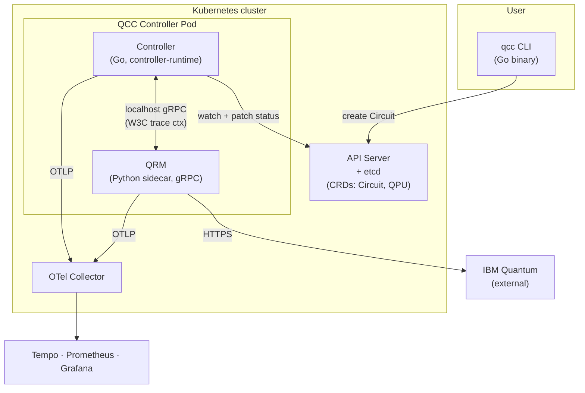
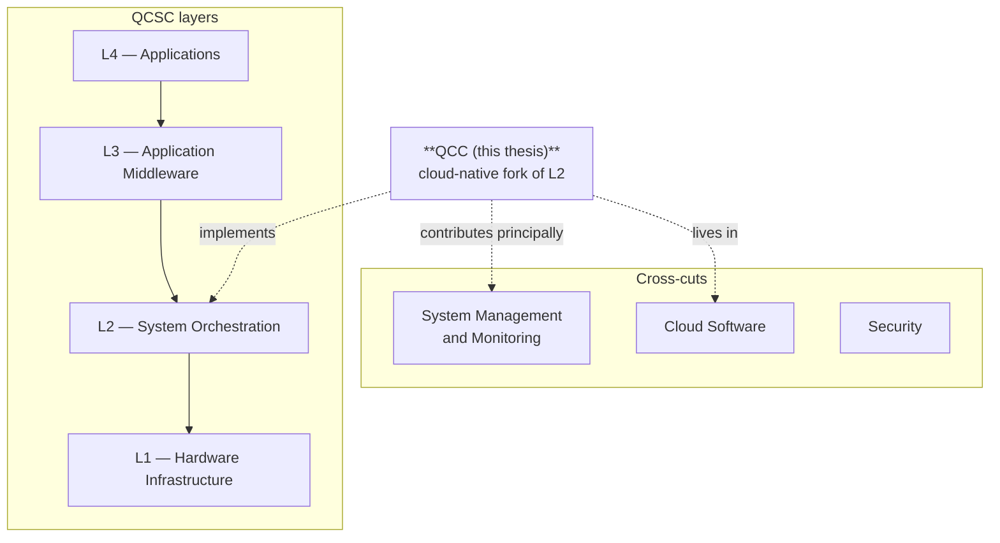
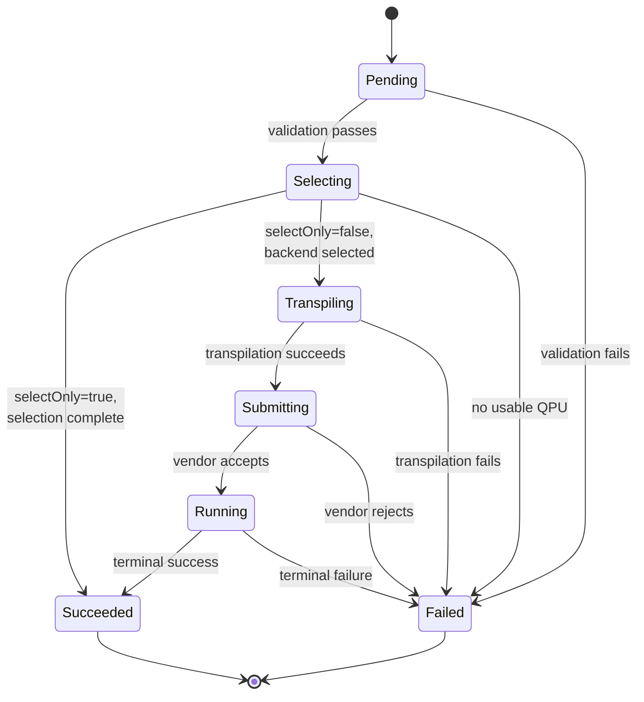
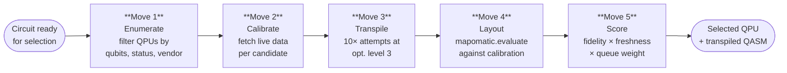
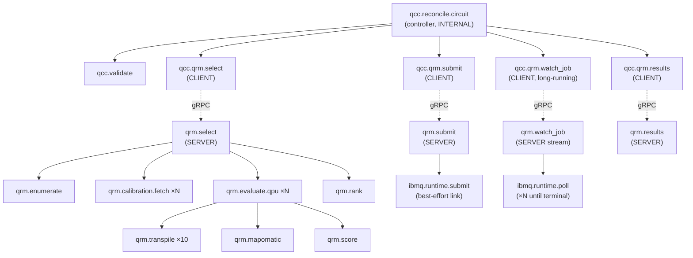

# Quantum Circuit Controller (QCC) — Systems Design

> **⚠️ Historical staging** — This document uses pre-rename terminology.
> The Python sidecar named "QRM" / "Quantum Resource Manager" throughout this
> file is now called **Executor** (image `qcc-executor:latest`). See
> [`QCC-System-Design.md`](QCC-System-Design.md) for the current canonical
> design.

**MSc Thesis: "Interface between Quantum and Classical Computers"**
*Author: Ioannis Savvaidis (60663) — Supervisor: Ioannis Karafyllidis — Democritus University of Thrace*

**Document version:** v2 (sections A–M locked) + Appendix N working notes
**Supersedes:** `qcc-systems-design-v2.md`, `QCC_Systems_Design_v2___Quantum_Circuit_Controller.md` (identical duplicates), and `QCC-Design-State.md` (absorbed into Appendix N).
**Status:** Sections A–M locked across components, interfaces, and observability schema. Ch6 source. Appendix N tracks lock state, walks, errata, and open questions; it is updated as work progresses while A–M remain stable.

---

## How sections feed thesis chapters

This map exists so future readers (and future-me in a fresh chat) see at a glance which design sections feed which thesis chapter. It is not a contract — sections may be referenced more broadly than listed — but it captures primary intent.

| Design section | Primary thesis consumer | Secondary |
|---|---|---|
| §A Architectural overview | Ch6 §6.1 (architecture intro) | — |
| §A.7 QCSC mapping | Ch6 §6.2 (positioning) | Ch9 §9.x (future work, phase axis) |
| §B `Circuit` CRD | Ch6 (design), Ch7 (impl) | — |
| §C `QPU` CRD | Ch6 (design), Ch7 (impl) | — |
| §D Controller | Ch6 (design), Ch7 (impl) | — |
| §E QRM + five-move chain | Ch6 (design), Ch7 (impl) | Ch5 §5.8 R5 (acceptance) |
| §F CLI | Ch7 (impl, UX) | — |
| §G Observability architecture | Ch6 (design), Ch7 (impl) | Ch5 §5.8 R2/R4 (acceptance) |
| §H Deployment topology | Ch7 (impl, deployment) | Ch8 (operability discussion) |
| §I Failure mode analysis | Ch7 (impl, evaluation) | Ch8 (resilience discussion) |
| §J Non-functional requirements | Ch7 (evaluation criteria) | Ch8 (production-maturity discussion) |
| §K Comparator differentiation | Ch7 (evaluation against comparators) | Ch5 §5.6 (corroboration) |
| §L Risks and open questions | Ch8 (discussion) | Ch9 (future work seeds) |
| §M Quantum circuit metrics | Ch6 (semantic conventions), Ch7 (impl) | OTEP submission (out of scope as a contribution claim) |
| Appendix N Working notes | (none — operational only) | Walk integration tracking, errata log, parked questions |

---

## Section A — Architectural Overview

### A.1 What QCC Is

The Quantum Circuit Controller (QCC) is defined by five claims:

1. **What it is.** A Kubernetes-native control plane that treats quantum circuits as first-class declarative resources, reconciled by a controller-runtime operator and submitted to registered quantum processing units through a vendor-neutral resource manager.

2. **What the user does.** Writes Qiskit Python the way they always have, pipes it to the `qcc` CLI, and gets a `Circuit` Custom Resource. The CLI translates Python to OpenQASM 3 client-side and creates the resource through the standard Kubernetes API; the user does not learn a new resource format.

3. **What QCC does with it.** The controller drives the `Circuit` through a phase machine. On entry to *Selecting*, the Quantum Resource Manager (QRM) executes a five-move accuracy chain — enumerate, calibrate, transpile, layout, score — and returns a chosen backend with a transpiled OpenQASM body. The controller then submits, watches, and persists the result.

4. **What spans the boundary.** A single OpenTelemetry trace propagated via W3C Trace Context, plus a Prometheus-scrapable metric surface using a proposed `qcc.*` semantic-conventions namespace — both crossing the classical–quantum boundary in real time, not reconstructed post-hoc from persisted execution logs.

5. **Where it sits in the QCSC reference architecture.** QCC is the cloud-native fork of QCSC Layer 2 (System Orchestration) in the Seelam et al. (2026) architecture. It complements — does not compete with — the Slurm/QRMI/SPANK HPC instantiation; it contributes principally at the System Management and Monitoring cross-cut.

### A.2 Design Goals

Four goals define the architectural target. Each is derived from gaps the literature review surfaces in Chapter 5 and from operational experience with cloud-native systems.

**G1 — Accuracy.** When more than one quantum backend can run a circuit, choose among them using live calibration data, layout-fidelity estimates, and queue state — not by static configuration or first-come-first-served. Hardware variability across QPUs and across calibration cycles is operationally large enough that backend choice dominates execution-quality outcomes. The acceptance test is that the chosen backend, the candidates evaluated, and the per-candidate scores are all reproducible from the trace.

**G2 — Observability.** Every decision QCC makes — backend selection, transpilation, queue routing, vendor submission, result retrieval — must be visible through OpenTelemetry traces and Prometheus metrics that follow standard semantic conventions. Decisions must be reproducible from the trace alone: the calibration vintage, the candidates evaluated, the per-candidate scores, and the chosen backend must all be visible in spans.

**G3 — Easy submission.** Developers submit a familiar Qiskit Python script with one command. Translation to vendor-neutral wire format (OpenQASM 3) happens client-side; the user does not learn a new resource format. The submission boundary is the standard Kubernetes API, available wherever `kubectl` is.

**G4 — Deployable production shape.** The system follows the established CNCF operator pattern: single Helm chart, RBAC, leader election, status conditions, finalisers, prometheus-operator integration. It installs on managed and unmanaged Kubernetes clusters without node-level customisation. The deployment is the surface where R1's "production deployment patterns" become concrete.

### A.3 Goal → Requirement → Design Section Linkage

The four goals trace to the five requirements derived in Ch5 §5.8 (R1–R5), and each requirement is realised in named design sections of this document. The chain *literature gap → goal → requirement → design section → acceptance test* is what defence depends on; making it explicit here is the most important structural move in this overview.

| Goal | Requirement(s) (Ch5 §5.8) | Realised in design sections |
|---|---|---|
| **G1 Accuracy** | R5 (calibration-aware backend selection) | §A.6 (selection modes), §E (QRM design), §E.4 (five-move chain), §E.10 (chain Python sketch), §M.6 (selection metrics) |
| **G2 Observability** | R2 (open-standards observability), R4 (live cross-layer correlation) | §G (observability architecture), §G.1 (span hierarchy), §G.2 (W3C trace context), §M (`qcc.*` semantic conventions) |
| **G3 Easy submission** | R1 (production deployment patterns — declarative interface) | §B (Circuit CRD), §F (CLI design), §F.2 (auto-detect), §F.3 (Python→QASM translation) |
| **G4 Deployable production shape** | R1 (production deployment patterns), R3 (vendor-neutral interface) | §A.7 (deployment topology), §D (controller design), §H (deployment), §I (failure modes), §J (operational characteristics) |

The non-requirements NR1–NR5 (Ch5 §5.8) trace to §L.3 ("What it does NOT claim"). The cross-references above are forward-references to subsections that follow, so a reader can navigate the architecture by goal, by requirement, or by section interchangeably.

### A.4 Component Architecture

Five components compose QCC.



The components and their responsibilities:

| # | Component | Language / framework | Responsibility |
|---|---|---|---|
| 1 | `qcc` CLI | Go (cobra) | Submit `Circuit` resources, translate Python→QASM client-side, present status, expose `lint` and `submit --wait` ergonomics |
| 2 | Custom Resource Definitions | OpenAPI v3 schema | `Circuit` (namespace-scoped, request and result), `QPU` (cluster-scoped, declared backends) |
| 3 | Controller | Go, controller-runtime | Watch `Circuit`, drive phase machine, hold Kubernetes-side state and lifecycle |
| 4 | QRM (Quantum Resource Manager) | Python, grpcio | Five-move accuracy chain, vendor adapter (Qiskit/IBM), QPU calibration cache |
| 5 | Observability surface | OpenTelemetry, Prometheus | Spans across the boundary, `qcc.*` metric namespace, cross-layer correlation through W3C Trace Context |

The controller and QRM are co-located in a single Pod (sidecar pattern) for the proof-of-concept; §A.7 discusses why and the alternative.

### A.5 How Components Compose to Satisfy the Goals

The five components are not independently complete; they compose to satisfy the goals.

| Component | G1 Accuracy | G2 Observability | G3 Easy submission | G4 Deployable shape |
|---|---|---|---|---|
| **CLI** | — | trace context originates here | submits `Circuit` from Python in one command | uses standard `kubectl`-equivalent API; deploys nowhere |
| **CRDs** | declarative request schema for selection inputs | result attributes carry telemetry pointers | familiar `kubectl apply` semantics | versioned API surface, OpenAPI-validated |
| **Controller** | drives the phase machine to *Selecting*, calls QRM | emits root span, exposes status conditions | reconciles asynchronously; status reports back through CRD | controller-runtime is the standard CNCF operator pattern |
| **QRM** | runs the five-move accuracy chain | emits gRPC SERVER spans nested in CLIENT span | (transparent to user) | sidecar over localhost gRPC, no service-mesh dependency |
| **Observability** | calibration vintage and per-candidate scores in spans | full surface; this is where G2 lives | trace ID surfaced in CLI status | follows OTel and Prometheus-operator conventions |

### A.6 Selection Modes

G1 Accuracy is realised through three submission modes, distinguished by the candidate set entering Move 1 of the five-move chain (§E.4):

**Pinned.** The user names a specific `QPU` in the `Circuit` spec. QCC submits to that backend without selection. Useful for reproducibility and benchmark runs.

**Constrained.** The user names selection constraints in the spec (minimum qubit count, vendor preference, region label, `kind`). QCC narrows the candidate set, then runs the five-move chain over the survivors.

**Auto.** No backend named, no constraints. QCC enumerates all healthy registered `QPU`s of `kind: hardware` and runs the five-move chain over that set. Simulator QPUs are excluded by default — without that exclusion a `statevector` simulator would always win (constant 1.0 score) and dominate every auto submission. Including simulators in auto-mode requires `spec.backendSelector.kind: simulator` or `any`.

**Orthogonal axis: select-only.** Any of the three modes can be combined with `spec.selectOnly: true`. The chain runs and populates `status.selection`; the controller then transitions to `Succeeded` without invoking `QRM.Submit`. This is the "what would QCC pick?" surface — and the only such surface, since the operator pattern centralises decisions in the cluster (see §K2.7).

The chain itself is identical across all combinations of mode and select-only. This is **not** Qonductor's NSGA-II Pareto-front search: QCC's chain optimises a single composite score; Qonductor optimises simultaneously across fidelity, job completion time, and QPU utilisation. Qonductor's logic could plug *into* QCC's QRM as an alternative scoring policy in future work — the interface contract is what enables that, not the specific scoring function.

The selection emits dedicated attributes on the `qcc.qrm.select` span (specified in §M): `qcc.selection.policy = auto | constrained | pinned`, `qcc.selection.candidates_total`, `qcc.selection.candidates_evaluated`, `qcc.circuit.select_only = true | false`. This makes the mode and intent visible in Grafana and queryable in TraceQL.

### A.7 Deployment Topology

| Topology | When | Trade-off |
|---|---|---|
| **Single-Pod, sidecar QRM (recommended)** | PoC, single-tenant, single-cluster | gRPC over `localhost`, no NetworkPolicy needed, lifecycle coupled, trace-context propagation trivial, no service discovery. Cannot scale Go and Python tiers independently; OOM in QRM kills the Pod (mitigated by separate container resource limits and `OOMScoreAdj` differential). |
| **Separate-Pod, ClusterIP Service** | Multi-tenant, autoscaling needs | Independent scaling, blast-radius isolation. Adds NetworkPolicy, mTLS, and service-discovery surface; trace context requires explicit `otelgrpc` middleware on both ends. |

The PoC ships the single-Pod topology. The CRI/CSI analogy is informative: kubelet talks to its container runtime over a Unix Domain Socket on the same node, not across a network — the QRM is similarly node-local logic that should not be schedulable independently. Migration to separate-Pod requires only a Helm value flip (`qrm.deployment: sidecar | standalone`) and the `otelgrpc` middleware switch on the QRM side; the gRPC contract itself does not change.

### A.8 Architectural Quality Attributes

Four quality attributes track the requirement framework.

| Attribute | Tied to | How it is realised |
|---|---|---|
| **Scalability** | G3, G4 | Controller horizontal scaling via leader election; `Circuit` and `QPU` are stateless declarative resources. Per-object reconciliation is serial (controller-runtime workqueue invariant) even with `MaxConcurrentReconciles > 1`; concurrency is across distinct `Circuit` keys. A single replica with `MaxConcurrentReconciles: 5` saturates the IBM open tier well before saturating the controller. |
| **Reliability** | R1 | Phase-machine idempotency at every reconciliation step (§B.3, §D.2); finalisers ensure clean teardown; vendor failures are observable, not silent. Leader election uses `controller-runtime`'s default `Lease`-based mechanism (`coordination.k8s.io/v1`). Retries use the controller-runtime exponential backoff rate limiter (5 ms → 1000 s). |
| **Observability** | G2 (R2, R4) | OTel substrate is first-class; `qcc.*` semantic conventions specify cardinality and stability tiers (§M); the selection trace is the contract surface. The `/metrics` endpoint is served by the manager's metrics server (HTTPS by default since kubebuilder v4, secured via `WithAuthenticationAndAuthorization`). |
| **Maintainability** | R3, G4 | The QRM Go interface is the only vendor-touching surface for the controller. Adding a second adapter (e.g., AWS Braket) means implementing the same protobuf service in a new sidecar — no controller code changes, only the `QPU.spec.vendor` discriminator and a new container image. §J.4 names this as the explicit acceptance test. |

### A.9 Mapping to QCSC

The QCSC reference architecture in Seelam et al. (2026) defines four horizontal layers and three cross-cuts.



**Layer placement.** QCC is the cloud-native fork of L2 (System Orchestration). It does not touch L1 (Hardware Infrastructure) or L3 (Application Middleware), and it does not implement L4 (Applications) — the Chapter 7 VQE demonstrator is an *application of* QCC, not a layer of it.

**Phase placement.** QCC stays in QCSC Phase 1 (loose spatial and temporal coupling, quantum consumed as a cloud co-processor). Near-time HPC interconnects (Phase 2) and co-designed quantum–HPC platforms (Phase 3) are explicit non-goals (NR4 in Ch5 §5.8); they remain the territory of the Slurm/QRMI/SPANK HPC instantiation that Seelam et al. describe.

**Cross-cut contribution.** QCC contributes principally at the System Management and Monitoring cross-cut, where the proposed `qcc.*` semantic conventions and the live-trace-across-the-boundary property both land. QCC also lives in the Cloud Software cross-cut by virtue of its CNCF operator-pattern packaging.

**Why "fork" not "competitor".** The HPC instantiation Seelam et al. describe and QCC are answers to the same question — how should L2 orchestrate quantum workloads — addressed for two different deployment regimes. The HPC answer is Slurm-shaped: queue, plug-in, GRES allocation. The cloud answer is operator-shaped: declarative resource, reconciler, status conditions. The two are complementary, not contradictory.


---

## Section B — `Circuit` CRD Design

### B.1 Schema (`qcc.io/v1alpha1`)

```yaml
apiVersion: qcc.io/v1alpha1
kind: Circuit
metadata:
  name: vqe-h2-iter-042                     # or generateName for CLI-driven submissions
  namespace: research
  labels:
    qcc.io/run-id: vqe-h2-bd-0p74           # cross-iteration grouping (optional)
    qcc.io/iteration: "42"                  # iteration ordinal (optional)
spec:
  # --- Source: OpenQASM 3 only (see §B.8 for rationale) ---
  source:
    inline: |                               # OPTIONAL; ≤ 32 KiB recommended
      OPENQASM 3.0;
      include "stdgates.inc";
      qubit[2] q; bit[2] c;
      h q[0]; cx q[0], q[1]; c = measure q;
    configMapRef:                           # OPTIONAL; alternative to inline
      name: vqe-h2-circuit
      key:  circuit.qasm
  # --- Execution requirements (mandatory) ---
  shots: 4096
  # --- Execution mode ---
  selectOnly: false                         # default false. When true, the controller runs
                                            # Moves 1-5 (selection chain) and terminates without
                                            # submitting to the QPU. Populates status.selection
                                            # exactly as in a real run, then transitions to
                                            # Succeeded with reason=SelectOnlyComplete. Used for
                                            # "what-would-be-picked" introspection without
                                            # consuming queue time or vendor cost. Distinct from
                                            # kubectl client/server dry-run, which governs whether
                                            # the API call persists at all.
  # --- Execution requirements (optional) ---
  backendSelector:                          # constraints, not assignment
    minQubits: 2
    kind: hardware                          # enum: hardware | simulator | any
    vendor: ibm-quantum                     # optional vendor pin
    qpuRef:                                 # optional hard pin to a QPU CR
      name: ibm-brisbane
  optimization:
    transpilerLevel: 3                      # 0..3, default 3
    transpileAttempts: 10                   # default 10 (locked accuracy chain)
    layoutSelection: mapomatic              # enum, default mapomatic
  freshness:
    maxCalibrationAgeSeconds: 3600          # default 3600
    queueWeight: 0.3                        # default 0.3
  resultStorage:
    mode: auto                              # enum: inline | configMap | auto
    inlineMaxBytes: 16384                   # default 16384 (≈ 16 KiB)
  ttlSecondsAfterFinished: 604800           # 7 days; nil disables
status:
  phase: Running                            # enum (see B.3)
  observedGeneration: 1
  conditions:
    - type: Submitted
      status: "True"
      reason: BackendSelected
      message: "Selected ibm_brisbane, layout [3,4,5], score 0.9421"
      lastTransitionTime: "2026-05-02T10:14:31Z"
      observedGeneration: 1
  source:
    # The OpenQASM 3 the controller actually executed against (round-trip transparency).
    # Equal to spec.source.inline when the user supplied QASM directly;
    # populated by the CLI when the user supplied Python.
    generatedQasm: |
      OPENQASM 3.0;
      ...
  selection:
    qpuRef: { name: ibm-brisbane }
    layout: [3, 4, 5]
    score: 0.9421
    composite:                              # decomposed score (see §M, Family 3)
      fidelity: 0.9612
      freshness: 0.99
      queue: 0.991
    calibrationTimestamp: "2026-05-02T08:00:00Z"
    transpiledTwoQubitGateCount: 6
    transpiledQasm: |                       # the post-transpile circuit (for `qcc visualize`)
      OPENQASM 3.0;
      ...
    candidatesTotal: 4
    candidatesEvaluated: 4
    policy: auto                            # auto | constrained | pinned
  vendorJobId: "cz0a8x9k2l3m"
  traceId: "0af7651916cd43dd8448eb211c80319c"
  startTime: "2026-05-02T10:14:30Z"
  completionTime: null
  results:
    inline:
      counts: { "00": 2031, "11": 2065 }
    configMapRef: null
```

### B.2 Field-by-Field Rationale

- **`spec.source`** is mandatory. Exactly one of `inline` or `configMapRef` must be set (enforced by an `oneOf` in the OpenAPI schema and re-checked by a validating webhook). The 32 KiB inline soft cap is well below etcd's 256 KiB practical object limit and the 1 MiB hard limit.
- **`spec.shots`** is mandatory and validated `≥ 1, ≤ 100000` (IBM Quantum cap); no default — making the user think about cost is a feature.
- **`spec.selectOnly`** defaults to `false`. When `true`, the reconciler runs Moves 1–5 of the selection chain, populates `status.selection` with the would-be backend, and transitions directly to `Succeeded` (with `Ready=True, reason=SelectOnlyComplete`) *without* invoking `QRM.Submit`. The CRD is the single surface for "what would QCC do?" — there is no parallel CLI-side simulation path. The field is named `selectOnly` rather than `dryRun` to avoid collision with kubectl's API-level dry-run semantics (`?dryRun=All`), which is a different concept (the API call does not persist). `selectOnly` becomes immutable after the first reconcile (see §B.7); a user wanting to flip to a real submission deletes the select-only Circuit and submits a fresh one.
- **`spec.backendSelector`** is optional. With nothing set, auto-selection mode runs (see §A.4). `qpuRef` is a hard pin and short-circuits enumeration.
- **`spec.optimization.transpileAttempts`** defaults to 10 (locked design); validated `1..100`. Setting it to 1 disables stochastic search.
- **`spec.freshness.maxCalibrationAgeSeconds`** defaults to 3600. `queueWeight ∈ [0,1]`.
- **`spec.resultStorage.mode: auto`** writes inline if the JSON-encoded result is `≤ inlineMaxBytes`, else creates an owned `ConfigMap`.

### B.3 Status Subresource — Phase Machine



`conditions[]` follows `metav1.Condition`. QCC defines four condition types: `Validated`, `BackendSelected`, `Submitted`, `Ready`. For select-only Circuits, `Submitted` is never set; `Ready=True, reason=SelectOnlyComplete` is the terminal condition. `observedGeneration` is written into both `status.observedGeneration` and each `condition.observedGeneration`.

Idempotency invariants:

1. If `obj.Generation == status.observedGeneration && phase ∈ {Succeeded, Failed}`, the reconciler is a no-op.
2. The `Selecting → Submitting` transition writes `status.vendorJobId` *before* the phase change, so a controller restart between writes does not produce a duplicate vendor submission. The `vendorJobId` reservation is the operational anchor (§I, Mode 1).

### B.4 Printer Columns

```go
// +kubebuilder:printcolumn:name="Phase",type=string,JSONPath=`.status.phase`
// +kubebuilder:printcolumn:name="QPU",type=string,JSONPath=`.status.selection.qpuRef.name`
// +kubebuilder:printcolumn:name="Shots",type=integer,JSONPath=`.spec.shots`
// +kubebuilder:printcolumn:name="Score",type=number,format=float,JSONPath=`.status.selection.score`
// +kubebuilder:printcolumn:name="Policy",type=string,JSONPath=`.status.selection.policy`
// +kubebuilder:printcolumn:name="Age",type=date,JSONPath=`.metadata.creationTimestamp`
// +kubebuilder:printcolumn:name="Trace",type=string,priority=1,JSONPath=`.status.traceId`
```

### B.5 Finalisers

Single finaliser: `qcc.io/circuit-cleanup`. Protects:

1. Cancellation of the vendor-side job if `status.phase ∈ {Submitting, Running}` and `status.vendorJobId` is set — best-effort `qrm.CancelJob(jobID)` with a short timeout. **For select-only Circuits this branch is skipped** (no vendor job exists), so the finaliser completes immediately for them.
2. Garbage-collection of the owned results `ConfigMap` (also handled by Kubernetes ownerReferences; the finaliser ensures *vendor* state is reaped before the K8s object disappears).

Cleanup is idempotent. On finaliser failure the reconciler logs, sets `Degraded=True`, and returns an error to retry. After a bound (10 minutes), QCC removes the finaliser and surfaces the leak in `Degraded.message` so an SRE can clean up out-of-band.

### B.6 Versioning Strategy

- **v1alpha1** (thesis-shipping): no compatibility guarantees, served and stored. Schema may change between thesis revisions.
- **v1beta1** (post-thesis): introduces fields without breaking v1alpha1; both served, v1beta1 stored, conversion strategy `None` (only allowed if schemas are field-compatible).
- **v1** (production): if breaking changes are needed, introduce a conversion webhook served by the controller's manager. The webhook is the standard `apiregistration.k8s.io` extension; the controller already has a webhook-server endpoint for admission validation, so adding conversion is a code-level change, not a deployment change. The Gateway API policy — keep all changes between betas convertible without a webhook — is the explicit policy until v1.

CRD storage version is updated only between releases that have shipped a conversion webhook for one full minor version, never simultaneously with the version that introduces the breaking change. This is the standard CRD lifecycle pattern; naming it explicitly avoids the mistake of conflating served and storage versions.

### B.7 Validation

| Layer | Catches |
|---|---|
| OpenAPI v3 schema (CRD) | Type, enum, range, required, `oneOf(inline, configMapRef)` |
| Validating admission webhook (cert-manager-issued cert) | Cross-field invariants (e.g., `qpuRef` exists in cluster; `inline` decodes as valid OpenQASM 3); applied at create + update |
| Reconciler runtime | Live state — QPU exists *and is Ready*, calibration data fetchable, vendor credentials valid |

**Spec-immutability rule.** Once a Circuit's `status.observedGeneration > 0` (i.e., the controller has processed at least one reconcile), the validating webhook rejects any change to `spec` that would alter the submitted-circuit identity: `source`, `shots`, `selectOnly`, `backendSelector`, `optimization`, `freshness`. The user can still change `metadata.labels`, `metadata.annotations`, and `spec.ttlSecondsAfterFinished`. This avoids the "did this Circuit run with the old spec or the new spec?" ambiguity. The escape hatch is to delete the Circuit and create a fresh one.

### B.8 OpenQASM 3 as the Only Wire Format

QCC accepts OpenQASM 3 only as the canonical wire format. This is a deliberate choice with three justifications:

The first is **vendor neutrality at the wire level**. OpenQASM 3 is a published standard with cross-vendor support — IBM Quantum, AWS Braket, and Azure Quantum all consume it. Qiskit-internal binary formats like QPY are vendor-specific and contradict the QRM's vendor-neutral framing.

The second is **GitOps-friendliness**. OpenQASM 3 is human-readable and diffable in pull requests. A binary format would defeat declarative change management.

The third is **forward compatibility**. The OpenQASM 3 standard is the IEEE-bound circuit format; building on it lets QCC inherit ecosystem evolution rather than depending on Qiskit-internal formats that may change across major versions.

This does not constrain users to write OpenQASM 3. Users write Qiskit Python the way they always have; the CLI translates to OpenQASM 3 at the boundary using `qiskit.qasm3.dumps()` from the user's own Qiskit installation (see §F.3). The `Circuit.status.source.generatedQasm` field surfaces the translated QASM for round-trip transparency, so a user who is curious about what their Python became runs `qcc describe` and sees it.

Constructs that do not round-trip cleanly through OpenQASM 3 (custom unitary matrices defined inline, certain very recent dynamic-circuit features) are caught by the CLI's pre-submission validation with a clear error naming the construct and suggesting workarounds where they exist. This is honest scope-bounding.

### B.9 Inline vs ConfigMap

- **Inline**: ≤ 32 KiB of QASM. Embeds the source in the `Circuit`, so a single GitOps PR is the unit of submission. Recommended for VQE-class workloads.
- **ConfigMapRef**: required for circuits that exceed the etcd practical limit. The `Circuit` references but does not own the `ConfigMap`.

### B.10 Examples

**Minimum-viable** (Bell pair):
```yaml
apiVersion: qcc.io/v1alpha1
kind: Circuit
metadata: { name: bell, namespace: default }
spec:
  source:
    inline: |
      OPENQASM 3.0;
      include "stdgates.inc";
      qubit[2] q; bit[2] c;
      h q[0]; cx q[0],q[1]; c = measure q;
  shots: 1024
```

**Auto-selection with constraints**:
```yaml
spec:
  source:
    configMapRef: { name: vqe, key: ansatz.qasm }
  shots: 8192
  backendSelector: { minQubits: 4, kind: hardware, vendor: ibm-quantum }
  freshness: { maxCalibrationAgeSeconds: 1800, queueWeight: 0.5 }
```

**Hard-pinned to a specific QPU**:
```yaml
spec:
  source: { inline: "OPENQASM 3.0; ..." }
  shots: 4096
  backendSelector:
    qpuRef: { name: ibm-brisbane }
```

---

## Section C — `QPU` CRD Design

### C.1 Schema (`qcc.io/v1alpha1`, **cluster-scoped**)

```yaml
apiVersion: qcc.io/v1alpha1
kind: QPU
metadata: { name: ibm-brisbane }
spec:
  vendor: ibm-quantum                       # discriminator (also: local-statevector, local-aer)
  kind: hardware                            # enum: hardware | simulator
  backendName: ibm_brisbane                 # vendor-side identifier
  qubits: 127
  connectivity: heavy-hex                   # advisory
  credentialsRef:                           # required for kind: hardware; ignored for in-cluster simulators
    name: ibm-quantum-token
    namespace: qcc-system
    key:  IBM_QUANTUM_TOKEN
  endpoint: "https://quantum.cloud.ibm.com/api/v1"
  polling:
    calibrationIntervalSeconds: 600
    queueIntervalSeconds:       120
  simulatorConfig:                          # only meaningful when kind: simulator
    type: aer-fakebackend                   # enum: statevector | aer-fakebackend | vendor-cloud
    fakeBackend: FakeSherbrooke             # required when type=aer-fakebackend
    aerOptions:                             # optional Aer-specific runtime options
      method: density_matrix                # density_matrix | statevector | matrix_product_state
      noiseModel: from-fakebackend          # from-fakebackend | none
status:
  availability: Ready                       # Ready | Degraded | Offline
  observedGeneration: 1
  lastCalibrationFetch: "2026-05-02T10:00:00Z"
  calibrationTimestamp:  "2026-05-02T08:00:00Z"
  queueDepth: 12
  errorRatesSummary:
    medianTwoQubitError:  0.0072
    p90TwoQubitError:     0.0214
    medianReadoutError:   0.0095
    medianT1Microseconds: 165.4
    medianT2Microseconds: 142.1
  conditions:
    - type: Reachable
      status: "True"
      reason: APIResponding
      lastTransitionTime: "2026-05-02T10:00:01Z"
```

### C.2 Cluster-scoped vs Namespace-scoped

**Recommendation: cluster-scoped.** Quantum hardware is genuinely shared infrastructure; duplicating QPU objects per namespace is misleading. RBAC on a cluster-scoped resource cleanly expresses "platform team owns QPUs, application teams own Circuits". Multi-tenancy is explicitly out of scope; the simpler model is correct for the thesis. Credentials live in a `Secret` (which *is* namespace-scoped) referenced by the cluster-scoped `QPU` via `credentialsRef.namespace`.

### C.3 Credential Management

- `Secret` of type `Opaque` containing the IBM Quantum token under a documented key.
- The QPU controller's `ServiceAccount` has a `Role` granting `get` on the named secret in the named namespace (least privilege; not `secrets:get` at cluster scope).
- The token is read at reconcile time, not cached on disk.
- Future hardening (out of scope): mount via projected `ServiceAccountToken` volume bound to a vault-issued workload identity.

### C.4 Calibration Refresh

A second reconciler (`QPUReconciler`) drives the QPU lifecycle. On each `polling.calibrationIntervalSeconds` tick (via `RequeueAfter`), it:

1. Calls `QRM.GetCalibration(QPU)` over gRPC.
2. Updates `status.calibrationTimestamp`, `status.errorRatesSummary`, `status.queueDepth`.
3. Records `qcc_qpu_calibration_age_seconds` and `qcc_qpu_queue_depth` gauges.

Calibration data is **not cached** in-memory by the controller for selection use; the QRM re-fetches per `Select` call (see §E.4 — Wilson et al. (2020) and Murali et al. (2019) variance results justify per-call freshness). The `QPUReconciler` poll is for *display* (status fields, dashboards), not for selection.

### C.5 `kind: hardware | simulator`

A simulator is a **backend**, not a CLI feature. The same `Circuit` submission flow handles both. What differs is what the QRM does internally on `Submit` and `GetCalibration`. There is no "local execution" path outside the cluster: every execution that produces results — ideal, noisy, or hardware — runs in the QRM container and emits the same `qcc.*` telemetry.

**Three simulator types.** The `spec.simulatorConfig.type` discriminator selects which backend the QRM constructs:

| `simulatorConfig.type` | Implementation in QRM | Calibration story | Use case |
|---|---|---|---|
| `statevector` | `qiskit.quantum_info.Statevector(qc)` evaluated in the QRM Python process | No calibration; selection score against a statevector candidate is constant 1.0 | Reference / regression: "what is the noiseless answer?" Ideal for sanity-checking a circuit before paying queue time. |
| `aer-fakebackend` | `AerSimulator.from_backend(<FakeBackend>)` constructed in the QRM Python process from `qiskit_ibm_runtime.fake_provider` | Snapshot calibration from the fake backend. Cached at QPU registration; refreshed only when `spec.simulatorConfig.fakeBackend` changes. | Realistic noise modelling without burning real-hardware time. The full chain runs (transpile, layout, score) and produces meaningful results. |
| `vendor-cloud` | Vendor's cloud-side simulator backend (e.g., `ibmq_qasm_simulator`). QRM submits via the same `QiskitRuntimeService` as `kind: hardware`. | Vendor-supplied; treated exactly like hardware calibration — fetched live per `Select`. | When the vendor's own simulator is the desired comparison point. |

**Branching matrix.** What changes per kind, what stays identical:

| Concern | hardware | statevector | aer-fakebackend | vendor-cloud |
|---|---|---|---|---|
| Selection chain runs (Moves 1–5) | Yes | Yes | Yes | Yes |
| Calibration fetch path | Live `backend.properties()` | No-op (returns identity) | Snapshot, cached at QPU registration | Live `backend.properties()` |
| `Submit` execution | Vendor Runtime API | In-process statevector eval | In-process Aer eval | Vendor Runtime API |
| Credentials required | Yes | No | No | Yes |
| `vendorJobId` semantics | Cloud job UUID | Synthetic UUID (`sim-<8-byte-hex>`) | Synthetic UUID | Cloud job UUID |
| Queue depth tracking | Real | Always 0 | Always 0 | Real |
| Trace context propagation to vendor | Best-effort via `runtime_options.tags` (§G.2) | N/A (in-process) | N/A (in-process) | Best-effort |

**What stays identical across all four:** the `Circuit` CRD, the Go QRM interface (`QRM.Submit`, `QRM.GetCalibration`, `QRM.WatchJob`, `QRM.GetResults`), the protobuf contract, the phase machine, the trace span shape (with `qcc.qpu.kind` and `qcc.qpu.simulator_type` attributes), and the metric labels. The QRM's vendor-adapter dispatch is the single point of divergence.

**Auto-mode default.** In auto-selection (§A.6), QCC enumerates only `kind: hardware` QPUs by default. Simulator QPUs must be requested explicitly via `Circuit.spec.backendSelector.kind: simulator | any` or via a hard `qpuRef` pin. Without this default, a `statevector` simulator would always win selection (constant 1.0 score) and dominate every auto-mode submission — that is the wrong behaviour for the production path.

### C.6 Examples

```yaml
# IBM hardware
apiVersion: qcc.io/v1alpha1
kind: QPU
metadata: { name: ibm-brisbane }
spec:
  vendor: ibm-quantum
  kind: hardware
  backendName: ibm_brisbane
  qubits: 127
  credentialsRef: { name: ibm-token, namespace: qcc-system, key: IBM_QUANTUM_TOKEN }
---
# Statevector simulator (ideal, in-process)
apiVersion: qcc.io/v1alpha1
kind: QPU
metadata: { name: sim-statevector }
spec:
  vendor: local-statevector
  kind: simulator
  backendName: statevector
  qubits: 25                        # statevector practical limit on a typical QRM container
  simulatorConfig:
    type: statevector
---
# Noisy simulator backed by a FakeBackend (in-process)
apiVersion: qcc.io/v1alpha1
kind: QPU
metadata: { name: sim-fake-sherbrooke }
spec:
  vendor: local-aer
  kind: simulator
  backendName: FakeSherbrooke
  qubits: 27
  simulatorConfig:
    type: aer-fakebackend
    fakeBackend: FakeSherbrooke
    aerOptions: { method: density_matrix, noiseModel: from-fakebackend }
---
# IBM cloud simulator (real submission, vendor-side simulator)
apiVersion: qcc.io/v1alpha1
kind: QPU
metadata: { name: ibm-cloud-qasm-sim }
spec:
  vendor: ibm-quantum
  kind: simulator
  backendName: ibmq_qasm_simulator
  qubits: 32
  credentialsRef: { name: ibm-token, namespace: qcc-system, key: IBM_QUANTUM_TOKEN }
  simulatorConfig:
    type: vendor-cloud
```

### C.7 Discovery vs Declaration

**Recommendation: declarative, with an optional discovery controller as future work.** A cluster operator should declare which backends QCC may use, exactly as one declares `StorageClass` or `PriorityClass`. Auto-discovery creates implicit infrastructure that breaks GitOps invariants. The QRM already exposes `ListBackends`; a future `QPUDiscovery` CRD that creates `QPU` objects automatically is a natural extension.

### C.8 Bootstrapping

Zero-QPU state is well-defined: `Circuit` resources reconcile, fail validation in *Selecting* with `BackendSelected=False, reason=NoCandidates`, requeue with backoff. As soon as the first `QPU` reaches `Ready`, pending Circuits are picked up via a watch on `QPU` events (`Watches(...EnqueueRequestsFromMapFunc...)` mapping ready QPUs back to all `Circuit`s in `Pending`).

---

## Section D — Controller Design

### D.1 Reconciliation Loop Architecture

Built on `sigs.k8s.io/controller-runtime` (kubebuilder v4 scaffolding). The `Manager` owns:

- Two reconcilers (`CircuitReconciler`, `QPUReconciler`), each registered via `SetupWithManager`.
- A shared cache (informer-backed) for `Circuit`, `QPU`, `ConfigMap`, `Secret`.
- A metrics server (`:8443`, HTTPS, `WithAuthenticationAndAuthorization`).
- A health/readiness server (`:8081`).
- The leader-election runnable.

Workqueue: controller-runtime's typed exponential failure rate limiter (5 ms → 1000 s default), wrapped in a per-controller priority queue (controller-runtime v0.18+).

### D.2 Phase Machine — Idempotency at Each Phase

| Phase | Trigger | Reconciler action | Crash-safety |
|---|---|---|---|
| *Pending* | `Generation > observedGeneration` | Run validation; transition to *Selecting* | Re-runs validation; safe |
| *Selecting* | Phase=Selecting | Call `QRM.Select(circuit)`; persist `status.selection` | If pod dies mid-call, the next reconcile re-issues the call (deterministic given inputs and current calibration; small re-cost is acceptable) |
| *Submitting* | Phase=Submitting | Call `QRM.Submit(selection, idempotencyKey)`; persist `vendorJobId` **before** transitioning | Submission is the danger zone. Mitigation: idempotency-key style — generate a deterministic client-side request ID `sha256(circuit.UID + generation + selection)`; QRM uses it to detect duplicates (§E.5) |
| *Running* | Phase=Running | Open `QRM.WatchJob(vendorJobId)` stream until terminal | Pure stream consumption; safe |
| *Succeeded/Failed* | Terminal phase reached | Persist results, set `completionTime`, `Ready=True` / `Failed=True` | No further action; reconciler is a no-op |

### D.3 Leader Election

- Resource lock: `Lease` (`coordination.k8s.io/v1`).
- Lease name: `qcc-controller-manager.qcc.io`.
- Defaults: `LeaseDuration: 15 s`, `RenewDeadline: 10 s`, `RetryPeriod: 2 s`.
- Reconcilers tolerate brief overlap; status updates use optimistic concurrency (`resourceVersion`) and retry on conflict.

### D.4 Concurrency

- `MaxConcurrentReconciles: 5` for `CircuitReconciler` (matches IBM open-tier parallelism cap).
- `MaxConcurrentReconciles: 2` for `QPUReconciler`.
- Per-object serialisation is guaranteed by the workqueue contract.
- Reconciler structs hold no mutable per-object state; the controller-runtime client is goroutine-safe.

### D.5 Failure Modes (Summary)

See §I for the complete table. Key points: every failure has a detection signal, a transient/permanent classification, and a recovery path. The controller is idempotent at every phase; nothing depends on a successful predecessor reconcile.

### D.6 Backpressure

10000 `Circuit` objects created in a burst: API server admission rate-limits clients (~50 QPS); informer delivers events to workqueue; workqueue caps in-flight at `MaxConcurrentReconciles: 5`; each reconcile makes one gRPC call to QRM. The QRM is the throttle: the IBM API allows ~few jobs/sec. Excess Circuits sit in *Pending* for minutes; their condition is `BackendSelected=False, reason=ProviderRateLimited`.

QCC explicitly does not add admission throttling. The `Circuit` queue length is the signal an SRE acts on (`qcc_circuits_pending` metric).

### D.7 Resource Footprint

Estimated, single replica:

| Container | CPU req | CPU limit | Mem req | Mem limit |
|---|---|---|---|---|
| controller (Go) | 100m | 500m | 128Mi | 256Mi |
| qrm (Python) | 200m | 1000m | 256Mi | 512Mi |

### D.8 Metrics Surface

Inherited from controller-runtime: `controller_runtime_reconcile_total{controller,result}`, `controller_runtime_reconcile_errors_total`, `controller_runtime_reconcile_time_seconds`, `controller_runtime_active_workers`, `workqueue_depth`, `workqueue_adds_total`, `workqueue_queue_duration_seconds`, `workqueue_work_duration_seconds`, `workqueue_unfinished_work_seconds`, `workqueue_longest_running_processor_seconds`, `workqueue_retries_total`, `leader_election_master_status`, plus Go process metrics.

QCC-specific metrics are specified in §M.

### D.9 Reconciler Internals

```go
func (r *CircuitReconciler) SetupWithManager(mgr ctrl.Manager) error {
    return ctrl.NewControllerManagedBy(mgr).
        For(&qccv1alpha1.Circuit{}).
        Owns(&corev1.ConfigMap{}).
        Watches(&qccv1alpha1.QPU{},
            handler.EnqueueRequestsFromMapFunc(r.qpuToPendingCircuits)).
        WithOptions(controller.Options{MaxConcurrentReconciles: 5}).
        Named("circuit").
        Complete(r)
}
```

`Reconcile` follows the canonical pattern: fetch object, handle `DeletionTimestamp` + finaliser, dispatch on `status.phase`, return `ctrl.Result{}` or `RequeueAfter`. Status writes use `r.Status().Patch(...)` with optimistic concurrency.

### D.10 Testing

- **envtest** (controller-runtime test harness): brings up `etcd` + `kube-apiserver` only; reconciler logic exercised against a fake QRM (Go interface + in-memory implementation).
- **kind** integration tests: full Helm install, fake-backend QPU, end-to-end phase transitions; runs in CI on each PR.
- **No fake-client unit tests** — fake client is being deprecated by controller-runtime; envtest is the supported path.

---

## Section E — Quantum Resource Manager (QRM) Design

The QRM is the contribution-bearing component of QCC. Where the controller is the boring-by-design CNCF operator pattern applied to a new resource type, the QRM is where the cross-boundary work happens — accuracy, vendor abstraction, observability across two languages and one network call.

### E.1 Boundary of Responsibility

The QRM owns everything between "transpile-able OpenQASM 3 received from the controller" and "results returned to the controller." The controller does not know how IBM Quantum is called, what mapomatic does, how the Qiskit transpiler is configured, or what calibration data looks like. The controller knows only the gRPC service contract.

This separation is what makes adding a second adapter (AWS Braket, Azure Quantum) a matter of writing a second QRM image rather than touching controller code. It is the QCC analogue of CRI's separation between kubelet and container runtimes, or CSI's separation between the kubelet and storage providers.

### E.2 Go Interface (Controller-Side)

```go
// qrm/iface.go
type QRM interface {
    ListBackends(ctx context.Context, vendor string) ([]Backend, error)
    GetCalibration(ctx context.Context, qpu QPURef) (*Calibration, error)
    Select(ctx context.Context, req SelectRequest) (*Selection, error)
    Submit(ctx context.Context, sel *Selection, idempotencyKey string) (vendorJobID string, err error)
    WatchJob(ctx context.Context, qpu QPURef, jobID string) (<-chan JobStatusEvent, error)
    GetResults(ctx context.Context, qpu QPURef, jobID string) (*Results, error)
    CancelJob(ctx context.Context, qpu QPURef, jobID string) error
}

type SelectRequest struct {
    CircuitQASM string                // OpenQASM 3
    Shots       int
    Selector    BackendSelector
    Opt         OptimizationParams    // level, attempts, layout method
    Fresh       FreshnessParams       // maxAge, queueWeight
}

type Selection struct {
    QPU                   QPURef
    Layout                []int
    TranspiledQASM        string
    Score                 float64
    ScoreComponents       ScoreBreakdown    // fidelity, freshness, queue
    CalibrationTimestamp  time.Time
    TwoQubitGateCount     int
    CandidatesTotal       int
    CandidatesEvaluated   int
    Policy                string            // auto | constrained | pinned
}
```

Errors are classified as `Transient` (retry), `Permanent` (fail), `AuthError` (fail with operator-actionable message). Cancellation: `ctx` deadline propagates into the gRPC call, then into Qiskit Runtime via cooperative timeouts in the Python adapter.

### E.3 protobuf Contract (gRPC, `qrm.proto`)

```proto
syntax = "proto3";
package qcc.qrm.v1;
import "google/protobuf/timestamp.proto";
import "google/protobuf/empty.proto";

service QRM {
  rpc ListBackends(ListBackendsRequest) returns (ListBackendsResponse);
  rpc GetCalibration(GetCalibrationRequest) returns (Calibration);
  rpc Select(SelectRequest) returns (Selection);
  rpc Submit(SubmitRequest) returns (SubmitResponse);
  rpc WatchJob(WatchJobRequest) returns (stream JobStatusEvent);
  rpc GetResults(GetResultsRequest) returns (Results);
  rpc CancelJob(CancelJobRequest) returns (google.protobuf.Empty);
}

message SelectRequest {
  string circuit_qasm = 1;              // OpenQASM 3
  int32 shots = 2;
  BackendSelector selector = 3;
  OptimizationParams opt = 4;
  FreshnessParams freshness = 5;
}

message Selection {
  QPURef qpu = 1;
  repeated int32 layout = 2;
  string transpiled_qasm = 3;
  double score = 4;
  ScoreBreakdown score_components = 5;
  google.protobuf.Timestamp calibration_timestamp = 6;
  int32 two_qubit_gate_count = 7;
  int32 candidates_total = 8;
  int32 candidates_evaluated = 9;
  string policy = 10;                   // auto | constrained | pinned
}

message ScoreBreakdown {
  double fidelity = 1;
  double freshness = 2;
  double queue = 3;
}

message SubmitRequest {
  QPURef qpu = 1;
  string transpiled_qasm = 2;
  repeated int32 layout = 3;
  int32 shots = 4;
  string idempotency_key = 5;           // mandatory; SHA-256 hex
}
```

The streaming `WatchJob` is the right shape for two reasons. First, the controller no longer manages its own poll loop with `RequeueAfter` — the QRM owns the polling cadence and applies vendor-specific backoff. Second, the QRM can implement `WatchJob` against vendors that support push notifications without the controller knowing or caring. For IBM Quantum today, `WatchJob` is implemented as a polling loop inside the Python QRM with a 30-second cadence; for a future provider with push, the same RPC becomes near-zero-latency.

### E.4 The Five-Move Chain — Diagram, Per-Move Rationale, Budgets and Failure Modes

The chain is the operational realisation of G1 Accuracy and the acceptance surface of R5. It runs inside the QRM, called by the controller on entry to *Selecting*.



**Why this composition, in this order.** The chain is composed deliberately, not assembled by accident:

- **Move 1 (Enumerate) is first** because narrowing the candidate set early is cheap and dominates total chain cost. Filtering on `QPU.spec.qubits >= circuit.qubits` and `QPU.status.availability == Ready` removes infeasible candidates before any vendor API call is made.
- **Move 2 (Calibrate) precedes transpilation** because Move 4 (mapomatic) consumes calibration data, and Wilson et al. (2020) measure 3–304% fidelity drift between published-snapshot and submission-time calibration. Stale calibration would invalidate Move 4's evaluation; freshness is therefore in the chain, not delegated to a poller.
- **Move 3 (Transpile) precedes Layout** because mapomatic operates on already-transpiled circuits — it evaluates physical-qubit mappings of the abstract circuit, not the QASM source. Multiple transpilation attempts (10× by default at opt. level 3) gives mapomatic a richer search space; the cost is borne once and amortises over the layout evaluation.
- **Move 4 (Layout) precedes Score** because the score function consumes per-gate fidelities along the chosen physical-qubit path. Without a layout, fidelity multiplication is undefined.
- **Move 5 (Score) is last** because it composes the prior four moves' outputs into the single comparable figure that ranks candidates. The score function is intentionally simple (multiplicative composition with weights) so the trace is readable to an SRE; sophistication belongs in plug-in scoring policies, not in the default.

**Per-move budget and failure mode.** Naming these explicitly is what lets an SRE diagnose anomalous latency.

| Move | Latency budget | Primary failure mode | Mitigation |
|---|---|---|---|
| 1. Enumerate | ~50 ms (cache); seconds (vendor) | Vendor unreachable | Use `QPU.status.availability` cached by `QPUReconciler`; do not call vendor on every `Select`. Filters by `qubits`, `availability`, `kind` per the candidate-set rules in §A.6. |
| 2. Calibrate | 500 ms – 2 s per candidate (IBM `backend.properties()`); ~0 ms for in-process simulators | API timeout, 429 throttling | Per-candidate deadline 5 s; on timeout, drop candidate from this `Select` (logged in trace, not failed permanently); if all candidates fail, return `Transient` so controller retries. **Branches on `QPU.spec.kind` and `simulatorConfig.type`**: `hardware` and `vendor-cloud` fetch live; `aer-fakebackend` returns the cached snapshot; `statevector` returns identity (no errors). |
| 3. Transpile | 1–5 s per attempt at opt. level 3 (≤30 qubits); 10 attempts in process pool to avoid GIL contention | Hang or panic | Per-attempt deadline 30 s; kill process on timeout; remaining attempts proceed. Transpilation target is the candidate's coupling map (real for hardware/FakeBackend; trivial all-to-all for statevector). |
| 4. Layout | 100 ms – 1 s per backend (mapomatic) | No valid layouts found | Fall back to Qiskit's `SabreLayout` from Move 3 and emit `qcc.layout.fallback=true`. Statevector candidates skip mapomatic (any layout is equivalent under no-noise); the trivial layout is recorded for trace consistency. |
| 5. Score | ~10 ms | Arithmetic edge cases (zero fidelity, missing gate in calibration data) | Defensive defaults documented in scoring function; affected gates listed in span attributes. Statevector candidates score 1.0 by construction; `aer-fakebackend` and `hardware` use the standard composite (fidelity × freshness × queue weight). |

Total `Select` budget: 5 to 30 seconds for typical circuits, dominated by Moves 2 and 3.

### E.5 Idempotency at the QRM Boundary

The QRM maintains an in-memory cache mapping `idempotency_key` to `vendor_job_id` for the last N submissions (N=1000, configurable). On a duplicate call with the same key, the QRM returns the cached `vendor_job_id` without contacting the vendor. The cache is lost on QRM restart, but the controller's idempotency key is deterministic from circuit UID, generation, and selection — on restart the controller may issue what looks like a duplicate `Submit`, the QRM's cache is cold, the QRM forwards to the vendor, and the vendor's own deduplication (IBM Runtime's `tags`-based correlation) catches it. Two layers of defence, neither alone sufficient, both together correct.

### E.6 Why Go controller + Python QRM over gRPC

| Alternative | Verdict |
|---|---|
| **CGo binding to Qiskit C extensions** | Rejected: Qiskit is fundamentally a Python library; CGo would re-implement most of it. |
| **Embed Python interpreter via `go-python`** | Rejected: GIL contention, build complexity, no clean lifecycle separation. |
| **Separate Pod with K8s Service** | Workable, but for a single-replica PoC it adds a NetworkPolicy and a network hop with no payoff. Reserved as a flip via Helm value. |
| **In-Pod sidecar over localhost gRPC (chosen)** | Lifecycle bound, trace context propagates trivially via `otelgrpc` handlers, idiomatic CRI-pattern shape. |

The CRI/CSI lineage is explicit: kubelet ↔ container runtime is gRPC over Unix Domain Socket; CSI plugins use the same pattern. QCC follows the same playbook for the same reasons.

### E.7 W3C Trace Context Propagation

- Go side: `otel.SetTextMapPropagator(propagation.TraceContext{})` once in `main`; gRPC client uses `grpc.WithStatsHandler(otelgrpc.NewClientHandler())` — `traceparent`/`tracestate` are injected into gRPC metadata automatically.
- Python QRM: `grpc-server-instrumentor` from `opentelemetry-instrumentation-grpc` extracts the headers; the Qiskit Runtime call inherits the `Context` for any further spans.
- IBM Quantum boundary: best-effort. Qiskit Runtime does not currently propagate W3C Trace Context into its server-side trace surface. QCC stamps the trace ID into `runtime_options.tags` as `traceparent=00-<trace_id>-<span_id>-01`, which surfaces in the IBM job metadata and lets a reader correlate after the fact.

### E.8 Calibration Caching Policy

The policy branches on `QPU.spec.kind` and `simulatorConfig.type`:

- **`kind: hardware`** — per-call fresh, no cache. Justification: Wilson et al. (2020) measure 3–304% fidelity drift between calibration snapshots and submission time; Murali et al. (2019) show up to 18× variation in success probability between best and worst valid mappings. A short TTL cache (60 s) is defensible only if the vendor API itself becomes the bottleneck; for a single-replica MSc PoC, no cache is the right answer. The `QPUReconciler` poll loop populates `status.calibrationTimestamp` for *display*, but the QRM re-fetches on each `Select`.
- **`kind: simulator`, `type: aer-fakebackend`** — cached at QPU registration, refreshed only on QPU spec change. Justification: a `FakeBackend`'s calibration is a fixed snapshot baked into the Qiskit version; refetching it across `Select` calls returns identical bytes. Caching here is correctness-neutral and saves the import cost.
- **`kind: simulator`, `type: statevector`** — no calibration. The QRM returns a sentinel "identity calibration" object with all error rates zero; Move 5 score evaluates to 1.0 by construction.
- **`kind: simulator`, `type: vendor-cloud`** — same as `kind: hardware` (live fetch per `Select`); vendor-side simulators have their own calibration semantics and the QRM treats them uniformly with hardware.

### E.8.1 Vendor-Adapter Dispatch

The QRM's `Submit` method is uniform across `kind`; what differs is dispatch inside the QRM. The dispatch logic is a single switch on `(QPU.spec.vendor, QPU.spec.kind, QPU.spec.simulatorConfig.type)`:

```python
def submit(circuit_qasm: str, qpu: QPUSpec, shots: int) -> SubmitResult:
    if qpu.kind == "hardware":
        return _submit_vendor_runtime(circuit_qasm, qpu, shots)         # IBM Runtime API
    if qpu.kind == "simulator":
        if qpu.simulatorConfig.type == "vendor-cloud":
            return _submit_vendor_runtime(circuit_qasm, qpu, shots)     # IBM Runtime API
        if qpu.simulatorConfig.type == "aer-fakebackend":
            return _submit_aer_fakebackend(circuit_qasm, qpu, shots)    # in-process, noisy
        if qpu.simulatorConfig.type == "statevector":
            return _submit_statevector(circuit_qasm, qpu, shots)        # in-process, ideal
    raise ConfigError(f"unsupported QPU kind/type combination: {qpu}")
```

**Five guarantees the dispatch enforces.**

1. **Trace shape is uniform.** All four paths emit the same span hierarchy (`qrm.submit → ibmq.runtime.submit | qrm.aer.run | qrm.statevector.run`) under the same parent. Trace queries by the `qcc.qrm.submit` span work across all paths.
2. **Result shape is uniform.** All four return a `SubmitResult` with `vendor_job_id` (synthetic UUID for in-process paths), `shots_completed`, `counts` (or `quasi_probabilities` for noiseless statevector when shots are not requested), `metadata`. The Circuit `status.results` field has identical shape regardless of execution path.
3. **Error semantics are uniform.** All four map onto the same gRPC error codes (§E.12). An OOM in the Aer path returns `RESOURCE_EXHAUSTED` exactly like an IBM 429 returns `RESOURCE_EXHAUSTED`.
4. **Observability emission is uniform.** The `qcc.qpu.kind` attribute distinguishes paths in queries; metric labels include `qpu_kind` so dashboards can split by hardware vs simulator.
5. **No path leaks vendor SDK objects across the gRPC boundary.** All four return wire-format protobuf; the QRM is the only process that imports `qiskit_aer` or `qiskit_ibm_runtime`.

This is the operational meaning of "simulators are first-class citizens": a Circuit author writes the same YAML and gets the same telemetry shape regardless of where the bits actually move.

### E.9 Streaming Results and Large Outputs

`GetResults` returns a small summary inline (counts dictionary, total shots, expectation values if computed), plus an optional `results.large_data_uri` field that points to an object-store location (`s3://...` or `gs://...`) when results exceed the inline budget. The QRM is responsible for uploading large results to the configured store. This is configured at QRM deployment time via Helm values and is opt-in — by default everything stays inline or in a ConfigMap.

The thesis demonstrator uses small VQE results that always fit inline; the interface supports the large-results case, which Argo Workflows and Tekton both implement via the same pattern.

### E.10 Five-Move Chain — Python-Side Sketch

```python
def select(req: SelectRequest) -> Selection:
    with tracer.start_as_current_span("qrm.select") as root:
        circuit = qasm3.loads(req.circuit_qasm)

        # Move 1: enumerate
        candidates = filter_backends(service.backends(), req.selector)
        root.set_attribute("qcc.selection.candidates_total", len(candidates))

        # Move 2: live calibration (parallel across candidates)
        cal_data = parallel_fetch_calibrations(candidates, deadline=5.0)

        scored = []
        for b in cal_data:
            with tracer.start_as_current_span(f"qrm.evaluate.{b.name}") as span:
                # Move 3: 10× transpile, pick fewest 2q gates
                pm = generate_preset_pass_manager(optimization_level=3, backend=b)
                attempts = parallel_transpile(circuit, pm, n=req.opt.attempts, deadline=30.0)
                best = min(attempts, key=lambda c: count_2q(c))

                # Move 4: mapomatic
                deflated = mm.deflate_circuit(best)
                layouts = mm.evaluate_layouts(deflated, b)
                if not layouts:
                    span.set_attribute("qcc.layout.fallback", True)
                    layout = best.layout.final_layout  # SabreLayout fallback
                else:
                    layout, _, _ = layouts[0]

                # Move 5: composite scoring
                fid = walk_score(best, layout, cal_data[b.name].properties)
                age = (now_utc() - cal_data[b.name].timestamp).total_seconds()
                qd = b.status().pending_jobs

                fid_factor   = fid
                fresh_factor = freshness_factor(age, req.freshness.max_age)
                queue_factor = queue_factor_fn(qd, req.freshness.queue_weight)
                score = fid_factor * fresh_factor * queue_factor

                span.set_attributes({
                    "qcc.qpu.name": b.name,
                    "qcc.layout.score": layouts[0][2] if layouts else None,
                    "qcc.selection.fidelity_component": fid_factor,
                    "qcc.selection.freshness_component": fresh_factor,
                    "qcc.selection.queue_component": queue_factor,
                    "qcc.selection.composite_score": score,
                })
                scored.append((b, layout, best, score, fid_factor, fresh_factor, queue_factor))

        winner = max(scored, key=lambda x: x[3])
        root.set_attribute("qcc.selection.candidates_evaluated", len(scored))
        return Selection(
            qpu=winner[0].name,
            layout=winner[1],
            transpiled_qasm=qasm3.dumps(winner[2]),
            score=winner[3],
            score_components=ScoreBreakdown(
                fidelity=winner[4], freshness=winner[5], queue=winner[6]),
            ...
        )
```

### E.11 QRMI/CRI Lineage Framing — and Standardisation Invitation

QCC's QRM is **shaped to** support a future quantum-runtime-interface community standard. The shape is deliberate, not incidental.

**The CRI analogy.** The Container Runtime Interface (CRI) emerged because Kubernetes needed to be runtime-agnostic and the existing runtime APIs (Docker shim, rkt) were vendor-specific. CRI standardised the kubelet's contract with whatever runtime sits behind a Unix Domain Socket. The same pressure applies to quantum: each vendor has a different SDK (Qiskit, Cirq, Braket SDK), but the operational contract a control plane needs from a backend is the same handful of operations — *can I reach this backend, what is its capability, schedule this circuit, tell me when it is done, give me the result*.

**What QCC ships.** One Go interface, one protobuf service, one concrete adapter (Qiskit/IBM). Future vendors add adapters without controller changes — exactly the relationship `containerd` and `cri-o` have to kubelet through CRI.

**Why the QCC method set is shaped close to QRMI.** Seelam et al. (2026) propose a Rust Quantum Resource Management Interface library for HPC workloads. Its method set is `is_accessible`, `acquire`, `release`, `task_start`, `task_status`, `task_result`, `metadata`. QCC's Go interface uses semantically equivalent methods (`Select`, `Submit`, `WatchJob`, `Results`, `QPUStatus`) because shape-compatibility is what makes a future shared standard mechanically possible — once the community converges on a contract, both implementations can adapt.

**Standardisation invitation, not standardisation claim.** The thesis ships one adapter and does not claim to define a standard. What it does claim is that the *interface property* is testable (R3 acceptance criterion in Ch5 §5.8) and that the contract surface is positioned to feed a future Universal Quantum Access conformance specification, the QRMI Rust upstream, or a hypothetical `QuantumRuntimeInterface` SIG within CNCF. This positioning costs nothing now and is what makes the QRM contribution durable beyond the proof-of-concept.

### E.12 Failure Semantics

Errors crossing the gRPC boundary are typed:

- `INVALID_ARGUMENT` → permanent, controller transitions to *Failed*.
- `UNAVAILABLE`, `DEADLINE_EXCEEDED` → transient, requeue with backoff.
- `UNAUTHENTICATED`, `PERMISSION_DENIED` → permanent + sets `QPU.status.availability=Degraded` and `Reachable=False`; the SRE must rotate the secret.

### E.13 Observability Emitted by the QRM

Span hierarchy (rooted at the controller's `qcc.reconcile.circuit`):

```
qrm.select
├── qrm.enumerate
├── qrm.calibration.fetch (×N candidates, parallel)
├── qrm.evaluate.{qpu_name} (per candidate)
│   ├── qrm.transpile (×10 attempts)
│   ├── qrm.mapomatic
│   └── qrm.score
└── qrm.rank

qrm.submit
└── ibmq.runtime.submit (best-effort link)

qrm.watch_job (long-running stream)
└── ibmq.runtime.poll (×N until terminal)

qrm.get_results
```

Span attributes — see §M for the complete `qcc.*` schema.

QRM-specific Prometheus metrics — see §M.

### E.14 Testing

- **Stub QRM** (Go, in-memory) for envtest of the controller — controls exactly what `Select`/`Submit` return.
- **Fake-backend integration**: real QRM Python sidecar with `FakeSherbrooke` from `qiskit_ibm_runtime.fake_provider`. Exercises the full chain without consuming IBM Quantum minutes.
- **Live tier smoke test**: a single weekly CI run against IBM Quantum open tier (gated, opt-in) to catch upstream API drift.

---

## Section F — CLI Design

The `qcc` CLI is a resource constructor. It translates user-friendly inputs (Qiskit Python, OpenQASM 3, declarative YAML) into `Circuit` Custom Resources and applies them through the standard Kubernetes API. The CLI has no privileged path to the controller; every operation is a Kubernetes API call, identical to what `kubectl` or any GitOps tool would issue.

### F.1 Subcommand Surface

```
qcc submit <input> [flags]      # async submission; returns name + trace ID
qcc run    <input> [flags]      # sync: submit + wait + describe
qcc list   [flags]              # list circuits with QCC-friendly columns
qcc describe <name> [flags]     # show circuit status, OSC-8 hyperlinks for trace ID
qcc delete <name>               # delete (triggers cancellation finalizer)
qcc lint   <input> [flags]      # static + simulation lint
qcc visualize <input|name>      # render circuit / transpiled / layout
qcc version
```

Eight subcommands. Each does one thing. `trace` and `logs` are deliberately omitted — the LGTM stack (Loki, Grafana, Tempo, Mimir) owns those surfaces; the trace ID surfaced by `qcc describe` is the correlation key.

### F.2 Input Auto-Detection

The CLI auto-detects input type from extension and content rather than forcing flags:

| Input | Detection | Handler |
|---|---|---|
| `script.py` | `.py` extension | Python path (§F.3) |
| `circuit.qasm`, `circuit.qasm3` | `.qasm*` extension | Raw OpenQASM 3 path |
| `circuit.yaml`, `circuit.yml` | `.yaml`/`.yml` extension | Declarative resource path (apply through `client-go`) |
| `-` (stdin) | content sniff: `OPENQASM 3.0` prefix → QASM; `apiVersion:` → YAML; else Python | Routed accordingly |

This composes cleanly with Unix:

```bash
qcc submit script.py
qcc submit circuit.qasm
qcc submit -f circuit.yaml
cat script.py | qcc submit -
qcc submit - <<EOF
from qiskit import QuantumCircuit
qc = QuantumCircuit(2, 2); qc.h(0); qc.cx(0,1); qc.measure([0,1],[0,1])
EOF
```

### F.3 Python-to-QASM Translation

**Principle:** meet the user where they are. A typical Qiskit user has Python; QCC accepts Python; the conversion to OpenQASM 3 happens at the boundary.

**Subprocess execution.** The CLI runs the user's script in a subprocess using the *user's* Python environment (whatever `python` is on PATH). The CLI does not bundle Qiskit; it imports `qiskit.qasm3` from the user's installation. This keeps the user in control of their Qiskit version. If `qiskit.qasm3` is not importable, the CLI emits: *"qiskit not installed; install with `pip install qiskit`."*

**Why this is *resource construction*, not *operator logic*.** The Python→QASM step transforms the user's input into the CRD's wire format (OpenQASM 3). It is conceptually identical to a Helm chart rendering values into manifests, or to `kubectl create -f` parsing YAML — preparation that happens in the user's environment before the operator sees the resource. The cluster never executes user-provided Python; it consumes the OpenQASM 3 result. This preserves the operator pattern: the cluster is the single source of truth for *execution*, while the CLI is a constructor for *resources*.

**Qiskit version drift.** The user's Qiskit version produces the QASM, and the cluster's QRM Qiskit version transpiles it. Drift can manifest if the user emits OpenQASM 3 features the cluster's transpiler does not yet support. Mitigations:
- The CLI records the Qiskit version it used in a `qcc.io/qiskit-version` annotation on the `Circuit` resource at submission time.
- The validating webhook checks the annotation against a documented compatibility range (set at QRM deployment time as a Helm value); a mismatch produces a clear admission error before the resource enters the phase machine.
- This is operationally the same pattern as Helm `chart.yaml` API-version compatibility checks.

**Circuit extraction.** The CLI scans the executed module's namespace for objects of type `qiskit.QuantumCircuit`:

1. If exactly one `QuantumCircuit` exists → use it.
2. If multiple exist → check for the conventional names `qc` or `circuit`; if exactly one matches, use it.
3. Otherwise → list candidates and prompt: `--var <name>` flag selects.

**Power-user mode (optional, post-thesis).** `qcc submit script.py --entry build_circuit --param theta=0.74` calls a function in the script with bound parameters. Useful for VQE iteration loops where the same script drives many submissions. Not on the thesis critical path.

**Failure modes.**
- Script raises an exception → CLI surfaces traceback locally; no Circuit submitted.
- No `QuantumCircuit` found → clear error.
- Circuit uses constructs that do not round-trip through OpenQASM 3 (custom unitary matrices, certain dynamic-circuit features) → CLI names the construct and suggests workarounds.

**Round-trip transparency.** The QASM emitted by `qasm3.dumps()` is what gets stored in `Circuit.spec.source.inline` (or a generated ConfigMap if it exceeds the inline budget). `Circuit.status.source.generatedQasm` mirrors this for `qcc describe` and `qcc visualize` to read.

### F.4 GitOps Path

The same flow drives interactive use and GitOps. `qcc submit script.py --dry-run -o yaml` produces the `Circuit` YAML to stdout without applying it. Users committing to a Git repo pipe the output to a file, commit, and Argo CD or Flux applies it on every reconcile. This is the standard Kubernetes pattern (`kubectl apply --dry-run=client -o yaml`).

### F.5 `qcc run` — Synchronous Submission

`qcc run script.py --shots 4096` is `qcc submit` plus `kubectl wait --for=condition=Ready` plus `qcc describe`. Useful for interactive development and CI pipelines that need to block until results are available.

```
qcc submit script.py    # async; returns immediately with name + trace ID
qcc run script.py       # sync; submits, waits, prints results
```

For long batches, `submit` is correct. For tight iteration, `run` is.

### F.6 `qcc lint` — Static Validation Only

`qcc lint` is the developer-facing **static validator** for circuits before submission. It is intentionally narrow: it parses the input, runs structural checks, and exits. It **does not execute the circuit** in any form. Execution — ideal, noisy, or hardware — is the operator's job, addressed by submitting a `Circuit` resource (with `selectOnly: true` for "what-would-be-picked" introspection, or with a target `kind: simulator` QPU for noiseless or noisy execution).

This split is operator-pattern hygiene: the cluster is the single source of truth for what executes a circuit. A second client-side execution path would drift from the cluster (different Qiskit version, different mapomatic, different scoring) and produce results that disagree with what `qcc submit` would produce. Lint stays static; submission stays in the cluster.

**Static checks.** Each finding has a severity (`error`, `warning`, `info`); the exit code reflects the highest severity. Used as a pre-commit hook or CI gate.

- Circuit declares more qubits than it uses (`info`)
- Measurement before final-layer gates that depend on those qubits (`warning`)
- Parameterised gates without bound parameters (`error`, unless `--allow-unbound`)
- Classical bit width mismatch with measurement count (`error`)
- Use of constructs outside the OpenQASM 3 representable subset (`error`)
- Excessive depth relative to the qubit count's coherence budget (`warning`, configurable threshold)
- Unused classical registers (`info`)
- `Circuit` resource validity against the OpenAPI v3 schema, when given a YAML input

**Usage.**

```
qcc lint script.py                  # static lint of a Python source
qcc lint circuit.qasm               # static lint of an OpenQASM 3 source
qcc lint circuit.yaml               # static lint of a Circuit resource manifest
qcc lint --strict script.py         # treat warnings as errors (CI-friendly)
```

**For "what would be selected?"** — submit a Circuit with `spec.selectOnly: true`. The reconciler runs Moves 1–5 of the chain server-side, populates `status.selection`, and transitions to `Succeeded` without invoking `Submit`. The selection trace is visible in Tempo exactly as it would be for a real submission.

**For "what does the noiseless answer look like?"** — submit a Circuit targeting a `kind: simulator, type: statevector` QPU. The QRM runs the statevector simulator in-process, emits the same telemetry surface as a hardware run, and returns probabilities or counts in `status.results`.

**For "what would happen on a noisy device?"** — submit to a `kind: simulator, type: aer-fakebackend` QPU. Same flow, noisy result.

The CLI never executes a quantum simulation. The cluster does. This is not a CLI limitation; it is the operator pattern.

### F.7 `qcc visualize` — Circuit, Transpiled, Layout

Three rendering modes. Each takes either an input file (uses the input directly) or a Circuit name (reads from the cluster):

- **Circuit diagram** (`qcc visualize script.py` or `qcc visualize <name>`) — renders ASCII to the terminal via `circuit.draw('text')` or PNG to a file via `circuit.draw('mpl')` with `--output diagram.png`.
- **Transpiled diagram** (`qcc visualize <name> --transpiled`) — fetches `Circuit.status.selection.transpiledQasm` and renders. Shows what the circuit looked like *after* the QRM transformed it; this is the surprise that motivated Ch1.
- **Layout diagram** (`qcc visualize <name> --layout`) — renders the chosen physical qubit layout on the backend's coupling map using `qiskit.visualization.plot_circuit_layout`.

### F.8 Authentication and Configuration

- Reuses kubeconfig (`KUBECONFIG` env, `~/.kube/config`, in-cluster service account).
- Namespace via `--namespace`/`-n`, default from current context.
- Output formats: `table` (default), `yaml`, `json`.
- Uses `k8s.io/cli-runtime` for argument and kubeconfig handling.

### F.9 Distribution

- Single statically-linked Go binary cross-compiled for `linux/amd64`, `linux/arm64`, `darwin/amd64`, `darwin/arm64`, `windows/amd64`.
- GoReleaser pipeline pushes to GitHub Releases on tag.
- Homebrew tap (`homebrew-qcc`) and `.deb`/`.rpm` artefacts.
- Symlinked as `kubectl-qcc` for kubectl plugin discovery.

### F.10 Version Compatibility

CLI minor version `N` works with controller minor versions `[N-1, N, N+1]`. The CLI only calls the K8s API; compatibility is governed by the `qcc.io/v1alpha1` CRD shape. CLI tolerates unknown status fields and uses `/openapi/v3` to validate spec fields against the *cluster's* CRD schema before submission.

---

## Section G — Observability Architecture

### G.1 Span Hierarchy



The full lifetime of a `Circuit` from submission to result is one trace. The dotted arrows indicate gRPC calls that cross the controller↔QRM process boundary, with W3C Trace Context propagated via `otelgrpc` interceptors on both sides.

### G.2 W3C Trace Context Propagation

| Boundary | Mechanism | Status |
|---|---|---|
| CLI → Kubernetes API | Standard HTTP propagation if user enables OTel in their CLI invocation; otherwise the controller starts a fresh trace on receiving the watch event | Optional |
| Controller → QRM (gRPC) | `otelgrpc.NewClientHandler()` injects `traceparent`/`tracestate` into gRPC metadata; QRM extracts via `otelgrpc.NewServerHandler()` | Standard |
| QRM → IBM Quantum (HTTPS) | Stamped into `runtime_options.tags` as `traceparent=00-<trace_id>-<span_id>-01` | Best-effort |
| Within Python QRM | `opentelemetry-instrumentation-grpc` propagates `Context` automatically | Standard |

### G.3 Prometheus Metrics — Integration

QCC metrics integrate with prometheus-operator via a `ServiceMonitor`:

```yaml
apiVersion: monitoring.coreos.com/v1
kind: ServiceMonitor
metadata:
  name: qcc-controller
  namespace: qcc-system
  labels: { release: kube-prometheus-stack }
spec:
  selector: { matchLabels: { app.kubernetes.io/name: qcc-controller } }
  namespaceSelector: { matchNames: [qcc-system] }
  endpoints:
    - port: metrics
      scheme: https
      interval: 30s
      tlsConfig: { insecureSkipVerify: true }
      bearerTokenSecret: { name: qcc-metrics-reader, key: token }
    - port: qrm-metrics
      scheme: http
      interval: 30s
```

The complete metric list is in §M.

### G.4 Grafana Dashboard

Panels (with source queries):

1. **Circuit throughput** — `sum(rate(qcc_circuits_total{phase="Succeeded"}[5m])) by (namespace)`
2. **Phase latency p50/p95/p99** — `histogram_quantile(0.95, sum(rate(qcc_circuit_phase_duration_seconds_bucket[5m])) by (le, phase))`
3. **End-to-end latency vs IBM queue depth** — overlay of `qcc_circuit_e2e_duration_seconds` with `qcc_qpu_queue_depth`
4. **Layout score distribution per QPU** — `qcc_qrm_layout_score`
5. **Calibration age at decision time** — `qcc_qpu_calibration_age_seconds`
6. **Two-qubit gate count after transpile** — histogram per QPU
7. **VQE iteration tracker** — table of recent Circuits sharing `qcc.io/run-id`, with per-iteration score, qpu, e2e_duration, trace ID
8. **Auto-selection breadth** — `qcc_qrm_candidates_evaluated` distribution
9. **Score decomposition** — stacked area of fidelity / freshness / queue components per recent Circuit
10. **Reconciliation health** — `controller_runtime_reconcile_errors_total`, `workqueue_depth`, leader status
11. **Vendor API health** — `qcc_qrm_vendor_api_errors_total` by code
12. **Trace explorer** — datasource link from selected Circuit row → Tempo trace

### G.5 Cross-iteration Profiling

VQE runs many circuits with shared structure. Users label them with `metadata.labels."qcc.io/run-id": vqe-h2-bd-0p74` and `metadata.labels."qcc.io/iteration": "42"`. Dashboard panel 7 groups by `run-id`. The CLI's `qcc list -l qcc.io/run-id=...` surfaces all iterations. The trace view can be opened across all of them by TraceQL query `{ resource.qcc.run.id = "vqe-h2-bd-0p74" }` against Tempo.

### G.6 Retention and Storage

- **Traces**: Grafana Tempo with object-storage backend (S3/MinIO), 14-day block retention. Tail-sampling at the OTel Collector: keep all errors, sample 10% of successes. Tempo's index-free design fits an MSc budget.
- **Metrics**: Prometheus default 15-day retention; sufficient for an MSc PoC.
- **Sampling**: Parent-based (`sdktrace.ParentBased(sdktrace.AlwaysSample())`); switch to `TraceIDRatioBased(0.1)` only if volumes explode.

The complete observability schema (attributes, metric names, types, units, cardinality, stability) is specified in §M.

### G.7 Sampling Strategy at Production Scale

The PoC samples every trace because volumes are small. At production scale the strategy must be deliberate: the value of QCC's trace surface is highest at the edges (failures, slow selections, unusual candidate distributions) and lowest in the middle (well-known healthy submissions). Three-tier sampling is the recommended evolution:

1. **Always-sample (100%)**: errors at any phase, latency outliers above the 95th percentile, select-only invocations, any selection where `qcc.selection.candidates_evaluated < 2` (fleet health concern). These are the traces an SRE will want to investigate.
2. **Head-sampled (10–20%)**: routine successful executions. Provides aggregate visibility for capacity planning and trend analysis without exploding storage.
3. **Tail-sampled at the collector**: tail-sampling makes the 100%-vs-10% decision *after* the trace is complete, using span attributes as predicates (e.g., `qcc.execution.terminal_status != succeeded`). The OTel Collector's `tail_sampling` processor implements this; the `qcc.*` semantic conventions are designed to make the predicates expressible.

The trade-off is collector memory (tail-sampling buffers spans until the trace is complete) versus head-sampling fidelity (head-sampling can miss interesting traces because the decision is made before evidence accumulates). The recommendation is tail-sampling for QCC's use case because the interesting predicates (`terminal_status`, latency, candidate count) are only known at trace completion.

This subsection is operational guidance, not a design contribution. It is named here because deferring sampling-strategy thinking to "later" is how observability surfaces become unaffordable.

---

## Section H — Deployment Topology and Operational Concerns

### H.1 Helm Chart Structure

```
charts/qcc/
├── Chart.yaml
├── values.yaml
├── crds/
│   ├── qcc.io_circuits.yaml
│   └── qcc.io_qpus.yaml
└── templates/
    ├── namespace.yaml
    ├── serviceaccount.yaml
    ├── rbac/
    │   ├── clusterrole.yaml
    │   ├── clusterrolebinding.yaml
    │   └── role-secret-reader.yaml
    ├── deployment.yaml              # 2 containers: controller + qrm
    ├── service.yaml                 # exposes :8443 metrics, :9000 qrm-metrics
    ├── servicemonitor.yaml          # gated on .Values.metrics.serviceMonitor.enabled
    ├── networkpolicy.yaml           # gated on .Values.networkPolicy.enabled
    └── NOTES.txt
```

`values.yaml` skeleton:

```yaml
image:
  controller: { repo: ghcr.io/savvaidis/qcc-controller, tag: v0.1.0 }
  qrm:        { repo: ghcr.io/savvaidis/qcc-qrm-ibm,    tag: v0.1.0 }
replicaCount: 1
leaderElection: { enabled: true, leaseDuration: 15s, renewDeadline: 10s }
controller:
  maxConcurrentReconciles: 5
  resources: { requests: {cpu: 100m, memory: 128Mi}, limits: {cpu: 500m, memory: 256Mi} }
qrm:
  deployment: sidecar               # sidecar | standalone
  resources: { requests: {cpu: 200m, memory: 256Mi}, limits: {cpu: 1000m, memory: 512Mi} }
  ibmQuantum:
    credentialsSecret: { name: ibm-quantum-token, key: IBM_QUANTUM_TOKEN }
metrics:
  serviceMonitor: { enabled: true, interval: 30s, labels: { release: kube-prometheus-stack } }
otel:
  exporter:
    otlp: { endpoint: opentelemetry-collector.observability:4317, insecure: true }
networkPolicy: { enabled: false }
```

Published as an OCI artefact: `helm install qcc oci://ghcr.io/savvaidis/charts/qcc --version 0.1.0`.

### H.2 RBAC — Least Privilege

`ClusterRole qcc-controller`:
- `qcc.io/circuits` & `/qpus`: `get;list;watch;create;update;patch`
- `qcc.io/circuits/status`, `qcc.io/qpus/status`: `get;update;patch`
- `qcc.io/circuits/finalizers`, `qcc.io/qpus/finalizers`: `update`
- `configmaps`: `get;list;watch;create;update;patch;delete` (results storage)
- `events`: `create;patch`
- `coordination.k8s.io/leases`: `get;list;watch;create;update;patch;delete` (leader election)

`Role qcc-secret-reader` (in `qcc-system`, RoleBinding to controller SA): `secrets: get` only on resources named in `QPU.spec.credentialsRef`.

### H.3 Network Requirements

- **Egress**: HTTPS to `quantum.cloud.ibm.com` (or vendor host) from QRM sidecar; OTLP gRPC (`:4317`) to OpenTelemetry Collector; optional object-store egress for large results.
- **Ingress**: prometheus-operator scrape on metrics ports.
- **Internal**: controller ↔ QRM is `localhost` (sidecar topology).

### H.4 Single-Replica vs HA

Single replica is the honest default for a PoC. HA (replicas=3, leader election) is cheap to enable but adds nothing to the thesis demonstration.

### H.5 Upgrade Strategy

- Rolling Deployment update with `maxUnavailable: 0, maxSurge: 1`.
- In-flight `Circuit`s in *Running* are idempotent w.r.t. controller restart; the new leader picks up the existing `vendorJobId` and resumes the `WatchJob` stream.
- CRD migration: as long as v1alpha1 stays served, upgrade is in-place. If v1beta1 is ever introduced as the storage version, run a one-time storage migration via `kube-storage-version-migrator`.

### H.6 Local Development (kind/k3d)

```bash
make kind-up              # creates kind cluster + installs prometheus-operator + cert-manager
make build-images         # builds controller and qrm images, kind load
make install-crds
make deploy               # helm install with values-dev.yaml (uses fake-backend QPU)
make smoke                # qcc submit examples/bell.py; wait for Succeeded
```

A `FakeSherbrooke` QPU is part of the dev manifest; no IBM token needed for local development.

### H.7 CI/CD

GitHub Actions pipeline:

1. **lint** — `golangci-lint`, `helm lint`, `controller-gen verify`.
2. **unit** — `go test ./...` (envtest suites).
3. **e2e** — kind-up → install → submit Circuits → assert phases (uses fake backend).
4. **build** — multi-arch container images via `docker buildx`.
5. **release** (on tag) — GoReleaser for CLI; cosign-signed images; Helm chart push to OCI registry.

### H.8 Multi-Cluster

Out of scope for the thesis; called out as future work.

---

## Section I — Failure Mode Analysis

The "Protects" column ties each failure mode to the requirement (Ch5 §5.8) it defends. Failure modes without a clean tie protect generic operational properties (§J).

| # | Mode | Detection | Mitigation | Recovery | Protects |
|---|---|---|---|---|---|
| 1 | Controller pod evicted mid-reconciliation | K8s reschedules; old leader's lease times out (~15 s) | Phase machine idempotent; in-flight gRPC calls cancelled by ctx | New leader resumes; worst case the 5-move chain re-runs (cost: a few seconds; no vendor job duplicated because submission writes `vendorJobId` *before* the phase transition) | R1 (idempotency under restart) |
| 2 | QRM sidecar OOM-killed | K8s restart; Pod readiness flips | Controller's gRPC client reconnects with retry policy; reconcile returns error → requeue | Sidecar restarts, controller retries on next backoff | R1 (graceful degradation) |
| 3 | IBM Quantum API down/throttled | gRPC error from QRM with `UNAVAILABLE` or HTTP 429 | Treat as transient; exponential backoff; surface `Reachable=False` on QPU after 3 failures | Auto-recovers when API returns; metric `qcc_qrm_vendor_api_errors_total` alerts SRE | R3 (vendor-isolation), R5 (drop unhealthy candidates) |
| 4 | Calibration fetch timeout | Per-call deadline 5 s | Selection drops that QPU; chain continues with remaining candidates; if zero remain, condition `BackendSelected=False, reason=NoUsableQPU` | Next reconcile retries | R5 (graceful degradation in selection) |
| 5 | Transpilation hang | Per-attempt deadline 30 s | Worker process killed in QRM; partial results discarded; if all 10 attempts hang, return `PERMANENT` | User reduces circuit complexity; permanent fail is correct | R5 (bounded selection latency) |
| 6 | Job submitted but `WatchJob` stream fails | Stream errors persist > N reconnect attempts | Reconnect with backoff capped at 5 min; the *job* is unaffected | Eventually IBM returns; or user issues `qcc delete` triggering finaliser → `CancelJob` | R4 (trace continuity) |
| 7 | etcd / API server unavailable | controller-runtime client errors everywhere | Manager backs off; readiness probe fails | When API server returns, informers resync; in-progress jobs are unaffected (vendor-side state is durable) | R1 (operational resilience) |
| 8 | Network partition controller↔QRM | gRPC `UNAVAILABLE` | In sidecar topology this means QRM container is dead → restart by kubelet | Recovers in seconds | R1 (process-boundary isolation) |
| 9 | Trace context lost | Span has no parent in backend | Best-effort: span still emits; correlation by `qcc.circuit.uid` attribute | Operational; investigate propagator config | R4 (correlation degradation, not loss) |
| 10 | Helm upgrade fails partway | `helm upgrade` non-zero exit | `helm rollback`; CRDs are not removed by Helm so existing Circuits remain readable | Investigate; if CRD storage-version was changed, run migration | R1 (rollback capability) |
| 11 | Python script raises in `qcc submit` | Subprocess non-zero exit | CLI captures stderr, surfaces traceback locally; no Circuit submitted | User fixes script; resubmits | G3 (clear error surfacing) |
| 12 | Circuit uses non-OpenQASM-3-representable construct | `qasm3.dumps()` raises | CLI catches, emits clear error naming construct | User rewrites to representable subset | R3 (wire-format neutrality) |

---

## Section J — Operational Characteristics

This section names operational properties of the deployed system that the proof-of-concept exercises in evaluation. The framing avoids the term "non-functional requirements" because the actual requirements (R1–R5, named in Ch5 §5.8) are tracked separately; what follows are the deployment-time properties that derive from those requirements being implemented.

### J.1 Performance — End-to-End Latency Budget for One Circuit

| Stage | Typical | Notes |
|---|---|---|
| CLI Python execution + QASM dump | 0.5–3 s | User's Qiskit; not on critical path for raw QASM submissions |
| API server admission + webhook | 50–200 ms | Validating webhook is in-cluster |
| Controller queue → reconcile start | 10–100 ms | Workqueue + cache sync |
| QRM `Select` (5-move chain) | **2–15 s** | 10× transpile dominates |
| Submit to IBM | 0.2–1 s | API call |
| **IBM Quantum queue wait** | **seconds–hours** | Open-tier; *the* dominant term |
| Execution on QPU | 0.1–10 s | Shots × per-shot time |
| `WatchJob` stream → terminal event | event-driven | No fixed budget |
| Result fetch + persist | 100–500 ms | |

The IBM queue wait dominates everything else by orders of magnitude. The five-move chain weighs queue depth into the score: a slightly worse fidelity layout on a less-loaded QPU often dominates the right answer end-to-end.

### J.2 Scalability

A single replica with `MaxConcurrentReconciles: 5` reconciles ~5 Circuits in parallel; non-blocking phases (`WatchJob`, results) are quick, so steady-state throughput is bounded by how fast `Select+Submit` clears (~5–20 s per Circuit). Bottleneck order: (1) IBM API, (2) Python transpile CPU, (3) controller queue.

### J.3 Reliability / SLO

PoC SLO: **95% of submitted Circuits reach a terminal phase within `IBM_queue_wait + 60 s` of submission, measured weekly.** Single-replica deployment availability: ~99%. For an MSc demonstrator this is appropriate; the target is to *expose* operability, not to *guarantee* production-grade availability.

### J.4 Maintainability — Adding a Second Adapter

Changes: new container image `qcc-qrm-braket` implementing the same protobuf service; new Helm deployment for that QRM, addressed by `vendor: aws-braket` on `QPU` resources.

Does NOT change: controller Go code; `Circuit` and `QPU` CRD schemas; phase machine; observability surface; metrics; RBAC.

This separation is the entire point of the QRMI/CRI-pattern shape.

### J.5 Operability — On-call View

Primary signals: `qcc_circuits_pending` rising, `controller_runtime_reconcile_errors_total` rising, `qcc_qrm_vendor_api_errors_total{code=~"5..|429"}` rising, `qcc_qpu_availability == 0`.

Runbook actions: rotate IBM token (Secret update), restart QRM Pod, scale `MaxConcurrentReconciles`, manually delete a stuck Circuit (finaliser handles cancellation).

### J.6 Security Posture

Out of scope as a *contribution*; inherited:
- TLS for OTLP (Collector terminates).
- K8s RBAC (least privilege per §H.2).
- Secrets for vendor tokens.
- Metrics endpoint: HTTPS + bearer token.
- Container images: signed with `cosign` in CI.

Explicitly NOT addressed: mTLS between controller and QRM (sidecar over loopback), supply-chain attestation depth, Pod Security Standards.

### J.7 Cost (PoC)

- One Pod (controller + QRM): ~0.3–1.5 vCPU, 384–768 MiB → on a kind cluster, free.
- Tempo + Prometheus (kube-prometheus-stack): ~1 vCPU, 2 GiB.
- IBM Quantum: open tier, free with rate limits.
- Total for a continuous demo on a small managed cluster: ~$30–50/month.

---

## Section K — Comparator Differentiation

| Prior system | What it covers | What QCC adds |
|---|---|---|
| **Qubernetes** (Stirbu et al., 2024) | Establishes Kubernetes-as-quantum-platform pattern: standard `kind: Job` resources routed by `nodeSelector` to gateway nodes advertising a `vendor.example.com/qpu` extended resource (§5.3, Listing 2). The paper §8.3 names CRDs as future work, not as a delivered abstraction. Demonstrated on a single 2-qubit Bell circuit against the HELMI/IQM QPU at CSC; the public footprint is a Jupyter kernel + FastAPI proxy + scheduler conventions, not a kubebuilder controller. | A real controller-runtime operator with phase machine, finalisers, status conditions; an explicit accuracy chain (mapomatic + calibration freshness + queue weighting); end-to-end OpenTelemetry trace; vendor-neutral QRM gRPC interface as the integration boundary. QCC instantiates the future-work direction Qubernetes §8.3 points at. |
| **Qonductor** (Giortamis et al., SC '25) | Sophisticated multi-objective hybrid scheduler — NSGA-II Pareto front over fidelity vs JCT, resource estimator, real measurements over IBM cloud. Built on Kubernetes primitives (CRDs, scheduler, etcd) as an open-source research prototype. | Qonductor uses K8s primitives but is not packaged as a deployable operator; QCC is full operator-pattern (controller-runtime, RBAC, Helm chart, status conditions, finalisers, prometheus-operator integration). QCC has first-class observability (OTel traces and Prometheus metrics across the boundary); Qonductor does not. QCC's auto-selection runs the same five-move chain over all candidates (single composite score), simpler than Qonductor's NSGA-II — but deployable, observable, and integrated. Complementary: Qonductor's scheduling logic could plug *into* QCC's QRM as an alternative scoring policy. |
| **QOS** (Giortamis et al., OSDI '25) | Whole "OS-style" stack: error mitigator (circuit cutting, qubit reuse, freezing), multi-programmer, scheduler, performance estimator. Real evaluation on IBM 27-q QPUs. | QOS is a *much larger* surface than QCC. QCC is deliberately narrower: cloud-native orchestration of single-tenant single-circuit submission with rigorous observability. QOS's circuit cutting and multi-programming are explicitly out of QCC's scope. They could coexist: QOS as a sophisticated QRM adapter behind QCC's interface. |
| **HyperQ** (Tao et al., OSDI '25) | qVM hypervisor-style multiplexing of a *single* physical QPU across users; operates *below* the cloud API. | QCC operates *above* the cloud API. HyperQ is hardware-multiplexing infrastructure; QCC is workload orchestration. Different layer, no conflict; HyperQ would appear to QCC as just another `QPU.spec.kind: hardware`. |
| **Kanazawa et al.** (2025) | Decoupled observability for QCSC workflows on Miyabi+IBM Q using **Prefect** + **Apache Superset**, persistent metrics in PostgreSQL. Workflow metrics pyramid (system-centric vs domain-centric). IBM-internal architecture. | Same problem space, different stack: QCC uses **Kubernetes + OpenTelemetry + Prometheus + Tempo + Grafana**, the CNCF-canonical observability stack. QCC's spans cross the classical-quantum boundary in real time as a single trace; Kanazawa's design is decoupled (workflow runs, telemetry stored, post-hoc dashboards). Different telemetry philosophy: live distributed trace vs persistent post-hoc analysis. |
| **pilot-quantum** (Mantha et al., RADICAL, CCGrid '25) | Pilot abstraction adapted to quantum: late-binding workload management from the HPC tradition. Application-level resource management. | QCC is at the K8s/CRD layer, not the pilot/application layer. Pilot-quantum is closer to a job-submission library than an operator. They live at different layers of QCSC. |
| **QRMI + Slurm/SPANK** (Seelam et al., 2026) | The HPC-rooted Layer 2 instantiation. Rust library with C/Python bindings. SPANK plug-in integrates QPUs as Slurm GRES. | **QCC is the cloud-native fork of exactly this layer.** Same mission (vendor-neutral resource management for quantum), different control plane (Kubernetes-native CRDs and controller, not Slurm/SPANK). QCC's QRM Go interface is intentionally close to QRMI's method set so a future shared standard is feasible. |

---

## Section K2 — Design Rationale and Push-back Responses

The four critical-reading walks of the pillar references (Seelam, Qubernetes, Qonductor, Kanazawa) generated six explicit OBJECTION marks — pressure-tests on the QCC design from the perspective of someone steeped in each paper. This section addresses each in turn. The objections are paraphrased; the responses are what a defence-time reader would expect to hear.

### K2.1 "Did you really need a `Circuit` CRD, or did you assume CRDs are how you get serious?"

**Source:** Qubernetes walk, OBJECTION 1.

**The objection.** Qubernetes used standard `kind: Job` resources, not custom resources, and demonstrated that the cloud-native quantum-platform pattern works with the smallest possible Kubernetes extension. QCC's choice to define a `Circuit` CRD adds a versioned API surface, OpenAPI validation, generated clients, and operator complexity. Was the additional complexity load-bearing, or was it convention-following?

**The response.** A `Job` carries a Pod template, a parallelism specification, and a completion-condition surface. None of those map cleanly onto a quantum circuit submission. The `Circuit` CRD carries a QASM body, a backend selector, an accuracy chain configuration, and a result attribute set — none of which fit `Job.spec`. The CRD is therefore not "K8s-style packaging for a Job"; it is a different declarative surface that happens to share the operator-pattern infrastructure with Job. The complexity load is real but it is paying for the declarative request/result asymmetry that a quantum submission requires (request is small, result is per-shot bitstring data and per-iteration parameters). Defending this position depends on naming the CRD's surface and showing what `Job.spec` would have to absorb to host it.

### K2.2 "If your operator is down, no circuits run. Qubernetes can submit through `kubectl apply` directly."

**Source:** Qubernetes walk, OBJECTION 3.

**The objection.** Qubernetes's design treats the operator as a *convenience*, not a *runtime dependency* — a user can `kubectl apply` a Job manifest directly and have the kube-scheduler handle placement. QCC's controller is on the critical path: if the controller is unhealthy, no `Circuit` advances. Is this an architectural regression?

**The response.** It is a deliberate trade. The controller's presence is what enables phase-machine idempotency, finalisers, condition reporting, retry semantics with exponential backoff, and the live trace from reconcile root to vendor submission. None of those properties are reachable from a `kubectl apply` to a `Job` — Job's controller does not understand quantum-job semantics, and the kube-scheduler does not understand backend selection. The mitigation is operational, not architectural: the controller deploys via Helm with a leader-elected single replica (HA pattern is a values flip), readiness probes are exposed for the prometheus-operator, and the `qcc.controller.up` metric is the SLI that operators alert on. R1's non-coverage statement is honest about HA (single-replica PoC, multi-replica chaos testing is out of scope); the controller-as-runtime-dependency is the operational position that makes that non-coverage tractable.

### K2.3 "Vendor-neutrality is something you ship in code, not in a schema. Qubernetes shipped a HELMI adapter and proved the case."

**Source:** Qubernetes walk, OBJECTION 2.

**The objection.** Qubernetes describes itself as vendor-agnostic at the architectural level but ships a single HELMI adapter and acknowledges the single-vendor demonstration as an internal threat to validity (§8.1, p. 26). QCC ships a single IBM Quantum adapter. By the Qubernetes standard, both are vendor-neutral by design and single-vendor by demonstration; what makes QCC's claim stronger?

**The response.** Already addressed in the R3 framing of Ch5 §5.8. Vendor-neutrality is a property of the interface and the schema, testable by inspecting the adapter contract and the resource definition rather than by counting demonstrated backends. The proof-of-concept ships one adapter for the same reason Qubernetes ships one — single-vendor demonstration is deliberate scope. The contribution is the typed adapter contract (the QRM gRPC service and the `QPU.spec.vendor` discriminator), the property that adding a second adapter requires no controller change, no schema change, no observability surface change, and the documented procedure for doing so (§J.4 names this as the explicit acceptance test). A future Universal Quantum Access conformant adapter falls within R3's scope, once that standard ships.

### K2.4 "L4 telemetry is the *interesting* part. The system layers below are infrastructure plumbing."

**Source:** Kanazawa walk, OBJECTION 1.

**The objection.** Kanazawa et al. (2025) show that the high-value observability for QCSC workflows is at L4 — orbital occupancies, solver-convergence vectors, parameter trajectories. The L0–L3 layers QCC instruments are infrastructure. Is QCC delivering the easy half of the problem?

**The response.** Already addressed in the R2 non-coverage statement and NR2 of Ch5 §5.8. L4 telemetry is workflow-specific: it depends on the chemistry, the solver, the iteration scheme. Kanazawa et al. capture L4 through user-defined workflow code, not through framework instrumentation, and explicitly draw the boundary at L3 in their own framework (§III, p. 3). QCC preserves that boundary. The `qcc.*` semantic conventions cover L0–L3 and are completable; L4 is delegated to workflow code (the Ch7 VQE demonstrator instruments its own L4 metrics, but as an *application of* QCC, not a contribution claim). The contribution is the platform-operational layer being addressable in the first place; once that exists, L4 instrumentation is straightforward composition.

### K2.5 "PromQL is not ETL+SQL. You can't reproduce Kanazawa's analysis on a Prometheus + tracing-backend stack."

**Source:** Kanazawa walk, OBJECTION 2.

**The objection.** Kanazawa et al.'s analysis depends on cross-source joins, ad-hoc SQL over historical executions, and derived-metric introduction without re-execution — capabilities Apache Superset and a PostgreSQL backend provide. Prometheus + Tempo do not. QCC's choice of OTel-native substrate is therefore not a strict superset of Kanazawa's stack; it is a different shape with real expressivity gaps.

**The response.** Already addressed in NR5 of Ch5 §5.8. The expressivity gap is real and named honestly. The OTel substrate's advantage is vendor-neutrality, standards-grounding, and live-trace-across-the-boundary; its limitation is that retrospective analytical queries require additional storage. Closing the gap is straightforward in principle (longitudinal trace store, columnar analytical backend) but is named here as future work, not as a contribution claim. The honest comparison is: QCC and Kanazawa serve different observability needs (live operational vs analytical retrospective); both are legitimate, neither subsumes the other.

### K2.6 "Platform separation is not deliberate isolation; it's a sign you should pick one."

**Source:** Kanazawa walk, OBJECTION 3.

**The objection.** Kanazawa et al.'s reference architecture runs on a Slurm-side platform (Miyabi) and an IBM-cloud-side platform with telemetry decoupled across the boundary. A reader could argue this is platform sprawl symptomatic of an incomplete unification, not an architectural choice. QCC's single-platform position (Kubernetes-native end-to-end) might be the more honest one — and a critic could ask whether QCC is *too* unified, missing the operational reality that quantum workloads frequently span platforms.

**The response.** The two systems answer different questions. Kanazawa et al. operate in a setting where the HPC platform (Miyabi, Slurm) and the quantum cloud (IBM Quantum) are distinct administrative boundaries the workflow must cross; their architecture is organised around that crossing. QCC operates in a setting where the Kubernetes cluster is the platform and the vendor cloud is consumed as a remote backend through a typed adapter. Both are legitimate Phase-1 instantiations of QCSC L2; the choice of which to use depends on the deployment regime. QCC's contribution is *not* that all quantum workloads should be K8s-native; it is that *this particular regime* (cloud-co-processor consumption with rigorous observability) deserves a deployable, observable instantiation that the literature does not currently provide.

### K2.7 "Why doesn't `qcc lint` run a statevector simulation? Qiskit's CLI does it in one line."

**Source:** internal critique surfaced during the integration sweep — a natural reader question once the operator-pattern discipline is stated.

**The objection.** Qiskit's developer experience makes simulation a one-liner: import, construct, simulate, see the output. A user reasonably expects `qcc lint --simulate` to do the same. By making lint static-only and forcing simulation through the operator (`qcc submit` to a simulator QPU), QCC creates ceremony for a workflow that should be trivial.

**The response.** The ceremony is the point. A client-side simulation produces a result on the user's laptop using the user's local Qiskit version, the user's local Aer version, and possibly a different mapomatic version than the cluster runs. That result diverges silently from what `qcc submit` to a `kind: simulator, type: statevector` QPU would produce. Two users running the same circuit through `qcc lint --simulate` on different machines could get different answers. The operator pattern's whole value is that the cluster is the single source of truth for what executes; carving out a "simulation is special" exception breaks that property for a small ergonomic gain.

The substitute is mechanically equivalent and operationally correct: register a statevector simulator as a `QPU` resource, submit a `Circuit` against it. The Circuit completes in milliseconds (no queue, in-process eval), emits the same telemetry as a hardware submission, and the result is reproducible across users because the cluster's Qiskit version is the one source of truth. The cost is a few extra seconds for the round-trip; the gain is the architectural integrity that makes every other observability and reproducibility claim in the system actually hold.

This is also why "predict the selection" is a `Circuit.spec.selectOnly` field, not a CLI mode: predicting what the cluster would pick is the cluster's job, and the answer should come from the cluster.

---

## Section L — Risks and Open Questions

### L.1 Technical Bets

- **mapomatic remains maintained.** It's a `qiskit-community` project; latest 0.14.0; risk: low-medium. Mitigation: the QRM interface boundary is defined such that the layout-selection move is internal; if mapomatic ossifies, replacing it with `qiskit.transpiler.preset_passmanagers` + a custom VF2 + scoring pass is a Python-only change behind the gRPC contract.
- **Qiskit 1.x / qiskit-ibm-runtime API stability.** SamplerV2/EstimatorV2 are now the supported primitives; `backend.run()` is deprecated. The implementation pins minor versions in `requirements.txt`. Risk: medium.
- **OpenQASM 3 round-trip for typical Qiskit constructs.** Standard gates, parameters, classical control flow, measurement, reset — all round-trip cleanly. Custom unitary matrices and certain very recent dynamic-circuit features do not. Risk: low for thesis VQE workload; medium for arbitrary user input. Mitigation: CLI catches and reports clearly.
- **IBM Quantum open-tier remains free for research.** Risk: medium; IBM has restructured access tiers before. Demo may need to fall back to local Aer simulation.
- **OpenTelemetry semantic conventions registry, no `quantum.*` namespace by thesis closing date.** Verified: registry 1.41 has no quantum domain. Risk: if a standard appears post-thesis, `qcc.*` must be migrated.
- **kubebuilder v4 / controller-runtime API stability** within the project lifetime. Risk: low.

### L.2 Where Complexity May Exceed MSc Scope

- Conversion-webhook-when-needed CRD versioning is real production work. For the thesis, v1alpha1 suffices.
- HA leader election under split-brain does not need formal proof; documentation suffices.
- A full validating webhook with cert-manager integration is scoped; if time runs short, OpenAPI validation alone covers ~80% and the webhook can be deferred.
- Multi-vendor QRM dispatch: the *interface* should be implemented; only the IBM adapter ships.
- Power-user mode for the CLI (`--entry`, `--param`) is post-thesis polish.

### L.3 What the Demo Proves vs. Production Maturity

**What the demo proves:**
- Cloud-native quantum orchestration is feasible with a real K8s operator, not just a CRD.
- A composed accuracy chain can be wrapped in a vendor-neutral interface.
- The classical–quantum boundary can be made observable as a single distributed trace today, using existing CNCF and OpenTelemetry tooling.
- A small VQE workload (H₂ at canonical bond distance) runs end-to-end on IBM Quantum open tier driven entirely from `qcc submit script.py`.
- A typical Qiskit Python script becomes a Kubernetes resource without the user touching OpenQASM.

**What it does NOT claim:**
- Production-grade reliability (single-replica, no chaos testing).
- Multi-vendor operation in practice (only IBM is implemented).
- That the 5-move accuracy chain is *optimal* — only that it is *composable* and *observable*.
- Multi-tenancy, error mitigation, circuit cutting, qubit reuse — explicitly out of scope.
- That the `qcc.*` attribute namespace will become a community standard — only that it is offered as a candidate.

**Production maturity gap (future work):** HA controller deployment; chaos testing; second concrete QRM adapter; conversion webhooks and v1beta1 promotion; `QPUDiscovery` controller; mTLS in the gRPC channel; per-tenant quotas via a `CircuitQuota` CRD; SBOM and Sigstore attestation depth.

### L.4 Design Under Uncertainty

Several design choices in this document are educated guesses, not derivations from first principles. Naming them honestly is what allows the proof-of-concept to feed back into design rather than freezing prematurely.

- **Five-move chain composition.** The order — Enumerate, Calibrate, Transpile, Layout, Score — is justified per move in §E.4, but the composition itself is a hypothesis: that this five-step sequence produces selections that materially outperform first-come-first-served, in a measurable way, on circuits the proof-of-concept can run. If the Ch7 evaluation shows the chain's per-move cost dominates the accuracy gain (e.g., transpilation latency exceeds the queue wait it saves), the chain may need recomposition — fewer moves, parallelised moves, or move-skip heuristics. The interface allows this; the default does not commit to it.

- **Single-composite scoring.** QCC scores candidates with a single composite (fidelity × freshness × queue weight) rather than Qonductor's multi-objective Pareto front. The bet is that for an SRE making a single submission decision, a single scalar is the operational primitive needed. If users in evaluation reveal recurring scenarios where the composite obscures decisions they would have made differently (e.g., wanting to trade fidelity for latency in a specific run), the composite is the wrong default and a Pareto-aware mode becomes warranted.

- **Sidecar QRM topology.** §A.7 prefers single-Pod sidecar over separate-Pod for operational reasons. The bet is that the operational simplicity outweighs the lost ability to scale Go and Python independently. If load patterns in evaluation show that the QRM is the bottleneck and controller is idle (or vice versa), the topology is wrong.

- **Calibration freshness at every Select call.** §E.4 fetches calibration per call rather than caching with TTL. The bet is that the calibration drift Wilson et al. (2020) measured (3–304%) makes per-call freshness the safer default at the cost of latency. If the latency cost is operationally unacceptable and the drift is bounded for the user's workload, a TTL cache becomes the right answer.

- **PoC vendor scope (IBM Quantum only).** R3 acceptance is judged on the interface property, not on demonstrated breadth. The bet is that this position is defensible and that a single high-quality adapter exercises the contract better than two thin ones. If a reviewer finds the position unconvincing, the response is: ship the second adapter, do not change the contract.

The PoC is the experiment that resolves these uncertainties. The acceptance surface for each is observable in the trace.

---

## Section M — Quantum Circuit Metrics Specification

This section specifies the `qcc.*` semantic attribute namespace for quantum-circuit observability. The OpenTelemetry semantic conventions registry as of version 1.41 has no `quantum.*` domain; QCC offers `qcc.*` as a candidate community contribution rather than as a registered convention. This section is structured so that a future OTEP submission could be derived from it directly.

### M.0 Summary View

The specification is organised in four families, each carrying a stability tier and a cardinality discipline. The summary below is the navigation surface; M.1–M.11 give the per-attribute detail.

| Family | Subsection | Stability | Cardinality | Purpose |
|---|---|---|---|---|
| 1. Circuit Characteristics (Static) | §M.4 | Stable | Low (per-circuit attributes) | What the input circuit looks like before any QCC processing — qubits, depth, gate counts, classical registers |
| 2. Transpilation Outcomes | §M.5 | Stable | Medium (per-transpilation-attempt) | What the transpiler produced — gate-count delta, depth delta, optimisation level used, attempt index |
| 3. Layout and Selection | §M.6 | Stable | Medium-high (per-candidate per-Select call) | Which QPUs were considered, what mapomatic returned, what scores were computed, which won. **This is R5's contract surface.** |
| 4. Execution Outcomes | §M.7 | Stable | Low (per-job) | Vendor job ID, queue time, execution time, shot count, terminal status |

Stability tiers (§M.1) and cardinality discipline (§M.2) are common across families. Schema versioning (§M.3) governs evolution. The Prometheus metric list (§M.9) and the Grafana dashboard (§M.10) consume these attributes; the resource attributes (§M.11) are environmental rather than per-circuit.

### M.1 Stability Tiers

Each attribute and metric carries a stability tier following the OpenTelemetry convention:

| Tier | Meaning |
|---|---|
| `stable` | Will not be renamed or removed without a major version bump |
| `experimental` | May change between releases; safe to depend on for the thesis demonstrator |
| `deprecated` | Scheduled for removal; replacements documented |

The thesis ships everything as `experimental` until external implementations validate the schema.

### M.2 Cardinality Discipline

Cardinality matters for Prometheus. The schema documents each attribute's cardinality so implementers do not accidentally explode metric label space:

| Tier | Use as Prometheus label | Use as trace attribute |
|---|---|---|
| `low` (≤ 10 distinct values) | Yes | Yes |
| `medium` (≤ 100 distinct values per scope) | Yes (with care) | Yes |
| `high` (unbounded) | No | Yes |

### M.3 Schema Versioning

Every span QCC emits carries a resource attribute `qcc.schema.version` (e.g., `"0.1"`). Multiple QCC versions may coexist in one observability backend with different schemas. A future OTEP submission cites specific schema versions.

### M.4 Family 1 — Circuit Characteristics (Static)

Describe the circuit as written by the developer, before any QCC processing.

| Attribute | Type | Unit | Cardinality | Stability | Semantics |
|---|---|---|---|---|---|
| `qcc.circuit.uid` | string | — | high | experimental | K8s object UID |
| `qcc.circuit.namespace` | string | — | medium | experimental | K8s namespace |
| `qcc.circuit.name` | string | — | high | experimental | K8s object name |
| `qcc.circuit.generation` | int64 | — | medium | experimental | observedGeneration at start |
| `qcc.circuit.qubits` | int | count | low | experimental | Number of logical qubits |
| `qcc.circuit.classical_bits` | int | count | low | experimental | Classical register width |
| `qcc.circuit.depth` | int | count | medium | experimental | Source-representation depth |
| `qcc.circuit.size` | int | count | medium | experimental | Total instruction count |
| `qcc.circuit.gate_counts.{name}` | int | count | high | experimental | Per-gate counts (`h`, `cx`, `rz`, …) |
| `qcc.circuit.measurements` | int | count | low | experimental | Number of measurement instructions |
| `qcc.circuit.has_conditionals` | bool | — | low | experimental | Classically-conditioned gates present |
| `qcc.circuit.has_resets` | bool | — | low | experimental | Qubit resets present |
| `qcc.circuit.parametric_count` | int | count | low | experimental | Number of parameter expressions |
| `qcc.circuit.format` | string | — | low | experimental | Always `openqasm3` (v0.1) |
| `qcc.circuit.select_only` | bool | — | low | experimental | True when reconciliation will stop after Move 5 (selection-only run, no submission). Set on the root reconcile span. |
| `qcc.qpu.kind` | string | — | low | experimental | `hardware` \| `simulator`. Set on every span where a specific QPU is being evaluated or addressed. |
| `qcc.qpu.simulator_type` | string | — | low | experimental | `statevector` \| `aer-fakebackend` \| `vendor-cloud`. Only present when `qcc.qpu.kind=simulator`. |

### M.5 Family 2 — Transpilation Outcomes

Describe what the transpiler did to the circuit on a given backend. The most revealing metrics for understanding *why* a backend was chosen.

| Attribute | Type | Unit | Cardinality | Stability | Semantics |
|---|---|---|---|---|---|
| `qcc.transpile.optimization_level` | int | — | low | experimental | Qiskit transpile level (0..3) |
| `qcc.transpile.attempts` | int | count | low | experimental | Stochastic attempts |
| `qcc.transpile.depth.original` | int | count | medium | experimental | Pre-transpile depth |
| `qcc.transpile.depth.final` | int | count | medium | experimental | Post-transpile depth |
| `qcc.transpile.depth.expansion_ratio` | double | ratio | medium | experimental | `final / original` |
| `qcc.transpile.gates.original` | int | count | medium | experimental | Pre-transpile total gate count |
| `qcc.transpile.gates.final` | int | count | medium | experimental | Post-transpile total |
| `qcc.transpile.two_qubit_gates.original` | int | count | medium | experimental | Pre-transpile 2Q count |
| `qcc.transpile.two_qubit_gates.final` | int | count | medium | experimental | Post-transpile 2Q count |
| `qcc.transpile.swap_gates_inserted` | int | count | medium | experimental | SWAPs from routing |
| `qcc.transpile.basis_gates` | string[] | — | low | experimental | Native gate set targeted |
| `qcc.transpile.duration_ms` | double | ms | high | experimental | Wall time per attempt |

The `expansion_ratio` is the metric that surfaces the Ch1 Deutsch's-algorithm story — depth-5 became depth-15 — at the dashboard level. Every developer using QCC sees this ratio for every circuit they submit.

### M.6 Family 3 — Layout and Selection

Describe the qubit-layout decision and the scoring that drove backend selection. Make auto-selection transparent.

| Attribute | Type | Unit | Cardinality | Stability | Semantics |
|---|---|---|---|---|---|
| `qcc.qpu.name` | string | — | low | experimental | K8s `QPU` object name |
| `qcc.qpu.vendor` | string | — | low | experimental | `ibm-quantum`, … |
| `qcc.qpu.kind` | string | — | low | experimental | `hardware` \| `simulator` |
| `qcc.qpu.backend_name` | string | — | low | experimental | Vendor-side identifier |
| `qcc.qpu.qubits` | int | count | low | experimental | Total qubits on backend |
| `qcc.layout.physical_qubits` | int[] | — | high | experimental | Mapomatic-selected layout |
| `qcc.layout.score` | double | — | medium | experimental | Mapomatic score (lower=better in mapomatic convention; document exactly) |
| `qcc.layout.method` | string | — | low | experimental | `mapomatic` \| `sabre` \| `vf2` \| `manual` |
| `qcc.layout.fallback` | bool | — | low | experimental | True if mapomatic returned no layouts and SabreLayout fallback was used |
| `qcc.calibration.timestamp` | string | ISO-8601 | high | experimental | Vendor timestamp of calibration data used |
| `qcc.calibration.age_seconds` | double | s | medium | experimental | Age at decision time |
| `qcc.qpu.median_two_qubit_error` | double | — | medium | experimental | Median 2Q error rate at calibration |
| `qcc.qpu.median_readout_error` | double | — | medium | experimental | Median readout error |
| `qcc.qpu.median_t1_microseconds` | double | μs | medium | experimental | Median T1 |
| `qcc.qpu.median_t2_microseconds` | double | μs | medium | experimental | Median T2 |
| `qcc.qpu.queue_depth` | int | count | medium | experimental | Pending jobs at decision time |
| `qcc.selection.fidelity_component` | double | — | medium | experimental | Fidelity factor of composite score |
| `qcc.selection.freshness_component` | double | — | medium | experimental | Freshness factor |
| `qcc.selection.queue_component` | double | — | medium | experimental | Queue factor |
| `qcc.selection.composite_score` | double | — | medium | experimental | Final score |
| `qcc.selection.policy` | string | — | low | experimental | `auto` \| `constrained` \| `pinned` |
| `qcc.selection.candidates_total` | int | count | low | experimental | Candidates entering chain |
| `qcc.selection.candidates_evaluated` | int | count | low | experimental | Candidates that reached scoring |

The three score-component attributes are the explainability surface — they make the composite score *decomposable* so a developer answers "why this backend and not that one" in Grafana without re-running the chain.

### M.7 Family 4 — Execution Outcomes

Describe what actually happened on the hardware.

| Attribute | Type | Unit | Cardinality | Stability | Semantics |
|---|---|---|---|---|---|
| `qcc.shots` | int | count | low | experimental | Shots requested |
| `qcc.execution.queue_wait_seconds` | double | s | medium | experimental | Time from submit to execution start |
| `qcc.execution.duration_seconds` | double | s | medium | experimental | Time spent executing on QPU |
| `qcc.execution.total_seconds` | double | s | medium | experimental | Queue + execution |
| `qcc.execution.shots_completed` | int | count | low | experimental | Successful shots returned |
| `qcc.results.unique_outcomes` | int | count | medium | experimental | Distinct measurement outcomes observed |
| `qcc.results.most_frequent_outcome` | string | — | medium | experimental | Bitstring of most-frequent outcome |
| `qcc.results.most_frequent_probability` | double | — | medium | experimental | Empirical probability |
| `qcc.results.entropy_bits` | double | bits | medium | experimental | Shannon entropy (sanity check for "circuit became noise") |
| `qcc.execution.observed_two_qubit_error` | double | — | medium | experimental | Backward-computed if results allow estimation |

Family 4 is partially aspirational — `entropy_bits` and `observed_two_qubit_error` require post-processing. The thesis deliverable is Families 1–3 fully implemented and Family 4 as the obvious extension; the schema specifies all four to be useful as the OTEP-candidate proposal.

### M.8 Cross-Iteration Profiling Attributes

User-supplied metadata propagated as resource attributes:

| Attribute | Source | Cardinality | Stability | Semantics |
|---|---|---|---|---|
| `qcc.run.id` | `metadata.labels."qcc.io/run-id"` | medium | experimental | Free-text grouping ID; queryable across iterations |
| `qcc.run.iteration` | `metadata.labels."qcc.io/iteration"` | medium | experimental | Iteration ordinal; lets user order without depending on timestamps |

These are *resource attributes*, not span attributes — they appear on every span emitted under a labelled circuit.

### M.9 Prometheus Metrics — Complete List

QCC-specific (in addition to controller-runtime defaults):

| Metric | Type | Labels | Unit | Stability |
|---|---|---|---|---|
| `qcc_circuits_total` | counter | `phase`,`namespace` | — | experimental |
| `qcc_circuits_pending` | gauge | `namespace` | — | experimental |
| `qcc_circuit_phase_duration_seconds` | histogram | `phase`,`result` | s | experimental |
| `qcc_circuit_e2e_duration_seconds` | histogram | `qpu`,`result` | s | experimental |
| `qcc_qpu_calibration_age_seconds` | gauge | `qpu` | s | experimental |
| `qcc_qpu_queue_depth` | gauge | `qpu` | — | experimental |
| `qcc_qpu_availability` | gauge | `qpu` (1=Ready,0=else) | — | experimental |
| `qcc_qrm_select_duration_seconds` | histogram | `qpu`,`result` | s | experimental |
| `qcc_qrm_transpile_duration_seconds` | histogram | `qpu`,`level` | s | experimental |
| `qcc_qrm_two_qubit_gate_count` | histogram | `qpu` | — | experimental |
| `qcc_qrm_layout_score` | gauge | `qpu` | — | experimental |
| `qcc_qrm_layout_fallback_total` | counter | `qpu` | — | experimental |
| `qcc_qrm_candidates_evaluated` | histogram | `policy` | — | experimental |
| `qcc_qrm_vendor_api_errors_total` | counter | `qpu`,`code` | — | experimental |
| `qcc_vendor_job_duration_seconds` | histogram | `qpu`,`result` | s | experimental |

### M.10 Cardinality Rules — Worked Example

The schema's cardinality discipline matters at scale. Worked example: `qcc.layout.physical_qubits` is high-cardinality (every distinct layout is a distinct value). It belongs **on traces only**, never as a Prometheus label. If a future implementer is tempted to label `qcc_qrm_layout_fallback_total{layout="[3,4,5]"}`, the cardinality of that metric becomes the cardinality of all observed layouts across all backends — easily thousands of distinct series. The schema's `cardinality: high` annotation is the explicit signal: trace-only.

Conversely, `qcc.qpu.name` is low-cardinality (handful of registered QPUs per cluster) and is safe as a Prometheus label, which is why metrics like `qcc_qrm_select_duration_seconds{qpu=...}` are well-formed.

### M.11 Future OTEP Submission

This section is structured so that a future OTEP submission to OpenTelemetry can be derived from it directly. The schema needs:

1. Validation across multiple independent implementations (currently QCC is the only one).
2. Stability promotion — at least Family 1 (circuit characteristics) is the most universally applicable and should reach `stable` after one external implementation.
3. Versioning beyond v0.1 — the `qcc.schema.version` resource attribute is already in place.

The thesis does not claim this submission. It specifies the schema with the rigour a submission would require, and offers the work to the community.

---

## Bibliography (BibTeX-ready)

```bibtex
@article{stirbu2024qubernetes,
  author = {Stirbu, Vlad and Kinanen, Otso and Haghparast, Majid and Mikkonen, Tommi},
  title  = {Qubernetes: Towards a Unified Cloud-Native Execution Platform for Hybrid Classic-Quantum Computing},
  journal = {Information and Software Technology},
  year = {2024},
  note = {arXiv:2408.01436}
}
@inproceedings{giortamis2025qonductor,
  author = {Giortamis, Emmanouil and Rom\~{a}o, Francisco and Tornow, Nathaniel and Lugovoy, Daniel and Bhatotia, Pramod},
  title  = {Qonductor: A Cloud Orchestrator for Quantum Computing},
  booktitle = {Proceedings of SC '25},
  year = {2025}, pages = {728--745}, publisher = {ACM},
  doi = {10.1145/3712285.3759785}
}
@inproceedings{giortamis2025qos,
  author = {Giortamis, Emmanouil and Rom\~{a}o, Francisco and Tornow, Nathaniel and Bhatotia, Pramod},
  title  = {QOS: A Quantum Operating System},
  booktitle = {Proceedings of OSDI '25}, year = {2025}, publisher = {USENIX}
}
@inproceedings{tao2025hyperq,
  author = {Tao, Runzhou and others},
  title  = {HyperQ: Hypervisor-Based Quantum Virtualization for Multi-Tenant Quantum Computers},
  booktitle = {Proceedings of OSDI '25}, year = {2025}, publisher = {USENIX}
}
@misc{kanazawa2025observability,
  author = {Kanazawa, Naoki and Takahashi, Hitomi and Kawashima, Yukio and Horii, Hiroshi and Morohoshi, Yuto and Nakajima, Kengo},
  title  = {Observability Architecture for Quantum-Centric Supercomputing Workflows},
  year = {2025}, eprint = {2512.05484}, archivePrefix = {arXiv}
}
@inproceedings{mantha2025pilotquantum,
  author = {Mantha, Pradeep and Kiwit, Florian J. and Saurabh, Nishant and Jha, Shantenu and Luckow, Andre},
  title  = {Pilot-Quantum: A Middleware for Quantum-HPC Resource, Workload and Task Management},
  booktitle = {Proceedings of CCGrid 2025}, year = {2025}, pages = {164--173}, publisher = {IEEE}
}
@misc{seelam2026qcsc,
  author = {Seelam, Seetharami and Chow, Jerry M. and C\'{o}rcoles, Antonio and others},
  title  = {Reference Architecture of a Quantum-Centric Supercomputer},
  year = {2026}, eprint = {2603.10970}, archivePrefix = {arXiv}
}
@misc{qrmi2025,
  author = {{Qiskit Community}},
  title  = {QRMI: Quantum Resource Management Interface},
  howpublished = {\url{https://github.com/qiskit-community/qrmi}}, year = {2025}
}
@misc{wennersteen2025qrmi,
  author = {Wennersteen, Aleksander and others},
  title  = {Quantum resources in resource management systems},
  year = {2025}, eprint = {2506.10052}, archivePrefix = {arXiv}
}
@inproceedings{murali2019noiseadaptive,
  author = {Murali, Prakash and Baker, Jonathan M. and Javadi-Abhari, Ali and Chong, Frederic T. and Martonosi, Margaret},
  title  = {Noise-Adaptive Compiler Mappings for Noisy Intermediate-Scale Quantum Computers},
  booktitle = {Proceedings of ASPLOS '19}, year = {2019}, pages = {1015--1029},
  doi = {10.1145/3297858.3304075}
}
@inproceedings{wilson2020jit,
  author = {Wilson, Ellis and Singh, Sudhakar and Mueller, Frank},
  title  = {Just-in-Time Quantum Circuit Transpilation Reduces Noise},
  booktitle = {Proceedings of IEEE QCE 2020}, year = {2020}, pages = {345--355},
  doi = {10.1109/QCE49297.2020.00050}
}
@misc{mapomatic,
  author = {Nation, Paul and others},
  title  = {mapomatic: Automatic mapping of compiled circuits to low-noise sub-graphs},
  howpublished = {\url{https://github.com/qiskit-community/mapomatic}}
}
@misc{kandala2017hardwareeff,
  author = {Kandala, Abhinav and Mezzacapo, Antonio and Temme, Kristan and others},
  title  = {Hardware-efficient variational quantum eigensolver for small molecules and quantum magnets},
  journal = {Nature}, volume = {549}, pages = {242--246}, year = {2017}
}
@misc{openqasm3,
  author = {Cross, Andrew W. and others},
  title  = {OpenQASM 3: A Broader and Deeper Quantum Assembly Language},
  journal = {ACM Transactions on Quantum Computing},
  year = {2022}, doi = {10.1145/3505636}
}
@misc{kubebuilder,
  title  = {The Kubebuilder Book},
  howpublished = {\url{https://book.kubebuilder.io/}}, year = {2025}
}
@misc{controllerruntime,
  title  = {sigs.k8s.io/controller-runtime},
  howpublished = {\url{https://github.com/kubernetes-sigs/controller-runtime}}, year = {2025}
}
@misc{otelsemconv,
  title  = {OpenTelemetry Semantic Conventions, version 1.41.0},
  howpublished = {\url{https://opentelemetry.io/docs/specs/semconv/}}, year = {2025}
}
@misc{w3ctracecontext,
  title  = {W3C Trace Context Level 2},
  howpublished = {\url{https://www.w3.org/TR/trace-context/}}, year = {2025}
}
@misc{prometheusoperator,
  title  = {prometheus-operator API Reference},
  howpublished = {\url{https://prometheus-operator.dev/docs/api-reference/api/}}, year = {2025}
}
@misc{cri,
  title  = {Kubernetes Container Runtime Interface (CRI)},
  howpublished = {\url{https://kubernetes.io/docs/concepts/containers/cri/}}
}
@misc{csi,
  author = {{CSI Working Group}},
  title  = {Container Storage Interface Specification},
  howpublished = {\url{https://github.com/container-storage-interface/spec}}
}
@misc{qiskitruntime,
  title  = {qiskit-ibm-runtime: IBM Client for Qiskit Runtime},
  howpublished = {\url{https://github.com/Qiskit/qiskit-ibm-runtime}}, year = {2025}
}
```

---

## Appendix N — Working Notes

This appendix absorbs the operationally useful content from the former `QCC-Design-State.md`. Sections A–M above are the locked design spec; this appendix is the *working-state log* — what is current, what is parked, what needs fixing on next edit.

### N.1 Lock and cadence

- **Sections A–M**: locked. No silent edits — corrections go through Appendix N.5 (errata) first, then a deliberate revision.
- **Last updated**: May 2026, after the integration-sweep design-doc revision pass (Ch-A through Ch-E).
- **Walk completion**: ✅ Seelam, ✅ Qonductor, ✅ Kanazawa, ✅ Qubernetes. Marks files in `_staging/critical-readings/`.
- **Revision history (this document):**
  - **Initial merge** (May 2026): three duplicate sources consolidated into this single canonical doc.
  - **Thread 01** (May 2026): Appendix N.2 updated with R1–R5 and NR1–NR5 from Ch5 §5.8 rewrite.
  - **§K factual fix** (May 2026): rows 1 (Qubernetes) and 2 (Qonductor) corrected per walks.
  - **Integration sweep design-doc revision** (May 2026): §A restructured (G1–G4 explicit, goal→requirement→section linkage table, two new Mermaid diagrams); ASCII diagrams in §B.3, §E.4, §G.1 converted to Mermaid; new §K2 Design Rationale (6 walk OBJECTIONS addressed); §J renamed to "Operational Characteristics"; §I gained "Protects R" column; §M.0 summary view added; §L.4 design-under-uncertainty added; §G.7 sampling strategy added; §E.11 standardisation framing strengthened; §F.6 lint expanded with three modes.
  - **Operator-pattern correctness pass** (May 2026): the previous revision's `qcc lint --simulate` and `--dry-run-select` modes were removed — they introduced a parallel client-side execution path that violated the operator pattern (the cluster must be the single source of truth for what executes a circuit). Replacements: `spec.selectOnly: true` on the Circuit CRD for "what would be picked?" introspection, server-side; simulator backends (`type: statevector`, `aer-fakebackend`, `vendor-cloud`) as first-class `kind: simulator` QPU resources for ideal/noisy/cloud-simulated execution. §K2.7 added to articulate the discipline. §F.6 reduced to static validation only. §C.5 expanded with the three simulator types and a per-kind branching matrix; §C.1 schema gained `spec.simulatorConfig`; §E.4 Move 2 (Calibrate) and Move 5 (Score) updated to branch on QPU kind; §E.8 calibration policy split per-kind; §E.8.1 added covering vendor-adapter dispatch with five enforced uniformity guarantees. SE rigor additions: §B.6 conversion-webhook lifecycle; §B.7 spec-immutability rule on identity fields; §F.3 Qiskit version drift mitigation (annotation + webhook check); name `dryRun` was renamed to `selectOnly` to avoid collision with kubectl's API-level dry-run semantics.

### N.2 Requirements (current state)

Locked in Ch5 §5.8 as of repo v3.1.7 + Thread 01:

**Five requirements** (R1–R5), each in four-part form (statement / source / acceptance criterion / non-coverage), with explicit v2-design-section references:

| # | Requirement | v2 design section(s) |
|---|---|---|
| R1 | Production deployment patterns grounded in cloud-native operational practice | §A.5, §H, §I, §J.3, §J.5 |
| R2 | Cross-boundary observability using open standards at platform-operational scope | §M, §G |
| R3 | Vendor-neutral orchestration as a property of the interface, not of demonstration breadth | §E.2, §E.3, §E.11, §B.8, §J.4 |
| R4 | Live cross-layer correlation operationalising Seelam's convergence development #2 | §G.1, §G.2, §G.4, §G.5 |
| R5 | Calibration-aware backend selection across heterogeneous, time-varying QPUs | §A.4, §E.4, §E.10, §M.6 |

**Five non-requirements** (NR1–NR5), explicitly named to define the evaluation surface for Ch7 and the future-work surface for Ch9:

| # | Non-requirement | Rationale source |
|---|---|---|
| NR1 | Profiling tools | Seelam convergence dev. #3 |
| NR2 | Domain-level (L4) telemetry | Kanazawa OBJECTION 1 (workflow-specific by design) |
| NR3 | Multi-programming / circuit cutting / qubit reuse | QOS territory; shared deferral with Qonductor |
| NR4 | HPC tight coupling (Phase 2/3) | Seelam phase axis |
| NR5 | Analytical / retrospective deep-storage queries | Kanazawa OBJECTION 2 (PromQL ≠ ETL+SQL expressivity) |

All non-coverage statements trace to v2 §L.3 ("What it does NOT claim"). The R1–R5 set is the input to Ch6 §6.2; the NR1–NR5 set is the input to Ch7 evaluation framing and Ch9 future work.

**Framing.** R1–R4 are gap-fill — each restates a residual finding from a layer or cross-cut paragraph. R5 is empirical-reality grounded — accuracy-aware selection is well-explored in the literature (mapomatic, Qiskit, Qonductor's NSGA-II, noise-aware compilation), but no system delivers it in vendor-neutral, deployable, observable form. The R5 contribution is the deployable, observable instantiation, not the selection mechanism itself.

### N.3 Open questions

| # | Question | Status |
|---|---|---|
| Q1 | Whether to revise Ch1's motivation paragraph now to foreground the QCSC framework, or after v2 is fully locked into Ch6 first | **Parked.** Lean: lock Ch6 first because Ch1 should reflect what Ch6 actually argues. Revisit after Ch6 §6.2 is drafted. |
| Q2 | Whether Ch5 §5.8 R1–R4 derivation explicitly traces to Seelam's cross-cuts and layers | **Resolved (Thread 01).** The §5.8 framing paragraph anchors R1–R5 against Seelam's three convergence developments, Qubernetes' six objectives, and Kanazawa's L0–L4 pyramid. The mapping is partial by design: R4 has no Qubernetes analogue (genuinely new), and R5 is empirically grounded rather than gap-derived. |
| Q3 | Whether QCC is best positioned as a Phase-1 instantiation (peer to QRMI/Slurm) or as a Cloud Software cross-cut realisation | **Resolved.** Cross-cut framing wins (per `qubernetes.md` line 772, citing Stirbu et al.'s own DSRM scope statement *"Focus on cloud-native systems. Leave out HPC."*). Three cross-cut data points (Qubernetes, Kanazawa, QCC); one HPC-instantiation data point (QRMI/Slurm). Ch6 §6.2 can use cross-cut framing without hedging. |
| Q4 | L4 audience for QCC's `qcc.*` schema — operational L4 (queue/transpile/selection) or stop at L3 and let workflow code own L4 | **Parked, decision goes in §M.** Recommendation: stop at L3, delegate L4 to workflow code (consistent with Kanazawa OBJECTION 1). |

### N.4 Walk synthesis (corrected)

**Seelam et al. 2026 (QCSC reference architecture).** Framework anchor; not a comparator. QCC follows QCSC semantics, instantiates Layer 2 as cloud-native fork. Provides three convergence developments (node exporters, cross-layer correlation, profiling tools); QCC addresses #1 and #2, leaves #3 (profiling) explicitly out of scope. Phase 1 positioning, with cross-cut framing for Cloud Software and System Management and Monitoring.

**Qubernetes (Stirbu et al. 2024).** Closest engineering vocabulary; SRE/DevOps mindset. Demonstrates Kubernetes-as-quantum-platform feasibility using the **standard `kind: Job` resource with `nodeSelector` + extended-resource declarations** — *not* a custom resource definition. CRDs appear only in §8.3 threats-to-validity as **future work the authors point at but do not implement**. QCC delivers that future-work direction with typed `Circuit` and `QPU` CRDs and a real controller-runtime operator.

**Qonductor (Giortamis et al. SC '25).** Highest-maturity orchestration prototype in the literature. Sophisticated NSGA-II Pareto-front + MCDM + resource estimator, evaluated at scale (7,000 real IBM runs underpinning a 70,000-circuit simulation). Research prototype, not deployable as a real K8s operator; no observability story. QCC is honest about not competing on scheduling sophistication; positioning is "Qonductor's selection ideas could plug into QCC's QRM as an alternative scoring policy; QCC delivers the deployable, observable, integrated envelope." Empirical anchors: 38% spatial fidelity variance, ~100× queue-load imbalance.

**Kanazawa et al. 2025 (Observability for QCSC).** Highest-maturity observability prototype. First **application-level** observability architecture for QCSC workflows; introduces the L0–L4 metrics pyramid and the system-centric / domain-centric distinction. Reference implementation uses Prefect + Apache Superset + PostgreSQL + MinIO on Miyabi+IBM Quantum — **does not reference OpenTelemetry, Prometheus, Grafana, or Kubernetes anywhere in the paper**. QCC adopts the architectural principle (decoupled platforms, application-centric framing), substitutes the substrate (CNCF + OTel), and re-domains L4 from scientific (chemistry) to platform-operational (queue waits, transpile staleness, selection scores).

**Convergence claim (refined from earlier "all papers validating QCC's direction"):** the four pillars validate the architectural direction but each would push back on specific design choices. The walks captured nine OBJECTION marks across Qubernetes (3) and Kanazawa (3) and informed in-paragraph push-backs on Qonductor and Seelam. Ch6 design rationale will engage these directly rather than treating them as outside scope.

### N.5 Errata to apply on next deliberate revision

These are factual corrections surfaced by the walks. They are *not* applied silently in this merge — they are queued for a deliberate revision pass.

1. **✅ APPLIED (this revision) — Section K, rows 1 and 2.** Two factual errors fixed:
   - **Row 1 (Qubernetes):** removed the `QuantumJob` CRD framing — Qubernetes uses standard `kind: Job` with `nodeSelector` + `vendor.example.com/qpu` extended resource (paper §5.3, Listing 2, p. 16); CRDs appear only in §8.3 threats-to-validity as future work. Demonstrator was a 2-qubit Bell circuit on HELMI/IQM at CSC, not IBM Quantum.
   - **Row 2 (Qonductor):** removed the *"Qonductor is not Kubernetes-native"* overclaim — Qonductor's §1 (p. 2) explicitly says it builds on Kubernetes' scheduler, key-value store, and CRDs. The actual distinction is operator-pattern packaging: Qonductor is a research prototype using K8s primitives; QCC is a full controller-runtime operator with RBAC, Helm, status conditions, finalisers, prometheus-operator integration.

2. **Bibliography corrections** (separate track, not part of Section M):
   - `stirbu2024qubernetes`: wrong author list (currently has Tanskanen/Mallett — should be Kinanen/Haghparast); wrong volume (174 → 175). Per `qubernetes.md` lines 806–843.
   - `giortamis2024qos`: wrong author list (currently has Papalitsas/Kastampolidou/Andronikos from Ionian University; the OSDI '25 QOS paper is by the Giortamis/Romão/Tornow/Bhatotia TUM team). Per `qonductor.md` lines 345–375.
   - `giortamis2025qonductor`: name spellings (Tornow Nils → Nathaniel; Lugovoy Daniel → Dmitry).
   - `kanazawa2025observability`: author order (Morohoshi is fifth on masthead, currently second in BibTeX). Per `kanazawa.md` lines 697–731.

3. **Section L.3 ("What it does NOT claim") consolidation.** When Thread 01 NR1–NR5 lands in Ch5 §5.8, the §L.3 list and Ch5 NRs should be cross-checked for consistency (NR1 ↔ §L.3 production reliability; NR2 ↔ workflow-specific L4; NR3 ↔ multi-programming/cutting/reuse; NR4 ↔ HPC tight coupling; NR5 ↔ analytical retrospective storage).

### N.6 SRE-discipline references (cite at specific points, not driving design)

To be cited in the thesis where they ground specific arguments, not as load-bearing references for the design itself:

- Brendan Gregg, *Systems Performance* — USE method, latency analysis, OS-primitives-up methodology
- Beyer et al., *Site Reliability Engineering* (Google / O'Reilly) — SLOs, error budgets, postmortem culture
- Burns et al., *Kubernetes: Up & Running* (O'Reilly) — practitioner reference for K8s architecture
- The Kubebuilder Book — operator-pattern technical grounding
- controller-runtime API documentation — workqueue, leader election, reconcile semantics
- OpenTelemetry semantic conventions documentation — standards basis for the `qcc.*` namespace

### N.7 Voice and writing position

The thesis is written from the position of an SRE working in a quantum company. Not aspirationally — concretely. The SRE disciplines (hermeticity, velocity, scalability, observability) are the framework that makes QCC defensible as an *engineering* contribution rather than a research prototype. When a passage feels academic and removed, ask: would an SRE working at PsiQuantum or similar actually write this paragraph? If no, revise. If yes, in voice.

The author's 12+ years of K8s/OTel/Go/cloud-native experience is the differentiator. The thesis should not pretend otherwise.

---

*End of Appendix N.*
*Sections A–M are the locked design spec. Appendix N is the working-state log. Updates to either go through deliberate revision passes, not silent edits.*
