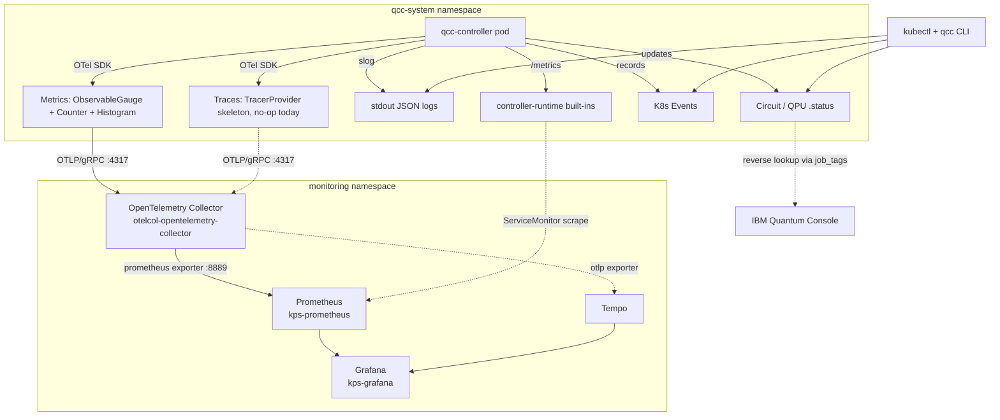

# QCC Observability Design

**Status:** canonical observability design document for QCC.  As of 2026-05-17 (morning), this is the single source of truth for the observability surface.  Revised from the 2026-05-16 (night) version to reflect the OTel SDK + OTLP push + Collector hub architecture (the canonical mid-2026 K8s observability pipeline, post OpenTelemetry CNCF graduation 2026-05-11).
**Primary thesis consumers:** Chapter 6 (architecture), Chapter 7 (evaluation).
**Related files:** `QCC-System-Design.md`, `QCC-API.md`, `01-requirements-re-evaluation.md`, `deploy/platform/` (helm values for the deployed stack).

---

## 1. Purpose

QCC observability exists to make the quantum--classical execution path inspectable from the infrastructure layer using cloud-native open standards.

The goal is *not* a complete quantum telemetry standard, nor a SaaS-grade operational stack.  The thesis prototype demonstrates that circuit submission, backend selection, transpilation, provider submission, and result retrieval can be correlated through the canonical mid-2026 cloud-native observability pipeline: **the OpenTelemetry SDK in the application + OTLP push to an OpenTelemetry Collector + storage in Prometheus/Tempo/Loki + visualization in Grafana**, combined with K8s-native artifacts (CRDs + ConfigMaps + Events) for per-instance state.

This document realises **R4 (observable execution lifecycle)** from `QCC-System-Design.md` §5, and grounds **R2 (open-standards observability)** and **R4 (live cross-layer correlation)** from `01-requirements-re-evaluation.md`.

### Scope today and what's deferred

QCC's observability surface is built in layers, intentionally separated so each can ship and stabilise independently:

**Layer 1 — Application metrics (M2, shipped):**

- 12 `qcc_*` metrics covering QPU calibration state (L0/L1) and Circuit lifecycle (L2/L3 of Kanazawa's pyramid).
- Emitted from the controller via the OTel SDK, pushed via OTLP-gRPC to the helm-deployed Collector, translated to Prometheus exposition on Collector :8889, scraped by kube-prometheus-stack's Prometheus via the Collector's own ServiceMonitor.
- Cross-boundary identifier stamp (Circuit UID on IBM `runtime_options.tags`) carries identity across the K8s↔IBM boundary.

**Layer 2 — QCC-internals observability (deferred, future M-?):**

- Direct scrape of the controller's own `controller-runtime` built-ins (`controller_runtime_reconcile_total`, `go_*`, `process_*`) — exists on `:8443/metrics` but **not currently in Prometheus**.  Re-enabling needs the Prometheus subdirectory back in the kustomize default plus a ServiceAccount binding (config/prometheus/ holds the scaffold).
- Executor-side instrumentation (Python `qcc-executor`): per-RPC durations, per-adapter timings (transpile/submit/poll), provider-call latencies.  Today the executor emits nothing through OTel; its behaviour is observable transitively via the controller's view.
- Cross-process trace context propagation: the gRPC controller↔executor call would carry W3C trace context when tracing emits.

**Layer 3 — Tracing (wired but not emitting):**

- TracerProvider skeleton at `internal/observability/traces/provider.go` with a no-op exporter.  Flipping to `otlptracegrpc` is a config change, not a code change.  The Collector's Tempo exporter is already deployed and waiting.

**Layer 4 — Logs (slog → stdout today):**

- `slog` is the application API; controller-runtime's logr is bridged via `logr.FromSlogHandler` in `cmd/qcc-controller/main.go`.  Visible via `kubectl logs`.
- OTel logs bridge (`otelslog`) deferred until `go.opentelemetry.io/otel/log` reaches v1.

**Layer 5 — Domain telemetry (Kanazawa L4, M2.5):**

- Outcome-quality metrics (Hellinger fidelity, TVD against `aer-statevector`) — per-experiment analytical artifacts, not Prometheus-shaped.

The separation by layer reflects an architectural decision: **application observability is what answers thesis questions** (cross-substrate calibration drift, Circuit lifecycle outcomes, cross-boundary identity).  **QCC-internals observability is operational** — useful in production but not load-bearing for the M2 contribution claim.

---

## 2. Audience and observability questions

Three distinct audiences ask different questions of QCC.  The observability surface serves all three with the right tool for each:

| Audience | Typical questions | Primary tool |
|---|---|---|
| **User running a Circuit** | "Where is my Circuit now?  Why did it fail?  What ran where?" | `qcc get circuit X`, `kubectl describe`, `kubectl logs` — the per-instance K8s-native tools |
| **Thesis evaluator** | "Can QCC observe the classical–quantum boundary?  How does QPU calibration affect circuit results?  How does selection behave across substrates?" | Grafana dashboards over Prometheus metrics; Ch7 figures |
| **Future operator (post-thesis)** | "Is the system healthy?  What's the failure rate trending?  Are queues backing up?" | Prometheus + alerting (deferred to M4) |

### 2.1 Question → signal mapping

| Question | Primary signal | Source |
|---|---|---|
| What is the Circuit doing right now? | `Circuit.status.phase` + Conditions | K8s API |
| Why was this backend selected? | `Circuit.status.selectionSummary` + K8s Events | K8s API |
| Where did latency accumulate inside one Circuit? | `qcc_circuit_phase_duration_seconds_observed{circuit=…}` (persistent gauge from conditions) | Prometheus |
| Where did latency accumulate across many Circuits? | `qcc_circuit_phase_duration_seconds` histogram (fleet-wide percentiles) | Prometheus |
| How much actual QPU compute did this Circuit use vs orchestration overhead? | `qcc_circuit_usage_seconds` (on-QPU) vs `qcc_circuit_phase_duration_seconds_observed{phase="Running"}` (wall-clock) | Prometheus |
| Did the controller duplicate a submission? | `Circuit.status.providerJobId` + idempotency key | K8s API |
| Did failure happen in K8s, executor, or provider? | Condition `reason` + `qcc_circuits_total{reason}` counter | K8s API + Prometheus |
| How often do circuits fail by reason? | `qcc_circuits_total{phase="Failed", reason=...}` | Prometheus |
| What's the current calibration state of each QPU? | `qcc_qpu_*` gauges + `kubectl get qpus` | Prometheus + K8s API |
| Is selection stable across calibration changes? | Repeated `mode=select` runs; success/match rate | K8s API + experiment scripts |
| How does this hardware compare to that hardware? | Grafana panels over `qcc_qpu_*` metrics | Prometheus |
| How does v2 of an algorithm compare to v1? | `qcc_circuit_result_count{algorithm="X"}` grouped by `algorithm_version` | Prometheus |
| Did `v2` actually change anything? | `count by(algorithm, source_sha256)(qcc_circuit_info)` — same hash across versions = label-only relabel | Prometheus |
| Which IBM job did this Circuit produce? | `Circuit.status.providerJobId` (or `qcc_circuit_info{circuit=…}.provider_job_id`) | K8s API or Prometheus |
| Which Circuit owned IBM job `<id>`? | `qcc_circuit_info{provider_job_id="<id>"}` (reverse-linkage via §6) | Prometheus |

**Note**: the per-Circuit / aggregate split has softened compared to earlier designs.  Per-Circuit *state changes and event narrative* still come from the K8s API (`kubectl describe`, condition transitions, K8s Events) — that's the authoritative audit trail.  But per-Circuit *quantitative facts* — phase durations, gate counts, outcome distributions, QPU time — are answerable from Prometheus too, because the metric label set carries `circuit` and the new `qcc_circuit_phase_duration_seconds_observed` gauge is derived from CR state on every scrape.  The two surfaces complement each other; §10 shows query patterns for each.

---

## 3. The observability stack

QCC's observability surface combines K8s-native primitives (CRD status, Events) with the canonical OpenTelemetry pipeline (SDK → OTLP → Collector → storage → Grafana).  Both signal flows map to Kanazawa et al.'s 5-layer pyramid (Kanazawa et al. 2025, "Observability Architecture for QCSC Workflows").



**Two parallel data paths to Prometheus** (intentional, not redundant):

1. **QCC domain metrics** (`qcc_qpu_*`, `qcc_circuit_*`) flow via OTel SDK → OTLP/gRPC → Collector → Prometheus exporter (port `:8889`) → Prometheus scrape.
2. **controller-runtime built-ins** (`controller_runtime_*`, `go_*`, `process_*`) flow via the controller's own `/metrics` HTTP endpoint → ServiceMonitor scrape → Prometheus.  These live in controller-runtime's Prometheus registry which we don't fight (upstream issue [#305](https://github.com/kubernetes-sigs/controller-runtime/issues/305) keeps it Prom-native).

Both end up in the same Prometheus instance; Grafana queries one source.

### 3.1 Signal-to-layer mapping (Kanazawa pyramid)

| Kanazawa layer | What it covers | QCC implementation | Source-of-truth |
|---|---|---|---|
| **L0 Hardware** | power, thermal — substrate-level facts | `qcc_qpu_*` metrics (qubits, gate errors, T1/T2, durations) — the *quantum-node-exporter* analog of Prometheus `node_exporter` for quantum hardware (Seelam et al. 2026, §III.E.2) | OTel SDK → OTLP → Collector → Prometheus → Grafana |
| **L1 System** | CPU, memory, I/O, network | `controller_runtime_*` + `process_*` + `go_*` (free from controller-runtime) + kube-state-metrics + node-exporter (from kube-prometheus-stack) | Direct ServiceMonitor scrape → Prometheus |
| **L2 Job** | job accounting, throughput | `qcc_circuits_total` counter (via OTel SDK) + K8s Events on Circuit | OTel SDK + K8s API |
| **L3 Task** | task artifacts, wall-clock times | `Circuit.status` itself (transpile shape, results, providerJobId, Conditions with timestamps) | K8s API via `kubectl get circuit X -o yaml` |
| **L4 Domain** | solver convergence, fidelity | Out of scope today; M2.5 outcome-quality work (Hellinger fidelity, TVD against `aer-statevector` reference) | future |

**The L3 substrate substitution is the thesis-distinctive piece.**  Kanazawa's reference implementation stores L3 task data as Prefect metadata; QCC stores it directly on the K8s CRD `.status`.  Same architectural pattern, K8s-native substrate, different ergonomics for the user (`kubectl describe circuit X` instead of Apache Superset queries).

### 3.2 The deployed platform (reference)

The infrastructure-side observability stack is deployed via Helm into the `monitoring` namespace.  Values files live in `deploy/platform/`:

| Component | Helm chart | Values file | Purpose |
|---|---|---|---|
| Prometheus + Grafana + Alertmanager-disabled + KSM + Prom Operator | `kube-prometheus-stack` | `deploy/platform/kps-values.yaml` | Storage + viz + K8s state metrics |
| OpenTelemetry Collector (Deployment mode, contrib image) | `opentelemetry-collector` | `deploy/platform/otelcol-values.yaml` | OTLP ingest from QCC + translate to Prometheus exposition + forward traces to Tempo |
| Tempo (in-memory, single replica) | `tempo` | `deploy/platform/tempo-values.yaml` | Trace storage for future tracing work |

**Not installed**: the OpenTelemetry Operator.  We use the bare `opentelemetry-collector` chart since one Collector suffices at thesis scale.  Adding the Operator becomes worthwhile only when we want the `Instrumentation` CR to auto-inject OTel SDKs into other pods (e.g., the Python `qcc-executor`) — that's future-work.

**Why this composition** (no `opentelemetry-kube-stack`): kube-prometheus-stack already ships kube-state-metrics and prometheus-node-exporter as subcharts; using `otel-kube-stack` on top would duplicate those pods.  The clean composition is `kube-prometheus-stack` (owns the Prom side) + bare `opentelemetry-collector` (owns OTLP ingest).

### 3.3 Operational paradigm — **USE-Q + RED-F**

Existing cloud-native monitoring paradigms — RED (Wilkie, microservices), USE (Gregg, resources), the 4 Golden Signals (Google SRE) — were designed for deterministic classical services.  Quantum-classical workloads break their assumptions on three fronts:

1. **Results are probabilistic.**  "Did the request succeed?" isn't binary; it's a distribution over outcomes scored against an ideal.
2. **Queue dominates wall-time.**  On real hardware (IBM Quantum, AWS Braket), the `Submitting` phase can be 99% of total Circuit duration.  RED's "Duration" hides this without phase decomposition.
3. **Calibration drift is a continuous-quality signal**, not a fault.  A QPU is "less good" today than yesterday; that's a substrate state, not a failure.

QCC's operational paradigm extends two established frameworks rather than inventing a new one — both for thesis defensibility and because the underlying ideas (resource health and request flow) translate directly to the quantum context.  We add **one quantum-specific dimension** (Fidelity) to make the gap explicit.

#### 3.3.1 USE-Q — QPU substrate health

The Utilization / Saturation / Errors framework (Gregg) adapted for quantum substrates.  Each letter answers an operator-facing question about backend state.  The `-Q` suffix signals quantum adaptation without obscuring the lineage.

| Letter | Question it answers | What it captures (quantum interpretation) | Backing metrics |
|---|---|---|---|
| **U** — Utilization | *Is this backend being maintained — has it been calibrated recently enough to trust?* | Calibration freshness (the analog of "uptime as intended use") + processor identity for filtering | `qcc_qpu_last_calibration_timestamp_seconds`, `qcc_qpu_info{processor_family, processor_revision}` |
| **S** — Saturation | *Is the backend accepting submissions right now? Is it congested or blocked?* | Availability state; (future) queue depth at the provider | `qcc_qpu_condition{condition="Ready"}`, `qcc_qpu_condition{condition="MetadataFresh"}` |
| **E** — Errors | *What's the substrate's intrinsic error profile — gates and coherence?* | Per-operation error medians + coherence times + gate durations (the quantum analog of "hardware error events") | `qcc_qpu_operation_error_median{operation}`, `qcc_qpu_coherence_seconds{type}`, `qcc_qpu_operation_duration_median_seconds{operation}` |

#### 3.3.2 RED-F — Circuit workload outcomes

The Rate / Errors / Duration framework (Wilkie) extended with **Fidelity** — the quantum-specific quality dimension that classical RED has no analog for.

| Letter | Question it answers | What it captures | Backing metrics |
|---|---|---|---|
| **R** — Rate | *How many Circuits are flowing through QCC? At what throughput?* | Phase-transition events per unit time | `rate(qcc_circuits_total[5m])` |
| **E** — Errors | *What fails, in which layer, and for what reason?* | Failed phase transitions broken down by condition reason (TranspilationFailed, ProviderSubmissionFailed, …) | `qcc_circuits_total{phase="Failed", reason}` |
| **D** — Duration | *Where does time go inside a Circuit lifecycle?* | Per-phase duration distribution (10ms → 30m buckets) | `qcc_circuit_phase_duration_seconds_bucket` |
| **F** — Fidelity *(quantum-specific extension)* | *How close was the outcome to the ideal answer?* | Measurement-outcome distribution; future Hellinger / TVD vs `aer-statevector` reference (M2.5) | `qcc_circuit_result_count{bitstring}`, `qcc_circuit_transpile_depth`, `qcc_circuit_transpile_gates{kind}` |

#### 3.3.3 Why F is its own letter (not folded into E)

Errors (the **E**) capture *failures of the system* — a Circuit that didn't complete, an RPC that timed out, a transpile that errored.  Fidelity captures *failures of the physics* — a Circuit that completed but produced a noisy histogram.  Different audiences, different remediations.  A high **E** means "the platform broke" → operator investigates the layer; a low **F** means "the substrate is decoherent / the circuit is too hard for this QPU" → operator considers a different backend or fewer two-qubit gates.  Naming them separately keeps the operator-debugging path distinct from the substrate-quality path.

#### 3.3.4 How USE-Q + RED-F relate to Kanazawa's pyramid

| Paradigm layer | Maps to Kanazawa | What the operator asks |
|---|---|---|
| USE-Q | L0 (Hardware) + L1 (System) — substrate-state and substrate-saturation signals | "Is the backend healthy / busy?" |
| RED-F (R, E, D) | L2 (Job) + L3 (Task) — workload-flow signals | "What's happening with my Circuits?" |
| RED-F (F) | L4 (Domain) — algorithm-outcome signals | "How good were the answers?" |

The paradigms are **the operational view** on top of Kanazawa's **architectural view**.  Kanazawa names the layers; USE-Q + RED-F names the questions an operator asks at each layer.

#### 3.3.5 Future extension — derived "Match Quality" signals

A natural derived layer sits between USE-Q and RED-F: signals that join *substrate state* with *workload shape* to predict outcome quality before measurement.  Examples (computable via PromQL recording rules over the existing instruments — not shipped today):

- `expected_total_2q_error` = `transpile_gates{kind="two_qubit"} × operation_error_median{operation="gate_2q"}` — the single best predictor of histogram quality on real hardware.
- `coherence_budget_ratio` = `(depth × 2Q_duration) / T2` — how much of T2 the circuit consumes.
- `predicted_vs_observed_fidelity_delta` — when M2.5 outcome-quality metrics land, the gap between predicted (from substrate × shape) and observed (from `qcc_circuit_result_count` Hellinger vs ideal) IS the R5 selection-model-quality signal.

These are deferred to a follow-up — see also the note at the end of §14 — but the framework anticipates them.

---

## 4. Idiomatic principles for the metric surface

These are the conventions QCC's metrics follow, with reasoning.  When in doubt during implementation or extension, return here.

### 4.1 Two-pattern split: resource state vs. operational events

The prometheus-operator community uses two distinct patterns for two distinct kinds of signal:

| Pattern | Used for | Type | Source-of-truth | Canonical example |
|---|---|---|---|---|
| **Resource state** (kube-state-metrics style) | Current state of a CRD object | **gauges** | The K8s API (read on each scrape) | `kube_pod_info`, `kube_pod_status_phase`, `kube_pod_status_condition` |
| **Operational events** (controller-runtime style) | Things that happen over time inside the process | **counters + histograms** | The controller's own observations | `controller_runtime_reconcile_total`, `controller_runtime_reconcile_time_seconds` |

**Strict separation rule**: resource state never gets modelled as a counter; operational events never get modelled as a gauge.  Mixing produces confusing dashboards.

For QCC:
- QPU calibration values, conditions, identity, availability → gauges (resource state)
- Circuit phase transitions, identity, transpile shape → mix of gauges (per-Circuit values set once) and counters (transition tallies)
- Reconcile loops, RPC durations → counters and histograms (controller-runtime freebies)

### 4.2 Naming conventions

```
<project>_<subsystem>_<name>_<unit>
```

1. **Project namespace prefix**: `qcc_*` — distinguishes our metrics from `kube_*` (kube-state-metrics), `controller_runtime_*` (controller-runtime), `prometheus_*` (Prometheus self), `go_*` (Go runtime).
2. **Subsystem**: `qpu_*`, `circuit_*`.
3. **Snake_case lowercase** throughout.
4. **Counter suffix `_total` is mandatory** per Prometheus convention.
5. **Base SI units in the name**: `_seconds` (not `_ms` or `_microseconds`), `_bytes`, no suffix for ratios in [0,1].  Microsecond-range values like coherence still expose as `_seconds` (0.000232 = 232 µs); the *dashboard* formats for display.
6. **Aggregations in the name** (e.g., `_median`) are acceptable when computed server-side.  The value stored is already the aggregate, and the name should reflect that.

### 4.3 Label conventions

1. **Short, lowercase, snake_case label names**: `qpu`, `namespace`, `condition`, `status`, not `qpu_name` or `the_namespace`.
2. **Always include `namespace` on namespaced resources**.  Circuit is namespace-scoped — every Circuit metric carries `namespace`.  QPU is cluster-scoped — no `namespace` label.
3. **Include `uid` on `_info` metrics**.  The K8s UID is unique-forever; dashboards can distinguish a recreated-with-same-name resource from the original.
4. **Don't repeat the metric name in label keys**: bad `qcc_circuit_phase_duration_seconds{circuit_phase=…}`; good `qcc_circuit_phase_duration_seconds{phase=…}`.
5. **Bounded label values only**.  Every label value must come from a known-finite set.  Reserved label names to never use: `__name__`, `instance`, `job`, `le`, `quantile`.

### 4.4 Type discipline

OpenTelemetry's metric SDK distinguishes **synchronous** instruments (the application explicitly records values at the call site) from **observable** instruments (the SDK invokes a callback on each collection cycle).  This split matters for QCC because most QPU/Circuit metrics derive from K8s CRD state, and the "source of truth lives on the CRD" principle maps onto observable instruments naturally.

| Type | When to use | Examples in QCC | OTel instrument |
|---|---|---|---|
| **Observable gauge** | "What is X right now, derived from K8s state?" — value queried from controller-runtime informer cache on each scrape | `qcc_qpu_*` (calibration values), `qcc_circuit_info`, `qcc_circuit_transpile_*`, `qcc_circuit_result_count`, `qcc_circuit_phase_duration_seconds_observed`, `qcc_circuit_usage_seconds` | `Int64ObservableGauge` / `Float64ObservableGauge` + `meter.RegisterCallback(...)` |
| **Synchronous counter** (name ends `_total` in Prometheus exposition) | "How many times has X happened?" — increments on observed events | `qcc_circuits_total` (phase transitions) | `Int64Counter` |
| **Synchronous histogram** | "Across many event observations, what's the distribution of X?" | `qcc_circuit_phase_duration_seconds` (observed when a phase ends) | `Float64Histogram` with explicit buckets |
| **Synchronous gauge** | "Value that the application sets explicitly and that can go up or down" — rare in QCC | (none) | `Int64Gauge` / `Float64Gauge` |
| **Summary** | Quantiles computed client-side | **Avoid** — not aggregable across replicas | n/a |

**The Observable-vs-synchronous rule for QCC**:

- If the value's source-of-truth is a CRD field (or anything readable from the informer cache), use **`Int64ObservableGauge`** with a callback.  Reasoning:
  - **No write/scrape race** — synchronous gauges create a window where the cached metric value lags the CRD; observable callbacks read fresh on each scrape.
  - **No state duplication** — the CRD IS the truth; we don't mirror it into a separate variable.
  - **Lazy cost** — callbacks fire on Prometheus scrape (every ~30s), not on every reconcile (which can fire ~10× more often during a phase transition burst).
  - **Matches kube-state-metrics** — the canonical pattern.
- If the value is observed *because an event happened* (phase transitioned, RPC completed, error occurred), use **`Counter` / `Histogram`**.  These can only be incremented or observed; they don't read state.

### 4.4.1 ObservableGauge callback pattern

```go
qubits, _ := meter.Int64ObservableGauge(
    "qcc_qpu_qubits",
    metric.WithDescription("Number of qubits this QPU exposes"),
)

_, _ = meter.RegisterCallback(
    func(ctx context.Context, obs metric.Observer) error {
        var qpus qccv1alpha1.QPUList
        if err := cachedClient.List(ctx, &qpus); err != nil {
            return err
        }
        for _, qpu := range qpus.Items {
            obs.ObserveInt64(qubits, int64(qpu.Status.Qubits),
                metric.WithAttributes(
                    attribute.String("qpu", qpu.Name),
                    attribute.String("provider", qpu.Spec.Provider),
                ))
        }
        return nil
    },
    qubits,
)
```

Three discipline notes:
- **Use the controller-runtime informer cache** (`cache.Cache` or `client.Client` with cache-backed reads), not the API server.  Scrape paths must not block on apiserver round-trips.
- **One callback can observe many instruments** if they share the same iteration over resources — list QPUs once, observe all per-QPU gauges in one pass.  Prevents repeated cache iteration.
- **Return errors** rather than panicking — the OTel SDK logs them; partial observation is fine.

### 4.5 Info-metric pattern (KSM-canonical)

For static identity / metadata about a resource:

```
<resource>_info{<identity labels>} = 1
```

The value is always 1.  Labels carry the metadata.  PromQL joins via:

```promql
qcc_qpu_operation_error_median * on(qpu) group_left(processor_family) qcc_qpu_info
```

This adds `processor_family` to the error metric for grouping without baking the identity into every operational metric.

**Important**: info-metric label values should be **strings only**, not numbers.  Numbers as labels require regex queries (`{qubits=~"1[2-9][0-9]"}`) and prevent arithmetic.  Model numeric facts as separate gauges if needed.

**Exception, narrowly scoped**: an identity-like numeric value that is set-once and never changes (e.g. a Circuit's configured `shots`) can live on the info-metric as a stringified label.  The "doesn't change" property makes the regex-filter limitation acceptable in exchange for one fewer metric.  Don't use this loophole for time-varying values.

### 4.6 Condition pattern (KSM-canonical)

For K8s Conditions on a resource:

```
<resource>_condition{<resource>, condition, status} = 0 or 1
```

Where `condition` ∈ {set of condition types on the CRD} and `status` ∈ {`true`, `false`, `unknown`}.  Exactly one `status` per `(<resource>, condition)` is 1; the others are 0.

Why this beats a 1-of-N enum gauge (e.g., `qcc_qpu_availability{state}`):

- **Matches K8s natively** — `kubectl describe qpu` already shows Conditions; the metric mirrors that surface exactly.
- **Extensible** — adding a new Condition adds new series automatically; no dashboard breaks.
- **Standard PromQL filter**: `qcc_qpu_condition{condition="Ready", status="false"} == 1` → all not-Ready QPUs.

### 4.7 Histogram bucket discipline

Default Prometheus buckets are tuned for HTTP-handler latency (sub-second).  They lose data outside that range.  **Always pick buckets for the actual range observed.**

QCC's Circuit phase durations span 5+ orders of magnitude (1ms reconciles to 30-minute IBM queues).  Use:

```
buckets: 0.01, 0.1, 0.5, 1, 5, 30, 120, 600, 1800
         (10ms, 100ms, 500ms, 1s, 5s, 30s, 2m, 10m, 30m)
```

Each histogram metric should declare its buckets explicitly when registered.

#### 4.7.1 Terminology clash — quantum "histogram" vs Prometheus "histogram"

Two unrelated things in QCC are called "histogram"; readers from both communities will reach for the wrong tool unless this is named explicitly.

| | **Quantum sense** | **Prometheus sense** |
|---|---|---|
| What it is | Frequency distribution of measurement outcomes over discrete bitstrings | Bucketed distribution of a *continuous* variable over many observations |
| Example | `{"00": 498, "01": 65, "10": 8, "11": 453}` from a Bell circuit | "5% of phase durations fell in (1s, 5s]" |
| Qiskit API | `plot_histogram(counts)` — produces a **categorical bar chart** | n/a |
| QCC metric type | **gauge** with `bitstring` label (`qcc_circuit_result_count{bitstring}`) | **histogram** (`qcc_circuit_phase_duration_seconds` with `_bucket{le}`, `_sum`, `_count`) |
| Right Grafana panel | **Bar chart** with bitstring on X axis (the Qiskit `plot_histogram` layout) | **Heatmap** of `_bucket` over time, or `Histogram` panel for a snapshot |

**Why this matters in practice**: Grafana's `Histogram` panel takes raw numeric values and bins them — exactly wrong for `qcc_circuit_result_count` which is *already* a categorical key-value mapping.  The correct panel for outcome distributions is `Bar chart` with bitstring as the X-axis field (after a `labelsToFields` transformation extracting the bitstring label).  This is the layout the `qcc-circuit` dashboard uses for the "Outcome distribution per Circuit" and "Cross-substrate Bell ladder" panels.

Conversely, Grafana's `Heatmap` panel is the right viz for `_bucket` series over time — it shows the full distribution evolving, which a p95 line cannot.  The `qcc-circuit` dashboard uses Heatmap for "Phase duration heatmap" and falls back to time-series-of-quantiles for the summary view below it.

### 4.8 Cardinality discipline at thesis scale

A bounded set is a label.  An unbounded set is not.  For QCC's thesis scope, **the `circuit` label is fine** despite SaaS-scale wisdom suggesting otherwise.  Reasoning:

| Label | Bounded? | Approximate cardinality |
|---|---|---|
| `qpu` | yes (~12 registered QPUs) | small |
| `circuit` | bounded at thesis lifetime (~hundreds of Circuit runs total) | small at thesis scale |
| `namespace` | yes (a handful) | small |
| `phase`, `reason`, `condition`, `status` | enum | small |
| `operation`, `type`, `kind`, `mode`, `source_format` | controlled vocabulary | small |

Cardinality budget: <1000 active series total.  Reality with the design below: ~few hundred at any instant.  Most Circuit-labelled series go inactive within ~5 minutes of Circuit terminal (Prometheus's inactivity rule).

The "high cardinality kills Prometheus" rule applies at production-SaaS scale (millions of unique IDs).  At thesis scale, `circuit` as a label gives genuine value (per-Circuit dashboards and drilldowns) without infrastructure pain.

### 4.9 Disallowed labels

Never as metric labels:
- Provider job IDs (IBM Cloud job IDs are unique per submission → unbounded)
- Trace IDs (same)
- Raw error messages (unbounded)
- User identity (privacy + cardinality)
- Exact calibration timestamps (unbounded; use the timestamp metric instead)

For provider-job correlation, surface IDs on `Circuit.status.providerJobId` (already done) and let the user join CR ↔ provider via that field, not via metric labels.

### 4.10 Controller-side only

All QCC-specific metrics emit from the controller, not the executor.  Single-language scope (Go only); the controller maintains all data we expose (CRD `.status` is the source of truth).  Per-RPC executor timing is extractable from `controller_runtime_reconcile_time_seconds` and the executor's gRPC duration if needed in the future.

---

## 5. Locked metric inventory

The 12 QCC-specific metrics, plus controller-runtime freebies.

### 5.1 QPU metrics (6)

| # | Metric | Type | Labels | Source / Description |
|---:|---|---|---|---|
| 1 | `qcc_qpu_info` | gauge (=1) | `qpu, uid, provider, kind, processor_family, processor_revision` | Static identity carrier.  Joined to other metrics via PromQL group-left for filtering/grouping. |
| 2 | `qcc_qpu_operation_error_median` | gauge ∈ [0,1] | `qpu, operation` ∈ `{gate_1q, gate_2q, readout}` | Median error rate per operation class, from `QPU.status.errorMedians`. |
| 3 | `qcc_qpu_operation_duration_median_seconds` | gauge ≥ 0 | `qpu, operation` ∈ `{gate_1q, gate_2q}` | Median operation duration in seconds.  IBM doesn't report readout duration — that label value is absent, not zero. |
| 4 | `qcc_qpu_coherence_seconds` | gauge ≥ 0 | `qpu, type` ∈ `{t1, t2}` | Median T1/T2 coherence in seconds (e.g., 0.000232 for 232 µs). |
| 5 | `qcc_qpu_last_calibration_timestamp_seconds` | gauge (Unix epoch) | `qpu` | When IBM last refreshed calibration.  For `fake_*` backends this is the frozen snapshot date. |
| 6 | `qcc_qpu_condition` | gauge ∈ {0,1} | `qpu, condition, status` ∈ `{true, false, unknown}` | KSM-canonical Conditions matrix; one row per (condition × status) combination. |

### 5.2 Circuit metrics (8)

| # | Metric | Type | Labels | Source / Description |
|---:|---|---|---|---|
| 1 | `qcc_circuit_info` | gauge (=1) | `circuit, namespace, uid, mode, source_format, shots, qpu, provider_job_id, algorithm, algorithm_version, experiment, run_index, source_sha256` | Static identity carrier.  Joined to other metrics via PromQL group-left.  `shots` and `qpu` are carried here (set-once, identity-like values) rather than as separate metrics; `shots` is stringified per the §4.5 "narrow exception" for set-once numeric identity.  `provider_job_id` is the substrate's own execution handle — its presence here is what closes the reverse-linkage loop (§6).  The algorithm-grouping labels (`algorithm`, `algorithm_version`, `experiment`, `run_index`, `source_sha256`) are promoted from `metadata.labels[qcc.io/*]` via an explicit allowlist (QCC-API.md §5.4).  All values are 1-to-1 with the Circuit — cardinality cost is zero, they enrich the existing per-Circuit series rather than multiplying it. |
| 2 | `qcc_circuits_total` | counter | `circuit, namespace, uid, provider_job_id, phase, reason, qpu, mode` | Phase-transition tallies.  `reason` is the condition reason on failure transitions; empty on success.  `uid` + `provider_job_id` carried so cross-boundary joins work on this counter too. |
| 3 | `qcc_circuit_phase_duration_seconds` | histogram (synchronous) | `circuit, namespace, uid, provider_job_id, phase, qpu` | Time spent in each phase, recorded on transition.  **Custom buckets**: `0.01, 0.1, 0.5, 1, 5, 30, 120, 600, 1800` (10ms to 30m).  Good for **fleet-wide percentiles** (`histogram_quantile`); for per-Circuit drill-down see metric #4 (the observable companion). |
| 4 | `qcc_circuit_phase_duration_seconds_observed` | gauge | `circuit, namespace, uid, provider_job_id, qpu, phase` | Per-phase wall-clock duration derived from `status.conditions[].lastTransitionTime` deltas on each scrape.  Persistent companion to the synchronous histogram (#3) — survives controller restarts and Prometheus's 5-minute staleness window because it's recomputed from cached CR state on every scrape.  Granularity is at K8s-condition level (4 phases: `Pending`, `Selecting`, `Submitting`, `Running`); finer 5-phase splits would require timestamping each phase entry on the CRD, which is Ch9 future work. |
| 5 | `qcc_circuit_usage_seconds` | gauge | `circuit, namespace, qpu, uid, provider_job_id` | Substrate-reported billable compute time (Qiskit Runtime `Job.usage()`).  **Only emitted when value > 0** — simulator paths produce no series, so any non-zero value in Prometheus reliably represents real-hardware compute.  Pair with `qcc_circuit_phase_duration_seconds_observed{phase="Running"}` for the **orchestration-overhead** decomposition: `Running − usage_seconds` is the queue + transit + IBM-side overhead bucket. |
| 6 | `qcc_circuit_transpile_depth` | gauge | `circuit, namespace, qpu` | Post-transpile depth (longest chain of dependent gates). |
| 7 | `qcc_circuit_transpile_gates` | gauge | `circuit, namespace, qpu, kind` ∈ `{single_qubit, two_qubit, total}` | Post-transpile gate counts.  `single_qubit` is derived from `total − two_qubit` because the executor's TranspileMetadata doesn't break it out — derivation is honest enough for thesis-scope visualisation. |
| 8 | `qcc_circuit_result_count` | gauge | `circuit, namespace, qpu, bitstring` | Per-bitstring measurement-outcome counts (e.g. `bitstring="00"` value=498).  Read directly from `Circuit.status.results` via cache.  **Straddles Kanazawa L3/L4 boundary** — the raw form of fidelity / TVD analytics that M2.5 outcome-quality work will compute over.  **Cardinality**: 2^qubits per Circuit; ~1000 series budget covers ~50 thesis-lifetime Circuits at ≤ 5 qubits.  Re-evaluate when VQE-scale workloads (many iterations × few qubits) land. |

**Dropped from earlier inventory**: `qcc_circuit_shots` as a standalone gauge was replaced by `shots` as a label on `qcc_circuit_info`.  The set-once nature of shots makes it identity-like; carrying it on info reduces the metric count and keeps shot+qpu accessible via PromQL info-joins.  The `sum by(qpu)(qcc_circuit_shots)` use case is recoverable via CRD aggregation when needed.

**Two phase-duration metrics, by design**: the synchronous histogram (#3) is the right primitive for *fleet-wide percentiles* across many Circuits (`histogram_quantile(0.95, rate(..._bucket[5m]))`); the observable gauge (#4) is the right primitive for the *per-Circuit detail panel* on the Circuit dashboard.  Both share the same definition of "phase duration" but differ in retention: the histogram observation fires once at transition and ages out per Prometheus staleness, while the gauge re-derives from the CR on every scrape and survives indefinitely.  Keeping both costs roughly 2× phase-timing series but gives the right tool for each query class.

### 5.3 Control-plane metrics (free from controller-runtime)

These ship automatically when the controller exposes its metrics endpoint.  Scrape via the same ServiceMonitor.

| Metric | Type | Description |
|---|---|---|
| `controller_runtime_reconcile_total{controller, result}` | counter | Reconciles per controller; `result` ∈ `{success, requeue, error}` |
| `controller_runtime_reconcile_time_seconds{controller}` | histogram | Reconcile latency distribution |
| `controller_runtime_reconcile_errors_total{controller}` | counter | Reconcile-error counts |
| `controller_runtime_active_workers{controller}` | gauge | Currently-active reconcile workers |
| `go_*` | various | Go runtime (heap, GC, goroutines) |
| `process_*` | various | Process (CPU, memory, file descriptors) |

### 5.4 Total active series envelope

At thesis scale (~12 QPUs, ~hundreds of Circuits across the thesis lifetime):
- QPU side: ~12 × ~15 series each ≈ **180 series**
- Circuit side (info + transpile + counter + histogram + observed-phase gauge): accumulates over time but most non-observed-gauge series age out ~5 min after terminal; the observed-phase gauge is **persistent** (re-derived from CR state every scrape), so ~4 phase rows × N Circuits ever submitted = a slowly-growing floor.  At thesis scale (~50 Circuits across the run) the floor is ~200 phase-gauge series.  Plus ~30–60 transient info/transpile/counter/histogram series at any moment.
- Circuit side (`qcc_circuit_result_count` with `bitstring` label): 2^qubits per Circuit.  Bell=4, GHZ-3=8, Shor=32–128.  At thesis circuit shapes (≤ 5 qubits typical), ~20 outcomes × ~30 active Circuits ≈ **~600 series peak**.
- Circuit side (`qcc_circuit_usage_seconds`): 1 series per real-hardware Circuit (simulator runs emit nothing).  At ~20% real-hardware fraction of ~50 Circuits → **~10 series** total.
- Control-plane: ~50 series
- **Total active: ~1050 series at peak.**  Just over the original <1000 target, driven by the persistent observed-phase gauge; acceptable for thesis-scope.

**When to revisit**: VQE-H₂ with N iterations submits N Circuits, each with its own outcome distribution.  At N=50 iterations × ~16 outcomes = 800 series for ONE VQE run.  If VQE runs accumulate without TTL eviction, the budget gets tight.  Mitigations available when needed: drop `qcc_circuit_result_count` to terminal Circuits only (skip in-flight); shorten the observed-phase gauge's effective retention by garbage-collecting old Circuits; or move per-bitstring counts to a logs/events path (one structured log line per terminal Circuit with the results dict).

---

## 6. Cross-boundary identifier linkage

The lightweight alternative to distributed tracing for the "follow my Circuit through the whole stack" use case.  Implemented bidirectionally as of M3:

- **Forward (QCC → IBM)**: the controller stamps the Circuit's K8s UID into IBM's job tags, so an IBM Quantum Console user can resolve a job back to its owning Circuit.
- **Reverse (IBM → QCC)**: the executor returns the substrate's `provider_job_id`, which the controller persists on `status.providerJobId` *and* the observability layer promotes to a label on `qcc_circuit_info`.  Paste a job ID from IBM Quantum Console into a Prometheus query (`qcc_circuit_info{provider_job_id="d8463bg0bvlc73d46tqg"}`) and the returned series tells you the Circuit name, namespace, UID, algorithm, run-index, and the rest of the metadata.

### 6.1 Forward — UID stamped into substrate job tags

When `IBMAdapter.submit` calls `SamplerV2.run`, the Circuit's K8s UID rides along as a job tag:

```python
sampler.run(
    [circuit],
    options={
        "environment": {
            "job_tags": [
                f"qcc.circuit.uid:{circuit_uid}",
                f"qcc.circuit.name:{circuit_namespace}/{circuit_name}",
            ],
        },
    },
)
```

The UID is plumbed through the gRPC contract — `TaskSpec.idempotency_key` carries `<uid>/<generation>`, and the Python servicer splits the UID prefix out and passes it to `adapter.submit(..., circuit_uid=...)`.

### 6.2 Reverse — `provider_job_id` as a metric label

`qcc_circuit_info` carries `provider_job_id` as a first-class label.  This means the reverse-linkage query is a single PromQL:

```promql
qcc_circuit_info{provider_job_id="d8463bg0bvlc73d46tqg"}
```

The returned series carries every other identity field (circuit name, namespace, uid, algorithm, version, run-index, source-sha256) — enough to fully resolve which Circuit owned that substrate job, then drill into Grafana panels or `kubectl get circuit` from there.

The Circuit-detail Grafana dashboard exploits this: the `provider_job_id` cell in the Identity table is a clickable data link to `https://quantum.ibm.com/jobs/<value>`, and the `qpu` cell links to the QPU substrate dashboard with the variable pre-filtered — one click closes the loop in either direction.

### 6.3 Why this satisfies R4

R4 says *"a single trace context propagates across the classical–quantum boundary linking algorithm control flow, controller reconciliation, executor selection, vendor submission, and result retrieval."*

QCC interprets "trace context" as the **Circuit's K8s UID** carried through every layer:

- **Circuit CRD** carries the UID as `metadata.uid` (K8s built-in)
- **Controller logs** include `circuit=<name>` and `uid=<uid>` on every reconcile line (controller-runtime convention)
- **gRPC calls** carry the Circuit as part of `TaskSpec.idempotency_key` (derived from UID)
- **IBM Cloud** carries it as a job tag (above)
- **Result retrieval** ends back at the same Circuit, with the substrate's `provider_job_id` now carried as a label on `qcc_circuit_info` so the reverse direction works too

The identifier flows through the stack — bidirectionally.  That's the cross-layer correlation.  We don't need OTel span trees to satisfy R4 — a stable identifier plus a reverse-linkage label is sufficient.

---

## 7. Kubernetes status and events

Status is the durable user-facing state.  Events are the short-lived human-readable trail.  Both are L3 (task-level) per Kanazawa, stored on the CRD.

### 7.1 Status fields

Observability-relevant status fields (full schema in `QCC-API.md`):

| Field | Purpose |
|---|---|
| `phase` | Current lifecycle phase |
| `conditions[]` | Durable state with reasons, messages, and timestamps.  `conditions[].lastTransitionTime` deltas are the source for `qcc_circuit_phase_duration_seconds_observed` |
| `selectedQPU` | Selected backend |
| `selectionSummary` | Compact selection explanation |
| `providerJobId` | External correlation; per-Circuit join key to IBM Console.  Also propagated to `qcc_circuit_info` as the `provider_job_id` label (reverse-linkage anchor; see §6.2) |
| `traceId` | Reserved field for an explicit OTel trace ID once controller spans propagate (Ch9).  The §6 cross-boundary linkage doesn't depend on it — the UID + provider_job_id pair handles the bidirectional join today |
| `transpile.{depth, twoQubitGates, totalGates}` | Post-transpile circuit shape |
| `results` | Inline measurement counts (terminal state for `mode=run`) |
| `usageSeconds` | Substrate-reported billable compute time; source for `qcc_circuit_usage_seconds`.  Zero or omitted on simulator paths |
| `drawingRef`, `convertedRef`, `scheduleRef` | Out-of-band ConfigMap artifact pointers |

### 7.2 Event examples

```text
Normal  CircuitAccepted          Circuit accepted by QCC controller
Normal  BackendSelected          Selected backend ibm_kingston from 4 candidates
Normal  ProviderSubmitted        Submitted provider job d8463bg0bvlc73d46tqg
Normal  ExecutionCompleted       Circuit completed in 4m 17s
Warning NoEligibleBackend        No QPU satisfies minQubits=20 and kind=hardware
Warning TranspilationFailed      Transpilation failed for backend ibm_lagos
Warning ProviderSubmissionFailed Provider submission failed: authentication error
```

Events flow into `kubectl describe circuit X` as a chronological trail, and into any K8s-events log aggregator (kubectl, Loki via the events-exporter pattern) for searchability.

---

## 8. `mode=select` observability

`mode=select` is the thesis-evaluation mode for backend selection without consuming QPU time (R5 acceptance criterion).

In `mode=select`, QCC emits:
- `Circuit.status.phase = Succeeded` if selection completes;
- Conditions `Selected=True` with reason `BackendSelected`, `Completed=True` with reason `ExecutionCompleted`;
- `selectedQPU` populated;
- `selectionSummary` with candidate count, selected backend, and score (once M2.a selection scoring lands);
- `qcc_circuits_total{mode="select", phase="Succeeded"}` increment;
- `qcc_circuit_phase_duration_seconds` for the Selecting phase.

Repeated `mode=select` of the same Circuit within a stable calibration window should produce the same selection — that's the R5 reproducibility property.  Measured as: same-backend-rate across repeated `mode=select` queries.

---

## 9. Failure observability

Failures classified by layer, each with a corresponding condition reason.

| Layer | Example reasons | Signal |
|---|---|---|
| API/resource | `InvalidCircuit`, `InvalidSelector`, `UnsupportedMode` | Condition reason + event |
| Controller | `ReconcileError`, `StatusPatchFailed`, `ExecutorUnavailable` | Condition reason + event + `controller_runtime_reconcile_errors_total` |
| Executor | `CalibrationFetchFailed`, `TranspilationFailed`, `NoEligibleBackend` | Condition reason + event + `qcc_circuits_total{phase="Failed", reason=...}` |
| Provider | `ProviderAuthFailed`, `ProviderUnavailable`, `ProviderSubmissionFailed`, `ProviderJobTimedOut` | Same |
| Result | `ResultFetchFailed`, `ResultTooLarge`, `ResultParseFailed` | Same |

Aggregate failure analysis via PromQL:

```promql
# Failure rate by layer in the last hour
sum by(reason)(increase(qcc_circuits_total{phase="Failed"}[1h]))
```

---

## 10. PromQL query patterns

Worth reading before building dashboards.  Demonstrates the division of labor between metrics (aggregate) and K8s API (per-instance).

### 10.1 Per-QPU drilldown

```promql
# Current 2Q gate error for ibm-kingston
qcc_qpu_operation_error_median{qpu="ibm-kingston", operation="gate_2q"}

# Calibration age in seconds since last calibration, all QPUs
time() - qcc_qpu_last_calibration_timestamp_seconds

# Which QPUs are currently Ready?
qcc_qpu_condition{condition="Ready", status="true"} == 1

# 2Q gate error grouped by processor family (info-metric join)
avg by(processor_family)(
  qcc_qpu_operation_error_median{operation="gate_2q"}
  * on(qpu) group_left(processor_family) qcc_qpu_info
)
```

### 10.2 Per-Circuit drilldown (metrics + K8s combined)

```promql
# Transpile shape for one circuit (metrics view)
qcc_circuit_transpile_gates{circuit="bell-state-5dcl8", namespace="default"}

# Time spent in each phase for a specific circuit (persistent gauge, survives restarts)
qcc_circuit_phase_duration_seconds_observed{circuit="bell-state-5dcl8"}

# On-QPU compute vs off-QPU overhead for one Circuit (real hardware only;
# simulator runs have no `qcc_circuit_usage_seconds` series)
qcc_circuit_usage_seconds{circuit="bell-state-5dcl8"}                                  # on-QPU
qcc_circuit_phase_duration_seconds_observed{circuit="bell-state-5dcl8", phase="Running"}
  - on(circuit) group_left() qcc_circuit_usage_seconds{circuit="bell-state-5dcl8"}    # off-QPU
```

Combined with K8s queries for the rest of per-instance history:

```bash
# Full per-instance view
qcc get circuit bell-state-5dcl8                        # phase, QPU, transpile shape, counts
kubectl describe circuit bell-state-5dcl8               # Conditions + Events timeline
kubectl logs deploy/qcc-controller | grep bell-state-5dcl8  # reconcile log lines
```

### 10.3 Aggregate views (Ch7 figures)

```promql
# Failure rate by reason, last hour
sum by(reason)(increase(qcc_circuits_total{phase="Failed"}[1h]))

# 2Q gate count distribution across QPUs (cross-substrate comparison)
avg by(qpu)(qcc_circuit_transpile_gates{kind="two_qubit"})

# p95 transpile duration by QPU
histogram_quantile(0.95,
  rate(qcc_circuit_phase_duration_seconds_bucket{phase="Transpiling"}[5m])
)

# Per-QPU Circuit count (acts as proxy for "QPU utilisation by run count").
# Total-shots-per-QPU isn't expressible in stock PromQL because `shots` is
# a label, not a value — recover it via CRD aggregation
# (`kubectl get circuits -o jsonpath=...` + jq) when needed.
count by(qpu)(qcc_circuit_info)

# Average off-QPU overhead per substrate
# = avg(Running wall-clock − on-QPU compute), seconds
# (matches the right-side stat on the Circuit dashboard's lifecycle panel)
avg by(qpu)(
  qcc_circuit_phase_duration_seconds_observed{phase="Running"}
  - on(circuit) group_left() qcc_circuit_usage_seconds
)

# Wall-clock-to-compute ratio per substrate (× units)
# = avg(Running / on-QPU compute) — 1.0 would mean the QPU was busy 100%
# of the Running phase (impossible in practice).  Typical: 2–10× on idle
# IBM, 50–100× when the queue is busy.
avg by(qpu)(
  qcc_circuit_phase_duration_seconds_observed{phase="Running"}
  / on(circuit) group_left() qcc_circuit_usage_seconds
)
```

### 10.4 Algorithm-grouping queries (the run-correlation pattern)

The `qcc.io/algorithm` / `algorithm-version` / `experiment` / `run-index` / `source-sha256` labels are promoted to metric labels (QCC-API.md §5.3), so cross-run aggregation works in PromQL without any external metadata store:

```promql
# Outcome distribution aggregated across all runs of the same algorithm
sum by(algorithm, algorithm_version, bitstring)(qcc_circuit_result_count)

# Per-algorithm orchestration overhead — does the algorithm size affect off-QPU time?
avg by(algorithm)(
  qcc_circuit_phase_duration_seconds_observed{phase="Running"}
  - on(circuit) group_left() qcc_circuit_usage_seconds
)

# Detect "relabel without re-edit" — same source body labelled as different versions
count by(algorithm, source_sha256, algorithm_version)(qcc_circuit_info{algorithm!=""})
# Any source_sha256 appearing with >1 distinct algorithm_version is a relabel.

# Compare v1 vs v2 of an algorithm on the same QPU
sum by(algorithm_version, bitstring)(
  qcc_circuit_result_count{algorithm="vqe-h2", qpu="ibm-kingston"}
)
```

### 10.5 The "circuit label" aggregation pattern

`qcc_circuits_total` is labelled by `circuit`, so naive `rate()` queries are noise (each Circuit transitions through each phase ≤1 time).  Use `sum without(circuit, namespace)` to aggregate across instances:

```promql
# Total Circuits across all instances, by phase outcome
sum without(circuit, namespace)(qcc_circuits_total)
```

Document this in dashboards so users don't fight the data shape.

---

## 11. Dashboards (shipped)

Two Grafana dashboards live in `deploy/grafana/`, source-controlled as ConfigMaps and picked up automatically by the kube-prometheus-stack Grafana sidecar via the `grafana_dashboard: "1"` label.  They map 1-to-1 to the USE-Q / RED-F split in §3.3.

### 11.1 `qcc-qpu-dashboard.yaml` — substrate health (USE-Q)

Audience: operator / SRE asking "is my fleet of backends healthy?"

| Section | Panel | Question answered |
|---|---|---|
| **S** — Availability | State-timeline of `qcc_qpu_condition{condition="Ready"}` + Ready/Registered count | Which QPUs are up *now*; when did they last drop? |
| **U** — Utilization | Calibration-age bargauge + timeseries trend | How fresh is each substrate's calibration?  `fake_*` snapshots show as red (months); live IBM as green (hours) |
| **E** — Errors | Per-operation error-median timeseries + 2Q error heatmap | Which operation is dominating noise on each substrate? |
| **E** — Coherence | T1 + T2 bargauges per QPU | Coherence budget per backend |
| **Family comparison** | 2Q error by `processor_family` + piechart of registered QPUs | Hardware-generation progression (Falcon → Eagle → Heron r2) |

Template variables: `$datasource`, `$family` (multi), `$qpu` (multi, **cascades from $family** — the `$qpu` query is `label_values(qcc_qpu_info{processor_family=~"$family"}, qpu)`, so narrowing the family narrows the QPU list automatically).

### 11.2 `qcc-circuit-dashboard.yaml` — Circuit detail (RED-F at per-instance granularity)

Audience: user asking "what happened to this Circuit?"

| Row | Panel | Source / Notes |
|---|---|---|
| **Identity + shape** | Table — `Circuit identity` (`circuit / namespace / qpu / mode / shots / source_format / provider_job_id / uid`) | All columns from `qcc_circuit_info`.  `provider_job_id` cell is a data link → IBM Quantum Console; `qpu` cell is a data link → QPU dashboard with `var-qpu` pre-filled |
| **Identity + shape** | Stat strip — `Transpilation` (`Circuit Depth / 1Q Gates / 2Q Gates / Total Gates`) | `qcc_circuit_transpile_depth` + three targets of `qcc_circuit_transpile_gates{kind=…}` |
| **Lifecycle phases** | Bargauge — `Time spent per phase` (left half) | `qcc_circuit_phase_duration_seconds_observed{circuit="$circuit"}`, one bar per phase |
| **Lifecycle phases** | Stat strip — `Running phase decomposition` (right half) | Two values: on-QPU (`qcc_circuit_usage_seconds`) and off-QPU (`Running − usage`).  The off-QPU number is the orchestration-overhead figure the thesis quantifies |
| **Results** | Barchart — `Outcome counts by bitstring` | `qcc_circuit_result_count{bitstring}`, Qiskit `plot_histogram`-native form |

Template variables: `$datasource`, `$algorithm` (multi, defaults to All), `$circuit` (single-select, **cascades from $algorithm** — the `$circuit` query is `label_values(qcc_circuit_info{algorithm=~"$algorithm"}, circuit)`).  Selection persists in the URL (`?var-circuit=…`), so shared links resolve to a deterministic view — useful for thesis figures and reproducibility.

**Visual style**: all panels use the `continuous-blues` colour palette on a transparent panel background.  The uniform palette is a thesis-figure-friendly choice — a single hue lets readers focus on *which numbers are large* without colour-coding implying severity (the Circuit-detail view is descriptive, not alerting; severity colour belongs on the QPU dashboard's USE-Q signals).  Stat tiles use `colorMode: background` so the blue scales with the value; bargauges and barcharts apply the palette to the bar fills.

### 11.3 Sibling cross-links

The two dashboards link to each other at the panel level:

- Top of each dashboard: a "QPU substrate dashboard" / "Circuit workload dashboard" link in the navigation
- Circuit dashboard, Identity table: clicking on `qpu` cell navigates to the QPU dashboard pre-filtered to that QPU
- Circuit dashboard, Identity table: clicking on `provider_job_id` cell opens IBM Quantum Console at that job (no-op for `aer-*` simulator IDs — harmless 404)

Production dashboards (alerting, SLO panels, multi-tenant breakdown) are future work; out of thesis scope.

---

## 12. Wiring

### 12.1 Package layout

QCC's observability package mirrors the `ioaiaaii.net` pattern (orchestrator + per-signal subpackages), adapted for the K8s controller context:

```
internal/observability/
  otel.go              # Setup(ctx, cfg) -> (shutdown func(ctx) error, error)
                       #   - orchestrates resource / metrics / traces / logs init
                       #   - honors cfg.Enabled (no-op when false)
                       #   - sets propagator globally (TraceContext + Baggage)
                       #   - returns single shutdown closure
  resource.go          # buildResource() — semconv service.* + k8s.* attrs (downward API)
  config.go            # Config struct (Enabled, OTLPEndpoint, ServiceName, etc.)
  metrics/
    provider.go        # newMeterProvider(res, cfg) — OTLP-gRPC exporter to Collector
    qpu.go             # registerQPUMetrics(meter, cachedClient) — ObservableGauges + callbacks
    circuit.go         # registerCircuitMetrics(meter, cachedClient) — mixed obs + sync
    events.go          # Sync Counter + Histogram for phase transitions
    runtime.go         # optional: runtime instrumentation (heap, GC)
  traces/
    provider.go        # newTracerProvider(res, cfg) — skeleton, no-op exporter today
  logs/
    provider.go        # placeholder; slog stays primary until OTel logs goes v1
```

### 12.2 Controller-side OTel SDK setup

The MeterProvider is owned by `cmd/qcc-controller/main.go`, called *before* `ctrl.NewManager`.  Resource attributes flow through to every metric.

```go
// internal/observability/metrics/provider.go
package metrics

import (
    "context"
    "time"

    "go.opentelemetry.io/otel/exporters/otlp/otlpmetric/otlpmetricgrpc"
    "go.opentelemetry.io/otel/sdk/metric"
    "go.opentelemetry.io/otel/sdk/resource"
    "google.golang.org/grpc"
    "google.golang.org/grpc/credentials/insecure"
)

func NewMeterProvider(ctx context.Context, res *resource.Resource, endpoint string) (*metric.MeterProvider, error) {
    exporter, err := otlpmetricgrpc.New(ctx,
        otlpmetricgrpc.WithEndpoint(endpoint),
        otlpmetricgrpc.WithDialOption(grpc.WithTransportCredentials(insecure.NewCredentials())),
    )
    if err != nil {
        return nil, err
    }
    return metric.NewMeterProvider(
        metric.WithResource(res),
        metric.WithReader(metric.NewPeriodicReader(exporter,
            metric.WithInterval(30*time.Second),
        )),
    ), nil
}
```

The PeriodicReader pushes accumulated metrics every 30 seconds via OTLP-gRPC to the Collector at `endpoint` (typically `otelcol-opentelemetry-collector.monitoring:4317`).

### 12.3 ObservableGauge collector example

```go
// internal/observability/metrics/qpu.go
package metrics

import (
    "context"

    qccv1alpha1 "github.com/ioaiaaii/quantum-circuit-controller/api/v1alpha1"
    "go.opentelemetry.io/otel"
    "go.opentelemetry.io/otel/attribute"
    "go.opentelemetry.io/otel/metric"
    "sigs.k8s.io/controller-runtime/pkg/client"
)

func RegisterQPUMetrics(c client.Client) error {
    meter := otel.Meter("qcc.io/observability/qpu")

    qubits, err := meter.Int64ObservableGauge(
        "qcc_qpu_qubits",
        metric.WithDescription("Number of qubits this QPU exposes"),
    )
    if err != nil { return err }

    // ... more ObservableGauges declared similarly ...

    _, err = meter.RegisterCallback(func(ctx context.Context, obs metric.Observer) error {
        var qpus qccv1alpha1.QPUList
        if err := c.List(ctx, &qpus); err != nil { return err }
        for _, qpu := range qpus.Items {
            attrs := metric.WithAttributes(
                attribute.String("qpu", qpu.Name),
                attribute.String("provider", qpu.Spec.Provider),
            )
            obs.ObserveInt64(qubits, int64(qpu.Status.Qubits), attrs)
            // ... observe other QPU gauges ...
        }
        return nil
    }, qubits /*, other instruments */)
    return err
}
```

### 12.4 Where in the reconciler to record synchronous instruments

| Metric | Update site | Pattern |
|---|---|---|
| `qcc_qpu_*` (all gauges) | ObservableGauge callback (§12.3) — no reconciler change | observe lazily on scrape from cache |
| `qcc_circuit_*` gauges (info, transpile_*, shots) | Same ObservableGauge callback pattern in `circuit.go` | observe lazily on scrape from cache |
| `qcc_circuits_total` (counter) | `internal/controller/circuit_controller.go` — on each phase transition | `counter.Add(ctx, 1, attrs)` at the same call site that emits the K8s Event |
| `qcc_circuit_phase_duration_seconds` (histogram) | Same site — when a phase ends, observe `time.Since(phaseStart)` | `histogram.Record(ctx, elapsed.Seconds(), attrs)` |

### 12.5 ServiceMonitor for controller-runtime built-ins (deferred to Layer 2)

The controller's own `/metrics` endpoint (`:8443`, kubebuilder default with auth filter) carries `controller_runtime_*`, `go_*`, `process_*`.  Scraping it would put those operational signals into Prometheus alongside the OTel-pushed `qcc_*` metrics.  The kubebuilder scaffold already includes the necessary pieces under `config/prometheus/`:

- `monitor.yaml` — the ServiceMonitor itself (HTTPS, bearer-token auth, insecureSkipVerify for self-signed cert)
- `metrics_auth_role.yaml` + binding — RBAC for the controller's own SA

What's NOT currently shipped (deferred): a ClusterRoleBinding from `quantum-circuit-controller-metrics-reader` to kube-prometheus-stack's Prometheus ServiceAccount.  Without it, Prometheus authenticates successfully but is denied authorization (403).

`config/default/kustomization.yaml`'s reference to `../prometheus` is **commented out** today.  Re-enable when QCC-internals observability (Layer 2 from §1) becomes the focus — that's when the controller-runtime built-ins are useful to surface.

Alternative quick path for dev clusters: pass `--metrics-secure=false` and bind on `:8080` HTTP, drop the CRB requirement entirely.  Documented here so a future operator knows the trade-off without spelunking commit history.

### 12.6 OTel Collector endpoint (controller env)

The QCC controller pushes OTLP to the Collector via an environment variable, set in `config/manager/manager.yaml`:

```yaml
env:
- name: OTEL_EXPORTER_OTLP_ENDPOINT
  value: "http://otelcol-opentelemetry-collector.monitoring.svc.cluster.local:4317"
- name: OTEL_SERVICE_NAME
  value: "qcc-controller"
- name: OTEL_SERVICE_VERSION
  valueFrom:
    fieldRef:
      fieldPath: metadata.labels['app.kubernetes.io/version']
- name: K8S_POD_NAME
  valueFrom: { fieldRef: { fieldPath: metadata.name } }
- name: K8S_POD_UID
  valueFrom: { fieldRef: { fieldPath: metadata.uid } }
- name: K8S_NAMESPACE_NAME
  valueFrom: { fieldRef: { fieldPath: metadata.namespace } }
- name: K8S_NODE_NAME
  valueFrom: { fieldRef: { fieldPath: spec.nodeName } }
```

The downward-API blocks populate `K8S_*` env vars that `internal/observability/resource.go` reads into the OTel `Resource` so every emitted metric carries pod/namespace/node identity.

### 12.6.1 Prometheus scrape relabeling (label hygiene)

kube-prometheus-stack's default scrape config attaches metadata labels to every series — `container`, `endpoint`, `instance`, `job`, `pod`, `service`, `exported_job` — describing the *scrape target* (the Collector) rather than *the metric's subject* (QCC).  Without relabeling, every `qcc_*` series in Prometheus carries 7+ noise labels that crowd PromQL queries.  The OTel Collector additionally emits `otel_scope_name`, `otel_scope_schema_url`, and `otel_scope_version` meter-scope metadata that's debug-only noise for QCC consumers.

The Collector's helm values (`deploy/platform/otelcol-values.yaml`) drop them via the ServiceMonitor, and also turn on `honorLabels` so the metric's `namespace` (the Circuit's) wins against the target's `namespace` (the Collector's pod namespace):

```yaml
serviceMonitor:
  metricsEndpoints:
    - port: prometheus
      interval: 30s
      honorLabels: true                    # metric labels win on collision
      metricRelabelings:
        - action: labeldrop
          regex: (container|endpoint|instance|pod|service|job|exported_job|otel_scope_.*)
```

**Why `honorLabels: true` matters**: the metric emits `namespace=<Circuit's namespace>` from the OTel SDK; the scrape target carries `namespace=monitoring` (the Collector's pod namespace) from kube-prometheus-stack's default config.  Without honor-labels, Prometheus renames our value to `exported_namespace` and keeps the target's — i.e., dashboards would show every Circuit as living in the `monitoring` namespace, which is wrong.  Honor-labels reverses the precedence: the metric's value wins, and the target's is dropped along with the other scrape-target labels.

**What's kept** (QCC-relevant): all the dimensions the controller actually sets — `circuit`, `namespace`, `qpu`, `mode`, `bitstring`, `operation`, `type`, `kind`, `condition`, `status`, `uid`, `provider`, `processor_family`, `processor_revision`, `phase`, `reason`, `source_format`, `shots`, `provider_job_id`, plus the algorithm-grouping labels `algorithm`, `algorithm_version`, `experiment`, `run_index`, `source_sha256` (promoted from `metadata.labels[qcc.io/*]`).

**Why `labeldrop` not `keep`**: kube-prometheus-stack ships dozens of dashboards and rules that reference `namespace`/`pod`/etc.  We use `labeldrop` because it's surgical (one rule, named noise) and doesn't conflict with whatever new labels the platform adds in future releases.

### 12.7 Files to add/touch

| Path | Action |
|---|---|
| `go.mod` / `go.sum` | TOUCH — add `go.opentelemetry.io/otel`, `otel/sdk/metric`, `otel/exporters/otlp/otlpmetric/otlpmetricgrpc`, `otel/semconv/v1.26.0` |
| `internal/observability/{otel,resource,config}.go` | **NEW** — orchestrator + resource + config |
| `internal/observability/metrics/{provider,qpu,circuit,events}.go` | **NEW** — MeterProvider + per-family collectors |
| `internal/observability/traces/provider.go` | **NEW** — skeleton TracerProvider (no-op exporter today) |
| `internal/observability/logs/provider.go` | **NEW** — placeholder for OTel logs v1 |
| `cmd/qcc-controller/main.go` | TOUCH — slog setup via `logr.FromSlogHandler` + OTel Setup + deferred shutdown |
| `config/manager/manager.yaml` | TOUCH — `OTEL_*` env vars + downward-API attrs (§12.6) |
| `config/prometheus/servicemonitor.yaml` | **NEW** (§12.5) |
| `config/prometheus/kustomization.yaml` | **NEW** — bundles ServiceMonitor for `kubectl apply -k` |
| `deploy/grafana/qcc-dashboard.json` | **NEW** — exported Grafana dashboard (M2 deliverable) |
| `qcc-executor/src/qcc_executor/adapters/ibm.py` | TOUCH — stamp `qcc.circuit.uid:<uid>` onto `runtime_options.tags` in `submit()` (§6) |

---

## 13. Evaluation mapping

How this observability surface grounds the thesis requirements R1–R5:

| Requirement | Evidence |
|---|---|
| **R1** — production deployment patterns | controller-runtime reconciler metrics; idempotency-under-restart test (M4); Helm chart (M4) |
| **R2** — cross-boundary observability using open standards | The 12 metrics in §5 + `qcc.*` semantic conventions documented in this file + Grafana dashboards |
| **R3** — vendor-neutral orchestration (interface property) | Same metric schema works across `local`, `ibm`, and any future adapters — `qpu, provider, kind` labels prove adapter independence |
| **R4** — live cross-layer correlation | Cross-boundary ID linkage (§6) — Circuit UID flows from K8s through gRPC to IBM job tags |
| **R5** — calibration-aware backend selection | `qcc_qpu_*` metrics + `mode=select` traces in `Circuit.status.selectionSummary` — reproducible across calibration cycles |

### 13.1 Quantitative targets (Ch7 reports against these)

| Target | Threshold | How measured |
|---|---|---|
| Controller reconciliation latency | <1s at p95 for phase transitions | `histogram_quantile(0.95, rate(controller_runtime_reconcile_time_seconds_bucket[5m]))` |
| Cross-boundary identifier coverage | 100% of IBM submissions carry `qcc.circuit.uid` job tag | IBM Console job-tag inspection over a sample of runs |
| Selection consistency under stable calibration | ≥95% same-backend outcome over repeated `mode=select` runs within a 5-min calibration window | Repeated `mode=select` of identical Circuit; same-backend rate |
| Metric cardinality footprint | <1000 active series for 10 registered QPUs under representative load | `count({__name__=~"qcc_.*"})` |
| Idempotency under restart | 0 duplicate vendor submissions across 10 controller-restart trials | Per-Circuit count of `qcc_circuits_total{phase="Submitting"}` increments = 1 |

Chapter 7 reports observed values against each target; misses are discussed in Chapter 8 alongside limitations.

---

## 14. Out of scope

Explicitly NOT part of QCC's M2 observability surface (deferred to follow-up milestones or post-thesis):

- **OpenTelemetry tracing emission** — the TracerProvider skeleton lives in `internal/observability/traces/provider.go` and the Tempo backend is deployed, but no spans are emitted today.  Tracing is a *config flip* (swap the no-op exporter for `otlptracegrpc`) when we're ready — likely M3 follow-up or after VQE work lands.  When traces emit, **exemplars on the existing histograms become automatic** via `OTEL_METRICS_EXEMPLAR_FILTER=trace_based`.
- **OTel logs SDK + bridge.**  Currently slog → stdout → `kubectl logs`.  When `go.opentelemetry.io/otel/log` reaches v1, add `otelslog` bridge in `internal/observability/logs/provider.go` — three lines, no call-site changes.  Logs then route via the same Collector → Loki (when deployed).
- **OpenTelemetry Operator + Instrumentation CR.**  Not needed at thesis scale (one hand-instrumented controller).  Becomes worthwhile if/when we want auto-injection of OTel SDK into the Python `qcc-executor` pod.
- **Loki for log aggregation.**  Deferred; controller logs via `kubectl logs` cover per-pod inspection.  Loki + the `otelslog` bridge can be added together as a follow-up.
- **Domain-level algorithm telemetry** (Kanazawa L4 — VQE convergence, fidelity, TVD).  These are M2.5 outcome-quality work, not Prometheus-shaped; per-experiment analytical artifacts via scripts.
- **OpenTelemetry semantic-conventions OTEP submission.**  The `qcc.*` schema in §5 stands as a candidate proposal, not a claimed standard.
- **PrometheusRule (alerts and recording rules).**  Deferred to M4 — this document specifies the *surface*; alerting comes after the surface stabilizes.
- **Multi-tenant observability boundaries**, **production alert policy**, **provider billing/cost telemetry**, **full L4 application-domain telemetry**.

These are valid future-work topics, not required to demonstrate the QCC architecture in M2.

---

## 15. Implementation sizing

Single focused session, controller-only:

| Chunk | Estimate |
|---|---|
| `internal/observability/metrics.go` — declarations + registration | ~1h |
| QPU collector: read `QPU.status`, emit metrics in `qpu_controller.go` | ~1.5h |
| Circuit metrics on phase transitions + transpile completion | ~1.5h |
| Custom histogram buckets | ~30 min |
| ServiceMonitor + kustomize wiring | ~30 min |
| Cross-boundary ID stamp (IBM `job_tags`) | ~1h |
| Optional dev-loop Prometheus + Grafana for kind | ~1h |
| Grafana dashboard JSON (~7 panels) | ~1.5h |
| Verify: scrape, query each metric, spot-check dashboard | ~30 min |
| **Total** | **~9h, one focused session (possibly bleeding into a second)** |

**Sequence**: build the QPU `_info` collector first (smallest, exercises the whole wiring path through registry + scrape).  Verify it appears in `curl localhost:8080/metrics`.  Then add the rest one collector at a time, scraping after each.  Cross-boundary ID stamp can land at any point; it's independent of the metrics work.

---

## Appendix: references

- Prometheus naming docs: <https://prometheus.io/docs/practices/naming/>
- kube-state-metrics: <https://github.com/kubernetes/kube-state-metrics>
- controller-runtime metrics: <https://book.kubebuilder.io/reference/metrics.html>
- prometheus-operator ServiceMonitor: <https://prometheus-operator.dev/docs/operator/api/>
- Kanazawa et al. (2025) "Observability Architecture for QCSC Workflows" — the L0–L4 pyramid; thesis comparator (see `_staging/critical-readings/kanazawa.md`)
- Seelam et al. (2026) "Reference Architecture of a Quantum-Centric Supercomputer" — quantum-node-exporter framing (see `_staging/critical-readings/seelam.md`)
