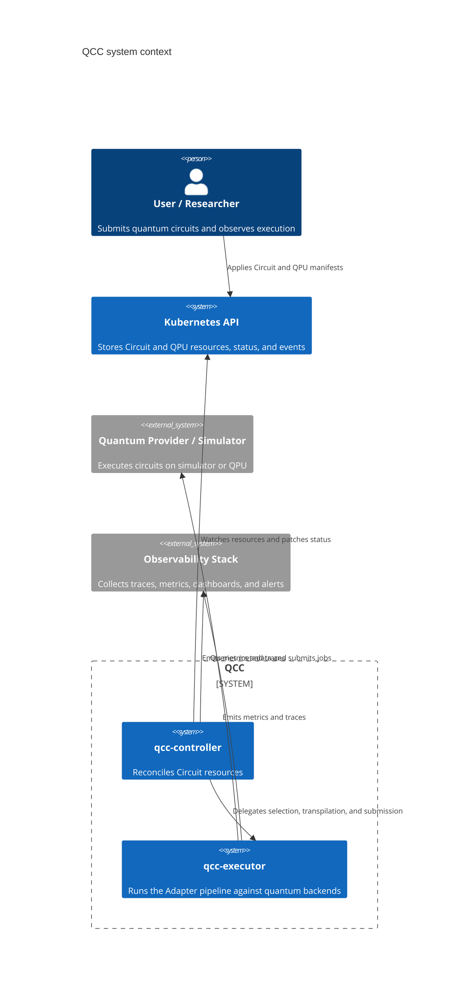
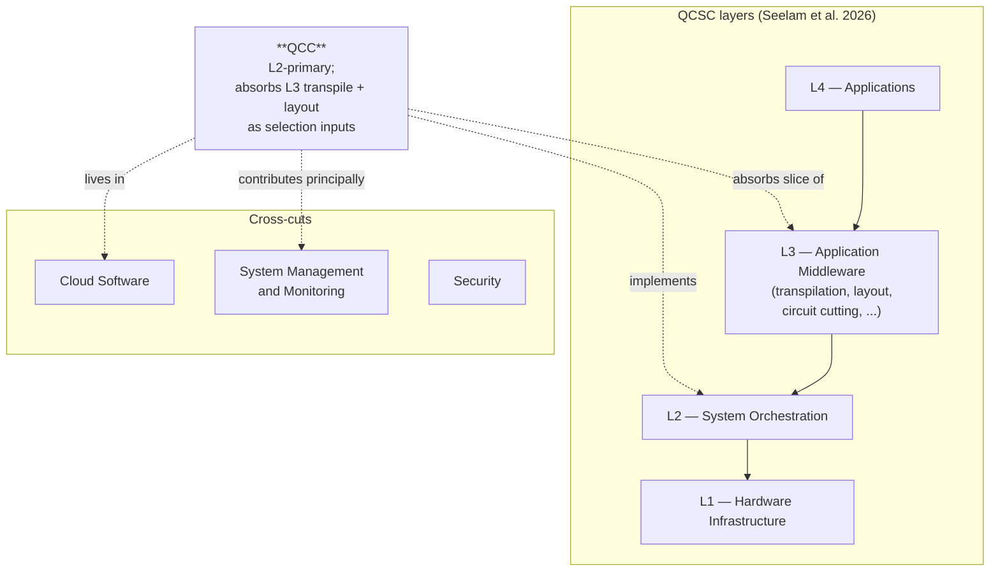
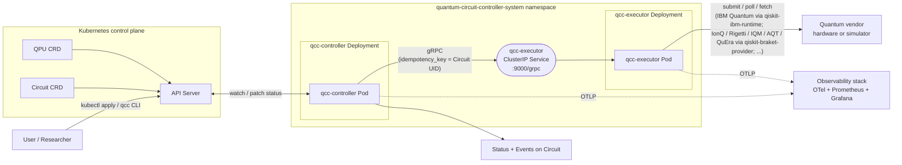
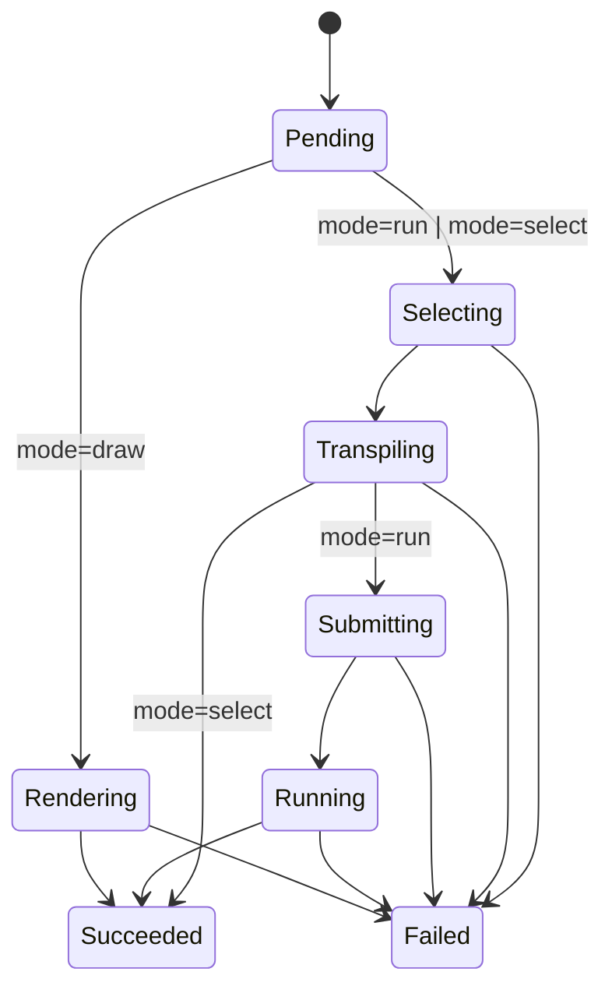
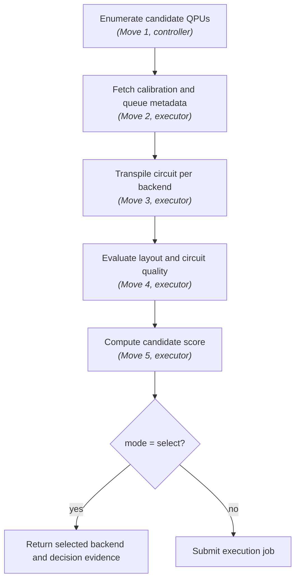

# Quantum Circuit Controller (QCC) System Design

**Status:** draft engineering design source of truth  
**Scope:** MSc thesis prototype, not production platform specification  
**Primary thesis consumer:** `Chapters/06-Architecture.tex`  
**Supporting consumers:** `Chapters/07-Implementation.tex`, `Chapters/08-Discussion.tex`

## 1. Purpose

Quantum Circuit Controller (QCC) is a cloud-native control-plane prototype for quantum circuit execution. It investigates how orchestration, scheduling, and observability patterns from modern distributed systems can be applied to the interface between classical infrastructure and quantum processing units (QPUs).

QCC models quantum circuits and quantum execution backends as Kubernetes resources. A reconciliation controller coordinates the lifecycle of circuit execution, while backend-specific quantum operations are delegated to a dedicated Executor service. The controller (Go) and executor (Python) run as separate Kubernetes `Deployment`s in the same namespace and communicate over a ClusterIP gRPC service.

The system does not aim to provide a complete quantum cloud platform. It is a directional architecture and proof-of-concept for evaluating declarative circuit submission, calibration-aware backend selection, and observable quantum--classical execution workflows.

## 2. Design posture

QCC should be engineered as if it could evolve into a production control plane, but evaluated as an MSc prototype. This distinction is important.

The design should therefore:

- use explicit system boundaries;
- expose a small and stable resource model;
- keep orchestration logic separate from quantum SDK logic;
- make operational state visible through Kubernetes status, events, metrics, and traces;
- avoid claims of optimal scheduling, production readiness, or multi-provider completeness.

## 3. Non-goals

QCC does not attempt to:

- introduce a new quantum algorithm;
- replace Qiskit, Cirq, PennyLane, CUDA Quantum, or other quantum SDKs;
- implement an optimal QPU scheduler;
- provide a full multi-tenant quantum cloud platform;
- solve quantum error correction;
- provide production-grade high availability, security hardening, or tenant isolation;
- act as a general-purpose Kubernetes scheduler extension;
- prove quantum advantage.

The scope is orchestration, execution lifecycle management, backend selection, and observability across the quantum--classical interface.

## 4. System context

QCC sits between a user-facing circuit submission workflow and one or more quantum execution backends. The Kubernetes API is the durable control-plane boundary. The quantum provider remains outside the system boundary.

### 4.1 External boundaries



### 4.2 Position in the QCSC reference architecture

QCC is positioned within the Quantum Cloud Software Continuum (QCSC) reference architecture proposed by Seelam et al. (2026):

- **Layer placement.** QCC sits primarily at QCSC Layer 2 (System Orchestration) and absorbs a deliberate slice of Layer 3 (Application Middleware) into its boundary. The executor performs L2 functions — candidate enumeration, calibration-metadata fetch, scoring, submission, lifecycle management — and also performs the L3 functions whose outputs are *inputs* to L2 scheduling: per-candidate transpilation (Qiskit transpiler) and layout evaluation (mapomatic). The rest of L3 (circuit cutting, multi-programming, error mitigation, domain-level orchestration) and all of L4 (Applications) are outside the QCC boundary; the Ch7 VQE demonstrator is *an application of* QCC, not a layer of it.
- **Why L2 + slice of L3, not pure L2.** Calibration-aware selection (Ch5 §5.8 R5) requires the transpiled-circuit shape — depth, two-qubit gate count, layout fidelity against live calibration — as a scoring input. Deferring transpilation to after selection would remove the signal that calibration-aware selection depends on. The HPC instantiation Seelam et al. describe (QRMI + SPANK + Qiskit Runtime) keeps L2 and L3 separate because it optimises for resource allocation *given a chosen backend*; QCC optimises *across backends* given calibration signals, and that target forces the L2/L3 absorption.
- **Phase placement.** QCC stays in QCSC Phase 1 (loose spatial and temporal coupling, quantum consumed as a cloud co-processor). Phases 2 and 3 (tight coupling, co-designed quantum--HPC platforms) are explicit non-goals.
- **Cross-cut contribution.** QCC contributes principally at the System Management and Monitoring cross-cut, where the Kubernetes-based status surface and Prometheus telemetry land. It also lives in the Cloud Software cross-cut by virtue of CNCF operator-pattern packaging.



This positioning is what makes QCC a thesis contribution rather than a re-implementation: the L2 cloud-native fork (with selection-relevant L3 absorbed) is the architectural shape the literature review identifies as missing, and the SMM cross-cut is where the K8s-native observability proposal lands — Prometheus metrics in a documented `qcc.*` vocabulary, K8s CRD lifecycle as the per-instance audit trail, and a cross-boundary identifier convention closing the live-correlation requirement (see `QCC-Observability.md`).

## 5. Requirements

The requirements are directional design requirements, not production acceptance criteria. They define the minimum system properties needed to evaluate whether cloud-native orchestration patterns can improve the quantum--classical execution interface.

### R1. Declarative circuit submission

A quantum circuit should be expressible as a Kubernetes resource. The submitted resource should contain enough information for the controller to select a backend, execute or dry-run the circuit, and expose execution state.

**Design consequence:** introduce a namespace-scoped `Circuit` custom resource.

### R2. Backend/QPU abstraction

Available execution targets should be represented through schedulable metadata rather than hard-coded controller configuration.

**Design consequence:** introduce a `QPU` custom resource that represents the backend profile required for selection and execution.

### R3. Calibration-aware selection

When multiple backends can execute a circuit, the system should support selection using queue, topology, calibration, and transpilation-derived signals.

**Design consequence:** the executor implements a backend-selection chain that is observable and reproducible, but not claimed as optimal.

### R4. Observable execution lifecycle

Circuit execution should expose phase, status, failure reason, timing, metrics, and operational events, with a stable identifier linking the QCC view of a Circuit to the provider's view of the underlying job.

**Design consequence:** use Kubernetes conditions/events, Prometheus-compatible metrics in a documented `qcc.*` vocabulary, and a cross-boundary identifier convention (Circuit's K8s UID stamped onto IBM `runtime_options.tags` for bidirectional lookup).  See `QCC-Observability.md` for the locked design.

### R5. Separation of orchestration and quantum logic

Kubernetes reconciliation should remain separate from vendor-specific quantum operations.

**Design consequence:** keep the controller in Go/controller-runtime and delegate Qiskit/provider logic to a Python executor service running as its own `Deployment`.

### Mapping to thesis-level requirements

The five design requirements above are **operational** — they describe what the system must do. They differ from, and collectively satisfy, the five **thesis-level** requirements derived from the literature review in Ch5 §5.8, which describe what existing systems lack.

| Design requirement | Satisfies thesis requirement(s) (Ch5 §5.8) |
|---|---|
| R1 Declarative circuit submission | Thesis R1 (production deployment patterns — declarative interface to a quantum workload) |
| R2 Backend/QPU abstraction | Thesis R3 (vendor-neutrality as a property of the interface), Thesis R5 (calibration-aware selection — by representing backends as schedulable resources with calibration metadata) |
| R3 Calibration-aware selection | Thesis R5 (calibration-aware backend selection across heterogeneous time-varying QPUs) |
| R4 Observable execution lifecycle | Thesis R2 (open-standards observability at platform-operational scope), Thesis R4 (live cross-layer correlation) |
| R5 Separation of orchestration and quantum logic | Thesis R3 (vendor-neutrality realised by isolating vendor SDK to the executor adapter) |

The two sets are not redundant. Thesis R1–R5 are the *inputs* to the architecture (what the literature shows is missing); design R1–R5 are the architecture's *outputs* (what QCC delivers). Both are needed: the thesis requirements justify why this design exists, and the design requirements justify which parts of the system carry the load.

## 6. Architecture overview

QCC consists of four logical parts:

1. `Circuit` API: declarative circuit execution request and status.
2. `QPU` API: backend profile used by the controller and executor.
3. **qcc-controller**: Kubernetes reconciler (Go / controller-runtime) that drives lifecycle state. Runs as its own `Deployment`.
4. **qcc-executor**: Python service that performs source conversion, ASCII rendering, selection, transpilation, provider interaction, and result retrieval behind an internal `Adapter` ABC. Runs as its own `Deployment` and is reached over a ClusterIP `Service`.

The split between controller and executor `Deployment`s — rather than a single Pod with two containers — is a deliberate consequence of R5 (separation of orchestration and quantum logic): the executor's Qiskit/Aer footprint is large and Python-heavy (≈1 GiB image, requires multi-worker concurrency for parallel circuits) while the controller is a small Go binary that should scale on reconciliation pressure, not vendor SDK weight. Separate `Deployment`s let each scale independently, and the controller→executor wire becomes a clean network boundary instead of localhost-loopback in a co-located pair.



The CLI (`qcc`) talks only to the Kubernetes API; it never opens a connection to the executor. Even `qcc draw`, which appears to be an imperative "render this for me" call, is implemented as a short-lived `Circuit` resource with `mode=draw` — the controller dials `DrawCircuit` on the executor, writes the rendered ASCII into a sibling `ConfigMap`, and points `status.drawingRef` at it (see `QCC-API.md` §3.7 for the etcd-bounded rationale). This keeps the K8s API as the single trust boundary the CLI relies on.

The internal executor selection chain (enumerate → calibrate → transpile → layout → score → submit) is shown in §9.

### 6.1 How iterative workloads compose

The `Circuit` resource represents a single execution. Iterative workloads (e.g., VQE, QAOA, parameter sweeps) are realised by an external workflow process — typically a Kubernetes `Job` running a user script, or a Jupyter notebook with cluster access — that creates one `Circuit` resource per iteration, watches its status to terminal, reads `status.results`, computes the next parameter set, and creates the next `Circuit`. QCC itself does not provide a built-in workflow controller. A higher-level `Workflow` (or `CircuitBatch`) custom resource that captures iteration semantics is named as future work in §15.

This composition is intentional: keeping QCC at the single-circuit granularity preserves clean reconciliation semantics, while higher-level orchestration can be evolved independently using either user-side scripts or, in follow-on work, a dedicated workflow controller layered on top.

### 6.2 Executor gRPC API

The controller calls the executor over an in-cluster gRPC channel — a ClusterIP `Service` in the same namespace (`qcc-executor.<ns>.svc:9000`), reached by the controller via the `QCC_EXECUTOR_ADDR` env var. The proto package is `qcc.executor.v1`. Three families of RPC coexist:

**Synchronous execution — `RunCircuit`**:
```protobuf
rpc RunCircuit(RunCircuitRequest) returns (RunCircuitResponse);
```
Transpile, submit, and wait for the result in a single RPC. Returns `TASK_STATUS_DONE` on success or `TASK_STATUS_FAILED` with a Circuit condition reason. Suits in-process simulators (Aer) and short-running hardware jobs where blocking within one reconciliation is acceptable.

**Asynchronous execution — `SubmitTask` / `WatchTask` / `FetchTaskResult`**:
```protobuf
rpc SubmitTask(SubmitTaskRequest) returns (SubmitTaskResponse);
rpc WatchTask(WatchTaskRequest) returns (stream WatchTaskResponse);
rpc FetchTaskResult(FetchTaskResultRequest) returns (FetchTaskResultResponse);
```
These task-lifecycle RPCs align directly with Qiskit's `qiskit.providers.JobV1` contract (`backend.run() → Job`; `job.job_id() / job.status() / job.result()`), which every Qiskit provider plugin (`qiskit-ibm-runtime`, `qiskit-braket-provider`, `qiskit-ionq`, …) implements uniformly. Real-hardware adapters that wrap a Qiskit provider therefore satisfy the async contract without translation. The same RPCs also map onto QRMI's `task_start` / `task_status` / `task_result` (Bacher et al., 2025) — relevant for future-work alternative substrates (Ch9; see `QCC-Design-State.md` §7d).

**Pure-Python utilities — `ConvertSource` / `DrawCircuit`**:
```protobuf
rpc ConvertSource(ConvertSourceRequest) returns (ConvertSourceResponse);
rpc DrawCircuit(DrawCircuitRequest) returns (DrawCircuitResponse);

message CircuitSource {
  string format = 1;  // "openqasm3" | "qiskit"
  string body   = 2;
}
```
Neither call talks to a quantum backend — they are stateless adapters over the executor's `qiskit_io` module:
- `ConvertSource` translates a `qiskit`-format body to OpenQASM 3 by exec'ing the Python source in a fresh module namespace, locating the first `QuantumCircuit` at module scope, decomposing high-level library instructions (e.g. `QFT`, custom `to_gate()` constructions used in Shor's / Grover's / QPE), and dumping the result via `qiskit.qasm3.dumps`. Decomposition is required because Qiskit's QASM 3 exporter currently rejects "non-unitary subroutine calls"; without it, every Shor/Grover/QPE submission with `source.format=qiskit` would fail at the export step. The controller's executor client calls this transparently whenever `Circuit.spec.source.format=qiskit`, so the reconciler stays format-agnostic.
- `DrawCircuit` accepts either format, parses to a `QuantumCircuit`, and returns ASCII text (Qiskit's text drawer). It backs `Circuit.spec.mode=draw`.

Conversion or rendering failures are returned in the response's `status` + `error_reason` / `error_message` fields (e.g., `RenderingFailed`, `SourceConversionFailed`), so they map onto the controller's existing `TaskError` dispatch path without special-casing.

**Shared types**:
- `TaskSpec` carries `idempotency_key`, `qasm`, `shots`, `target`, optional `optimization_level` and `timeout_seconds`, and the Tier-2 passthrough carriers `transpile_options` + `execute_options` (both `google.protobuf.Struct`).  Tier-2 keys flow from `Circuit.spec.transpile` / `Circuit.spec.execute` through the controller untouched and land as `**kwargs` on `qiskit.compiler.transpile()` / `AerSimulator.run()` / `SamplerV2.run()`; see `QCC-Design-State.md` §7a (Composition Principle).  Both sync and async execution requests embed a `TaskSpec` so the adapter contract is uniform.  `ConvertSource` and `DrawCircuit` instead take a `CircuitSource` because they operate on the source body, not on a transpilable task.
- `TaskStatus` enum: `PENDING / RUNNING / DONE / FAILED / CANCELLED`. `RunCircuit`, `ConvertSource`, and `DrawCircuit` return only `DONE` or `FAILED` (all three wait to terminal); the async path can return any state through `WatchTask`.

### 6.3 Internal Adapter contract

Inside the executor, vendor-specific logic lives behind an `Adapter` Abstract Base Class (`qcc_executor/adapters/base.py`):

```python
class Adapter(ABC):
    def transpile(self, qasm: str, target, options: Mapping | None = None) -> TranspiledCircuit: ...
    def submit(self, circuit: TranspiledCircuit, shots: int, options: Mapping | None = None, circuit_uid: str = "") -> JobHandle: ...
    def poll(self, handle: JobHandle) -> JobStatus: ...
    def fetch_result(self, handle: JobHandle) -> FetchResult: ...
    def inspect(self) -> BackendMetadata: ...
    def schedule(self, qasm: str, target) -> CircuitSchedule: ...
```

The `options` arguments on `transpile` / `submit` are the Tier-2 passthrough dicts (§7a) — forwarded verbatim as `**kwargs` to the upstream Qiskit function.  `inspect` backs `ProbeBackend` (calibration metadata for QPU status); `schedule` backs `ScheduleCircuit` (per-instruction dt-cycle timeline for `mode=schedule`).

`submit` takes an optional `circuit_uid` that the servicer extracts from `TaskSpec.idempotency_key` and forwards to the adapter for cross-boundary identifier linkage — the `IBMAdapter` stamps it onto `runtime_options.tags` as `qcc.circuit.uid:<uid>` so an IBM Quantum Console user can resolve a job back to its owning QCC Circuit.  Adapters that submit to substrates without a tag surface (e.g. Aer) treat the UID as informational.

`fetch_result` returns a `FetchResult` dataclass (`counts: Mapping[str, int]`, `usage_seconds: float`) rather than the bare counts map, so substrate-reported billable compute time rides along on the same RPC.  The `IBMAdapter` populates `usage_seconds` via `RuntimeJobV2.usage()` (defensively — falls back to 0.0 on older SDK shapes); the `AerAdapter` returns 0.0 because local CPU compute has no QPU-time concept.  The value flows through `RunCircuitResponse.usage_seconds` / `FetchTaskResultResponse.usage_seconds` to the controller, which persists it on `Circuit.status.usageSeconds` and emits the `qcc_circuit_usage_seconds` metric only when > 0 (so simulator runs produce no series).

A registry in `adapters/__init__.py` maps provider strings to implementations:

| Provider | Adapter | Status |
|---|---|---|
| `""` / `local` | `AerAdapter` | in-process Qiskit Aer simulator + `fake_*` snapshots via `FakeProviderForBackendV2` + method-pinned variants (`aer_statevector`, `aer_mps`, …) via the resolver — no credentials — **shipped M1** |
| `ibm` | `IBMAdapter` | wraps `qiskit-ibm-runtime` (`QiskitRuntimeService` + `SamplerV2`); reaches IBM Quantum hardware + IBM cloud simulators; credentials via `QISKIT_IBM_TOKEN` from a K8s Secret (channel defaults to `ibm_quantum_platform`, overridable via `QISKIT_IBM_CHANNEL`) — **shipped M3 (2026-05-16)** |
| `ibm-via-braket` *(optional, future)* | generic `QiskitProviderAdapter` | wraps any `qiskit.providers.Provider`; reaches IonQ + Rigetti + IQM + AQT + QuEra through `qiskit-braket-provider` aggregator; AWS credentials via Secret — **planned post-M3** |

Vendor coverage comes from the Qiskit provider ecosystem (Qiskit-internal `qiskit.providers.Backend` abstraction), not from per-vendor adapter code in QCC. Adding a Qiskit-provider-compatible vendor is one new branch in an existing adapter's resolver + the corresponding pip dependency on the executor image. Adding a non-Qiskit-ecosystem substrate (e.g. QRMI for Pasqal-direct, CUDA-Q for NVIDIA-reach) is one new `adapters/<name>.py` module — Ch9 future-work; see `QCC-Design-State.md` §7d for the QEI direction that formalizes this seam as a public interface.

## 7. Component responsibilities

| Component | Responsibility | Explicitly not responsible for |
|---|---|---|
| `Circuit` CRD | Represents desired circuit execution and observed result state. | Provider SDK behavior, long-term result storage, domain algorithm semantics. |
| `QPU` CRD | Represents backend metadata relevant to selection and execution. | Full physical hardware model, real-time calibration authority. |
| qcc-controller | Watches `Circuit` resources, drives phase transitions, calls the executor, patches status, emits Kubernetes events and telemetry. | Quantum SDK calls, provider-specific transpilation, optimal scheduling. |
| qcc-executor | Performs candidate evaluation, calibration lookup, transpilation, layout evaluation, scoring, vendor submission, and result retrieval. Vendor interaction is encapsulated behind the internal `Adapter` ABC (§6.3); `AerAdapter` (M1) and `IBMAdapter` (M3, 2026-05-16) ship today for simulator and real-hardware reach via the Qiskit provider ecosystem. | Kubernetes reconciliation, CRD ownership, cluster policy. |
| Observability stack | Collects traces, metrics, logs/events, and supports operational inspection. | Defining domain-level algorithm quality or proving quantum advantage. |

### 7.1 Executor concurrency contract

The executor is a single-process gRPC service. Concurrent submission requests from the controller are handled by a configurable worker pool (default: 8 workers). Calibration metadata is cached per-`QPU` with a configurable TTL (default: 60 seconds) to bound the rate of external metadata fetches under load. The MSc prototype does not implement per-`QPU` submission serialisation: concurrent submissions targeting the same backend are delegated to the vendor's queue, which is the appropriate authority for QPU-level concurrency. Per-submission observability is via the controller's metrics surface (controller-runtime's gRPC client-side instrumentation, plus the `qcc_circuits_total` and `qcc_circuit_phase_duration_seconds` series); the executor itself is a stateless RPC worker.

## 8. Execution lifecycle

The external lifecycle should remain simple. This is the lifecycle users and thesis readers should see. `Circuit.spec.mode` picks which branch of the diagram applies (see `QCC-API.md` §3.6 for the mode/source matrix).



The external lifecycle intentionally hides internal selection detail. Internally, backend selection and transpilation are coupled, because the selected backend affects the transpiled circuit, physical layout, depth, gate counts, and expected execution quality. The `mode=select` terminal transition (shown above) is the run lifecycle truncated before submission; `mode=draw` is a parallel short path that calls only the executor's `DrawCircuit` RPC and never touches selection or transpilation.

## 9. Backend-selection model

QCC uses a five-step selection chain.  Move 1 is **controller-side** because it operates on Kubernetes resources (`List` of `QPU` CRDs); Moves 2–5 are **executor-side** because they require Qiskit/SDK access (calibration RPCs, transpiler, layout evaluation).  The controller hands the filtered candidate list to the executor; the executor returns the chosen QPU with decision evidence.  This split follows §7's component-responsibility table directly.



**M1 status**: Move 1 is implemented (`internal/controller/circuit_controller.go::selectBackend` lists QPUs, filters by `BackendSelector`, fails with `NoEligibleBackend` if zero match).  Moves 2–5 are M2 — the M1 controller picks the first eligible candidate and passes it to the executor as a single `BackendTarget`.  When M2 lands, the gRPC contract extends to carry the filtered candidate list and the executor runs Moves 2–5 over it.

The composite score is not proposed as an optimal quantum scheduling algorithm. It is an explicit and observable policy for combining backend suitability signals into a single selection decision.

Candidate scoring may include:

- hard constraints: minimum qubits, simulator/hardware type, provider, region, allowed backend list;
- circuit-shape signals: transpiled depth, two-qubit gate count, layout quality;
- hardware signals: calibration age, gate error, readout error, coupling constraints;
- operational signals: queue depth, estimated wait, provider availability;
- user intent: `mode=select`, preferred backend, maximum cost or execution constraints if supported later.

For the thesis prototype, the important property is not optimality. The important property is that the decision is explainable, reproducible from telemetry, and connected to quantum execution constraints.

## 10. `Circuit.spec.mode` — verb modes

`Circuit.spec.mode` is a verb-style enum (`run` \| `select` \| `draw` \| `schedule`) that names the slice of the lifecycle the controller runs.  Four modes are first-class design features.

### 10.1 `mode: run`

End-to-end execution. The controller drives the full lifecycle: validate → select → transpile → submit → wait → record `status.results`. This is the default and the path live QPU/simulator workloads take.

### 10.2 `mode: select`

Selection without execution. Activated by setting `Circuit.spec.mode = select`. Allows QCC to evaluate backend-selection behaviour without consuming QPU execution time.

In `mode: select`, QCC should:

- validate the circuit request;
- enumerate candidate backends;
- run calibration-aware selection;
- transpile where required for candidate evaluation;
- record the selected backend and candidate scores;
- stop before provider job submission.

This is useful for thesis evaluation because it provides repeatable experiments around scheduling direction, backend metadata, and observability without depending on live QPU availability.

### 10.3 `mode: draw`

ASCII rendering of the circuit, served by the executor's `DrawCircuit` RPC (§6.2). The controller skips selection and transpilation entirely: `Pending → Rendering → Succeeded`, with the rendering written to a sibling `ConfigMap` (owned by the Circuit so it cascade-deletes) and `status.drawingRef.name` pointing at it — see `QCC-API.md` §3.7. Useful for the `qcc draw <file>` CLI subcommand, which creates an ephemeral `Circuit` resource, watches for `status.drawingRef`, fetches the ConfigMap, prints the drawing, and deletes the resource (unless `--keep` is set). Because the executor's `qiskit_io` loader handles both `openqasm3` and `qiskit` source formats, `mode: draw` is the most permissive mode on the source-format axis.

### 10.4 `mode: schedule`

Per-instruction timeline analysis without execution.  Served by the executor's `ScheduleCircuit` RPC (§6.2): the adapter re-transpiles with `scheduling_method='asap'` and walks `op_start_times` + the backend's Target durations to produce a structured timeline in **dt cycles** (the backend's control-electronics sample period).  The controller drives `Pending → Scheduling → Succeeded`, with the JSON-encoded timeline written to a sibling `ConfigMap` and `status.scheduleRef.name` pointing at it (data key `schedule.json`; see `QCC-API.md` §3.7).  No shots consumed, no remote job created — but unlike `mode: draw`, scheduling *is* backend-specific (durations come from the backend's Target; physical-qubit assignment depends on layout/routing).

Gives readers the µs-scale envelope of a run without executing — the Ch1 "9466 dt ≈ 1.89 µs" anchor.  Real IBM backends and `fake_*` snapshots support it; generic Aer doesn't (no Target durations) and the adapter surfaces that as a terminal `SchedulingUnsupported` failure.

## 11. Observability model

QCC observability should answer operational questions, not only expose raw data.

| Question | Signal |
|---|---|
| What phase is the circuit in? | `Circuit.status.phase`, conditions, Kubernetes events. |
| Why was a backend selected? | `Circuit.status.selectionSummary` + K8s Events (per-instance); `qcc_qpu_*` metrics (substrate state at time of selection). |
| Where did time go (this Circuit)? | `qcc_circuit_phase_duration_seconds_observed{circuit=…}` (persistent gauge derived from `conditions[].lastTransitionTime`) — or equivalently `kubectl describe circuit` for the raw conditions. |
| Where did time go (across many Circuits)? | `qcc_circuit_phase_duration_seconds` histogram in Prometheus (synchronous; ideal for `histogram_quantile` fleet percentiles). |
| Of the time spent in `Running`, how much was actual QPU compute? | `qcc_circuit_usage_seconds` (on-QPU) vs `qcc_circuit_phase_duration_seconds_observed{phase="Running"}` (wall-clock).  Their difference is the orchestration-overhead window — the Ch7 figure that quantifies the cost of going through QCC vs talking to the substrate directly. |
| Did submission duplicate after restart? | Idempotency key, `providerJobId` in status, reconcile events. |
| Which layer failed? | Condition reason, error counter labels (`qcc_circuits_total{phase="Failed", reason=...}`). |
| Is backend selection stable across calibration changes? | Repeated `mode=select` runs; same-backend rate; `qcc_qpu_last_calibration_timestamp_seconds`. |
| How do runs of the same algorithm compare? | `qcc.io/algorithm` + `qcc.io/algorithm-version` labels on the Circuit propagate to metric labels; PromQL groups by `(algorithm, algorithm_version)`.  Reserved label convention in `QCC-API.md` §5.3. |

The canonical observability design — locked metric inventory, idiomatic principles, cross-boundary identifier linkage, dashboards, query patterns — lives in `QCC-Observability.md`.  This thesis prototype's observability stack is **Prometheus metrics + K8s status/events/CRDs + cross-boundary identifier linkage via IBM `runtime_options.tags`**, intentionally without OpenTelemetry distributed tracing infrastructure (decision rationale: `QCC-Design-State.md` 2026-05-16 night entry).

## 12. Failure model

QCC should treat failure as part of the lifecycle, not as an exceptional afterthought.

| Failure | Expected behavior |
|---|---|
| Invalid circuit schema | Reject at API validation where possible; otherwise fail with clear condition. |
| No eligible backend | Move to `Failed` with reason `NoEligibleBackend`; include candidate evidence if available. |
| Calibration fetch failure | Retry within bounded policy; fail with provider/metadata reason if unavailable. |
| Transpilation failure | Fail the candidate or circuit depending on whether other candidates remain. |
| Provider submission failure | Retry only if idempotency is preserved; otherwise fail safely. |
| Controller restart | Resume from status; do not duplicate provider submission. |
| Executor unavailable | Requeue with backoff; expose degraded condition/event. |
| Provider job timeout | Mark failed or timed out according to configured execution deadline. |

The key reliability property is **non-duplicating submission under controller restart**. A provider job ID or equivalent submission token must be persisted before the controller advances past the submission boundary. The mechanics — the order of provider job ID persistence relative to phase transition — are illustrated in `QCC-API.md` §6 (idempotency and submission boundary). If provider-side idempotency keys are unavailable, this limitation must be stated explicitly in Chapter 8.

### 12.1 Executor pod failure

Controller and executor run as separate `Deployment`s reached via a ClusterIP `Service`. If the executor pod exits non-zero, Kubernetes restarts it independently of the controller; the controller's gRPC `ClientConn` is lazy and reconnects on the next reconcile, with transient RPC failures surfaced as `ctrl.Result{RequeueAfter: 10s}` rather than `Failed` (terminal `TaskError`s are distinguished by reason — see `internal/controller/circuit_controller.go`). On controller pod restart, reconciliation resumes from each Circuit's persisted status, including any `providerJobId` recorded before the failure. For the async path, in-flight provider jobs continue at the vendor side and are picked up by the next reconcile loop via `WatchTask` against the persisted `providerJobId`. For in-process simulator adapters (Aer) no in-flight state exists across restart; the executor-side `idempotency_key` cache short-circuits a re-issued `RunCircuit` to the cached result if available.

Because the two pods are independent, an executor crash does not cycle the controller (and vice versa) — a property that the previous single-pod sidecar layout did not provide. The trade-off is that the controller→executor wire is now a network hop subject to namespace-level NetworkPolicy and Service DNS, rather than localhost.

## 13. Trust boundaries

The main trust boundaries are:

1. User to Kubernetes API: authenticated Kubernetes submission.
2. Controller to Kubernetes API: RBAC-scoped controller permissions.
3. Controller to executor: intra-namespace ClusterIP gRPC in the prototype (cleartext, no mTLS).
4. Executor to provider: provider credentials and external API calls.
5. QCC to observability stack: telemetry export boundary.

For the MSc prototype, controller and executor communicate over a ClusterIP `Service` in the same namespace; the wire is cleartext and unauthenticated, relying on namespace isolation and (optionally) Kubernetes `NetworkPolicy` to constrain who can dial port 9000. mTLS between controller and executor, multi-tenant credential isolation, admission control, policy enforcement, and credential rotation pipelines (e.g., Vault-issued workload identity, projected `ServiceAccountToken` volumes bound to a workload-identity provider) belong to future work.

## 14. Constraints and assumptions

- Kubernetes is used as the orchestration substrate.
- OpenQASM 3 is the canonical circuit interchange format at the QCC API boundary; `qiskit`-format sources are accepted as a convenience and converted to OpenQASM 3 server-side by the executor's `ConvertSource` RPC. The Go controller and CLI never depend on a Python SDK.
- The prototype targets IBM Quantum via `IBMAdapter` (wrapping `qiskit-ibm-runtime`'s `QiskitRuntimeService` + `SamplerV2`), shipped M3 2026-05-16.  Broader vendor reach through a generic `QiskitProviderAdapter` (wrapping any `qiskit.providers.Provider` — e.g. `qiskit-braket-provider` for IonQ + Rigetti + IQM + AQT + QuEra via AWS Braket aggregator) is planned post-M3.  Both paths use the Qiskit provider ecosystem's `JobV1` async contract, so the controller's async lifecycle is uniform across them.
- `AerAdapter` (Qiskit Aer, in-process; plus `fake_*` snapshots via `FakeProviderForBackendV2`) is shipped today for credential-free evaluation and forms the basis for the thesis's M1 and M1.5 evidence.
- The community QRMI library (Bacher et al., 2025) and NVIDIA CUDA-Q are recognised alternative substrates and are documented as Ch9 future-work in `QCC-Design-State.md` §7d (QEI direction) — they are not on the thesis-implementation critical path.
- The thesis evaluation can use `mode=select` to avoid unnecessary QPU execution.
- Metrics should be low-cardinality and suitable for Prometheus systems; per-instance correlation is satisfied by the cross-boundary identifier convention (per `QCC-Observability.md` §6) without requiring distributed tracing infrastructure.

## 15. Limitations

QCC demonstrates architectural direction, not production completeness.

Known limitations:

- the prototype's vendor coverage is what the Qiskit provider ecosystem provides via shipped adapters — IBM Quantum directly through `qiskit-ibm-runtime`, and IonQ + Rigetti + IQM + AQT + QuEra through `qiskit-braket-provider` if the optional Braket aggregator is enabled. Other vendors (Quantinuum, Pasqal-direct, NVIDIA CUDA-Q-reached vendors) arrive through additional Qiskit-provider plugins or alternative-substrate adapters (Ch9 future-work; QEI direction in `QCC-Design-State.md` §7d) rather than per-vendor code in QCC core;
- scoring policy is heuristic and experimental;
- QPU metadata may be stale, incomplete, or provider-specific;
- real QPU queue behavior may not be fully controllable;
- result persistence can remain minimal;
- security is scoped to basic Kubernetes and provider credential handling;
- multi-tenancy and quotas are out of scope;
- HPC scheduler integration is out of scope for the first prototype.

**Qiskit provider ecosystem integration.** QCC's vendor reach in the thesis implementation comes from the **Qiskit provider ecosystem** — `qiskit.providers.Backend` is the abstraction Qiskit itself ships, and every vendor plugin (`qiskit-ibm-runtime`, `qiskit-braket-provider`, `qiskit-ionq`, `qiskit-iqm`, `qiskit-aqt-provider`, …) implements the same `Provider().get_backend().run() → JobV1` contract.  `IBMAdapter` (§6.3) wraps `qiskit-ibm-runtime` for direct IBM Quantum reach — shipped M3 2026-05-16, verified end-to-end on `ibm_kingston` (Heron r2).  A generic `QiskitProviderAdapter` wrapping any `qiskit.providers.Provider` for broader vendor coverage is planned post-M3.  The async gRPC task-lifecycle path (`SubmitTask` / `WatchTask` / `FetchTaskResult`, §6.2) maps onto Qiskit's `JobV1` (`backend.run() → job_id → job.status() → job.result()`) without translation.  This positions QCC as the operator-pattern Kubernetes counterpart to the proprietary managed-quantum-cloud platforms (IBM Quantum Platform, AWS Braket, Azure Quantum) — sharing the underlying Qiskit provider abstraction, differing on the platform layer (K8s-native open-source vs. managed proprietary).

**Alternative substrates (Ch9 future-work).** The community QRMI library (Bacher et al., 2025, [arXiv:2506.10052](https://arxiv.org/abs/2506.10052)) and NVIDIA's CUDA-Q both provide alternative substrates that QCC's adapter pattern could absorb without core changes. QRMI offers a language-agnostic (Rust-core) vendor abstraction below the SDK layer, relevant when non-Python or multi-SDK reach becomes load-bearing; CUDA-Q reaches a different vendor set (Quantinuum, Pasqal-direct, ORCA, Anyon) at the cost of dropping IBM access. Both are documented as Ch9 future-work directions; see `QCC-Design-State.md` §7d for the QEI direction that would formalize the adapter pattern as a public Kubernetes-style plugin interface, enabling third-party plugins for QRMI, CUDA-Q, and future substrates without modifying QCC core.

**Named future work.** A higher-level `Workflow` (or `CircuitBatch`) custom resource that captures iteration semantics for VQE/QAOA/parameter-sweep style workloads, sitting on top of `Circuit`. The composition story is in §6.1; the work is left for a follow-on operator layered above QCC.

## 16. Mapping to thesis chapters

| Design material | Thesis destination |
|---|---|
| Purpose, non-goals, context | Chapter 6 introduction and scope. |
| Requirements R1--R5 | Chapter 6 requirements and Chapter 7 evaluation criteria. |
| Architecture overview | Chapter 6 architecture section. |
| API model | Chapter 6 CRD design, Chapter 7 implementation details. |
| Executor gRPC API (§6.2) | Chapter 6 component-interaction section. |
| Adapter contract (§6.3) | Chapter 6 vendor-abstraction subsection; Chapter 7 implementation table. |
| Lifecycle | Chapter 6 execution model, Chapter 7 implementation/evaluation. |
| Backend selection | Chapter 6 scheduling/selection model, Chapter 7 `mode=select` experiments. |
| Observability | Chapter 6 observability architecture, Chapter 7 telemetry screenshots/results. |
| Failure model and limitations | Chapter 8 discussion and Chapter 9 future work. |
| Qiskit provider ecosystem integration | Chapter 6 vendor-neutrality argument; Chapter 7 implementation (`IBMAdapter` shipped + optional `QiskitProviderAdapter` planned post-M3). |
| QEI direction (Ch9 future-work) | Chapter 9 future-work — formalising the adapter pattern as a public Kubernetes-style plugin interface (CRI/CNI/CSI precedent); enables third-party plugins (QRMI, CUDA-Q, vendor-direct). |

## 17. Thesis-safe summary

QCC should be described in the thesis as follows:

> QCC is a cloud-native control-plane prototype for quantum circuit execution. It represents circuits and quantum backends as Kubernetes resources, reconciles circuit execution through an operator-based lifecycle, delegates backend-specific quantum logic to a separately-deployed Python executor service reached over an in-cluster gRPC `Service`, and exposes the resulting quantum--classical execution path through a Kubernetes-native observability surface: CRD status and conditions as the durable per-instance audit trail, Kubernetes events as the lifecycle narrative, Prometheus-compatible metrics in a documented `qcc.*` vocabulary for aggregate analysis, and a cross-boundary identifier convention (the Circuit's K8s UID stamped onto provider-side job tags) for bidirectional correlation between the K8s control plane and the quantum vendor's job system. The design does not introduce a new quantum algorithm; it investigates how operational patterns from cloud-native systems and site reliability engineering can be applied to the interface between classical infrastructure and quantum processing units.
>
> Positioned within the Quantum Cloud Software Continuum reference architecture of Seelam et al. (2026), QCC occupies QCSC Layer 2 (System Orchestration) and absorbs a slice of Layer 3 (Application Middleware) needed for calibration-aware backend selection. QCC is the open-source Kubernetes-native counterpart to the managed proprietary quantum cloud platforms (IBM Quantum Platform, AWS Braket, Azure Quantum) — sharing the underlying Qiskit `qiskit.providers.Backend` abstraction for vendor reach, differing in the platform layer (K8s-native open-source vs. managed proprietary). The HPC counterpart of QCC is the Slurm SPANK plug-in with QRMI (Bacher et al., 2025), which provides the same vendor-abstraction role for HPC scheduling environments; QCC and that plug-in target different orchestrator substrates (Kubernetes vs. Slurm) and produce different observability artifacts as a consequence — QCC contributes the K8s-native CRD lifecycle as the per-instance audit primitive and the cross-boundary identifier convention closing the live-correlation requirement, neither of which the HPC instantiation produces (it ships Prometheus-based metrics but no CRD-shaped per-job lifecycle artifact, no cross-boundary identifier stamping). QCC additionally contributes calibration-aware backend selection. The thesis demonstrates the architecture on the Qiskit provider ecosystem because that is the largest current quantum-SDK user community; the substrate-substitution argument (Chapter 6 §6.x; Chapter 9 future-work) shows the pattern extending to non-Qiskit substrates (QRMI, NVIDIA CUDA-Q) through the same adapter-as-seam architecture.
