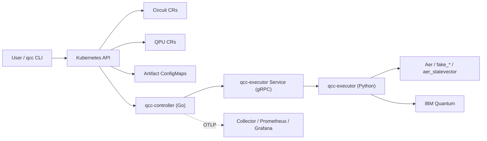

# QCC Revisited Docs

This directory is the implementation guide for the current `quantum-circuit-controller` codebase.

It is intentionally different from [`../docs/systems-design/`](../docs/systems-design/README.md):

- `docs/systems-design/` explains thesis architecture, design rationale, and research framing.
- `docs_revisited/` explains what is actually implemented, how to run it, how the pieces fit, and where the current gaps are.

Last aligned to repository state on `2026-05-21`.

## QCC In One Paragraph

QCC is a Kubernetes-based control plane for quantum-circuit execution. Users submit a `Circuit` custom resource, the Go controller reconciles its lifecycle, the Python executor performs Qiskit and provider-specific work over gRPC, and the CLI (`qcc`) uses the Kubernetes API as the only user-facing interface.

## Runtime At A Glance

## What You Can Do Today

- Submit circuits from inline OpenQASM 3 or Qiskit-Python source.
- Execute against Aer simulators, fake IBM calibration snapshots, and IBM hardware backends.
- Render ASCII drawings and backend-specific schedule timelines.
- Inspect backend metadata such as qubits, basis gates, calibration timestamps, error medians, and coherence medians.
- Compare the same source across multiple backends with `qcc run --performance-test`.
- Export controller-side `qcc_*` metrics to Prometheus/Grafana through an OTLP pipeline.

## What Is Still Incomplete

- Selection is still first-match filtering, not calibration-aware scoring.
- `allowedQPURefs` and `region` exist on the API but are not enforced yet.
- `QPU.spec.access.credentialSecretRef` exists on the API but is not wired into runtime credential loading.
- IBM QPUs are treated as optimistically available even when probing fails.
- Async hardware jobs are not restart-tolerant across executor restarts.
- Distributed tracing is scaffolded but not active.
- Executor-side telemetry is not implemented.
- Kubernetes `Event` emission is not implemented in the controller.
- No default QPUs are installed by `make deploy`; sample or custom QPUs must be applied explicitly.

## Recommended Reading Order

### If you want to run QCC quickly

1. [`quickstart.md`](./quickstart.md)
2. [`operations.md`](./operations.md)

### If you want to understand how it works

1. [`architecture.md`](./architecture.md)
2. [`api.md`](./api.md)
3. [`observability.md`](./observability.md)

### If you want a blunt feature/status map

1. [`implementation-status.md`](./implementation-status.md)

## Documents In This Directory

- [`quickstart.md`](./quickstart.md): fastest local path from clone to a working Bell-state run.
- [`architecture.md`](./architecture.md): runtime topology, controller/executor split, sync vs async execution, and lifecycle diagrams.
- [`api.md`](./api.md): `Circuit` and `QPU` resources, modes, fields, labels, conditions, artifacts, and contract gaps.
- [`observability.md`](./observability.md): metrics, dashboards, OTLP pipeline, and practical debugging flow.
- [`operations.md`](./operations.md): deploy paths, credentials, samples, CLI workflows, testing, and caveats.
- [`implementation-status.md`](./implementation-status.md): shipped vs partial vs absent features.

## Source-Of-Truth Rule

Use this directory as the operational reference. Use [`../docs/systems-design/`](../docs/systems-design/README.md) for thesis context and architectural rationale.

If they disagree, the code wins first, then `docs_revisited/`, then the thesis/design material.
