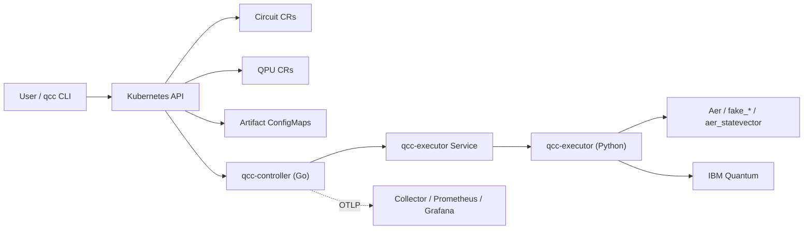
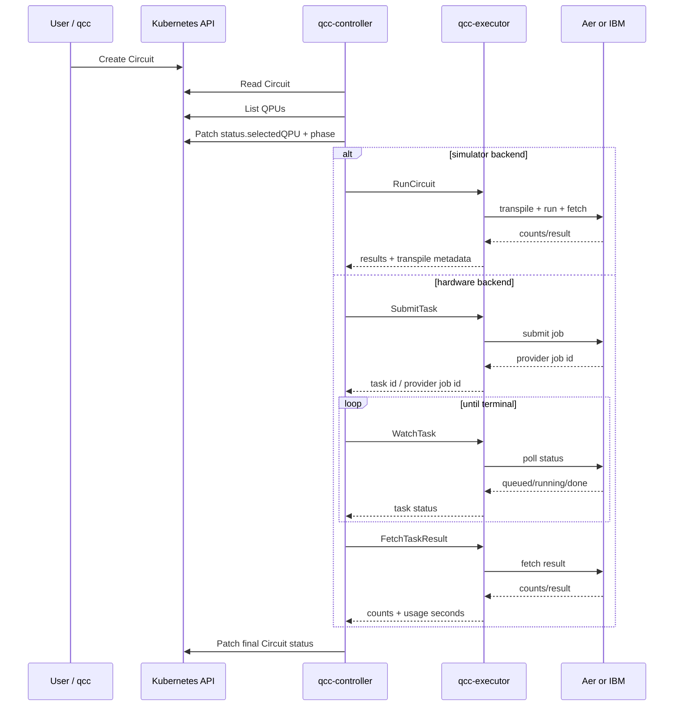

# Architecture

This document describes the runtime shape of QCC as it is implemented today.

## Design Summary

QCC uses Kubernetes as the control-plane boundary and keeps orchestration separate from quantum-provider logic.

- the controller owns CRD lifecycle, phase transitions, and status
- the executor owns Qiskit, adapters, source conversion, scheduling, and provider submission
- the CLI uses Kubernetes as the only user interface

This split is the core architectural decision in the implementation.

## Components

### 1. Kubernetes API

The Kubernetes API server is the durable control-plane boundary.

- `Circuit` is the execution request and execution-status resource
- `QPU` is the backend registry and probed-backend metadata resource
- large generated outputs are stored outside the CRs in owned `ConfigMap` artifacts

### 2. `qcc-controller`

The Go controller-manager lives under [`../cmd/qcc-controller/`](../cmd/qcc-controller).

It runs two reconcilers:

- `CircuitReconciler`: drives the `Circuit` phase machine
- `QPUReconciler`: stamps QPU availability and probes backend metadata

The controller never imports Qiskit or vendor SDKs. It delegates those concerns to the executor over gRPC.

### 3. `qcc-executor`

The Python executor lives under [`../qcc-executor/`](../qcc-executor).

It owns:

- source parsing and conversion
- ASCII drawing
- scheduled-timeline generation
- backend adapter dispatch
- transpilation
- provider submission and result retrieval

The executor is deployed as its own `Deployment` plus a ClusterIP `Service`.

### 4. `qcc` CLI

The CLI lives under [`../cmd/qcc/`](../cmd/qcc/).

It talks only to Kubernetes:

- `qcc run` creates a `Circuit`
- `qcc draw` creates a short-lived `Circuit` with `mode=draw`
- `qcc schedule` creates a short-lived `Circuit` with `mode=schedule`
- `qcc get` reads CR status and artifact `ConfigMap`s

The CLI never dials the executor directly.

### 5. Optional Observability Stack

The controller can export OTLP metrics to an OpenTelemetry Collector, then to Prometheus and Grafana.

Values and manifests for the local observability stack live in [`../deploy/platform/`](../deploy/platform).

## Component Responsibilities

| Component | Responsible for | Explicitly not responsible for |
|---|---|---|
| Kubernetes API | durable resource state, status persistence, artifact discovery | quantum execution logic |
| `qcc-controller` | reconciliation, phase machine, status updates, QPU probing, metric emission | Qiskit calls, provider SDKs |
| `qcc-executor` | source loading, conversion, drawing, scheduling, transpilation, adapter dispatch, provider submission | CRD reconciliation, Kubernetes watch logic |
| `qcc` CLI | user submission and inspection via Kubernetes | direct provider access, direct executor access |

## High-Level Runtime Topology

## Backend Adapters

The executor dispatches by `QPU.spec.provider`.

Implemented today:

- `local` or empty provider -> `AerAdapter`
- `ibm` -> `IBMAdapter`

`AerAdapter` supports:

- generic `aer_simulator`
- method-pinned variants such as `aer_statevector`
- fake IBM calibration snapshots such as `fake_brisbane`

`IBMAdapter` supports:

- real IBM Quantum backends via `QiskitRuntimeService`
- async submission and polling for queued hardware jobs

Not implemented today:

- QRMI
- CUDA-Q
- generic multi-provider adapters beyond the current IBM path

## End-To-End Run Flow

The most important runtime path is `mode=run`.

## Circuit Lifecycle

The controller uses an explicit phase machine.

Possible phases:

- `Pending`
- `Selecting`
- `Transpiling`
- `Submitting`
- `Running`
- `Rendering`
- `Scheduling`
- `Succeeded`
- `Failed`

The path depends on `Circuit.spec.mode`.

## Mode And RPC Matrix

| Mode | Main phases | Executor RPCs | Artifact output |
|---|---|---|---|
| `run` | `Pending -> Selecting -> Transpiling -> Submitting -> (Running) -> Succeeded/Failed` | `RunCircuit` or `SubmitTask` + `WatchTask` + `FetchTaskResult` | optional `convertedRef` |
| `select` | `Pending -> Selecting -> Transpiling -> Succeeded/Failed` | none | none |
| `draw` | `Rendering -> Succeeded/Failed` | `DrawCircuit` | `drawingRef` |
| `schedule` | `Pending -> Selecting -> Scheduling -> Succeeded/Failed` | `ScheduleCircuit` | `scheduleRef` |

## Mode Flows

### `mode=run`

`run` is the main execution path.

1. The controller validates the `Circuit`.
2. It enumerates `QPU` resources and filters eligible candidates.
3. It stores the chosen QPU in `status.selectedQPU`.
4. It dispatches to the executor.

Branch by backend kind:

- simulator QPU -> synchronous `RunCircuit`
- hardware QPU -> async `SubmitTask`, then later `WatchTask` and `FetchTaskResult`

On success, results land inline in `status.results`.

If the source was Qiskit-Python, the converted OpenQASM 3 is also stored in a sibling `ConfigMap` and referenced by `status.convertedRef`.

### Sync vs Async Execution

QCC has two execution styles:

| Path | Used for | Why |
|---|---|---|
| synchronous `RunCircuit` | simulators | simple, fast, returns in one reconcile |
| async submit/watch/fetch | hardware backends | real hardware queues for minutes; blocking a reconcile would be the wrong controller behavior |

### `mode=select`

`select` stops after controller-side eligibility filtering.

Today this is not a scoring system. It records the first eligible backend and completes successfully without submission.

### `mode=draw`

`draw` sends the source to the executor's draw path, stores the ASCII output in a `ConfigMap`, and sets `status.drawingRef`.

### `mode=schedule`

`schedule` resolves a backend, asks the executor to produce a backend-specific scheduled timeline, stores the JSON schedule in a `ConfigMap`, and sets `status.scheduleRef`.

## QPU Lifecycle

The `QPUReconciler` is much smaller than the `CircuitReconciler`.

Its main responsibilities are:

- determine coarse availability
- probe backend metadata through the executor
- write observed backend details into `QPU.status`

Probe-enriched fields include:

- qubit count
- basis gates
- coupling-map size
- calibration timestamp
- gate/readout error medians
- coherence medians
- instruction-duration medians
- processor family metadata

## Current Selection Behavior

Selection is currently controller-side and intentionally simple.

Implemented filters:

- `status.availability == Available`
- `backendSelector.provider`
- `backendSelector.backendName`
- `backendSelector.kind`
- `backendSelector.minQubits`
- `QPU.spec.capabilities.maxShots`

Important current limitations:

- `backendSelector.allowedQPURefs` is defined but ignored
- `backendSelector.region` is defined but ignored
- no queue-aware or calibration-aware scoring is active yet

In practice, QCC's current backend-comparison feature is `qcc run --performance-test`, not the `select` mode.

## Trust Boundaries

### What the controller trusts

- Kubernetes resource state
- the executor's gRPC contract
- probed backend metadata stored in `QPU.status`

### What the executor trusts

- resolved provider/backend information from the selected `QPU`
- source bodies embedded in `Circuit.spec.source`
- process-wide provider credentials from its deployment environment

### What the CLI trusts

- only the Kubernetes API

The CLI does not need direct network reach to the executor or providers.

## Artifact Model

QCC deliberately keeps bulky generated data out of CR status.

Artifacts are stored in owned `ConfigMap`s:

- `<circuit-name>-drawing`
- `<circuit-name>-converted`
- `<circuit-name>-schedule`

Each artifact is:

- in the same namespace as the `Circuit`
- owned by the `Circuit`
- garbage-collected with the `Circuit`

## Important Runtime Caveats

### No default QPUs

`make deploy` does not install any ready-to-use QPUs by itself. The operator-default QPU bundle is currently empty.

Apply sample QPUs explicitly from [`../config/samples/qpu/`](../config/samples/qpu).

### IBM availability is optimistic

IBM QPUs may show `Available` even when credentials are missing or backend probing failed. Those failures surface later during execution.

### Async jobs are not restart-tolerant

The executor keeps async task state in memory only. If the executor restarts, in-flight hardware jobs cannot currently be resumed from `status.providerJobId` alone.
